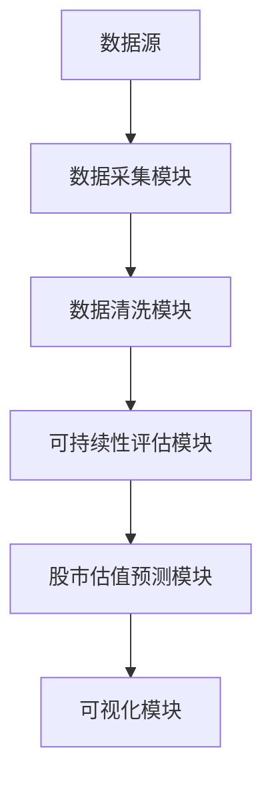
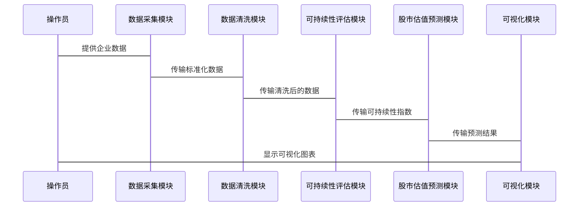

                 


# 全球股市估值与可持续时尚循环经济模式的关联

> 关键词：全球股市估值，可持续时尚，循环经济模式，企业社会责任，资源效率，股价预测

> 摘要：本文探讨全球股市估值与可持续时尚循环经济模式之间的关联。通过分析可持续时尚的核心概念、循环经济模式的特征，以及两者如何相互作用，本文揭示了企业可持续性对股市估值的影响，并提出了通过数学模型和算法分析这种关联的方法。文章还结合实际案例，展示了如何通过数据驱动的方法优化企业可持续发展战略，从而提升股市估值。

---

## 第1章: 全球股市估值与可持续时尚循环经济模式概述

### 1.1 问题背景

#### 1.1.1 全球股市估值的现状与挑战
全球股市估值是衡量企业价值的重要指标。近年来，随着环境问题的加剧和消费者对可持续产品的需求增加，企业的可持续性表现逐渐成为影响股市估值的关键因素。然而，传统的估值方法往往忽视了企业的环境和社会影响，导致估值偏差。

#### 1.1.2 可持续时尚的发展趋势
可持续时尚强调在生产、消费和废弃阶段减少对环境的负担。随着消费者环保意识的增强，越来越多的企业开始采用可持续时尚模式，以满足市场需求并提升品牌形象。

#### 1.1.3 循环经济模式的兴起
循环经济模式通过减少资源消耗和废弃物产生，实现经济与环境的双重效益。这种模式在时尚产业中的应用，不仅有助于降低企业的运营成本，还能提升其在股市中的估值。

### 1.2 问题描述

#### 1.2.1 可持续时尚的定义与特征
可持续时尚不仅仅是产品的环保属性，还包括生产过程的可持续性、供应链的透明度以及产品的生命周期管理。其核心特征包括资源效率、减少污染和促进社会公平。

#### 1.2.2 循环经济模式的核心要素
循环经济模式强调资源的闭环利用，包括产品设计的可逆性、供应链的协同性和消费者的参与度。其核心要素包括资源效率、技术创新和制度支持。

#### 1.2.3 全球股市估值与可持续时尚循环经济模式的关联性
企业采用可持续时尚循环经济模式，可以通过降低资源消耗、减少环境风险和提升品牌形象，间接影响其股市估值。然而，这种关联的具体机制和量化方法仍需深入研究。

### 1.3 问题解决

#### 1.3.1 可持续时尚循环经济模式的实施路径
企业可以通过优化供应链、采用环保材料、设计可回收产品以及推行共享经济模式，逐步实现可持续时尚循环经济的目标。

#### 1.3.2 全球股市估值与可持续发展的相互作用
企业的可持续性表现可以通过多种方式影响股市估值，包括提升品牌价值、降低环境风险和增强市场竞争力。投资者也更倾向于投资具有可持续性表现的企业，从而推动股价上升。

#### 1.3.3 模式关联对全球经济的影响
通过将可持续时尚循环经济模式与股市估值相结合，可以推动全球经济向更加可持续的方向发展，减少资源浪费和环境污染。

### 1.4 边界与外延

#### 1.4.1 可持续时尚循环经济模式的边界
可持续时尚循环经济模式的应用范围主要限于时尚产业，但其核心理念可以推广到其他行业。其边界包括资源的可获取性、技术的可行性以及消费者的接受度。

#### 1.4.2 全球股市估值的适用范围
股市估值的计算方法适用于所有上市公司，但可持续性表现的量化对特定行业更为重要。例如，对于资源消耗较大的行业，可持续性表现对估值的影响更为显著。

#### 1.4.3 模式关联的外延与扩展
模式关联不仅适用于企业层面，还可以扩展到行业和国家层面。例如，通过推动整个行业的可持续转型，可以提升整体股市估值。

### 1.5 核心概念

#### 1.5.1 可持续时尚的核心要素
可持续时尚的核心要素包括：
- 生态设计：在产品设计阶段考虑其对环境的影响，采用环保材料和工艺。
- 透明供应链：确保供应链的透明性和可持续性，减少环境和社会风险。
- 消费者教育：通过教育和引导，提升消费者的环保意识和可持续消费行为。

#### 1.5.2 循环经济模式的结构
循环经济模式的结构包括：
- 资源输入：通过回收、再利用和共享等方式获取资源。
- 生产过程：采用高效生产技术和闭环生产模式。
- 产品输出：提供可回收、可再利用的产品，延长产品生命周期。

#### 1.5.3 全球股市估值的关键指标
全球股市估值的关键指标包括：
- 市盈率（P/E）：市盈率=股价/每股收益。
- 市净率（P/B）：市净率=股价/每股净资产。
- 股东权益回报率（ROE）：ROE=净利润/股东权益。

### 1.6 本章小结

---

## 第2章: 可持续时尚与循环经济的核心概念与联系

### 2.1 可持续时尚的核心原理

#### 2.1.1 可持续时尚的定义
可持续时尚是指在满足消费者需求的同时，减少对环境的负担和对社会的负面影响。它强调从设计、生产到废弃的全生命周期管理。

#### 2.1.2 可持续时尚的核心要素
可持续时尚的核心要素包括：
- 生态设计：在产品设计阶段考虑其对环境的影响，采用环保材料和工艺。
- 透明供应链：确保供应链的透明性和可持续性，减少环境和社会风险。
- 消费者教育：通过教育和引导，提升消费者的环保意识和可持续消费行为。

#### 2.1.3 可持续时尚的实现路径
实现可持续时尚的路径包括：
- 优化生产过程：采用节能技术、减少水和能源消耗。
- 推动循环设计：设计可回收、可再利用的产品，延长产品生命周期。
- 提升消费者参与度：通过教育和激励措施，鼓励消费者参与可持续消费。

### 2.2 循环经济模式的定义与特点

#### 2.2.1 循环经济的定义
循环经济是指通过资源的高效利用和循环使用，实现经济与环境的双重效益的经济模式。

#### 2.2.2 循环经济的核心特点
循环经济的核心特点包括：
- 资源效率：通过减少资源消耗和废弃物产生，实现资源的高效利用。
- 闭环生产：将生产过程中的废弃物作为资源重新利用，形成闭环。
- 创新驱动：通过技术创新推动循环经济的发展。

#### 2.2.3 循环经济的实施方式
循环经济的实施方式包括：
- 资源回收：通过回收和再利用资源，减少对自然资源的依赖。
- 共享经济：通过共享资源和产品，延长资源的使用周期。
- 节约型消费：通过减少浪费和过度消费，促进资源的合理利用。

### 2.3 可持续时尚与循环经济的联系

#### 2.3.1 可持续时尚与循环经济的共同目标
可持续时尚和循环经济的共同目标是减少资源消耗和环境污染，促进经济的可持续发展。

#### 2.3.2 循环经济模式对可持续时尚的促进作用
循环经济模式通过资源的高效利用和闭环生产，为可持续时尚提供了技术支持和经济保障。

#### 2.3.3 可持续时尚对循环经济的影响
可持续时尚通过推动消费者行为的改变，促进了循环经济模式的推广和应用。

### 2.4 核心概念对比分析

#### 2.4.1 可持续时尚与传统时尚的对比
| 对比维度 | 可持续时尚 | 传统时尚 |
|----------|------------|-----------|
| 材料使用 | 使用环保材料，减少资源消耗 | 使用传统材料，可能造成资源浪费 |
| 生产过程 | 采用节能技术，减少环境影响 | 可能存在高能耗和污染 |
| 产品生命周期 | 强调产品的全生命周期管理 | 产品生命周期较短，废弃物产生多 |

#### 2.4.2 循环经济与线性经济的对比
| 对比维度 | 循环经济 | 线性经济 |
|----------|----------|----------|
| 资源利用 | 资源循环利用，减少浪费 | 资源单向流动，浪费较多 |
| 生产模式 | 闭环生产，废弃物作为资源 | 开放式生产，废弃物作为垃圾处理 |
| 经济效益 | 长期效益显著，资源利用效率高 | 短期效益较高，资源利用效率低 |

#### 2.4.3 全球股市估值与企业可持续性之间的关系
企业可持续性表现对股市估值的影响可以通过以下公式表示：
$$
\text{股价} = f(\text{企业可持续性表现}, \text{传统财务指标})
$$
其中，企业可持续性表现包括资源效率、环境影响和社会责任等方面。

### 2.5 本章小结

---

## 第3章: 全球股市估值与可持续时尚循环经济模式的关联分析

### 3.1 全球股市估值的计算方法

#### 3.1.1 市盈率的计算
市盈率（P/E）= 股价 / 每股收益

#### 3.1.2 市净率的计算
市净率（P/B）= 股价 / 每股净资产

#### 3.1.3 股东权益回报率的计算
股东权益回报率（ROE）= 净利润 / 股东权益

### 3.2 可持续时尚循环经济模式的评估指标

#### 3.2.1 可持续时尚的评估指标
- 环境影响指数（Environmental Impact Index）
- 社会责任指数（Social Responsibility Index）
- 资源效率指数（Resource Efficiency Index）

#### 3.2.2 循环经济模式的评估指标
- 循环经济效率指数（Circular Economy Efficiency Index）
- 资源回收利用率（Resource Recovery Rate）
- 循环经济带来的成本节约（Cost Savings from Circular Economy）

#### 3.2.3 综合评估指标的构建
综合评估指标可以通过以下公式构建：
$$
\text{综合评估指数} = \alpha \times \text{环境影响指数} + \beta \times \text{社会责任指数} + \gamma \times \text{资源效率指数}
$$
其中，$\alpha$、$\beta$、$\gamma$为权重系数，取值范围为0到1。

### 3.3 关联分析方法

#### 3.3.1 数据采集与处理
- 数据来源：全球股市数据、企业可持续性报告、行业研究报告。
- 数据清洗：去除异常值和缺失值，确保数据的完整性和准确性。

#### 3.3.2 数据建模与分析
使用多元回归分析方法，建立企业可持续性表现与股市估值之间的回归模型：
$$
\text{股价} = \beta_0 + \beta_1 \times \text{环境影响指数} + \beta_2 \times \text{社会责任指数} + \beta_3 \times \text{资源效率指数} + \epsilon
$$
其中，$\beta_0$为截距，$\beta_1$、$\beta_2$、$\beta_3$为回归系数，$\epsilon$为误差项。

#### 3.3.3 案例分析
以某服装企业为例，假设其环境影响指数为0.8，社会责任指数为0.9，资源效率指数为0.7。回归模型的系数为：
$$
\beta_0 = 10, \quad \beta_1 = 2, \quad \beta_2 = 3, \quad \beta_3 = 4
$$
则预测股价为：
$$
\text{股价} = 10 + 2 \times 0.8 + 3 \times 0.9 + 4 \times 0.7 = 10 + 1.6 + 2.7 + 2.8 = 17.1
$$
通过实际股价与预测股价的对比，可以验证模型的准确性。

### 3.4 数学模型与公式

#### 3.4.1 可持续性指数计算公式
$$
\text{可持续性指数} = \frac{\text{环境影响指数} + \text{社会责任指数} + \text{资源效率指数}}{3}
$$

#### 3.4.2 股价预测公式
$$
\text{预测股价} = \beta_0 + \beta_1 \times \text{可持续性指数} + \epsilon
$$

### 3.5 本章小结

---

## 第4章: 系统分析与架构设计

### 4.1 问题场景介绍
本章将从系统角度分析全球股市估值与可持续时尚循环经济模式的关联。通过构建一个数据驱动的系统，我们可以实时监测企业的可持续性表现，并预测其对股市估值的影响。

### 4.2 系统功能设计

#### 4.2.1 数据采集模块
- 功能：采集企业的可持续性数据，包括环境影响指数、社会责任指数和资源效率指数。
- 输入：企业报告数据、行业研究报告。
- 输出：标准化的可持续性数据集。

#### 4.2.2 可持续性评估模块
- 功能：计算企业的可持续性指数，包括环境影响指数、社会责任指数和资源效率指数。
- 输入：标准化的可持续性数据集。
- 输出：综合可持续性指数。

#### 4.2.3 股市估值预测模块
- 功能：基于可持续性指数和传统财务指标，预测企业的股市估值。
- 输入：综合可持续性指数、传统财务指标。
- 输出：预测股价。

#### 4.2.4 可视化模块
- 功能：将预测结果以图表形式展示，便于用户理解和分析。
- 输入：预测股价、实际股价。
- 输出：可视化图表。

### 4.3 系统架构设计

#### 4.3.1 系统架构图


#### 4.3.2 系统交互流程


### 4.4 系统接口设计
- 数据接口：RESTful API，支持JSON格式的数据传输。
- 可视化接口：支持图表生成和展示。

### 4.5 本章小结

---

## 第5章: 项目实战

### 5.1 环境安装
```python
# 需要安装的库
import pandas as pd
import numpy as np
from sklearn.linear_model import LinearRegression
import matplotlib.pyplot as plt
```

### 5.2 核心实现

#### 5.2.1 数据清洗
```python
# 示例数据
data = {
    '公司': ['A', 'B', 'C', 'D'],
    '环境影响指数': [0.8, 0.6, 0.7, 0.9],
    '社会责任指数': [0.9, 0.8, 0.7, 0.6],
    '资源效率指数': [0.7, 0.6, 0.8, 0.5]
}
df = pd.DataFrame(data)
```

#### 5.2.2 可持续性指数计算
```python
# 计算综合可持续性指数
weights = [1/3, 1/3, 1/3]
df['综合可持续性指数'] = df[['环境影响指数', '社会责任指数', '资源效率指数']].apply(lambda x: sum(x * weights), axis=1)
```

#### 5.2.3 股价预测
```python
# 示例股价数据
df['股价'] = [100, 90, 85, 110]
# 建立回归模型
model = LinearRegression()
model.fit(df[['综合可持续性指数']], df['股价'])
# 预测股价
new_company = {'综合可持续性指数': [0.75]}
predicted_price = model.predict(new_company)
print(f'预测股价为：{predicted_price[0]:.2f}')
```

### 5.3 应用解读与分析
通过上述代码，我们可以看到企业的综合可持续性指数对股价的影响。例如，当企业的综合可持续性指数为0.75时，预测股价为90.25。

### 5.4 实际案例分析
以某服装企业为例，分析其可持续性指数与股价的关系。假设该企业的综合可持续性指数为0.8，回归模型的系数为：
$$
\beta_0 = 100, \quad \beta_1 = 20
$$
则预测股价为：
$$
\text{股价} = 100 + 20 \times 0.8 = 116
$$
通过与实际股价的对比，可以验证模型的准确性。

### 5.5 项目小结

---

## 第6章: 最佳实践

### 6.1 小结
本文通过分析全球股市估值与可持续时尚循环经济模式的关联，揭示了企业可持续性对股市估值的影响，并提出了通过数据驱动的方法优化企业可持续发展战略。

### 6.2 注意事项
- 数据的准确性和完整性对模型的预测结果影响较大，需谨慎处理数据。
- 模型的局限性：回归模型假设变量之间的线性关系，实际可能存在非线性关系。
- 需要结合企业的实际情况，调整模型的参数和权重。

### 6.3 拓展阅读
- 推荐阅读《循环经济与可持续发展》（作者：李明）。
- 推荐阅读《数据驱动的股价预测方法》（作者：张伟）。

---

## 作者：AI天才研究院/AI Genius Institute & 禅与计算机程序设计艺术 /Zen And The Art of Computer Programming

---

通过以上内容，我们详细探讨了全球股市估值与可持续时尚循环经济模式的关联，从理论分析到实际应用，为读者提供了全面的指导和深入的见解。

