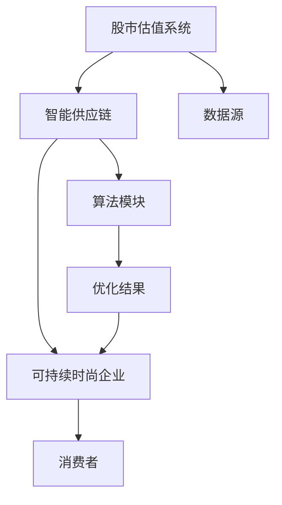

                 


# 全球股市估值与可持续时尚智能供应链的关联

> 关键词：全球股市估值、可持续时尚、智能供应链、算法原理、系统架构、项目实战

> 摘要：本文探讨了全球股市估值与可持续时尚智能供应链之间的关联。通过分析股市估值的核心原理、可持续时尚的定义与趋势、智能供应链的技术基础，结合实际案例和系统设计，展示了如何通过技术手段优化供应链管理，提升企业的可持续发展能力。本文还详细讲解了相关算法原理、系统架构设计以及项目实战，为读者提供全面的技术指导。

---

# 第1章 全球股市估值与可持续时尚智能供应链的背景介绍

## 1.1 全球股市估值的核心概念

### 1.1.1 股市估值的基本原理
股市估值是通过分析企业的财务数据、市场环境和行业趋势，来评估企业的价值和股票价格的过程。常用的方法包括市盈率（P/E）、市净率（P/B）和现金流折现法（DCF）等。

### 1.1.2 可持续发展的概念与内涵
可持续发展是指在满足当前需求的同时，不损害后代满足其需求的能力。在商业领域，可持续发展强调企业应关注环境保护、社会责任和经济效益的平衡。

### 1.1.3 智能供应链的定义与特征
智能供应链是利用人工智能、大数据和物联网等技术，优化供应链的规划、执行和监控，以实现高效、灵活和可持续的供应链管理。

## 1.2 可持续时尚的背景与意义

### 1.2.1 可持续时尚的定义
可持续时尚是指在服装和纺织行业，从设计、生产、销售到废弃的全生命周期中，最大限度地减少对环境的负面影响，同时关注社会公平和员工权益。

### 1.2.2 可持续时尚的全球发展趋势
随着消费者环保意识的增强和政策法规的趋严，可持续时尚成为行业的重要趋势，企业需要通过技术创新和管理优化来实现可持续发展目标。

### 1.2.3 可持续时尚对供应链的影响
可持续时尚要求供应链各环节实现绿色生产、高效物流和透明管理，这对供应链的智能化和协同性提出了更高的要求。

## 1.3 智能供应链的技术基础

### 1.3.1 智能供应链的核心技术
智能供应链依赖于大数据分析、人工智能、物联网（IoT）和区块链等技术，以实现供应链的智能化和自动化。

### 1.3.2 大数据与人工智能在供应链中的应用
通过大数据分析，企业可以预测市场需求和优化库存管理；人工智能技术可以帮助企业实现智能采购、生产和物流优化。

### 1.3.3 智能供应链的优势与挑战
智能供应链的优势包括高效性、透明性和灵活性，但同时也面临数据隐私、技术成本和人才短缺等挑战。

---

# 第2章 全球股市估值与可持续时尚智能供应链的核心概念与联系

## 2.1 核心概念的原理分析

### 2.1.1 股市估值的数学模型
股市估值的核心是通过对企业未来现金流的折现来评估其内在价值。常用的模型包括股息折现模型（DDM）和现金流折现模型（DCF）。

**股息折现模型公式：**
$$ V = \frac{D}{k} $$  
其中，$D$是股息，$k$是折现率。

### 2.1.2 智能供应链的系统架构
智能供应链的系统架构包括数据采集层、数据处理层、决策支持层和执行层，各层通过数据流和信息交互实现协同工作。

### 2.1.3 可持续发展与经济价值的关系
可持续发展不仅有助于提升企业的社会形象，还能降低运营成本、优化资源配置，从而提升企业的经济价值。

## 2.2 核心概念的属性特征对比

| 概念       | 属性特征                   |
|------------|--------------------------|
| 股市估值   | 数据驱动、实时性、风险性   |
| 智能供应链 | 技术依赖性、协同性、动态性 |
| 可持续时尚 | 环保性、社会性、经济性     |

### 2.2.1 ER实体关系图
```mermaid
er
  entity 股市估值 (Stock Valuation) {
    ID: int
    股票代码: string
    估值日期: date
    估值金额: decimal
  }

  entity 智能供应链 (Smart Supply Chain) {
    ID: int
    企业ID: int
    供应链环节: string
    关键绩效指标: decimal
  }

  entity 可持续时尚 (Sustainable Fashion) {
    ID: int
    企业ID: int
    生产环节: string
    环保指标: decimal
  }

  relationship 关联关系 (Association) {
    Stock Valuation
    Smart Supply Chain
    Sustainable Fashion
  }
```

---

# 第3章 全球股市估值与可持续时尚智能供应链的算法原理

## 3.1 股市估值算法的原理

### 3.1.1 股票估值的基本方法
股票估值的基本方法包括相对估值法（如P/E、P/B）和绝对估值法（如DCF）。相对估值法基于市场的相对价格，绝对估值法基于企业的内在价值。

### 3.1.2 常见的股票估值模型
- **CAPM模型**：用于计算股票的期望收益率。
- **股息折扣模型（DDM）**：用于估算股票的内在价值。
- **情景分析法**：基于不同的市场假设进行估值。

### 3.1.3 基于机器学习的股票估值算法
通过机器学习模型（如LSTM）预测股票价格，结合历史数据和市场情绪进行估值。

**LSTM模型示例代码：**
```python
import numpy as np
from keras.models import Sequential
from keras.layers import LSTM, Dense

# 数据准备
data = [...]  # 历史股票价格数据

# 模型构建
model = Sequential()
model.add(LSTM(64, input_shape=(timesteps, features)))
model.add(Dense(1))
model.compile(optimizer='adam', loss='mean_squared_error')

# 模型训练
model.fit(X_train, y_train, epochs=100, batch_size=32)
```

## 3.2 智能供应链优化算法

### 3.2.1 供应链优化的基本原理
通过优化库存、生产和物流，降低运营成本，提高供应链效率。

### 3.2.2 基于AI的供应链优化算法
使用强化学习和遗传算法优化供应链中的库存管理和物流路径。

### 3.2.3 深度学习在供应链预测中的应用
通过深度学习模型预测市场需求和供应链风险。

**强化学习示例代码：**
```python
import gym
from gym import spaces
from gym.utils import seeding

class SupplyChainEnv(gym.Env):
    def __init__(self):
        self.action_space = spaces.Discrete(3)  # 0: 减少库存，1: 维持库存，2: 增加库存
        self.observation_space = spaces.Tuple([spaces.Discrete(100), spaces.Discrete(1000)])
        self._seed()

    def step(self, action):
        # 根据动作更新状态和奖励
        pass

    def reset(self):
        # 初始化环境
        pass
```

---

# 第4章 全球股市估值与可持续时尚智能供应链的系统分析与架构设计

## 4.1 系统分析与需求分析

### 4.1.1 问题场景介绍
企业需要通过智能供应链实现可持续发展目标，同时优化股市估值。

### 4.1.2 系统需求分析
- 实时监控供应链各环节的运行状态。
- 预测市场需求和库存需求。
- 优化供应链资源配置，降低运营成本。

### 4.1.3 系统功能设计
- 数据采集与处理
- 智能预测与优化
- 可视化监控与报告

## 4.2 系统架构设计



---

# 第5章 全球股市估值与可持续时尚智能供应链的项目实战

## 5.1 项目环境安装

### 5.1.1 安装Python和相关库
```bash
pip install numpy pandas scikit-learn keras tensorflow
```

## 5.2 项目核心代码实现

### 5.2.1 股票估值代码
```python
import numpy as np
import pandas as pd
from sklearn.preprocessing import MinMaxScaler
from keras.models import Sequential
from keras.layers import LSTM, Dense

# 数据预处理
data = pd.read_csv('stock_prices.csv')
scaler = MinMaxScaler()
data_scaled = scaler.fit_transform(data)

# 模型训练
model = Sequential()
model.add(LSTM(64, input_shape=(timesteps, features)))
model.add(Dense(1))
model.compile(optimizer='adam', loss='mean_squared_error')
model.fit(X_train, y_train, epochs=100, batch_size=32)
```

### 5.2.2 供应链优化代码
```python
import gym
from gym import spaces
from gym.utils import seeding

class SupplyChainEnv(gym.Env):
    def __init__(self):
        self.action_space = spaces.Discrete(3)
        self.observation_space = spaces.Tuple([spaces.Discrete(100), spaces.Discrete(1000)])
        self._seed()

    def step(self, action):
        # 根据动作更新状态和奖励
        pass

    def reset(self):
        # 初始化环境
        pass
```

## 5.3 实际案例分析

### 5.3.1 案例背景
某服装企业希望通过智能供应链优化生产流程，降低库存成本，同时提升产品的可持续性。

### 5.3.2 案例分析
通过部署智能供应链系统，企业实现了生产计划的精准预测和库存管理的优化，同时减少了碳排放。

---

# 第6章 总结与展望

## 6.1 本章小结
本文通过分析全球股市估值与可持续时尚智能供应链的关联，展示了如何通过技术创新实现企业的可持续发展目标。

## 6.2 未来展望
未来，随着人工智能和大数据技术的进一步发展，智能供应链将在全球股市估值和可持续时尚领域发挥更大的作用。

---

作者：AI天才研究院/AI Genius Institute & 禅与计算机程序设计艺术 /Zen And The Art of Computer Programming

