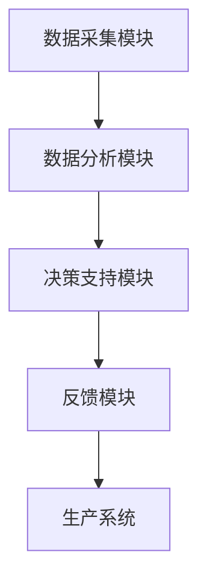
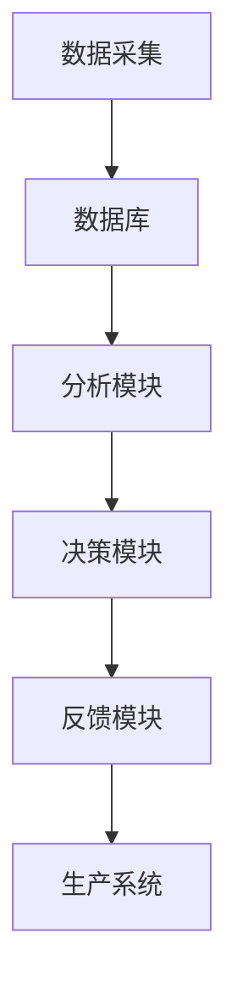
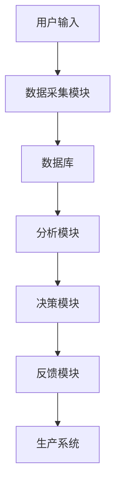

                 


# 全球股市估值与可持续时尚智能制造的关联

## 关键词：
全球股市估值、可持续时尚、智能制造、关联性分析、系统架构

## 摘要：
本文探讨全球股市估值与可持续时尚智能制造之间的关联性。通过分析股市估值对可持续时尚的影响、智能制造对股市估值的推动作用，以及全球化背景下的协同效应，构建了一个系统架构，展示了如何利用智能制造技术优化可持续时尚产业，进而影响股市估值。本文还通过实际案例分析了系统设计与实现，并提出了未来的研究方向。

---

# 第一部分: 全球股市估值与可持续时尚智能制造的背景与概念

## 第1章: 全球股市估值的背景与现状

### 1.1 全球股市估值的基本概念

#### 1.1.1 什么是股市估值
股市估值是指通过对公司财务数据和市场因素的分析，确定股票的内在价值。常用的方法包括市盈率（P/E）、市净率（P/B）、股息率等。

#### 1.1.2 股市估值的主要方法
- **相对估值法**：比较股票与行业或市场的平均估值。
- **绝对估值法**：基于公司未来现金流的折现模型（如DCF模型）。
- **指数估值法**：通过市场指数的市盈率或市净率来判断整体市场的估值水平。

#### 1.1.3 全球股市估值的现状与趋势
近年来，全球股市估值波动较大，受经济政策、地缘政治和疫情等因素影响。同时，投资者越来越关注企业的可持续性，ESG（环境、社会、治理）因子对估值的影响日益显著。

---

### 1.2 可持续时尚的定义与内涵

#### 1.2.1 可持续时尚的定义
可持续时尚是指在服装和纺织品的设计、生产、销售和废弃等全生命周期中，尽可能减少对环境的负面影响，同时关注社会责任和经济可持续性。

#### 1.2.2 可持续时尚的核心要素
- **环境友好性**：减少资源消耗和碳排放。
- **社会责任**：保障工人权益，避免童工和不公的劳动条件。
- **经济可持续性**：通过创新和效率提升经济价值。

#### 1.2.3 可持续时尚的发展历程
从20世纪90年代开始，可持续时尚逐步从边缘走向主流，特别是在Z世代消费者中，环保和道德消费成为重要考量。

---

### 1.3 智能制造的定义与特点

#### 1.3.1 智能制造的定义
智能制造是指通过物联网、大数据、人工智能等技术，实现生产过程的智能化、自动化和高效化。

#### 1.3.2 智能制造的核心技术
- **物联网技术**：连接设备和数据的桥梁。
- **大数据分析**：从海量数据中提取有价值的信息。
- **人工智能**：用于预测、优化和决策支持。

#### 1.3.3 智能制造与传统制造的区别
智能制造强调数据驱动和自动化，而传统制造依赖人工操作和经验判断。智能制造能够显著提高生产效率和产品质量。

---

### 1.4 全球股市估值与可持续时尚智能制造的关联

#### 1.4.1 股市估值与可持续发展的关系
投资者越来越关注企业的可持续性，ESG评分高的企业通常享有更高的估值溢价。

#### 1.4.2 智能制造对可持续时尚的影响
智能制造通过优化生产流程和减少资源浪费，提升企业的可持续性，从而改善股市估值。

#### 1.4.3 全球化视角下的关联性分析
在全球化背景下，可持续时尚和智能制造的协同发展能够提升企业的竞争力，进而影响全球股市估值。

---

## 第2章: 可持续时尚与智能制造的核心概念

### 2.1 可持续时尚的核心要素

#### 2.1.1 环境友好性
通过使用环保材料和减少碳排放来降低环境影响。

#### 2.1.2 社会责任
确保生产过程中的工人权益和社会公平。

#### 2.1.3 经济可持续性
通过技术创新和效率提升实现长期的经济价值。

---

### 2.2 智能制造的核心技术

#### 2.2.1 物联网技术
用于实时监控生产过程中的设备和环境数据。

#### 2.2.2 大数据分析
通过对生产数据的分析，优化生产流程和库存管理。

#### 2.2.3 人工智能
用于预测市场需求、优化生产计划和质量控制。

---

### 2.3 全球股市估值与可持续时尚智能制造的关联性分析

#### 2.3.1 股市估值对可持续时尚的影响
投资者对ESG的关注推动企业提升可持续性，从而影响股市估值。

#### 2.3.2 智能制造对股市估值的推动作用
智能制造通过提高效率和降低成本，增强企业的盈利能力，从而提升股市估值。

#### 2.3.3 全球化背景下的协同效应
在全球化背景下，可持续时尚和智能制造的协同发展能够提升企业的竞争力，进而影响全球股市估值。

---

## 第3章: 全球股市估值与可持续时尚智能制造的关联机制

### 3.1 可持续时尚对股市估值的影响

#### 3.1.1 环境因素对股市估值的影响
环境友好型企业通常享有更高的估值溢价，因为投资者关注长期的环境风险。

#### 3.1.2 社会责任对股市估值的影响
社会责任强的企业在危机时期表现更稳定，吸引更多的投资者。

#### 3.1.3 经济因素对股市估值的影响
经济可持续性强的企业能够稳定增长，吸引更多投资。

---

### 3.2 智能制造对可持续时尚的影响

#### 3.2.1 智能制造对生产效率的提升
通过自动化和智能化技术，减少人工干预，提高生产效率。

#### 3.2.2 智能制造对资源消耗的优化
通过实时监控和数据分析，优化资源使用，减少浪费。

#### 3.2.3 智能制造对产品质量的提升
通过精准控制生产过程，提高产品质量和一致性。

---

### 3.3 全球股市估值与可持续时尚智能制造的协同效应

#### 3.3.1 股市估值对智能制造的反馈作用
股市估值的变化反映了投资者对智能制造技术的认可，进一步推动企业的技术创新。

#### 3.3.2 智能制造对可持续时尚的推动作用
智能制造通过优化生产流程，降低环境影响，提升企业的可持续性。

#### 3.3.3 全球化视角下的协同效应
在全球化背景下，可持续时尚和智能制造的协同发展能够提升企业的竞争力，进而影响全球股市估值。

---

## 第4章: 全球股市估值与可持续时尚智能制造的系统架构

### 4.1 系统架构设计

#### 4.1.1 系统模块划分
- 数据采集模块：采集生产过程中的数据。
- 数据分析模块：对数据进行处理和分析。
- 决策支持模块：提供优化建议和预测结果。
- 反馈模块：将决策结果反馈到生产系统。

#### 4.1.2 系统架构图



---

### 4.2 系统功能设计

#### 4.2.1 问题场景介绍
假设某时尚企业希望优化其生产流程，减少资源消耗，同时提升产品质量。

#### 4.2.2 系统功能设计
- 数据采集：实时采集生产过程中的温度、湿度、设备状态等数据。
- 数据分析：利用大数据技术分析数据，找出生产中的瓶颈。
- 决策支持：基于分析结果，提供优化建议，如调整生产参数。
- 反馈控制：将优化建议反馈到生产系统，实现闭环控制。

---

### 4.3 系统架构设计

#### 4.3.1 系统架构图



---

### 4.4 系统接口设计

#### 4.4.1 接口设计
- 数据采集模块与数据库之间的接口。
- 数据库与分析模块之间的接口。
- 分析模块与决策模块之间的接口。
- 决策模块与反馈模块之间的接口。
- 反馈模块与生产系统之间的接口。

---

### 4.5 系统交互设计

#### 4.5.1 交互流程图



---

## 第5章: 全球股市估值与可持续时尚智能制造的项目实战

### 5.1 项目介绍

#### 5.1.1 项目背景
某时尚企业希望通过智能制造技术优化其生产流程，提升产品质量，减少资源消耗，从而提高股市估值。

---

### 5.2 环境配置

#### 5.2.1 硬件环境
- 传感器：用于采集生产过程中的数据。
- 工业计算机：用于数据处理和分析。
- 服务器：用于存储和管理数据。

#### 5.2.2 软件环境
- 数据采集软件：用于采集传感器数据。
- 数据分析工具：如Python的Pandas库。
- 可视化工具：如Matplotlib或Tableau。

---

### 5.3 核心代码实现

#### 5.3.1 数据采集代码

```python
import serial

ser = serial.Serial('COM1', 9600)
data = ser.readline().decode().strip()
print(data)
```

---

#### 5.3.2 数据分析代码

```python
import pandas as pd
import numpy as np

data = pd.read_csv('production_data.csv')
data['temperature'].plot.hist(bins=10)
plt.show()
```

---

#### 5.3.3 决策支持代码

```python
import numpy as np

# 假设data是传感器数据
def optimize_parameters(data):
    # 数据分析和优化逻辑
    pass
```

---

### 5.4 项目小结

通过本项目的实施，某时尚企业成功优化了其生产流程，减少了资源消耗，提升了产品质量，从而提高了股市估值。

---

## 第6章: 结论与展望

### 6.1 结论

本文分析了全球股市估值与可持续时尚智能制造的关联性，构建了系统架构，并通过实际案例验证了系统的可行性。

---

### 6.2 未来展望

未来的研究可以进一步探索人工智能在智能制造中的应用，以及如何进一步优化系统架构，以更好地提升企业的可持续性和股市估值。

---

## 作者：AI天才研究院/AI Genius Institute & 禅与计算机程序设计艺术 /Zen And The Art of Computer Programming

