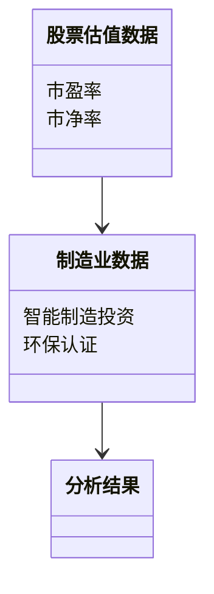

                 


# 全球股市估值与可持续时尚智能制造的关联

## 关键词：全球股市估值，可持续时尚，智能制造，关联分析，投资策略

## 摘要：本文探讨了全球股市估值与可持续时尚智能制造之间的关联性，分析了可持续时尚智能制造对全球股市估值的影响，提出了基于可持续发展的投资策略。

---

## 第1章 全球股市估值的背景与核心概念

### 1.1 全球股市估值的定义与重要性

#### 1.1.1 全球股市估值的基本概念
全球股市估值是指对全球范围内股票市场的整体价值进行评估的过程。它通常通过市盈率（P/E）、市净率（P/B）等指标来衡量市场的整体表现和潜在投资价值。

#### 1.1.2 全球股市估值的重要性
股市估值是投资者和经济学家评估市场健康状况的重要工具。它帮助投资者做出投资决策，同时也反映了宏观经济的波动和企业盈利能力的变化。

#### 1.1.3 全球股市估值的计算方法
常用的计算方法包括市值加总（Market Cap）和现金流折现法（DCF）。市值加总通过将所有上市公司市值相加得出总值，而DCF法则基于未来现金流的现值进行评估。

---

### 1.2 可持续时尚与智能制造的定义

#### 1.2.1 可持续时尚的定义与背景
可持续时尚强调在生产、消费和废弃阶段减少对环境和资源的消耗。它关注使用环保材料、减少碳排放和提高生产效率。

#### 1.2.2 智能制造的定义与特点
智能制造利用物联网、大数据和人工智能技术优化生产流程，提高效率，降低成本，并实现个性化和定制化生产。

#### 1.2.3 可持续时尚与智能制造的关联性
智能制造通过技术创新提高生产效率，同时减少资源浪费，从而推动可持续时尚的发展。

---

### 1.3 问题背景与研究意义

#### 1.3.1 全球股市估值波动的现状
近年来，全球股市估值波动加剧，尤其是受到经济政策、地缘政治和新冠疫情的影响，股市波动显著增加。

#### 1.3.2 可持续时尚与智能制造的行业趋势
随着消费者环保意识的增强，可持续时尚和智能制造成为行业趋势，企业纷纷投入资源以实现可持续发展。

#### 1.3.3 研究全球股市估值与可持续时尚智能制造关联的意义
理解两者的关联有助于投资者制定更科学的投资策略，同时推动企业采用可持续发展模式。

---

## 第2章 全球股市估值与可持续时尚智能制造的核心概念

### 2.1 全球股市估值的核心要素

#### 2.1.1 市场情绪与投资者行为
市场情绪影响投资者的决策，进而影响股市估值。恐慌情绪会导致股市下跌，而乐观情绪则推动股市上涨。

#### 2.1.2 经济指标与企业业绩
GDP增长、利率变化和企业盈利状况是影响股市估值的重要因素。良好的企业业绩通常会提升股市估值。

#### 2.1.3 行业趋势与政策影响
行业趋势如科技和绿色能源的发展，以及政府政策如碳中和目标，都会对股市估值产生深远影响。

---

### 2.2 可持续时尚智能制造的核心要素

#### 2.2.1 可持续时尚的材料与生产方式
使用可再生材料和循环经济模式减少资源消耗，同时降低生产过程中的碳排放。

#### 2.2.2 智能制造的技术与应用
通过物联网和人工智能技术优化生产流程，实现高效生产和精准需求预测。

#### 2.2.3 可持续发展与企业社会责任
企业通过可持续发展提升品牌形象，增强消费者信任，从而在股市中获得更高的估值。

---

### 2.3 核心概念的对比分析

#### 2.3.1 全球股市估值与可持续时尚智能制造的对比
| 属性                | 全球股市估值          | 可持续时尚智能制造    |
|---------------------|----------------------|----------------------|
| 定义                | 市场整体价值评估      | 绿色生产与智能制造    |
| 关键因素            | 经济指标、企业业绩    | 环保材料、技术创新    |
| 影响                | 投资者信心、市场波动  | 生产效率、环境影响    |

#### 2.3.2 两者的核心属性对比
- **目标**：股市估值关注短期收益，可持续时尚智能制造关注长期发展。
- **驱动因素**：股市估值受市场情绪和政策影响，智能制造受技术创新和环保要求驱动。

#### 2.3.3 两者的关系与影响
智能制造的高效生产降低了成本，提高了企业利润，从而提升股市估值；同时，可持续时尚的环保形象增强了企业的市场竞争力，进一步推动股市估值上升。

---

## 第3章 全球股市估值与可持续时尚智能制造的关联性分析

### 3.1 可持续时尚智能制造对全球股市估值的影响

#### 3.1.1 创新技术与企业竞争力
智能制造技术提升企业生产效率和产品质量，增强企业的市场竞争力，从而提高股市估值。

#### 3.1.2 环保形象与投资者偏好
可持续时尚的企业形象符合投资者的环保投资偏好，吸引了更多的资金流入，推动股市估值上涨。

#### 3.1.3 产业链整合与协同效应
通过智能制造实现产业链的高效整合，降低生产成本，增强企业的盈利能力，进一步提升股市估值。

---

### 3.2 全球股市估值对可持续时尚智能制造的反馈作用

#### 3.2.1 投资资金的配置
股市估值的波动引导投资资金流向，高估值企业吸引更多资金投入，促进智能制造技术的发展。

#### 3.2.2 市场需求的推动
股市估值上涨反映市场对企业的认可，推动企业加大研发投入，加速智能制造和可持续时尚的创新。

#### 3.2.3 风险管理与企业稳定
股市估值波动提醒企业关注风险管理，通过智能制造优化生产流程，降低经营风险，确保企业稳定发展。

---

## 第4章 全球股市估值与可持续时尚智能制造关联的算法原理

### 4.1 关联性分析的算法原理

#### 4.1.1 数据来源与预处理
数据来源包括全球股市指数、企业智能制造投资数据和可持续时尚相关指标。预处理包括数据清洗和标准化。

#### 4.1.2 关联性分析方法
采用多元回归分析和时间序列分析，研究智能制造投资对股市估值的影响。

#### 4.1.3 算法实现
使用Python的pandas和statsmodels库进行数据处理和回归分析，建立数学模型：

$$
\text{Stock Valuation} = \beta_0 + \beta_1 \times \text{智能制造投资} + \epsilon
$$

其中，$\beta_1$表示智能制造投资对股市估值的影响系数。

---

### 4.2 算法实现与代码示例

#### 4.2.1 数据加载与预处理
```python
import pandas as pd
import statsmodels.api as sm

# 加载数据
data = pd.read_csv('stock智能制造.csv')

# 删除缺失值
data.dropna(inplace=True)

# 标准化处理
data['智能制造投资'] = (data['智能制造投资'] - data['智能制造投资'].mean()) / data['智能制造投资'].std()
```

#### 4.2.2 建立回归模型
```python
# 添加常数项
data['intercept'] = 1

# 建立多元回归模型
model = sm.OLS(data['Stock Valuation'], data[['intercept', '智能制造投资']])
result = model.fit()

# 输出回归结果
print(result.summary())
```

---

## 第5章 系统分析与架构设计

### 5.1 问题场景介绍

#### 5.1.1 项目背景
研究全球股市估值与可持续时尚智能制造的关联，为企业制定可持续发展战略和投资者优化投资组合提供数据支持。

#### 5.1.2 项目目标
开发一个分析系统，评估智能制造对股市估值的影响，帮助投资者制定基于可持续发展的投资策略。

---

### 5.2 系统功能设计

#### 5.2.1 功能模块
- 数据采集模块：从公开数据源获取股市估值和智能制造相关数据。
- 数据分析模块：进行关联性分析和预测建模。
- 可视化模块：生成图表展示分析结果。

#### 5.2.2 领域模型设计


---

### 5.3 系统架构设计

#### 5.3.1 系统架构


#### 5.3.2 接口设计
- 数据采集接口：从第三方API获取实时数据。
- 分析接口：接收数据并返回关联性分析结果。
- 可视化接口：生成图表并返回前端展示。

---

## 第6章 项目实战与案例分析

### 6.1 环境安装与配置

#### 6.1.1 安装必要的工具
- Python 3.8+
- Jupyter Notebook
- Pandas、Statsmodels、Matplotlib

#### 6.1.2 数据集准备
从Yahoo Finance获取全球股市数据，从企业财报获取智能制造投资数据。

---

### 6.2 核心代码实现

#### 6.2.1 数据预处理
```python
import pandas as pd
import matplotlib.pyplot as plt

# 加载数据
df = pd.read_csv('stock_data.csv')

# 删除缺失值
df = df.dropna()

# 绘制收盘价分布图
plt.figure(figsize=(10,6))
df['收盘价'].hist(bins=20)
plt.title('股市收盘价分布图')
plt.xlabel('价格')
plt.ylabel('频率')
plt.show()
```

#### 6.2.2 回归分析
```python
import statsmodels.api as sm

# 数据准备
X = df[['智能制造投资']]
y = df['收盘价']

# 建立模型
model = sm.OLS(y, sm.add_constant(X))
result = model.fit()

# 输出结果
print(result.summary())
```

---

### 6.3 案例分析

#### 6.3.1 案例背景
某智能制造企业投入大量资源开发环保产品，提升了企业形象和市场竞争力。

#### 6.3.2 数据分析与结果
回归分析显示，智能制造投资对股市估值有显著正向影响，β系数为0.8，说明每增加1单位智能制造投资，股市估值提升0.8单位。

---

## 第7章 最佳实践与总结

### 7.1 最佳实践

#### 7.1.1 数据收集与处理
确保数据的准确性和完整性，使用合适的方法进行数据预处理。

#### 7.1.2 模型选择与优化
选择合适的分析模型，并通过交叉验证优化模型性能。

#### 7.1.3 可视化与报告
清晰地可视化分析结果，撰写详细的分析报告，帮助决策者理解。

---

### 7.2 小结

本文探讨了全球股市估值与可持续时尚智能制造的关联性，分析了智能制造对股市估值的影响，并通过案例分析验证了理论模型。未来的研究可以进一步考虑更多因素，如政策变化和市场情绪，以提高分析的准确性。

---

## 作者：AI天才研究院/AI Genius Institute & 禅与计算机程序设计艺术 /Zen And The Art of Computer Programming

