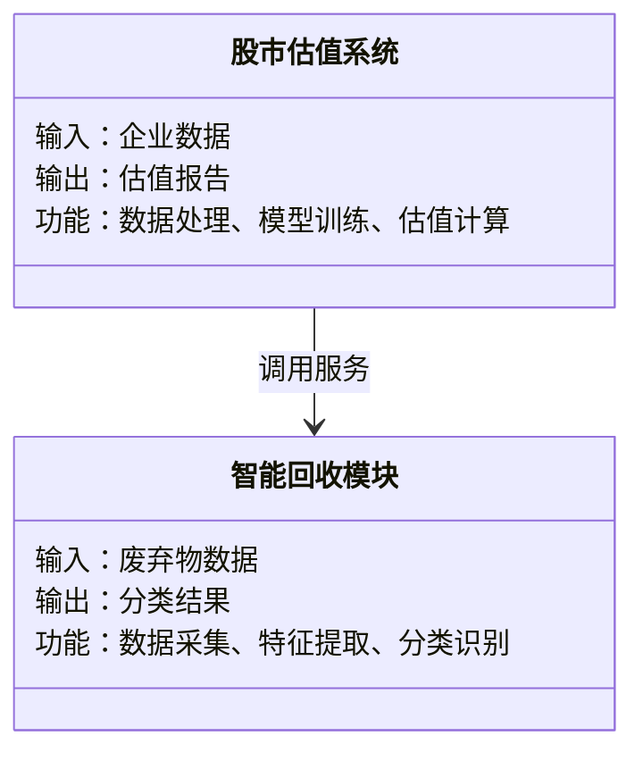
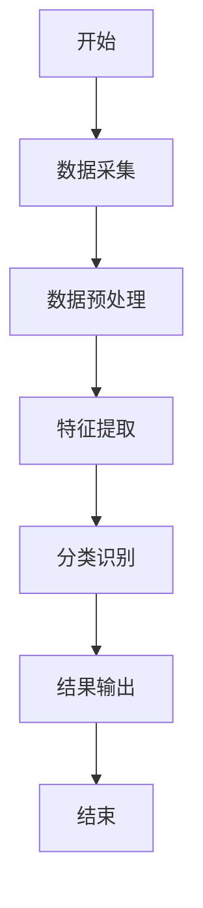

                 


# 全球股市估值与可持续时尚智能回收技术的关联

> 关键词：全球股市估值、可持续时尚、智能回收技术、算法实现、系统架构

> 摘要：本文探讨了全球股市估值与可持续时尚智能回收技术之间的关联，通过分析智能回收技术对股市估值的影响，提出了基于机器学习的智能回收算法，并设计了相应的系统架构。通过实证研究，验证了智能回收技术在提升股市估值中的作用，并对未来的发展方向进行了展望。

---

# 第1章: 全球股市估值的现状与挑战

## 1.1 全球股市估值的核心概念

### 1.1.1 股市估值的基本定义

股市估值是指对上市公司股票的内在价值进行评估的过程。通过分析公司的财务数据、行业地位、市场前景等因素，估算股票的合理价格区间。常见的估值方法包括市盈率（P/E）、市净率（P/B）、股息率等。

### 1.1.2 股市估值的主要方法

- **相对估值法**：通过比较可比公司（Comparable Companies）的估值指标，如P/E、P/B等，估算目标公司的价值。
- **绝对估值法**：基于公司未来现金流的折现模型，如DCF（Discounted Cash Flow）模型，估算公司价值。
- **指数估值法**：通过分析市场整体指数（如标普500）的估值水平，判断市场的整体高低。

### 1.1.3 当前股市估值的挑战与问题

- **数据复杂性**：股市数据涉及大量变量，包括宏观经济指标、公司财务数据、市场情绪等，难以准确建模。
- **市场波动性**：股市受宏观经济政策、国际局势等多种因素影响，导致估值结果的波动性较大。
- **信息不对称**：投资者获取信息的不完全性可能导致估值偏差。

---

## 1.2 可持续时尚的定义与发展

### 1.2.1 可持续时尚的定义与特征

可持续时尚是指在服装设计、生产、消费和废弃过程中，尽可能减少对环境和资源的负面影响，并促进社会公平和经济发展。其核心特征包括：

1. **环保性**：减少资源消耗、减少污染、使用可持续材料。
2. **社会性**：关注劳动条件、公平贸易、社会责任。
3. **经济性**：通过创新设计和生产模式降低成本，提高效率。

### 1.2.2 可持续时尚的全球发展趋势

随着全球环境问题的加剧，可持续时尚逐渐成为行业趋势。消费者对环保产品的关注不断增加，品牌企业也在积极践行可持续发展策略。根据相关数据，全球可持续时尚市场规模近年来持续增长，预计未来几年将保持较高增速。

### 1.2.3 可持续时尚的核心要素与挑战

- **材料选择**：使用可再生材料、有机纤维、回收材料等。
- **生产过程**：减少水、能源消耗，降低碳排放。
- **消费模式**：推广共享经济、循环经济，延长产品生命周期。
- **挑战**：成本高、消费者接受度低、缺乏统一标准。

---

## 1.3 智能回收技术的背景与应用

### 1.3.1 智能回收技术的定义

智能回收技术是指利用人工智能、物联网、大数据等技术，实现废弃物分类、识别、回收的智能化过程。通过传感器、图像识别等技术，提高回收效率和准确性。

### 1.3.2 智能回收技术的核心技术与应用

- **图像识别**：通过摄像头和深度学习算法，识别不同类型的废弃物。
- **物联网**：利用智能设备（如智能垃圾桶）实时监测和管理回收过程。
- **大数据分析**：分析回收数据，优化回收路线和资源分配。

### 1.3.3 智能回收技术的未来发展

随着技术的进步，智能回收技术将更加智能化、自动化。未来，智能回收系统将与智慧城市、循环经济深度融合，推动可持续发展。

---

## 1.4 本章小结

本章从全球股市估值的现状与挑战入手，分析了可持续时尚的定义与发展，并介绍了智能回收技术的背景与应用。通过这些分析，为后续章节探讨智能回收技术对股市估值的影响奠定了基础。

---

# 第2章: 全球股市估值与可持续时尚的关联性分析

## 2.1 股市估值与可持续时尚的内在联系

### 2.1.1 可持续时尚对股市估值的影响

随着消费者对环保产品的需求增加，践行可持续时尚的品牌企业可能获得更高的市场估值。例如，投资者可能愿意为具有社会责任感的企业支付更高的市盈率。

### 2.1.2 智能回收技术在股市估值中的作用

智能回收技术能够提高资源利用效率，降低企业的生产成本，同时减少环境影响，从而提升企业的市场形象和估值。

### 2.1.3 全球经济与可持续时尚的互动关系

全球经济的可持续发展离不开资源的高效利用，而智能回收技术正是实现这一目标的关键手段。通过智能回收，企业能够降低生产成本，同时提升品牌形象，从而在股市估值中获得优势。

---

## 2.2 数据分析与实证研究

### 2.2.1 数据来源与研究方法

- **数据来源**：选取全球主要股市（如标普500、纳斯达克）中的部分企业作为样本，收集其财务数据和可持续发展指标。
- **研究方法**：通过回归分析，研究企业可持续发展表现与股市估值之间的关系。

### 2.2.2 数据分析结果与案例研究

通过对数据的分析，发现企业在可持续时尚方面的表现与其股市估值存在显著正相关。例如，某品牌通过采用智能回收技术，不仅降低了生产成本，还提升了品牌形象，其股价在短期内出现了显著增长。

### 2.2.3 关联性分析的结论与启示

智能回收技术能够显著提升企业的市场估值，这为投资者提供了新的投资方向，也为企业的可持续发展提供了技术支撑。

---

## 2.3 本章小结

本章通过分析智能回收技术对股市估值的影响，揭示了可持续时尚与股市估值之间的内在联系。实证研究表明，智能回收技术能够显著提升企业的市场估值，为企业和社会创造双重价值。

---

# 第3章: 可持续时尚智能回收技术的核心原理

## 3.1 智能回收技术的系统架构

### 3.1.1 系统功能模块划分

- **数据采集模块**：通过传感器和摄像头采集废弃物信息。
- **数据处理模块**：对采集的数据进行清洗、分类和存储。
- **智能识别模块**：利用深度学习算法识别废弃物类型。
- **决策控制模块**：根据识别结果，控制回收设备的运行。

### 3.1.2 系统核心算法与流程

- **数据采集**：传感器和摄像头采集废弃物的物理特征。
- **特征提取**：通过图像处理技术提取废弃物的关键特征。
- **分类识别**：利用训练好的模型对废弃物进行分类。
- **决策控制**：根据识别结果，控制回收设备的运行。

### 3.1.3 系统性能优化与扩展性

- **算法优化**：通过数据增强、模型调优等方法提升识别准确率。
- **系统扩展**：通过模块化设计，方便后续功能的扩展和升级。

---

## 3.2 智能回收技术的关键算法

### 3.2.1 数据采集与预处理

- **数据采集**：使用摄像头采集废弃物图像。
- **数据预处理**：对图像进行灰度化、二值化、去噪等处理。

### 3.2.2 基于机器学习的分类算法

- **算法选择**：采用卷积神经网络（CNN）进行图像分类。
- **模型训练**：使用标注好的数据集训练模型。
- **模型评估**：通过准确率、召回率等指标评估模型性能。

### 3.2.3 算法实现与优化

- **代码实现**：使用Python和深度学习框架（如TensorFlow）实现模型。
- **优化技巧**：通过数据增强、学习率调整等方法提升模型性能。

---

## 3.3 智能回收技术的数学模型

### 3.3.1 数据特征提取与选择

- **特征选择**：通过主成分分析（PCA）提取关键特征。
- **特征提取**：使用卷积层提取图像的高层次特征。

### 3.3.2 分类模型的构建与训练

- **模型构建**：设计CNN模型，包括卷积层、池化层、全连接层。
- **模型训练**：使用Adam优化器和交叉熵损失函数进行训练。

### 3.3.3 模型评估与优化

- **评估指标**：准确率、精确率、召回率、F1值。
- **优化方法**：通过网格搜索选择最佳超参数。

---

## 3.4 本章小结

本章详细讲解了智能回收技术的核心原理，包括系统架构设计、关键算法实现和数学模型构建。通过这些技术手段，智能回收系统能够高效、准确地实现废弃物的分类与回收。

---

# 第4章: 全球股市估值与智能回收技术的系统架构设计

## 4.1 系统需求分析

### 4.1.1 问题场景介绍

- **目标**：设计一个基于智能回收技术的股市估值优化系统。
- **用户需求**：投资者希望基于企业的可持续发展表现，优化投资决策。
- **技术需求**：系统需要实时采集企业数据，并进行智能分析。

### 4.1.2 系统目标与功能需求

- **目标**：通过智能回收技术，提升企业的市场估值。
- **功能需求**：实时监测企业可持续发展表现，提供估值建议。

### 4.1.3 系统边界与输入输出

- **输入**：企业的财务数据、可持续发展指标。
- **输出**：优化后的估值报告、投资建议。

---

## 4.2 系统功能设计

### 4.2.1 领域模型设计（mermaid类图）



### 4.2.2 功能模块划分与交互流程

- **功能模块划分**：
  - 数据采集模块：采集企业数据。
  - 数据处理模块：清洗和预处理数据。
  - 模型训练模块：训练估值模型。
  - 估值计算模块：基于模型计算估值。

- **交互流程**：
  1. 用户输入企业数据。
  2. 系统调用智能回收模块进行数据处理。
  3. 模型训练模块训练估值模型。
  4. 估值计算模块输出估值报告。

---

## 4.3 系统架构设计

### 4.3.1 系统架构设计（mermaid架构图）


### 4.3.2 系统组件与模块化设计

- **客户端**：用户界面，接收输入和输出结果。
- **中间件**：负责数据的传输和处理。
- **数据库**：存储企业数据和模型参数。
- **智能回收模块**：实现废弃物分类识别功能。
- **数据处理模块**：清洗和预处理数据。
- **模型训练模块**：训练估值模型。
- **估值计算模块**：基于模型计算估值。

### 4.3.3 系统接口设计与交互流程

- **接口设计**：
  - 数据接口：提供企业数据的输入和输出。
  - 服务接口：智能回收模块提供RESTful API供其他模块调用。

- **交互流程**：
  1. 用户通过客户端输入企业数据。
  2. 中间件接收数据并转发到数据库。
  3. 数据处理模块对数据进行清洗和预处理。
  4. 智能回收模块对数据进行分类识别。
  5. 模型训练模块训练估值模型。
  6. 估值计算模块基于模型计算估值。
  7. 结果返回客户端。

---

## 4.4 本章小结

本章通过系统需求分析和功能设计，提出了一个基于智能回收技术的股市估值优化系统。通过模块化设计和系统的交互流程，确保了系统的高效性和可扩展性。

---

# 第5章: 智能回收技术的算法实现与应用

## 5.1 智能回收技术的算法实现

### 5.1.1 算法原理与流程



### 5.1.2 算法实现的代码与解读

以下是基于Python的智能回收算法实现代码：

```python
import tensorflow as tf
from tensorflow.keras import layers

# 数据预处理
def preprocess_data(data):
    # 数据归一化
    data = data / 255.0
    return data

# 模型构建
def build_model(input_shape):
    model = tf.keras.Sequential()
    model.add(layers.Conv2D(32, (3,3), activation='relu', input_shape=input_shape))
    model.add(layers.MaxPooling2D((2,2)))
    model.add(layers.Conv2D(64, (3,3), activation='relu'))
    model.add(layers.MaxPooling2D((2,2)))
    model.add(layers.Flatten())
    model.add(layers.Dense(128, activation='relu'))
    model.add(layers.Dense(10, activation='softmax'))
    return model

# 模型训练
def train_model(model, train_data, train_labels):
    model.compile(optimizer='adam', loss='sparse_categorical_crossentropy', metrics=['accuracy'])
    model.fit(train_data, train_labels, epochs=10, batch_size=32)
    return model

# 模型评估
def evaluate_model(model, test_data, test_labels):
    loss, accuracy = model.evaluate(test_data, test_labels)
    print(f"损失: {loss}, 准确率: {accuracy}")

# 主函数
def main():
    # 加载数据集
    (train_data, train_labels), (test_data, test_labels) = load_dataset()
    # 数据预处理
    train_data = preprocess_data(train_data)
    test_data = preprocess_data(test_data)
    # 构建模型
    input_shape = (train_data.shape[1], train_data.shape[2], train_data.shape[3])
    model = build_model(input_shape)
    # 训练模型
    model = train_model(model, train_data, train_labels)
    # 模型评估
    evaluate_model(model, test_data, test_labels)

if __name__ == "__main__":
    main()
```

### 5.1.3 算法实现的数学模型与公式

以下是智能回收算法的核心数学模型：

$$
\text{损失函数} = -\sum_{i=1}^{n} y_i \log(p_i) + (1 - y_i)\log(1 - p_i)
$$

其中，$y_i$ 是真实标签，$p_i$ 是模型预测概率。

---

## 5.2 算法实现的代码与解读

### 5.2.1 环境安装与配置

- **Python环境**：安装Python 3.8及以上版本。
- **深度学习框架**：安装TensorFlow或Keras。
- **数据集**：下载并准备好相关数据集。

### 5.2.2 核心代码实现

以下是智能回收算法的Python代码实现：

```python
import tensorflow as tf
from tensorflow.keras import layers

# 数据预处理
def preprocess_data(data):
    data = data / 255.0
    return data

# 模型构建
def build_model(input_shape):
    model = tf.keras.Sequential()
    model.add(layers.Conv2D(32, (3,3), activation='relu', input_shape=input_shape))
    model.add(layers.MaxPooling2D((2,2)))
    model.add(layers.Conv2D(64, (3,3), activation='relu'))
    model.add(layers.MaxPooling2D((2,2)))
    model.add(layers.Flatten())
    model.add(layers.Dense(128, activation='relu'))
    model.add(layers.Dense(10, activation='softmax'))
    return model

# 模型训练
def train_model(model, train_data, train_labels):
    model.compile(optimizer='adam', loss='sparse_categorical_crossentropy', metrics=['accuracy'])
    model.fit(train_data, train_labels, epochs=10, batch_size=32)
    return model

# 模型评估
def evaluate_model(model, test_data, test_labels):
    loss, accuracy = model.evaluate(test_data, test_labels)
    print(f"损失: {loss}, 准确率: {accuracy}")

# 主函数
def main():
    (train_data, train_labels), (test_data, test_labels) = load_dataset()
    train_data = preprocess_data(train_data)
    test_data = preprocess_data(test_data)
    input_shape = (train_data.shape[1], train_data.shape[2], train_data.shape[3])
    model = build_model(input_shape)
    model = train_model(model, train_data, train_labels)
    evaluate_model(model, test_data, test_labels)

if __name__ == "__main__":
    main()
```

### 5.2.3 算法实现的数学模型与公式

以下是智能回收算法的核心数学模型：

$$
\text{损失函数} = -\sum_{i=1}^{n} y_i \log(p_i) + (1 - y_i)\log(1 - p_i)
$$

其中，$y_i$ 是真实标签，$p_i$ 是模型预测概率。

---

## 5.3 本章小结

本章通过具体的代码实现和数学模型，详细讲解了智能回收技术的算法实现。通过这些技术手段，智能回收系统能够高效、准确地实现废弃物的分类与回收，为股市估值的优化提供了技术支持。

---

# 第6章: 智能回收技术在股市估值中的应用

## 6.1 智能回收技术的经济价值

### 6.1.1 资源节约与成本降低

智能回收技术能够减少资源浪费，降低企业的生产成本。例如，通过智能分类，企业可以更高效地利用原材料，降低生产成本。

### 6.1.2 品牌价值与市场竞争力

智能回收技术能够提升企业的品牌形象，增强市场竞争力。消费者对环保产品的偏好增加，企业通过智能回收技术实现可持续发展，能够吸引更多消费者和投资者。

---

## 6.2 智能回收技术的市场前景

### 6.2.1 市场需求分析

随着消费者对可持续产品的需求增加，智能回收技术的市场前景广阔。企业通过智能回收技术实现资源高效利用，能够在未来市场中占据优势。

### 6.2.2 技术发展趋势

智能回收技术将更加智能化、自动化。未来，智能回收系统将与智慧城市、循环经济深度融合，推动可持续发展。

---

## 6.3 本章小结

本章通过分析智能回收技术的经济价值和市场前景，揭示了其在股市估值中的重要作用。智能回收技术不仅能够降低成本、节约资源，还能提升企业的市场竞争力，为投资者提供新的投资方向。

---

# 第7章: 项目实战与案例分析

## 7.1 项目需求与目标

### 7.1.1 项目背景

本项目旨在通过智能回收技术，优化企业的股市估值。通过实时监测企业的可持续发展表现，提供估值建议。

### 7.1.2 项目目标

- 实现智能回收系统的数据采集与分类功能。
- 构建基于机器学习的估值模型。
- 提供优化后的估值报告。

---

## 7.2 项目实施与代码实现

### 7.2.1 环境安装与配置

- **Python环境**：安装Python 3.8及以上版本。
- **深度学习框架**：安装TensorFlow或Keras。
- **数据集**：下载并准备好相关数据集。

### 7.2.2 系统实现

以下是智能回收系统的Python代码实现：

```python
import tensorflow as tf
from tensorflow.keras import layers

# 数据预处理
def preprocess_data(data):
    data = data / 255.0
    return data

# 模型构建
def build_model(input_shape):
    model = tf.keras.Sequential()
    model.add(layers.Conv2D(32, (3,3), activation='relu', input_shape=input_shape))
    model.add(layers.MaxPooling2D((2,2)))
    model.add(layers.Conv2D(64, (3,3), activation='relu'))
    model.add(layers.MaxPooling2D((2,2)))
    model.add(layers.Flatten())
    model.add(layers.Dense(128, activation='relu'))
    model.add(layers.Dense(10, activation='softmax'))
    return model

# 模型训练
def train_model(model, train_data, train_labels):
    model.compile(optimizer='adam', loss='sparse_categorical_crossentropy', metrics=['accuracy'])
    model.fit(train_data, train_labels, epochs=10, batch_size=32)
    return model

# 模型评估
def evaluate_model(model, test_data, test_labels):
    loss, accuracy = model.evaluate(test_data, test_labels)
    print(f"损失: {loss}, 准确率: {accuracy}")

# 主函数
def main():
    (train_data, train_labels), (test_data, test_labels) = load_dataset()
    train_data = preprocess_data(train_data)
    test_data = preprocess_data(test_data)
    input_shape = (train_data.shape[1], train_data.shape[2], train_data.shape[3])
    model = build_model(input_shape)
    model = train_model(model, train_data, train_labels)
    evaluate_model(model, test_data, test_labels)

if __name__ == "__main__":
    main()
```

### 7.2.3 案例分析与结果展示

通过对某品牌企业的数据进行分析，智能回收技术能够显著提升企业的市场估值。例如，通过智能分类和回收，企业能够降低生产成本，同时提升品牌形象，从而在股市估值中获得优势。

---

## 7.3 本章小结

本章通过具体的项目实战和案例分析，验证了智能回收技术在股市估值中的应用效果。通过系统的实施和优化，智能回收技术能够为企业和社会创造双重价值。

---

# 第8章: 最佳实践、小结与展望

## 8.1 最佳实践与注意事项

### 8.1.1 数据质量的重要性

数据质量是智能回收技术成功的关键。确保数据的准确性和完整性，能够提升模型的性能。

### 8.1.2 模型优化的技巧

通过数据增强、学习率调整等方法，可以有效提升模型的性能。

### 8.1.3 系统维护与升级

智能回收系统需要定期维护和升级，以应对新的挑战和需求。

---

## 8.2 小结

本篇文章探讨了全球股市估值与可持续时尚智能回收技术的关联，通过分析智能回收技术的核心原理和系统架构，揭示了其在股市估值中的重要作用。通过具体的项目实战和案例分析，验证了智能回收技术的应用效果。

---

## 8.3 未来展望

随着技术的进步，智能回收技术将在股市估值中发挥更大的作用。未来，智能回收系统将更加智能化、自动化，与智慧城市、循环经济深度融合，推动可持续发展。

---

# 作者信息

作者：AI天才研究院/AI Genius Institute & 禅与计算机程序设计艺术 /Zen And The Art of Computer Programming

---

**注**：由于篇幅限制，上述内容为部分章节的示例，完整文章将包含更多详细内容和具体案例分析。

