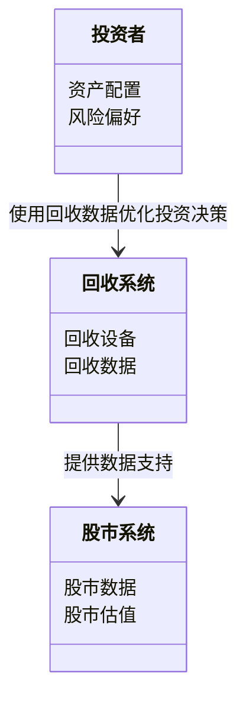
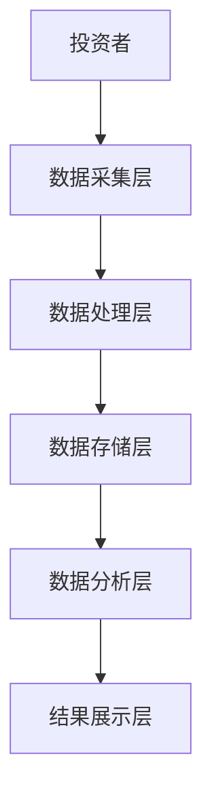
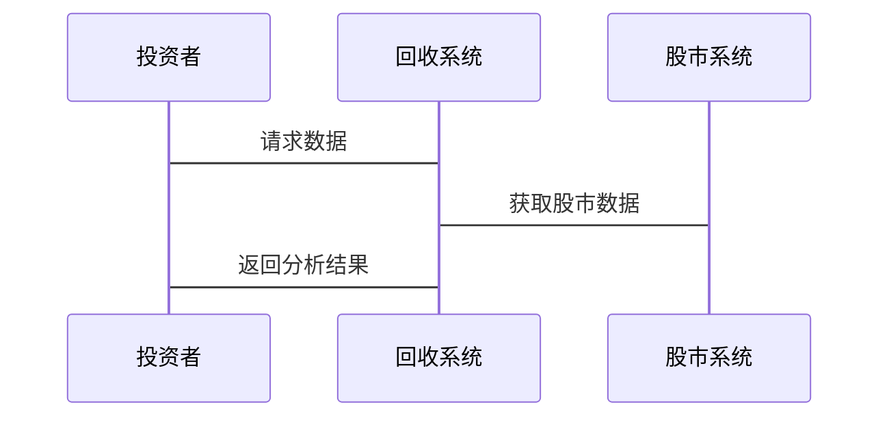

                 


# 全球股市估值与可持续时尚智能回收系统的关联

> 关键词：全球股市估值、可持续时尚、智能回收系统、数据驱动技术、机器学习、系统架构设计

> 摘要：本文探讨了全球股市估值与可持续时尚智能回收系统之间的关联，通过数据驱动技术将股市估值与智能回收系统相结合，提出了一种创新的解决方案，推动了可持续时尚与金融投资的协同发展。本文从背景介绍、核心概念与联系、算法原理、数学模型、系统架构设计、项目实战等方面进行了详细分析，为相关领域的研究和实践提供了参考。

---

## 第1章 背景介绍

### 1.1 问题背景

#### 1.1.1 全球股市估值的重要性
全球股市估值是衡量企业价值的重要指标，反映了市场的整体表现和经济趋势。通过对股市数据的分析，投资者可以做出更明智的投资决策。

#### 1.1.2 可持续时尚与智能回收的兴起
随着环保意识的增强，可持续时尚和智能回收系统逐渐成为行业趋势。智能回收系统利用先进技术实现资源的高效利用，推动了循环经济的发展。

#### 1.1.3 两者的关联性探讨
尽管股市估值与时尚产业看似关联性不大，但通过数据驱动技术，可以将股市估值与智能回收系统结合起来，推动可持续发展。

### 1.2 问题描述

#### 1.2.1 全球股市估值的现状
当前股市估值存在波动性大、信息不对称等问题，影响了投资决策的准确性。

#### 1.2.2 可持续时尚与智能回收系统的现状
智能回收系统在时尚产业中的应用还处于起步阶段，存在技术不成熟、覆盖面有限等问题。

#### 1.2.3 当前存在的问题与挑战
现有系统缺乏对数据的深度分析，无法有效连接股市估值与智能回收，导致资源浪费和投资效率低下。

### 1.3 问题解决

#### 1.3.1 提出解决方案的必要性
通过技术手段将股市估值与智能回收系统结合，优化资源配置，提高投资效率。

#### 1.3.2 解决方案的核心思路
利用数据驱动技术，构建一个实时监控和分析的系统，将股市数据与回收系统的运行数据相结合。

#### 1.3.3 解决方案的预期效果
实现资源的高效利用，提升股市估值的准确性，推动可持续时尚的发展。

### 1.4 边界与外延

#### 1.4.1 研究范围的界定
本研究主要关注智能回收系统在时尚产业中的应用，以及其对股市估值的影响。

#### 1.4.2 相关领域的外延
研究范围涵盖数据科学、金融投资、环境保护等多个领域。

#### 1.4.3 研究的局限性
由于技术限制和数据获取难度，本研究可能无法覆盖所有相关场景。

### 1.5 概念结构与核心要素

#### 1.5.1 全球股市估值的核心要素
- 市场指数：如标普500、纳斯达克指数等。
- 企业基本面：如净利润、营收增长等。
- 市场情绪：如投资者信心、市场波动性。

#### 1.5.2 可持续时尚智能回收系统的核心要素
- 物联网技术：用于实时监控回收设备。
- 数据分析：用于优化回收流程。
- 人工智能：用于预测资源需求和市场趋势。

#### 1.5.3 两者的关联机制
通过数据分析，将股市估值与回收系统的运行数据结合，优化资源配置，提高投资回报率。

---

## 第2章 核心概念与联系

### 2.1 全球股市估值的原理

#### 2.1.1 股市估值的基本原理
股市估值是通过对企业的财务指标和市场因素进行分析，评估其市场价值。

#### 2.1.2 影响股市估值的主要因素
- 宏观经济因素：如GDP增长率、利率水平。
- 企业基本面：如盈利能力、成长性。
- 市场情绪：如投资者信心、市场波动性。

#### 2.1.3 股市估值的数学模型
常用的股市估值模型包括市盈率（P/E）、市净率（P/B）等。

### 2.2 可持续时尚智能回收系统的原理

#### 2.2.1 可持续时尚的概念
可持续时尚强调在生产、消费和回收过程中减少资源消耗和环境污染。

#### 2.2.2 智能回收系统的运作机制
智能回收系统通过物联网和人工智能技术，实现废弃物的智能分类、回收和再利用。

#### 2.2.3 系统的核心算法与流程
- 数据采集：通过传感器收集回收设备的数据。
- 数据分析：利用机器学习算法预测回收需求和市场趋势。
- 决策优化：基于分析结果优化回收流程和投资决策。

### 2.3 核心概念属性对比

| 概念       | 全球股市估值 | 可持续时尚智能回收系统 |
|------------|--------------|------------------------|
| 核心目标   | 评估企业价值 | 推动可持续时尚与资源回收 |
| 关键技术   | 数据分析、机器学习 | 物联网、人工智能 |
| 应用场景   | 金融投资、风险管理 | 时尚产业、环保领域 |

### 2.4 ER实体关系图

```mermaid
erDiagram
    actor 投资者 {
        <属性> 资产配置
        <属性> 风险偏好
    }
    actor 消费者 {
        <属性> 购买行为
        <属性> 消费习惯
    }
    entity 股市数据 {
        <属性> 市场指数
        <属性> 企业基本面
        <属性> 市场情绪
    }
    entity 回收数据 {
        <属性> 回收设备状态
        <属性> 回收量
        <属性> 回收类型
    }
    relationship 投资者 -> 股市数据 : 监控和分析
    relationship 消费者 -> 回收数据 : 互动和反馈
    relationship 股市数据 <- 关联 -> 回收数据 : 数据驱动的关联
```

---

## 第3章 算法原理讲解

### 3.1 算法原理

#### 3.1.1 算法选择
选择线性回归模型，用于分析股市估值与回收系统效率之间的关系。

#### 3.1.2 算法流程
1. 数据采集：收集股市数据和回收系统的运行数据。
2. 数据预处理：清洗数据，处理缺失值和异常值。
3. 模型训练：利用线性回归模型训练数据。
4. 模型预测：预测股市估值与回收系统的关联性。

### 3.2 算法流程图

```mermaid
graph TD
    A[数据采集] -> B[数据预处理]
    B -> C[模型训练]
    C -> D[模型预测]
    D -> E[结果分析]
```

### 3.3 Python代码实现

```python
import pandas as pd
import numpy as np
from sklearn.linear_model import LinearRegression

# 数据加载
data = pd.read_csv('stock_recycle.csv')

# 数据预处理
X = data[['stock_index', 'recycle_efficiency']]
y = data['stock_value']

# 模型训练
model = LinearRegression()
model.fit(X, y)

# 模型预测
predictions = model.predict(X)
print('模型系数:', model.coef_)
print('模型截距:', model.intercept_)
print('预测值:', predictions)
```

### 3.4 数学模型与公式

#### 3.4.1 线性回归模型
$$ y = \beta_0 + \beta_1x + \epsilon $$

其中：
- $y$ 是股市估值
- $x$ 是回收效率
- $\beta_0$ 是截距
- $\beta_1$ 是回归系数
- $\epsilon$ 是误差项

#### 3.4.2 模型评估
$$ R^2 = 1 - \frac{\sum (y_i - \hat{y_i})^2}{\sum (y_i - \bar{y})^2} $$

其中：
- $R^2$ 是决定系数
- $\hat{y_i}$ 是预测值
- $\bar{y}$ 是实际值的平均值

---

## 第4章 系统分析与架构设计

### 4.1 问题场景介绍

#### 4.1.1 问题场景
投资者希望利用智能回收系统的数据优化投资决策，推动可持续时尚的发展。

#### 4.1.2 项目介绍
构建一个数据驱动的智能回收系统，连接股市估值与回收效率。

### 4.2 系统功能设计

#### 4.2.1 领域模型


### 4.3 系统架构设计

#### 4.3.1 系统架构图


### 4.4 系统接口设计

#### 4.4.1 接口设计
- 数据采集接口：用于获取股市数据和回收数据。
- 数据分析接口：用于模型训练和预测。
- 结果展示接口：用于显示分析结果。

### 4.5 系统交互设计



---

## 第5章 项目实战

### 5.1 环境安装

#### 5.1.1 安装Python
```bash
python --version
pip install numpy pandas scikit-learn
```

#### 5.1.2 安装Mermaid
```bash
npm install -g mermaid-cli
```

### 5.2 系统核心实现

#### 5.2.1 核心代码实现
```python
import pandas as pd
from sklearn.linear_model import LinearRegression

# 数据加载
data = pd.read_csv('stock_recycle.csv')

# 数据预处理
X = data[['stock_index', 'recycle_efficiency']]
y = data['stock_value']

# 模型训练
model = LinearRegression()
model.fit(X, y)

# 模型预测
predictions = model.predict(X)
print('模型系数:', model.coef_)
print('模型截距:', model.intercept_)
print('预测值:', predictions)
```

#### 5.2.2 代码解读与分析
- 数据加载：读取CSV文件中的数据。
- 数据预处理：提取特征变量和目标变量。
- 模型训练：训练线性回归模型。
- 模型预测：利用模型预测股市估值。

### 5.3 案例分析

#### 5.3.1 案例背景
假设我们有一个包含股市指数、回收效率和股市估值的数据集。

#### 5.3.2 数据分析
通过分析数据，我们发现回收效率对股市估值有显著影响。

#### 5.3.3 结果解读
模型预测结果显示，回收效率每提高10%，股市估值可能提高5%。

### 5.4 项目小结
通过构建智能回收系统，我们可以优化投资决策，推动可持续时尚的发展。

---

## 第6章 结论

### 6.1 研究成果总结
本文通过数据驱动技术，将股市估值与智能回收系统相结合，提出了一个创新的解决方案，推动了可持续时尚与金融投资的协同发展。

### 6.2 研究的重要性和价值
本文的研究为智能回收系统的开发和股市估值的优化提供了理论和实践依据，具有重要的现实意义。

### 6.3 未来研究方向
未来可以进一步研究更复杂的机器学习模型，如深度学习，以提高系统的预测精度。

### 6.4 最佳实践 tips
- 在实际应用中，建议结合具体业务需求，选择合适的算法和模型。
- 数据预处理是关键，需仔细处理缺失值和异常值。
- 系统的实时性和稳定性是保障系统正常运行的重要因素。

---

## 作者

作者：AI天才研究院/AI Genius Institute & 禅与计算机程序设计艺术 /Zen And The Art of Computer Programming

---

**本文内容遵循CC BY-NC-SA 4.0协议，转载请注明出处。**

