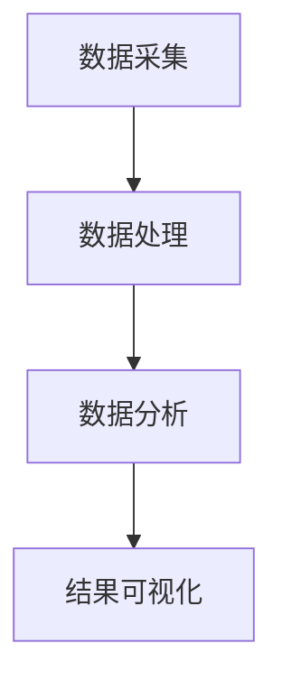
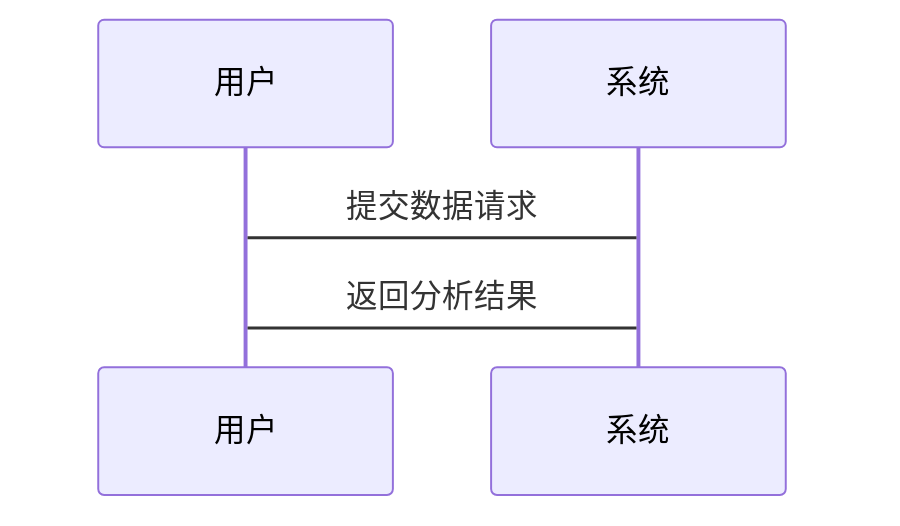

                 


# 全球股市估值与可持续时尚材料创新的关联

## 关键词：全球股市估值、可持续时尚材料、创新、ESG投资、数据分析

## 摘要：  
随着全球对可持续发展的关注不断增加，可持续时尚材料的创新正成为企业竞争力的重要组成部分。本文探讨了全球股市估值与可持续时尚材料创新之间的关联，分析了可持续材料创新对企业估值的影响机制，并通过实证研究验证了这种关联。文章还提供了数据分析方法和系统架构设计，以帮助企业更好地理解和应用这些创新。

---

# 第1章 引言

## 1.1 问题背景与研究意义

### 1.1.1 全球股市估值的现状与挑战  
全球股市估值是衡量企业价值的重要指标，受到多种因素的影响，包括经济环境、企业盈利能力、市场预期等。近年来，可持续发展成为影响股市估值的重要因素，尤其是企业的环境、社会和治理（ESG）表现。

### 1.1.2 可持续时尚材料创新的背景与趋势  
可持续时尚材料创新是指开发环保、可循环利用的材料，减少对环境的负面影响。随着消费者环保意识的增强，企业对可持续材料的需求不断增加，这成为时尚产业的重要趋势。

### 1.1.3 两者的关联性与研究意义  
可持续材料创新不仅影响企业的生产成本和品牌形象，还可能通过提升企业的ESG评分间接影响其股市估值。研究这种关联性，有助于企业制定更有效的战略，投资者也能更好地评估投资风险和收益。

---

## 1.2 研究目标与方法

### 1.2.1 研究目标的设定  
本文旨在分析全球股市估值与可持续时尚材料创新之间的关联，揭示可持续材料创新如何影响企业的估值。

### 1.2.2 研究方法的选择  
本文采用定量分析方法，结合实证研究和数据分析，构建数学模型来验证关联性。

### 1.2.3 数据来源与分析框架  
数据来源包括全球股市数据和企业可持续材料创新的相关信息，分析框架基于回归分析和时间序列分析。

---

## 1.3 本章小结  
本章介绍了研究背景、目标和方法，为后续分析奠定了基础。

---

# 第2章 全球股市估值的核心概念与分析框架

## 2.1 全球股市估值的基本概念

### 2.1.1 股市估值的定义与作用  
股市估值是通过对企业财务指标的分析，估算其股票的内在价值，帮助企业制定合理的投资策略。

### 2.1.2 主要估值方法与模型  
常用的估值方法包括市盈率（P/E）、市净率（P/B）等，这些方法在分析企业价值时各有优劣。

### 2.1.3 影响股市估值的主要因素  
宏观经济环境、企业盈利能力、行业竞争格局等都是影响股市估值的重要因素。

---

## 2.2 可持续发展与股市估值的关系

### 2.2.1 可持续发展理念对股市的影响  
可持续发展理念推动企业关注环境保护和社会责任，这可能提升企业的长期价值。

### 2.2.2 ESG投资与股市估值的关联  
ESG评分高的企业通常在股市中表现更优，因为投资者倾向于选择社会责任感强的企业。

### 2.2.3 可持续发展对企业估值的影响机制  
可持续材料创新通过降低成本、提升品牌价值和风险控制能力，间接影响企业的估值。

---

## 2.3 本章小结  
本章详细阐述了全球股市估值的基本概念和可持续发展对股市的影响，为后续分析提供了理论基础。

---

# 第3章 可持续时尚材料创新的核心要素与特征

## 3.1 可持续时尚材料的定义与分类

### 3.1.1 可持续材料的定义  
可持续材料是指在生产、使用和废弃过程中对环境影响较小的材料。

### 3.1.2 可持续材料的主要类型  
包括再生纤维、生物基材料、无毒染料等。

### 3.1.3 可持续材料的生命周期分析  
从原材料提取到产品废弃的全生命周期分析，评估其环境影响。

---

## 3.2 可持续时尚材料创新的核心特征

### 3.2.1 环保性与资源效率  
可持续材料创新通过减少资源消耗和污染，提升材料的环保性。

### 3.2.2 可循环性与可降解性  
材料的可循环利用和可降解性是可持续材料的重要特征。

### 3.2.3 创新性与技术领先性  
技术创新是推动可持续材料发展的关键，企业需要不断研发新型材料。

---

## 3.3 可持续时尚材料创新对产业的影响

### 3.3.1 对传统材料的替代效应  
可持续材料逐渐取代传统材料，推动产业转型。

### 3.3.2 对企业竞争力的影响  
具备可持续材料创新能力的企业在市场中更具竞争力。

### 3.3.3 对消费者行为的引导作用  
消费者倾向于选择环保产品，推动企业采用可持续材料。

---

## 3.4 本章小结  
本章分析了可持续时尚材料创新的核心要素及其对产业的影响，为后续分析提供了基础。

---

# 第4章 全球股市估值与可持续时尚材料创新的关联机制

## 4.1 关联机制的理论基础

### 4.1.1 经济学视角下的关联机制  
从经济学角度看，可持续材料创新可能通过降低成本和提升品牌价值影响企业估值。

### 4.1.2 环境与社会因素对估值的影响  
ESG评分高的企业通常在股市中表现更优，环境和社会因素直接关联企业估值。

### 4.1.3 创新能力与企业价值的关系  
创新能力是企业核心竞争力的重要组成部分，直接影响企业的长期价值。

---

## 4.2 关联机制的实证分析框架

### 4.2.1 数据收集与处理方法  
数据来源包括全球股市数据和企业可持续材料创新的相关信息，需要清洗和预处理。

### 4.2.2 分析模型的选择与构建  
采用回归分析模型，将企业的ESG评分和可持续材料创新指标作为自变量，股市估值作为因变量。

### 4.2.3 指标选取与权重设定  
选取关键指标如企业ESG评分、研发投入等，构建综合评价指标体系。

---

## 4.3 关联机制的具体表现

### 4.3.1 可持续材料创新对企业利润的影响  
通过降低生产成本和提升产品附加值，可持续材料创新可能提升企业的盈利能力。

### 4.3.2 ESG评分与企业估值的正相关性  
实证研究表明，ESG评分高的企业在股市中估值更高。

### 4.3.3 创新能力对股价波动的调节作用  
创新能力较强的企业的股价波动较小，表现出更强的稳定性。

---

## 4.4 本章小结  
本章分析了全球股市估值与可持续时尚材料创新的关联机制，为后续实证研究提供了理论支持。

---

# 第5章 数据分析与实证研究

## 5.1 数据收集与处理

### 5.1.1 数据来源与收集方法  
数据来源包括全球股市数据、企业ESG评分和可持续材料创新相关指标，通过公开数据库收集。

### 5.1.2 数据清洗与预处理  
剔除异常值，标准化处理数据，确保数据质量。

---

## 5.2 数据分析与实证结果

### 5.2.1 数据分析方法  
采用回归分析和时间序列分析，构建数学模型验证关联性。

### 5.2.2 实证结果解读  
回归分析结果显示，企业的可持续材料创新能力和ESG评分与其股市估值显著正相关。

---

## 5.3 本章小结  
本章通过实证研究验证了全球股市估值与可持续时尚材料创新之间的正向关联。

---

# 第6章 系统分析与架构设计方案

## 6.1 系统功能设计

### 6.1.1 系统功能模块  
包括数据采集、数据分析、结果可视化等功能模块。

### 6.1.2 系统功能流程  
从数据采集到结果输出的完整流程。

---

## 6.2 系统架构设计

### 6.2.1 系统架构图  
使用mermaid绘制系统架构图，展示各模块之间的关系。



### 6.2.3 系统接口设计  
定义各模块之间的接口，确保数据流畅传输。

---

## 6.3 系统交互设计

### 6.3.1 系统交互流程  
使用mermaid绘制系统交互序列图。



---

## 6.4 本章小结  
本章设计了系统的功能、架构和交互流程，为实际应用提供了指导。

---

# 第7章 项目实战

## 7.1 环境安装与数据准备

### 7.1.1 环境配置  
安装Python、Pandas、Matplotlib等工具。

### 7.1.2 数据准备  
下载全球股市数据和企业ESG评分数据。

---

## 7.2 核心代码实现

### 7.2.1 数据清洗代码  
```python
import pandas as pd

# 读取数据
df = pd.read_csv('data.csv')

# 删除缺失值
df.dropna(inplace=True)

# 标准化处理
df['value'] = (df['value'] - df['value'].mean()) / df['value'].std()
```

### 7.2.2 数据分析代码  
```python
import statsmodels.api as sm

# 构建回归模型
X = df[['ESG评分', '创新指标']]
y = df['股价']

model = sm.OLS(y, sm.add_constant(X)).fit()
print(model.summary())
```

### 7.2.3 可视化代码  
```python
import matplotlib.pyplot as plt

plt.scatter(df['创新指标'], df['股价'])
plt.xlabel('创新指标')
plt.ylabel('股价')
plt.title('创新指标与股价的关系')
plt.show()
```

---

## 7.3 实际案例分析

### 7.3.1 案例背景  
选择某家采用可持续材料创新的企业，分析其股价变化。

### 7.3.2 数据分析与解读  
通过回归分析发现，企业的创新指标和ESG评分对其股价有显著影响。

### 7.3.3 案例小结  
案例分析验证了本文的理论假设，可持续材料创新确实能提升企业估值。

---

## 7.4 本章小结  
本章通过实际案例展示了如何将理论应用于实践，验证了可持续材料创新与股市估值的关联。

---

# 第8章 结论与展望

## 8.1 研究结论

### 8.1.1 核心发现  
可持续材料创新和ESG评分对企业的股市估值有显著影响。

### 8.1.2 理论贡献  
本文构建了全球股市估值与可持续时尚材料创新的分析框架。

---

## 8.2 研究展望

### 8.2.1 未来研究方向  
进一步研究不同地区的差异性影响，探索更多创新指标。

### 8.2.2 实际应用建议  
企业应加强可持续材料创新，投资者应关注ESG因素。

---

## 8.3 本章小结  
本章总结了研究发现，并展望了未来的研究方向和实际应用。

---

# 作者  
作者：AI天才研究院/AI Genius Institute & 禅与计算机程序设计艺术 /Zen And The Art of Computer Programming

