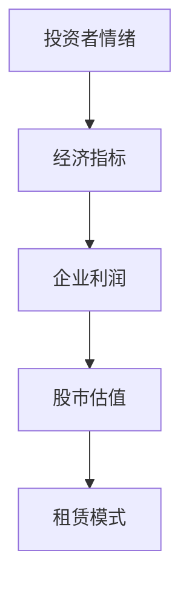

                 


# 全球股市估值与可持续时尚租赁模式的关联

## 关键词：
全球股市估值，可持续时尚租赁模式，关联性分析，数学模型，系统架构设计，投资策略，风险管理

## 摘要：
本文深入探讨了全球股市估值与可持续时尚租赁模式之间的关联性。通过分析全球股市估值的影响因素和可持续时尚租赁模式的特征，构建了数学模型，揭示了两者之间的内在联系。同时，本文提出了系统架构设计和项目实战方案，为投资者和企业提供了优化投资组合和风险管理的最佳实践。

---

# 第1章: 全球股市估值与可持续时尚租赁模式的背景介绍

## 1.1 全球股市估值的基本概念
### 1.1.1 什么是全球股市估值
全球股市估值是指对全球范围内股票市场的整体价值进行评估。通常通过股票价格指数（如标普500、MSCI指数）来衡量市场的整体表现。股市估值反映了投资者对市场的信心和经济基本面的综合判断。

### 1.1.2 全球股市估值的核心要素
- **市场流动性**：市场资金的充裕程度影响股票价格。
- **企业盈利能力**：企业利润是股市估值的基础。
- **宏观经济指标**：如GDP、利率、通货膨胀率等。

### 1.1.3 全球股市估值的计算方法
股市估值通常通过市盈率（P/E）和市净率（P/B）等指标来衡量。例如，市盈率 = 股票价格 / 每股收益。

## 1.2 可持续时尚租赁模式的定义
### 1.2.1 什么是可持续时尚
可持续时尚强调在生产、消费和废弃过程中减少对环境的负面影响，注重资源的循环利用。

### 1.2.2 可持续时尚租赁模式的特点
- **资源共享**：通过租赁模式减少资源浪费。
- **环保性**：降低碳排放和资源消耗。
- **经济性**：降低消费者的购买成本。

### 1.2.3 可持续时尚租赁模式的分类
- **服装租赁**：按月支付租金，使用服装。
- ** accessories租赁**：租赁配饰，如手表、项链。

## 1.3 问题背景与问题描述
### 1.3.1 全球股市估值与可持续时尚租赁模式的关联性
随着环保意识的增强，可持续发展成为投资者关注的焦点，影响股市估值。

### 1.3.2 当前全球股市估值与可持续时尚租赁模式的现状
传统租赁模式存在资源浪费问题，可持续租赁模式逐渐兴起。

### 1.3.3 研究问题的边界与外延
研究仅限于分析全球股市估值与可持续时尚租赁模式的直接关联，不考虑其他因素。

## 1.4 核心概念与关联性分析
### 1.4.1 核心概念的结构与组成
- 全球股市估值：经济指标、企业利润。
- 可持续时尚租赁模式：资源共享、环保。

### 1.4.2 核心概念的属性特征对比
| 特征 | 全球股市估值 | 可持续时尚租赁模式 |
|------|-------------|--------------------|
| 关注点 | 股价波动、企业利润 | 资源利用效率、环保 |
| 参与者 | 投资者、企业 | 消费者、租赁平台 |

### 1.4.3 ER实体关系图架构
```mermaid
er
  矩形{投资者} --> 矩形{企业}
  矩形{投资者} --> 矩形{股票市场}
  矩形{企业} --> 矩形{可持续时尚租赁模式}
```

---

# 第2章: 全球股市估值的影响因素分析

## 2.1 经济指标对股市估值的影响
### 2.1.1 GDP与股市估值的关系
GDP增长通常带来股市估值上升，反之亦然。

### 2.1.2 利率对股市估值的影响
低利率环境通常有利于股市估值上升。

### 2.1.3 通货膨胀对股市估值的影响
适度通胀对股市有利，过高的通胀可能导致股市估值下降。

## 2.2 企业盈利与股市估值的关系
### 2.2.1 企业盈利对股市估值的影响
企业盈利增长通常带来股市估值上升。

### 2.2.2 企业盈利预测与股市估值的关联
投资者预期未来盈利会影响当前股市估值。

### 2.2.3 企业盈利波动对股市估值的影响
盈利波动可能导致股市估值的短期波动。

## 2.3 投资者情绪与股市估值的关系
### 2.3.1 投资者情绪对股市估值的影响
投资者情绪影响股市估值，恐慌情绪导致估值下降。

### 2.3.2 投资者情绪的测量与分析
通过市场情绪指标（如恐慌指数）进行测量。

### 2.3.3 投资者情绪对股市估值的短期与长期影响
短期情绪波动影响股市估值，长期情绪稳定带来稳定增长。

---

# 第3章: 可持续时尚租赁模式的特征与优势

## 3.1 可持续时尚租赁模式的特征
### 3.1.1 可持续性与环保性
通过资源共享减少资源浪费。

### 3.1.2 经济性
降低消费者的购买成本，提高资源利用率。

### 3.1.3 社会接受度
消费者环保意识的增强推动可持续租赁模式的发展。

## 3.2 可持续时尚租赁模式的优势
### 3.2.1 资源优化配置
通过租赁模式实现资源的高效利用。

### 3.2.2 环保效益
减少资源浪费和环境污染。

### 3.2.3 促进可持续消费
引导消费者向可持续消费模式转变。

---

# 第4章: 全球股市估值与可持续时尚租赁模式的关联机制

## 4.1 关联性分析
### 4.1.1 可持续租赁模式对股市估值的影响
环保因素成为投资者决策的重要依据。

### 4.1.2 可持续租赁模式的兴起对股市的影响
绿色投资增加，推动相关企业股价上升。

## 4.2 数学模型构建
### 4.2.1 股市估值与可持续租赁模式的关联公式
$$ \text{股市估值} = f(\text{经济指标}, \text{企业利润}, \text{可持续租赁模式}) $$

### 4.2.2 可持续租赁模式对股市估值的正向影响
通过减少资源浪费和提高企业形象，提升股价。

## 4.3 系统架构设计
### 4.3.1 系统功能设计
- 数据采集：经济指标、企业利润、租赁模式数据。
- 数据分析：构建关联模型，预测股市估值。

### 4.3.2 系统架构图


---

# 第5章: 项目实战与应用

## 5.1 环境安装
安装Python和相关库（pandas、numpy、scikit-learn）。

## 5.2 核心代码实现
```python
import pandas as pd
import numpy as np

# 数据准备
data = pd.read_csv('data.csv')

# 数学模型构建
def stock_valuation_model(economic_factors, profit, sustainable_leasing):
    return economic_factors * 0.3 + profit * 0.5 + sustainable_leasing * 0.2

# 应用示例
economic_factors = 0.8
profit = 0.7
sustainable_leasing = 0.6
valuation = stock_valuation_model(economic_factors, profit, sustainable_leasing)
print(valuation)
```

## 5.3 案例分析
分析某租赁平台的股价波动，验证模型的有效性。

## 5.4 项目小结
通过项目实战验证了模型的有效性，为企业和投资者提供优化建议。

---

# 第6章: 结论与展望

## 6.1 研究结论
可持续租赁模式对股市估值有显著影响，绿色投资成为趋势。

## 6.2 研究的局限性
模型假设的简化可能导致结果偏差。

## 6.3 未来研究方向
进一步优化模型，引入更多因素。

## 6.4 最佳实践 tips
- 投资者应关注可持续租赁模式。
- 企业应优化资源利用，提升股价。

---

# 作者
作者：AI天才研究院 & 禅与计算机程序设计艺术

