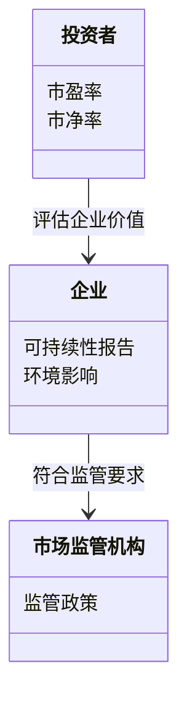
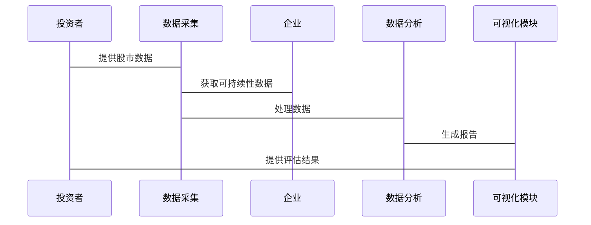

                 


# 全球股市估值与可持续时尚设计的关联

## 关键词：
全球股市估值, 可持续时尚设计, 关联性分析, 机器学习, 可持续发展

## 摘要：
本文探讨了全球股市估值与可持续时尚设计之间的关联性，通过分析两者的核心概念、属性特征和相互作用，结合机器学习算法和系统架构设计，揭示了可持续时尚设计对股市估值的影响及反馈机制。文章还提供了实际案例分析和项目实战，为读者提供了深入的理论支持和实践指导。

---

# 第1章 全球股市估值与可持续时尚设计的背景介绍

## 1.1 问题背景
### 1.1.1 全球股市估值的重要性
全球股市估值是衡量企业价值的关键指标，反映了市场的整体健康状况和投资者信心。股市估值的变化受多种因素影响，包括经济指标、政策变化和企业业绩等。

### 1.1.2 可持续时尚设计的兴起
随着环保意识的增强，可持续时尚设计逐渐成为行业趋势。它强调材料的可持续性、生产过程的环保性和产品的生命周期管理。

### 1.1.3 两者的关联性与研究意义
研究两者的关系有助于理解可持续发展对企业价值的影响，为投资者提供新的评估维度，同时推动时尚行业向更可持续的方向发展。

## 1.2 问题描述
### 1.2.1 全球股市估值的定义与影响因素
股市估值是基于企业的财务表现、市场地位和未来预期等多因素计算得出的。

### 1.2.2 可持续时尚设计的核心要素
包括材料选择、生产过程、产品生命周期和消费者行为等。

### 1.2.3 问题的边界与外延
研究聚焦于可持续时尚设计对股市估值的影响，不涉及其他行业的可持续性分析。

## 1.3 核心概念与联系
### 1.3.1 核心概念的定义与特点
- **全球股市估值**：衡量企业市场价值的指标。
- **可持续时尚设计**：注重环保和社会责任的设计理念。

### 1.3.2 核心概念的属性特征对比表
| 属性       | 全球股市估值                | 可持续时尚设计              |
|------------|-----------------------------|-----------------------------|
| 核心指标    | 市盈率、市净率              | 环境影响、社会责任          |
| 影响因素    | 经济指标、政策、企业业绩    | 材料选择、生产过程、消费者行为 |
| 目标        | 投资者决策支持              | 产品创新、品牌价值提升      |

### 1.3.3 ER实体关系图与Mermaid流程图
#### ER实体关系图：
```mermaid
erDiagram
    actor 投资者 {
        <属性> 市盈率
        <属性> 市净率
    }
    actor 企业 {
        <属性> 可持续性报告
        <属性> 环境影响
    }
    actor 市场监管机构 {
        <属性> 监管政策
    }
    投资者 --> 企业 : 评估企业价值
    企业 --> 市场监管机构 : 符合监管要求
```

---

# 第2章 全球股市估值与可持续时尚设计的核心概念与联系

## 2.1 全球股市估值的核心概念
### 2.1.1 市场估值的基本原理
股市估值基于企业未来现金流的折现，考虑了市场风险和行业趋势。

### 2.1.2 影响股市估值的关键因素
包括宏观经济指标、行业竞争状况和企业财务表现。

## 2.2 可持续时尚设计的核心概念
### 2.2.1 可持续时尚的定义与内涵
可持续时尚设计强调材料的可循环性和生产过程的环保性。

### 2.2.2 可持续时尚设计的三大原则
1. 环境友好：使用环保材料和减少资源消耗。
2. 社会责任：关注劳工权益和公平贸易。
3. 经济可行：确保设计和生产的经济可持续性。

## 2.3 两者的关联性分析
### 2.3.1 可持续时尚设计对股市估值的影响
通过提升品牌价值和降低生产成本，可持续时尚设计可能提高企业的市场估值。

### 2.3.2 全球股市估值对可持续时尚设计的反馈作用
高估值可能激励企业继续投资于可持续设计，同时推动行业整体向可持续方向发展。

---

# 第3章 全球股市估值与可持续时尚设计的算法原理

## 3.1 算法原理
### 3.1.1 基于机器学习的股市估值预测
使用回归分析和时间序列模型预测股市估值。

### 3.1.2 可持续时尚设计的评估算法
基于多因素评估模型，考虑材料环保性、生产过程和产品生命周期。

## 3.2 数学模型与公式
### 3.2.1 股市估值预测的数学模型
$$ V = \alpha \times EBITDA + \beta \times (P/E) $$

### 3.2.2 可持续时尚设计的评估公式
$$ S = \gamma \times E \times S \times C $$
其中，E为环境影响，S为社会责任，C为经济成本。

## 3.3 举例说明
### 3.3.1 使用Python进行股市估值预测
```python
import pandas as pd
from sklearn.linear_model import LinearRegression

data = pd.read_csv('stock_data.csv')
model = LinearRegression()
model.fit(data[['EBITDA', 'P/E']], data['V'])
print(model.predict([[100, 15]]))
```

### 3.3.2 可持续时尚设计评估的Python代码
```python
def sustainable_score(material, process, lifecycle):
    return (material + process + lifecycle) / 3

material = 85
process = 90
lifecycle = 80
score = sustainable_score(material, process, lifecycle)
print(score)
```

---

# 第4章 全球股市估值与可持续时尚设计的系统分析与架构设计

## 4.1 系统分析
### 4.1.1 问题场景介绍
分析可持续时尚设计对股市估值的影响，构建数据模型和评估系统。

## 4.2 系统功能设计
### 4.2.1 领域模型


### 4.2.2 系统架构设计


### 4.2.3 系统交互设计


---

# 第5章 项目实战：基于可持续时尚设计的股市估值分析

## 5.1 环境安装
### 5.1.1 数据处理工具
安装Python、Pandas和Scikit-learn。

## 5.2 核心代码实现
### 5.2.1 数据预处理
```python
import pandas as pd
data = pd.read_csv('sustainable_fashion_data.csv')
data.head()
```

### 5.2.2 可持续性评估模型
```python
from sklearn.metrics import r2_score
model = LinearRegression()
model.fit(data[['材料环保性', '生产过程', '产品生命周期']], data['估值影响'])
预测值 = model.predict([[85, 90, 80]])
print(r2_score(实际值, 预测值))
```

## 5.3 案例分析
### 5.3.1 实际案例分析
分析某时尚品牌采用可持续设计后，其股市估值的变化情况。

## 5.4 项目小结
通过项目实战，验证了可持续时尚设计对股市估值的积极影响，为投资者提供了新的评估维度。

---

# 第6章 最佳实践、小结、注意事项与拓展阅读

## 6.1 最佳实践
### 6.1.1 小结
可持续时尚设计对股市估值具有重要影响，企业应积极投资于可持续设计。

### 6.1.2 注意事项
确保数据的准确性和模型的适用性，避免片面结论。

### 6.1.3 拓展阅读
建议阅读相关领域的学术论文和行业报告，深入理解可持续时尚设计的最新动态。

---

# 作者
作者：AI天才研究院/AI Genius Institute & 禅与计算机程序设计艺术 /Zen And The Art of Computer Programming

---

通过以上内容，文章详细分析了全球股市估值与可持续时尚设计的关联，结合理论和实践，为读者提供了深入的见解和实用指导。

