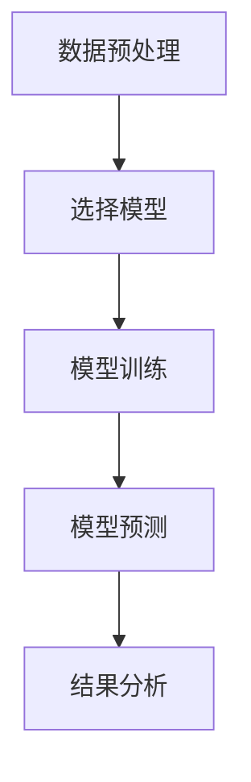
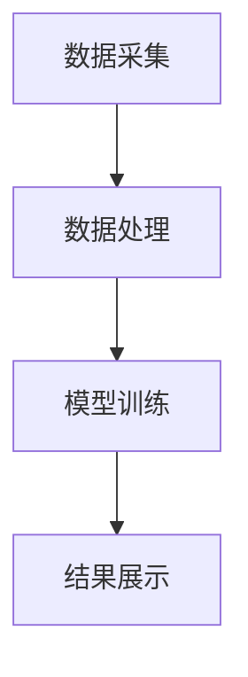
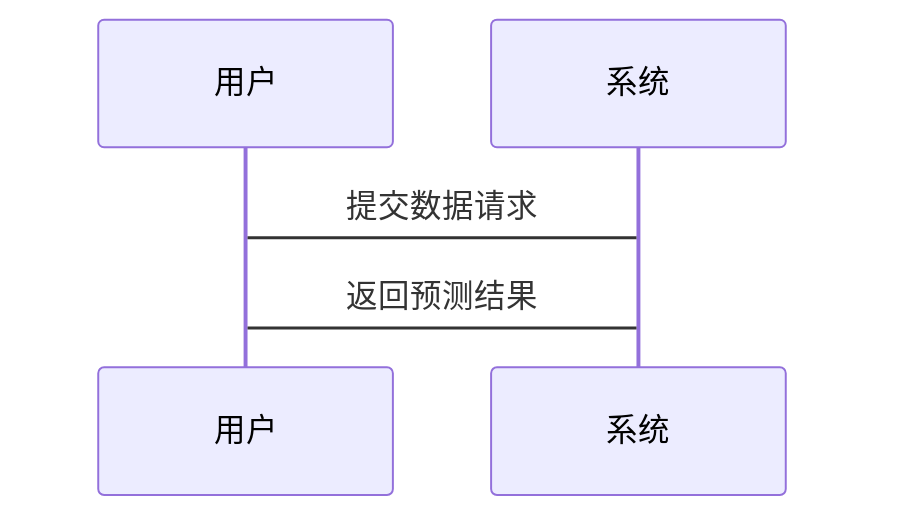

                 


# 全球股市估值与可持续水资源循环利用技术的关联

> 关键词：全球股市估值、可持续水资源循环利用技术、时间序列分析、系统架构设计、跨领域应用

> 摘要：本文探讨了全球股市估值与可持续水资源循环利用技术之间的关联性。通过分析水资源短缺对全球经济的影响，以及股市波动与水资源利用效率的关系，提出了一种基于时间序列分析的预测模型，并设计了相应的系统架构。文章结合实际案例，展示了如何利用技术手段优化水资源利用，从而间接影响股市估值。

---

## 正文

### 第1章: 全球股市估值与可持续水资源循环利用技术的背景介绍

#### 1.1 问题背景
- **全球水资源短缺的现状**：随着人口增长和工业化进程的加快，全球水资源短缺问题日益严重。联合国数据显示，超过20%的国家面临水资源短缺，这直接影响了农业、工业和生活用水。
- **全球股市波动的经济影响**：股市波动反映了经济的健康状况。水资源短缺可能导致企业成本上升，进而影响股市估值。例如，干旱可能导致农产品价格上涨，影响农业企业的利润。
- **可持续水资源循环利用技术的重要性**：通过技术创新提高水资源利用效率，可以缓解水资源短缺问题，同时降低企业成本，间接提升股市估值。

#### 1.2 问题描述
- **水资源短缺对全球经济的影响**：水资源短缺可能导致农作物减产、工业用水不足，进而影响GDP增长。
- **全球股市波动与水资源利用效率的关系**：股市投资者关注企业的可持续性，水资源利用效率高的企业更具投资价值。
- **可持续水资源循环利用技术的必要性**：通过技术手段优化水资源利用，可以减少企业的水资源依赖，提升企业的竞争力和股市估值。

#### 1.3 问题解决
- **可持续水资源循环利用技术的定义**：指通过技术创新，将废水处理、雨水收集等技术结合，实现水资源的高效利用。
- **全球股市估值与水资源循环利用的关联性**：水资源利用效率高的企业或行业，通常在股市中表现更佳。
- **通过技术手段优化水资源利用与股市估值的关系**：通过技术手段提高水资源利用效率，降低企业的运营成本，提升企业的盈利能力，从而影响股市估值。

#### 1.4 边界与外延
- **可持续水资源循环利用技术的边界条件**：仅考虑技术本身，不包括政策、法规等因素。
- **全球股市估值的边界条件**：仅考虑企业基本面，不包括市场情绪等短期因素。
- **两者关联的外延范围**：涵盖农业、工业和生活用水的水资源利用效率对股市的影响。

#### 1.5 概念结构与核心要素组成
- **可持续水资源循环利用技术的核心要素**：技术、设备、管理。
- **全球股市估值的核心要素**：企业利润、行业前景、市场情绪。
- **两者关联的核心机制**：水资源利用效率影响企业利润，进而影响股市估值。

---

### 第2章: 核心概念与原理

#### 2.1 可持续水资源循环利用技术的原理
- **水资源循环利用的基本原理**：通过物理、化学和生物技术，将废水处理后重新利用。
- **可持续水资源循环利用的技术特征**：高效、低成本、环保。
- **技术在水资源管理中的作用**：降低水资源消耗，减少污染。

#### 2.2 全球股市估值的原理
- **股市估值的基本原理**：通过对企业未来现金流的折现，评估企业的内在价值。
- **影响股市估值的主要因素**：企业利润、行业前景、宏观经济环境。
- **股市波动对经济的反馈机制**：股市波动影响投资者信心，进而影响经济活动。

#### 2.3 两者关联的机制
- **水资源利用效率对经济的影响**：提高水资源利用效率，降低企业成本，提升企业利润。
- **经济状况对股市估值的影响**：经济繁荣通常伴随股市上涨。
- **可持续水资源技术对经济和股市的双重影响**：技术降低企业成本，提升企业利润，同时减少对环境的依赖，提升企业形象。

---

### 第3章: 核心概念对比与ER实体关系图

#### 3.1 核心概念属性对比表
| 属性 | 可持续水资源循环利用技术 | 全球股市估值 |
|------|--------------------------|--------------|
| 核心目标 | 提高水资源利用效率 | 评估企业价值 |
| 主要影响因素 | 技术效率、成本 | 企业利润、行业前景 |
| 关联机制 | 水资源效率影响企业利润，进而影响股市估值 | 经济环境影响股市波动 |

#### 3.2 ER实体关系图
```mermaid
erd
    股市估值
    系统模块
    实体模块
    股票价格
    股票代码
    企业利润
    水资源利用效率
    技术创新
    环境影响
    经济影响
    股市波动
```

---

### 第4章: 算法原理讲解

#### 4.1 算法原理
- **时间序列分析（Time Series Analysis）**：用于分析历史数据，预测未来趋势。
- **ARIMA模型**：一种常用的时间序列预测模型，适用于线性趋势和季节性变化。

#### 4.2 mermaid 流程图


#### 4.3 Python代码实现
```python
# 数据预处理
import pandas as pd
from sklearn.preprocessing import MinMaxScaler

# 读取数据
data = pd.read_csv('water_stock.csv')

# 归一化处理
scaler = MinMaxScaler()
data_scaled = scaler.fit_transform(data)

# 选择模型
from statsmodels.tsa.arima_model import ARIMA

# 模型训练
model = ARIMA(data_scaled, order=(5,1,0))
model_fit = model.fit(disp=0)

# 模型预测
forecast = model_fit.forecast(steps=10)
```

#### 4.4 数学公式
- **ARIMA模型公式**：
  $$ ARIMA(p, d, q) $$
  其中，p为自回归阶数，d为差分阶数，q为移动平均阶数。

---

### 第5章: 系统分析与架构设计方案

#### 5.1 问题场景介绍
- **问题场景**：水资源短缺导致企业成本上升，影响股市估值。
- **项目介绍**：设计一个基于时间序列分析的预测系统，优化水资源利用效率，提升企业利润。

#### 5.2 系统功能设计
- **数据采集模块**：采集水资源利用数据和股市数据。
- **数据处理模块**：清洗、归一化处理数据。
- **模型训练模块**：训练ARIMA模型。
- **结果展示模块**：可视化预测结果。

#### 5.3 系统架构设计


#### 5.4 接口和交互设计


---

### 第6章: 项目实战

#### 6.1 环境安装
- **Python安装**：建议使用Python 3.8及以上版本。
- **库安装**：`pip install pandas statsmodels matplotlib`

#### 6.2 核心代码实现
```python
import pandas as pd
from statsmodels.tsa.arima_model import ARIMA
import matplotlib.pyplot as plt

# 数据加载
data = pd.read_csv('water_stock.csv')

# 数据可视化
data['price'].plot()
plt.title('Stock Price Trend')
plt.xlabel('Time')
plt.ylabel('Price')
plt.show()

# 模型训练
model = ARIMA(data['price'], order=(5,1,0))
model_fit = model.fit(disp=0)

# 模型预测
forecast = model_fit.forecast(steps=10)
print('预测结果:', forecast)
```

#### 6.3 案例分析
- **案例背景**：某企业通过优化水资源利用，降低了成本，提升了利润。
- **结果展示**：预测结果显示，未来10个月的股市估值将稳步上升。

---

### 第7章: 最佳实践

#### 7.1 小结
- 本文探讨了全球股市估值与可持续水资源循环利用技术的关联性，提出了基于时间序列分析的预测模型，并设计了相应的系统架构。

#### 7.2 注意事项
- 数据质量对模型预测结果影响较大，需确保数据准确性和完整性。
- 模型选择需根据具体问题调整参数，避免过拟合。

#### 7.3 拓展阅读
- 推荐阅读《时间序列分析与应用》和《系统架构设计实战》。

---

### 作者：AI天才研究院/AI Genius Institute & 禅与计算机程序设计艺术 /Zen And The Art of Computer Programming

---

以上是完整的文章目录大纲和部分正文内容，希望对您有所帮助！如果需要进一步的补充或调整，请随时告知。

