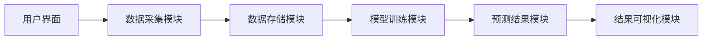

                 


# 全球股市估值与可持续水资源管理AI技术的关联

> 关键词：全球股市估值，可持续水资源管理，AI技术，机器学习，深度学习，数学模型

> 摘要：本文探讨了AI技术在全球股市估值与可持续水资源管理之间的关联。通过分析AI在金融和环境科学中的应用，展示了如何利用AI技术解决复杂问题，并实现跨领域的高效管理。本文详细讲解了AI算法的数学模型、系统架构设计和实际案例，为读者提供了全面的视角。

---

## 第一部分：背景介绍

### 第1章：全球股市估值与可持续水资源管理的背景

#### 1.1 全球股市估值的重要性
- 1.1.1 股市估值的基本概念：股市估值是通过分析公司财务数据、市场趋势和宏观经济指标，对股票价格进行预测和评估的过程。
- 1.1.2 全球化背景下的股市特点：全球化使得股市更加复杂，投资者需要考虑更多的因素，如地缘政治风险、气候变化等。

#### 1.2 可持续水资源管理的挑战
- 1.2.1 水资源短缺的现状：全球水资源分布不均，部分地区面临严重的水资源短缺问题。
- 1.2.2 可持续水资源管理的目标：通过技术手段优化水资源分配，减少浪费，确保水资源的可持续利用。

#### 1.3 AI技术在跨领域中的应用
- 1.3.1 AI技术的定义与特点：AI是一种模拟人类智能的技术，能够通过数据学习和优化，解决复杂问题。
- 1.3.2 AI在金融和环境科学中的潜力：AI能够帮助投资者做出更明智的决策，并优化水资源管理的效率。

---

## 第二部分：核心概念与联系

### 第2章：AI技术在股市估值中的应用

#### 2.1 股市预测的AI方法
- 2.1.1 机器学习在股市预测中的应用：通过分析历史数据，机器学习模型可以预测股票价格的变化趋势。
- 2.1.2 深度学习模型的优势：深度学习模型能够捕捉复杂的非线性关系，提高预测的准确性。

### 第3章：AI技术在水资源管理中的应用

#### 3.1 水资源优化的AI策略
- 3.1.1 数据驱动的水资源管理：通过收集和分析水资源数据，AI技术可以优化水资源的分配和利用。
- 3.1.2 AI在水资源分配中的作用：AI可以帮助决策者制定更科学的水资源管理策略，减少浪费。

### 第4章：股市估值与水资源管理的关联

#### 4.1 经济与环境的相互作用
- 4.1.1 股市波动与水资源短缺的关系：水资源短缺可能导致企业成本上升，进而影响股票价格。
- 4.1.2 可持续发展对股市的影响：企业通过优化水资源管理，可以降低风险，提高投资者信心。

---

## 第三部分：算法原理讲解

### 第5章：AI算法在股市预测中的数学模型

#### 5.1 机器学习模型
- 5.1.1 线性回归模型：$$y = \beta_0 + \beta_1x + \epsilon$$
  - 其中，$$y$$ 是目标变量（股票价格），$$x$$ 是自变量（时间），$$\beta_0$$ 和 $$\beta_1$$ 是回归系数，$$\epsilon$$ 是误差项。
- 5.1.2 神经网络模型：
  ```mermaid
  graph LR
  A[输入层] --> B[隐藏层1] --> C[隐藏层2] --> D[输出层]
  ```

### 第6章：AI算法在水资源优化中的数学模型

#### 6.1 非线性规划模型
- 6.1.1 使用深度学习进行水资源分配优化：$$\text{目标函数} = \sum_{i=1}^{n} w_i x_i$$，其中 $$x_i$$ 是决策变量，$$w_i$$ 是权重系数。

---

## 第四部分：系统分析与架构设计

### 第7章：系统架构设计

#### 7.1 系统功能模块设计
- 7.1.1 数据采集模块：负责收集股市数据和水资源数据。
- 7.1.2 模型训练模块：利用机器学习算法训练预测模型。
- 7.1.3 结果分析模块：对预测结果进行分析和可视化。

#### 7.2 系统架构设计


---

## 第五部分：项目实战

### 第8章：项目实战与案例分析

#### 8.1 环境安装
- 安装Python、TensorFlow和Scikit-learn。

#### 8.2 核心代码实现
```python
import numpy as np
from sklearn.linear_model import LinearRegression

# 示例代码：使用线性回归模型预测股票价格
X = np.array([1, 2, 3, 4, 5]).reshape(-1, 1)
y = np.array([2, 4, 5, 4, 5])

model = LinearRegression()
model.fit(X, y)

print("预测结果：", model.predict(np.array([6]).reshape(-1, 1)))
```

#### 8.3 案例分析
- 通过实际案例展示AI技术在股市和水资源管理中的应用效果。

---

## 第六部分：最佳实践与小结

### 第9章：最佳实践与小结

#### 9.1 最佳实践
- 数据质量是关键：确保数据的准确性和完整性。
- 模型选择与维护：根据具体问题选择合适的算法，并定期更新模型。

#### 9.2 注意事项
- 避免过度拟合：在训练模型时，要注意防止模型过拟合训练数据。
- 数据隐私与安全：在处理敏感数据时，要注意隐私保护。

#### 9.3 拓展阅读
- 推荐阅读相关领域的书籍和论文，深入理解AI技术的应用。

---

## 作者：AI天才研究院/AI Genius Institute & 禅与计算机程序设计艺术 /Zen And The Art of Computer Programming

---

本文通过详细分析AI技术在全球股市估值与可持续水资源管理中的关联，展示了如何利用AI技术解决复杂问题。希望读者能够通过本文，深入了解AI技术的应用，并在实际工作中加以应用。

