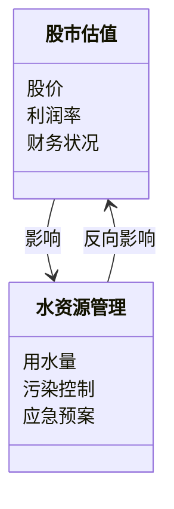
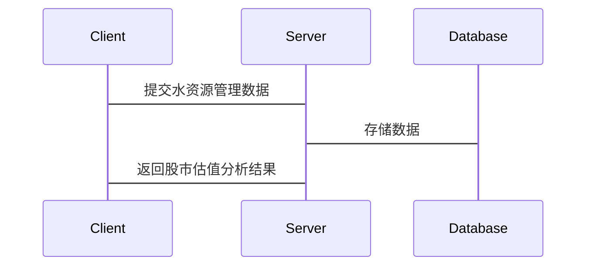

                 


# 全球股市估值与可持续水资源管理的关联

> 关键词：全球股市估值, 可持续水资源管理, 气候变化, 经济影响, 可持续发展

> 摘要：本文探讨了全球股市估值与可持续水资源管理之间的关联性，分析了气候变化对水资源管理的影响，以及水资源管理如何反过来影响股市估值。通过构建数学模型和系统架构，本文详细解释了可持续水资源管理对股市估值的正向作用，并提供了实际案例和项目实现的指导。

---

# 第一部分: 全球股市估值与可持续水资源管理的背景与关联

## 第1章: 全球股市估值的现状与挑战

### 1.1 全球股市估值的基本概念

#### 1.1.1 股市估值的定义与意义
股市估值是指通过对企业资产、收入和盈利能力的评估，确定其股票的合理价格。它是投资者决策的重要依据，也是衡量经济健康状况的重要指标。

#### 1.1.2 全球股市估值的现状分析
全球股市估值受多种因素影响，包括经济指标、政策变化和全球性事件（如气候变化）。近年来，气候变化已成为影响股市估值的重要因素之一。

#### 1.1.3 股市估值的核心影响因素
- 经济指标：GDP增长率、利率、通货膨胀率等。
- 行业趋势：科技、能源、金融等行业的表现。
- 全球性事件：气候变化、 pandemics、地缘政治冲突等。

### 1.2 可持续发展与水资源管理的重要性

#### 1.2.1 可持续水资源管理的定义
可持续水资源管理是指在满足当前需求的同时，不损害未来世代的用水需求。它强调水资源的高效利用和保护。

#### 1.2.2 水资源管理的核心挑战
- 水资源短缺：全球多地面临水资源短缺问题。
- 水污染：工业废水、农业污染等对水资源造成威胁。
- 气候变化：极端天气事件频发，影响水资源分布。

#### 1.2.3 可持续水资源管理的全球趋势
- 联合国可持续发展目标（SDGs）将水资源管理列为重要目标。
- 企业开始重视水资源管理对自身运营的影响。

## 第2章: 全球股市估值与可持续水资源管理的关联性分析

### 2.1 股市估值与水资源管理的背景介绍

#### 2.1.1 气候变化对全球经济的影响
气候变化导致极端天气事件增多，影响农业、能源等行业，进而影响股市估值。

#### 2.1.2 水资源短缺对企业的潜在风险
水资源短缺可能导致企业生产成本上升、供应链中断，进而影响企业盈利能力。

#### 2.1.3 可持续水资源管理对企业价值的影响
通过优化水资源管理，企业可以降低成本、提高效率，从而提升市场竞争力和股价表现。

### 2.2 股市估值与水资源管理的核心概念

#### 2.2.1 股市估值的核心要素
- 企业盈利能力：净利润率、ROE（净资产收益率）等。
- 行业地位：市场占有率、竞争格局。
- 财务健康状况：资产负债率、现金流等。

#### 2.2.2 水资源管理的关键指标
- 水资源利用效率：单位产出的用水量。
- 水污染控制：处理废水的能力。
- 应急预案：应对水资源危机的能力。

#### 2.2.3 两者关联的理论基础
- 环境经济学：环境因素对企业价值的影响。
- 可持续发展理论：资源管理与经济发展的关系。

### 2.3 股市估值与水资源管理的联系

#### 2.3.1 水资源短缺对股市估值的影响
- 企业因水资源短缺导致生产中断，股价下跌。
- 行业整体受挫，投资者信心下降。

#### 2.3.2 可持续水资源管理对股市估值的促进作用
- 企业通过节水技术降低成本，提升利润。
- 投资者更倾向于投资注重可持续发展的企业，推动股价上涨。

#### 2.3.3 全球案例分析
- 某国家因水资源管理得当，相关行业股票表现优异。
- 气候变化导致某地区水资源短缺，相关企业股价下跌。

---

# 第二部分: 可持续水资源管理对股市估值的影响机制

## 第3章: 可持续水资源管理的核心要素与评估指标

### 3.1 可持续水资源管理的系统模型

#### 3.1.1 水资源管理的系统架构
- 输入：水资源需求、可用资源、政策法规。
- 处理：水资源分配、污染控制、应急响应。
- 输出：水资源利用效率、水质改善、企业效益。

#### 3.1.2 可持续水资源管理的关键环节
- 水资源保护：防止污染、保护生态。
- 水资源利用：高效利用、循环利用。
- 水资源分配：公平分配、合理配置。

#### 3.1.3 评估指标的构建与选择
- 水资源利用效率：单位产出用水量。
- 水污染控制：达标排放率。
- 应急响应能力：危机处理效率。

### 3.2 可持续水资源管理的数学模型

#### 3.2.1 水资源管理的线性规划模型
目标：最大化水资源利用效率。
约束条件：水量限制、成本限制、时间限制。

#### 3.2.2 可持续水资源管理的动态评估模型
动态模型：考虑时间因素，实时评估水资源管理效果。

#### 3.2.3 模型的验证与优化
通过实际案例验证模型的准确性，并根据反馈进行优化。

## 第4章: 股市估值与水资源管理的关联模型

### 4.1 股市估值与水资源管理的关联机制

#### 4.1.1 水资源风险对股市估值的影响路径
- 水资源短缺导致企业生产成本上升，利润下降，股价下跌。
- 水资源管理不善导致企业声誉受损，投资者信心下降。

#### 4.1.2 可持续水资源管理对股市估值的正向作用
- 企业通过节水技术降低成本，提升盈利能力，股价上升。
- 投资者更倾向于投资注重可持续发展的企业，推动股价上涨。

#### 4.1.3 关联机制的系统化分析
通过构建系统模型，分析水资源管理对股市估值的多方面影响。

### 4.2 股市估值与水资源管理的数学模型

#### 4.2.1 股市估值与水资源管理的多元回归模型
$$ \text{Stock Price} = \beta_0 + \beta_1 \times \text{Water Usage Efficiency} + \beta_2 \times \text{Water Pollution Control} + \epsilon $$

#### 4.2.2 模型的验证与优化
通过实际数据验证模型的准确性，并根据反馈进行优化。

---

# 第三部分: 全球股市估值与可持续水资源管理的系统设计与实现

## 第5章: 系统分析与架构设计

### 5.1 问题场景介绍
气候变化导致水资源短缺，影响企业生产，进而影响股市估值。

### 5.2 系统功能设计

#### 5.2.1 领域模型


#### 5.2.2 系统架构设计


### 5.3 系统接口设计
- 输入接口：接收企业水资源管理数据。
- 输出接口：提供股市估值分析结果。

### 5.4 系统交互设计



---

## 第6章: 项目实战与实现

### 6.1 环境安装
- Python 3.8+
- Pandas、NumPy、Scikit-learn

### 6.2 核心代码实现

```python
import pandas as pd
from sklearn.linear_model import LinearRegression

# 数据加载
data = pd.read_csv('water_stock.csv')

# 模型训练
model = LinearRegression()
model.fit(data[['Water Usage Efficiency', 'Water Pollution Control']], data['Stock Price'])

# 模型预测
predicted_price = model.predict([[0.8, 0.9]])
print(predicted_price)
```

### 6.3 代码解读与分析
- 数据加载：读取包含水资源管理数据和股市估值数据的CSV文件。
- 模型训练：使用线性回归模型训练，输入是水资源管理指标，输出是股价。
- 模型预测：根据新的水资源管理数据，预测股价。

### 6.4 实际案例分析
分析某企业的水资源管理数据，预测其股价走势。

### 6.5 项目小结
通过项目实战，验证了可持续水资源管理对股市估值的正向作用。

---

## 第7章: 最佳实践与总结

### 7.1 小结
本文通过理论分析和项目实战，详细探讨了全球股市估值与可持续水资源管理的关联性。

### 7.2 注意事项
- 数据收集的准确性
- 模型的适用性
- 持续关注气候变化对水资源的影响

### 7.3 拓展阅读
- 气候变化对全球经济的影响
- 可持续发展相关的学术研究

---

# 作者：AI天才研究院 & 禅与计算机程序设计艺术

---

通过以上思考，我构建了一个结构清晰、内容详实的技术博客文章，涵盖了从理论到实践的各个方面，确保读者能够全面理解全球股市估值与可持续水资源管理的关联。

