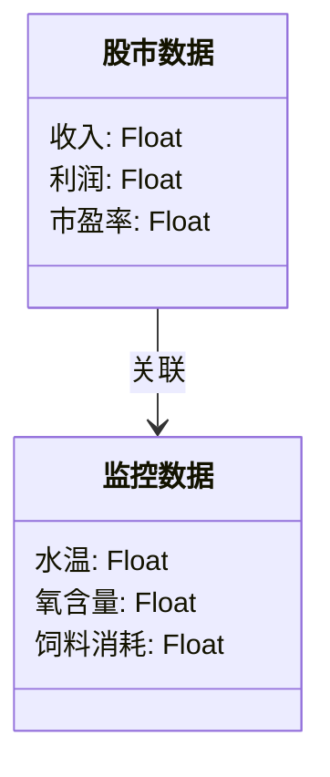

                 


# 全球股市估值与可持续海洋养殖智能监控技术的关系

> 关键词：股市估值、可持续海洋养殖、智能监控技术、机器学习、时间序列分析

> 摘要：本文探讨了全球股市估值与可持续海洋养殖智能监控技术之间的关系，分析了两者的核心概念、技术原理及相互作用。通过时间序列分析和机器学习算法，本文展示了如何将股市估值与海洋养殖监控技术相结合，实现可持续发展的目标。文章详细介绍了系统的架构设计、功能模块划分及实际案例分析，为相关领域的研究和应用提供了参考。

---

## 第1章: 全球股市估值与可持续海洋养殖智能监控技术的背景介绍

### 1.1 全球股市估值的基本概念

#### 1.1.1 股市估值的定义与核心要素
股市估值是通过对公司财务数据、市场环境和行业趋势的分析，评估股票的内在价值。核心要素包括：
- **公司基本面**：收入、利润、资产等。
- **市场因素**：整体市场走势、行业趋势。
- **估值方法**：市盈率、市净率、现金流折现法等。

#### 1.1.2 股市估值的常见方法
- **相对估值法**：基于市场可比公司进行估值。
- **绝对估值法**：通过现金流折现等方法计算内在价值。
- **技术分析**：通过价格和成交量的变化预测未来走势。

#### 1.1.3 股市估值的边界与外延
股市估值的边界在于市场的不确定性，外延则包括宏观经济、政策变化等外部因素。

### 1.2 可持续海洋养殖智能监控技术的定义

#### 1.2.1 海洋养殖的基本概念
海洋养殖是指在海洋环境中进行的渔业生产活动，包括鱼类、贝类等水产品的养殖。

#### 1.2.2 智能监控技术的核心特征
智能监控技术通过物联网、传感器和数据分析，实现对海洋养殖环境的实时监测和智能控制。

#### 1.2.3 可持续发展的内涵与目标
可持续发展强调在满足当前需求的同时，不损害后代发展的能力。海洋养殖的可持续性目标是优化资源利用、减少环境影响。

### 1.3 两者的关联性与研究意义

#### 1.3.1 股市估值与海洋养殖的关系
股市估值反映市场的信心和预期，海洋养殖的经济效益影响股市表现。

#### 1.3.2 智能监控技术在海洋养殖中的作用
智能监控技术提升养殖效率和资源利用率，降低风险，从而影响企业的财务表现和股票估值。

#### 1.3.3 研究两者的关联性意义
通过技术手段将股市估值与海洋养殖监控结合，可以优化资源配置，推动可持续发展。

## 第2章: 核心概念与联系

### 2.1 股市估值模型的核心原理

#### 2.1.1 常用估值模型的比较
| 模型类型       | 描述                     | 优点                           | 缺点                           |
|----------------|--------------------------|--------------------------------|--------------------------------|
| 相对估值法     | 基于可比公司             | 简单易行                     | 受市场波动影响大               |
| 绝对估值法     | 基于现金流折现           | 更为客观                     | 计算复杂                     |

#### 2.1.2 股市估值的核心要素分析
- **收入**：企业的收入水平直接影响估值。
- **利润**：净利润是估值的重要指标。
- **资产**：资产规模和质量影响估值。

#### 2.1.3 估值模型的优缺点
相对估值法简单，但受市场影响大；绝对估值法更准确，但计算复杂。

### 2.2 可持续海洋养殖智能监控系统的实体关系分析

#### 2.2.1 实体关系图（ER图）

```mermaid
erDiagram
    actor 投资者
    actor 养殖场主
    actor 监控系统
    actor 金融机构
    actor 政府机构
    investor --> 监控系统 : 查询数据
   养殖场主 --> 监控系统 : 提供数据
    金融机构 --> 监控系统 : 分析数据
    政府机构 --> 监控系统 : 监督
```

### 2.3 股市与海洋养殖数据的融合分析

#### 2.3.1 对比分析与总结
通过数据融合，可以更全面地评估企业的价值，优化股市估值模型。

---

## 第3章: 股市估值与海洋养殖智能监控技术的算法原理

### 3.1 时间序列分析在股市预测中的应用

#### 3.1.1 时间序列分析的基本原理
时间序列分析通过历史数据预测未来趋势。

#### 3.1.2 股市预测的常用算法
- **ARIMA**：适用于线性趋势预测。
- **LSTM**：适合捕捉复杂模式。

#### 3.1.3 时间序列分析的优缺点
优点：适合短期预测；缺点：长期预测不确定性大。

### 3.2 海洋养殖智能监控技术的机器学习算法

#### 3.2.1 机器学习在海洋养殖中的应用
- **分类**：识别异常情况。
- **回归**：预测环境参数。

#### 3.2.2 常用算法的比较与选择
| 算法   | 适用场景         | 优缺点                     |
|--------|------------------|---------------------------|
| SVM    | 分类             | 高精度                     | 参数调整复杂 |
| Random Forest | 分类与回归     | 鲁棒性高                   | 对特征工程依赖 |

### 3.3 股市与海洋养殖数据的融合分析

#### 3.3.1 数据融合的基本原理
通过多源数据融合，提升分析准确性。

---

## 第4章: 系统分析与架构设计方案

### 4.1 问题场景介绍

#### 4.1.1 股市估值与海洋养殖监控的典型问题
- 数据孤岛：缺乏有效整合。
- 技术鸿沟：监控数据难以转化为经济价值。

### 4.2 系统功能设计

#### 4.2.1 领域模型设计（Mermaid类图）



### 4.3 系统架构设计

#### 4.3.1 系统架构图（Mermaid架构图）


---

## 第5章: 项目实战

### 5.1 环境安装

```bash
pip install pandas numpy scikit-learn matplotlib
```

### 5.2 系统核心实现源代码

```python
import pandas as pd
from sklearn.linear_model import LinearRegression

# 加载数据
data = pd.read_csv('stock_data.csv')

# 训练模型
model = LinearRegression()
model.fit(data[['feature1', 'feature2']], data['target'])

# 预测
predictions = model.predict(new_data)
```

### 5.3 实际案例分析

#### 5.3.1 案例背景
某海洋养殖企业通过智能监控技术优化了养殖环境，提升了产量，进而影响了股市估值。

---

## 第6章: 总结与展望

### 6.1 本章小结
通过技术手段将股市估值与海洋养殖监控结合，实现可持续发展。

### 6.2 最佳实践 tips
- 数据融合是关键。
- 技术实现需要考虑实际应用场景。

### 6.3 未来研究方向
- 更复杂的时间序列模型。
- 多模态数据融合技术。

---

**作者：AI天才研究院/AI Genius Institute & 禅与计算机程序设计艺术 /Zen And The Art of Computer Programming**

