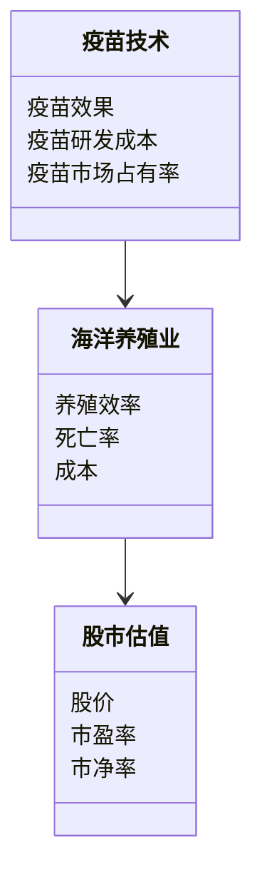
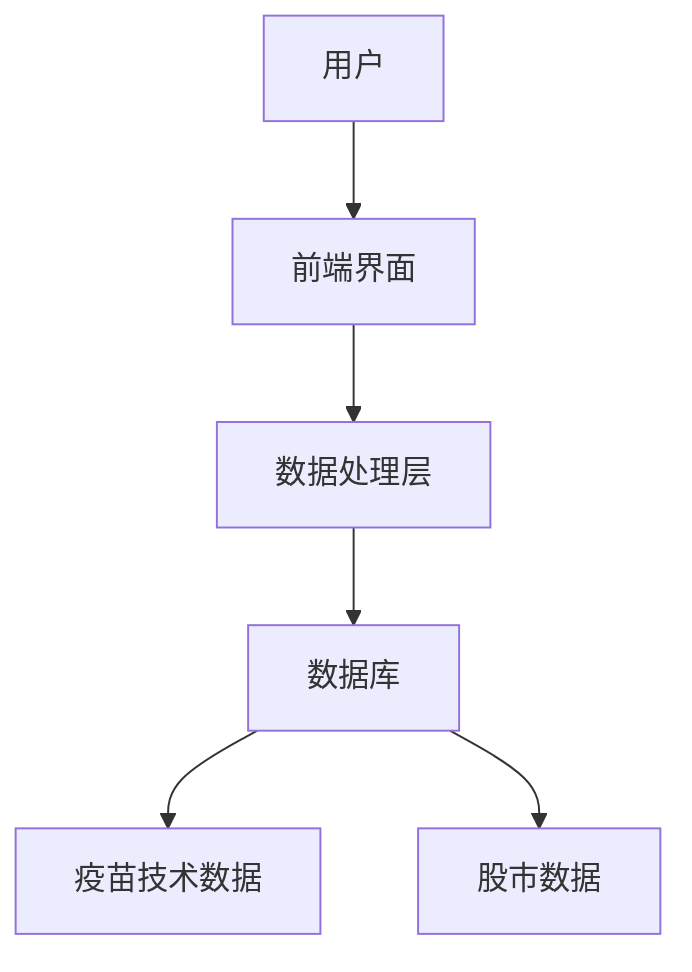
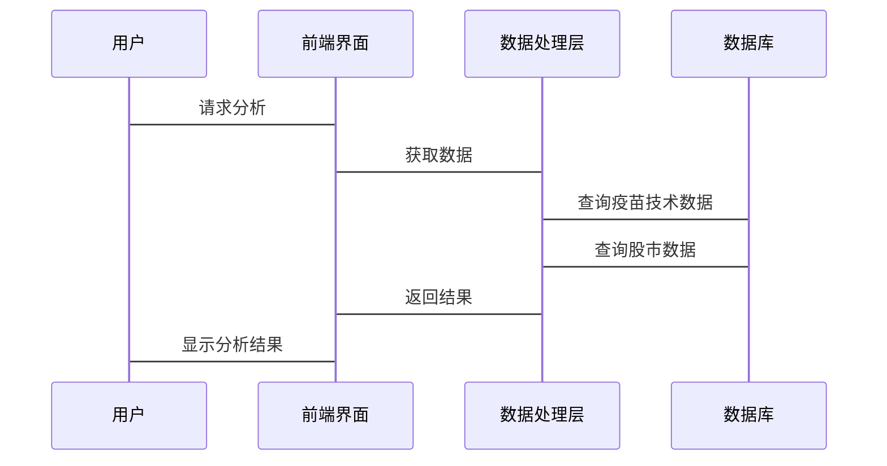

                 


# 全球股市估值与可持续海洋养殖疫苗技术的关系

## 关键词：全球股市估值、可持续海洋养殖、疫苗技术、经济影响、技术发展

## 摘要：
本文探讨全球股市估值与可持续海洋养殖疫苗技术之间的关系。通过分析疫苗技术对海洋养殖业的影响，进而分析其对股市估值的潜在影响。文章从背景介绍、核心概念、算法原理、系统架构、项目实战等多角度展开，结合实际案例，深入剖析疫苗技术如何推动海洋养殖业的可持续发展，并进一步影响全球股市估值的变化。

---

# 第1章: 全球股市估值概述

## 1.1 全球股市的基本概念

### 1.1.1 什么是全球股市
全球股市是指分布在世界各地的股票市场的总称，包括纽约证券交易所、纳斯达克、伦敦证券交易所等。股市是企业融资和投资者投资的重要平台，反映了经济的活力和市场的信心。

### 1.1.2 全球股市的主要组成部分
- **交易所**：如纽约证交所、纳斯达克、伦敦证交所等。
- **上市公司**：涵盖科技、金融、能源等多个行业。
- **投资者**：包括机构投资者和个人投资者。

### 1.1.3 全球股市的运行机制
股市通过买卖股票，实现资本的流动和资源配置。价格由供需关系决定，受宏观经济、企业盈利、市场情绪等多种因素影响。

## 1.2 全球股市估值的基本理论

### 1.2.1 估值的基本概念
估值是通过分析企业财务状况、行业地位、市场前景等因素，确定其股票的合理价格。

### 1.2.2 常用的估值方法
- **PE（市盈率）**：股价与每股收益的比率。
- **PB（市净率）**：股价与每股净资产的比率。
- **PS（市销率）**：股价与每股营收的比率。

### 1.2.3 影响股市估值的主要因素
- **宏观经济**：GDP、利率、通胀等。
- **行业特性**：科技、金融、能源等行业差异。
- **企业基本面**：盈利、增长、负债等。

## 1.3 全球股市的历史发展

### 1.3.1 20世纪的股市发展
20世纪见证了股市的快速发展，如1929年大萧条、20世纪80年代科技股的崛起。

### 1.3.2 21世纪的股市变化
互联网泡沫、2008年金融危机、新冠疫情对股市的重大影响。

### 1.3.3 近年来的重要事件对股市的影响
如新冠疫情导致的市场崩盘与复苏，科技股的持续上涨。

---

# 第2章: 可持续海洋养殖技术概述

## 2.1 海洋养殖的基本概念

### 2.1.1 海洋养殖的定义
海洋养殖是指在海洋环境中进行的渔业生产活动，包括鱼类、贝类、藻类等的养殖。

### 2.1.2 海洋养殖的主要类型
- **海水养殖**：如海水鱼类、贝类养殖。
- **淡水养殖**：如淡水鱼类养殖。
- **海洋藻类养殖**：如海带、紫菜等。

### 2.1.3 海洋养殖的发展现状
随着人口增长和资源需求增加，海洋养殖成为重要的食品来源，但同时也面临资源过度开发和环境污染的挑战。

## 2.2 疫苗技术在海洋养殖中的应用

### 2.2.1 疫苗技术的基本原理
疫苗通过刺激宿主免疫系统，产生对特定病原体的抵抗力，从而预防疾病的发生。

### 2.2.2 疫苗技术在海洋养殖中的具体应用
- **鱼类疫苗**：预防鱼类疾病，提高养殖存活率。
- **贝类疫苗**：减少病害，提高产量。

### 2.2.3 疫苗技术对海洋养殖的影响
- **降低死亡率**：疫苗技术显著减少了疾病导致的死亡，提高了养殖效率。
- **减少环境影响**：通过预防疾病，减少抗生素的使用，降低对环境的污染。

## 2.3 可持续发展的概念与海洋养殖

### 2.3.1 可持续发展的定义
可持续发展是指满足当前需求的同时，不损害后代满足其需求的能力。

### 2.3.2 可持续发展在海洋养殖中的重要性
海洋养殖需要在保护海洋生态系统的同时，满足人类对水产品的需求。

### 2.3.3 可持续海洋养殖的目标与挑战
目标是实现高效、环保、可持续的养殖模式，挑战包括技术、资金、政策等。

---

# 第3章: 全球股市估值与疫苗技术的关系

## 3.1 疫苗技术对海洋养殖业的影响

### 3.1.1 疫苗技术如何提高养殖效率
通过预防疾病，减少养殖过程中的损失，提高单位面积的产量。

### 3.1.2 疫苗技术如何降低养殖成本
减少疾病治疗和死亡率，降低人力和资源成本。

### 3.1.3 疫苗技术对养殖业的长期影响
疫苗技术的普及将推动海洋养殖业的规模化和集约化发展。

## 3.2 疫苗技术对股市估值的影响

### 3.2.1 疫苗技术如何影响企业的盈利能力
疫苗技术的应用提高了企业的生产效率和利润率，进而提升企业的盈利能力。

### 3.2.2 疫苗技术如何影响企业的市场地位
掌握疫苗技术的企业可能在行业内占据领先地位，增强市场竞争力。

### 3.2.3 疫苗技术如何影响企业的股价表现
疫苗技术的成功应用通常会带来股价的上涨，尤其是在技术创新和市场认可的情况下。

## 3.3 全球股市估值与疫苗技术的相互作用

### 3.3.1 疫苗技术如何推动股市估值的变化
疫苗技术的突破和应用可能引发相关企业股价的上涨，推动整体股市估值的变化。

### 3.3.2 股市估值如何反过来影响疫苗技术的发展
高估值可能吸引更多资金投入疫苗技术研发，推动技术进步和创新。

### 3.3.3 疫苗技术与股市估值的长期关系
疫苗技术的持续创新和应用将推动股市估值的长期上涨，形成良性循环。

---

# 第4章: 疫苗技术对全球股市的影响分析

## 4.1 疫苗技术在不同地区的股市表现

### 4.1.1 北美地区的股市表现
北美地区的股市，尤其是美国，许多疫苗技术公司如Moderna、辉瑞等，在股市中表现优异。

### 4.1.2 欧洲地区的股市表现
欧洲地区的疫苗技术公司如阿斯利康在股市中也有显著表现。

### 4.1.3 亚洲地区的股市表现
中国的疫苗企业如科兴中维在股市中表现突出，推动了相关股票的上涨。

## 4.2 疫苗技术对股市估值的数学模型

### 4.2.1 模型假设
假设疫苗技术的应用能够提高企业的盈利能力，进而影响其股价。

### 4.2.2 模型构建
使用回归分析模型，分析疫苗技术对股价的影响。

### 4.2.3 数据支持
通过实际数据，如Moderna的股价走势，验证模型的准确性。

---

# 第5章: 系统分析与架构设计方案

## 5.1 问题场景介绍

### 5.1.1 问题背景
分析疫苗技术对股市估值的影响，需要构建一个完整的系统。

### 5.1.2 项目介绍
构建一个基于疫苗技术的股市估值分析系统。

## 5.2 系统功能设计

### 5.2.1 领域模型


### 5.2.2 系统架构设计


## 5.3 系统接口设计

### 5.3.1 接口定义
- 数据接口：获取疫苗技术和股市数据。
- 计算接口：计算疫苗技术对股市估值的影响。

## 5.4 系统交互设计

### 5.4.1 交互流程


---

# 第6章: 项目实战

## 6.1 环境安装

### 6.1.1 数据库安装
使用MySQL或PostgreSQL存储数据。

### 6.1.2 开发工具安装
安装Python、Jupyter Notebook等工具。

## 6.2 系统核心实现源代码

### 6.2.1 数据获取
```python
import pandas as pd
import requests
# 获取疫苗技术相关数据
def get_vaccine_data():
    url = "https://example.com/vaccine_data"
    response = requests.get(url)
    data = response.json()
    return pd.DataFrame(data)
# 获取股市数据
def get_stock_data():
    url = "https://example.com/stock_data"
    response = requests.get(url)
    data = response.json()
    return pd.DataFrame(data)
```

### 6.2.2 数据分析
```python
def analyze_impact(vaccine_data, stock_data):
    # 数据清洗和预处理
    # 数据分析和建模
    # 返回结果
    pass
```

## 6.3 实际案例分析

### 6.3.1 案例背景
分析Moderna公司疫苗技术对股价的影响。

### 6.3.2 数据分析
使用回归分析模型，分析Moderna股价与疫苗技术的关系。

## 6.4 代码应用解读与分析
解释代码的功能和实现逻辑，展示如何通过代码实现疫苗技术对股市估值的影响分析。

---

# 第7章: 总结与展望

## 7.1 总结

### 7.1.1 核心内容回顾
本文分析了疫苗技术对海洋养殖业的影响，进而探讨了其对全球股市估值的潜在影响。

### 7.1.2 主要结论
疫苗技术的普及将推动海洋养殖业的可持续发展，进而影响全球股市的估值。

## 7.2 展望

### 7.2.1 未来的研究方向
进一步研究疫苗技术对不同地区股市的影响，探索更多应用场景。

### 7.2.2 可能的趋势
随着疫苗技术的不断进步，其对股市估值的影响将更加显著。

---

# 作者：AI天才研究院/AI Genius Institute & 禅与计算机程序设计艺术 /Zen And The Art of Computer Programming

