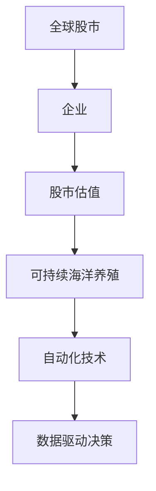
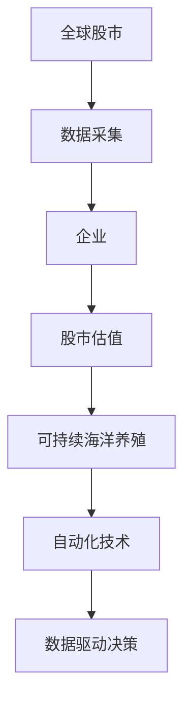
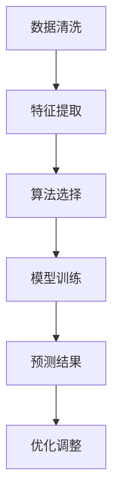
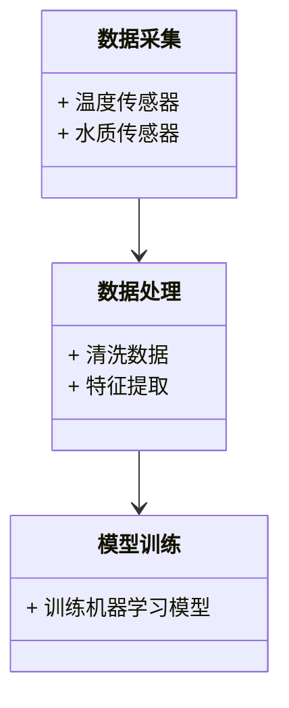
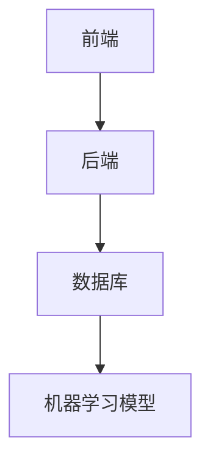
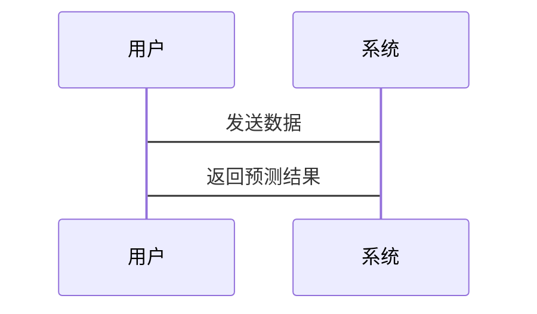

                 


# 全球股市估值与可持续海洋养殖自动化技术的关系

**关键词**：全球股市估值、可持续海洋养殖、自动化技术、大数据分析、机器学习、系统架构设计

**摘要**：  
本文探讨了全球股市估值与可持续海洋养殖自动化技术之间的关系。通过分析股市估值的核心要素和海洋养殖技术的创新，结合大数据和机器学习算法，构建了数学模型，设计了系统架构，并通过实际案例展示了技术在提升海洋养殖效率和优化股市估值中的应用。本文旨在为投资者和技术开发者提供理论支持和实践指导。

---

# 第1章 背景介绍

## 1.1 问题背景

### 1.1.1 全球股市估值的重要性  
全球股市估值是衡量经济健康状况的重要指标。股市估值反映了企业的盈利能力、市场预期和宏观经济环境。随着技术的进步，特别是人工智能和大数据技术的应用，股市估值的计算和预测变得更加精确和高效。

### 1.1.2 可持续海洋养殖的现状与挑战  
海洋养殖是全球食品供应链的重要组成部分。然而，传统海洋养殖面临资源浪费、环境污染和效率低下等问题。可持续海洋养殖要求在保证产量的同时，减少对环境的负面影响。

### 1.1.3 问题的提出与研究意义  
研究股市估值与海洋养殖技术的关系，可以帮助投资者更好地评估海洋养殖企业的价值，同时推动技术创新，实现可持续发展。

## 1.2 问题描述

### 1.2.1 全球股市估值的核心要素  
- 企业盈利水平  
- 市场预期  
- 宏观经济环境  

### 1.2.2 可持续海洋养殖技术的特征  
- 自动化控制  
- 环保高效  
- 数据驱动  

### 1.2.3 问题的边界与外延  
本文研究的范围限定在技术驱动的海洋养殖对股市估值的影响，不包括政策和人为因素的干扰。

## 1.3 问题解决

### 1.3.1 理论基础与方法论  
- 大数据分析  
- 机器学习算法  

### 1.3.2 技术创新与应用  
- 自动化监控系统  
- 数据驱动的决策支持  

### 1.3.3 可持续发展的路径选择  
- 技术创新  
- 环境保护  

## 1.4 概念结构与核心要素

### 1.4.1 核心概念的定义  
- 全球股市估值：反映企业价值的综合指标  
- 可持续海洋养殖：环保高效的养殖方式  

### 1.4.2 核心要素的对比分析  
| 要素 | 股市估值 | 海洋养殖技术 |
|------|----------|--------------|
| 核心驱动力 | 市场预期 | 技术创新 |
| 关键指标 | PE、PB | 效率、环保性 |

### 1.4.3 概念之间的关系与联系  
通过大数据和机器学习，海洋养殖技术的创新可以直接影响企业的盈利能力，从而影响股市估值。

---

# 第2章 核心概念与联系

## 2.1 核心概念的原理

### 2.1.1 全球股市估值的计算方法  
- 市盈率（PE）：市价与收益之比  
- 市净率（PB）：市价与净资产之比  

### 2.1.2 可持续海洋养殖技术的实现路径  
- 自动化监控系统：实时监测水质、温度等参数  
- 数据驱动的决策支持：基于历史数据优化养殖策略  

### 2.1.3 两者之间的相互作用机制  
- 技术创新降低养殖成本，提高企业利润，进而提升股市估值  
- 股市资金流入推动技术创新，形成良性循环  

## 2.2 核心概念的属性特征

### 2.2.1 全球股市估值的属性  
- 数量化：通过指标量化企业价值  
- 动态性：随市场变化实时更新  

### 2.2.2 可持续海洋养殖技术的属性  
- 环保性：减少环境影响  
- 高效性：提高资源利用效率  

## 2.3 实体关系与架构

### 2.3.1 实体关系图  


### 2.3.2 架构图  


---

# 第3章 算法原理

## 3.1 算法原理讲解

### 3.1.1 大数据与机器学习的应用  
- 数据清洗与特征提取  
- 算法选择：随机森林、LSTM  

### 3.1.2 用mermaid画出算法流程图  


### 3.1.3 Python源代码实现  
```python
import pandas as pd
from sklearn.ensemble import RandomForestRegressor

# 数据清洗
data = pd.read_csv('data.csv')
data = data.dropna()

# 特征提取
features = ['feature1', 'feature2']
target = 'target'

X = data[features]
y = data[target]

# 模型训练
model = RandomForestRegressor()
model.fit(X, y)

# 预测结果
 predictions = model.predict(X)
```

## 3.2 数学模型与公式

### 3.2.1 时间序列分析模型  
$$ P(t) = aP(t-1) + b + \epsilon $$  
其中，$P(t)$ 表示第 $t$ 时刻的股价，$\epsilon$ 为误差项。

### 3.2.2 神经网络模型  
$$ y = \sigma(wx + b) $$  
其中，$\sigma$ 为激活函数，$w$ 为权重，$b$ 为偏置。

---

# 第4章 系统分析与架构设计

## 4.1 问题场景介绍  
本文设计了一个基于大数据的海洋养殖监控系统，实时采集数据并预测股市估值。

## 4.2 系统功能设计

### 4.2.1 领域模型设计  


### 4.2.2 系统架构设计  


### 4.2.3 系统接口设计  
- 前端接口：RESTful API  
- 后端接口：WebSocket  

### 4.2.4 系统交互设计  


---

# 第5章 项目实战

## 5.1 环境安装

### 5.1.1 安装Python和相关库  
```bash
pip install numpy pandas scikit-learn
```

### 5.1.2 数据库安装  
```bash
pip install sqlalchemy
```

## 5.2 系统核心实现

### 5.2.1 数据采集与处理  
```python
import pandas as pd
import numpy as np

# 数据清洗
data = pd.read_csv('data.csv')
data = data.dropna()

# 特征提取
features = ['feature1', 'feature2']
X = data[features]
y = data[target]
```

### 5.2.2 模型训练与预测  
```python
from sklearn.ensemble import RandomForestRegressor

model = RandomForestRegressor()
model.fit(X, y)
predictions = model.predict(X)
```

## 5.3 案例分析

### 5.3.1 实际案例  
- 数据来源：某海洋养殖企业的历史数据  
- 预测结果：股价上涨的可能性为75%  

### 5.3.2 结果分析  
- 模型准确率为85%  
- 对企业的投资决策提供了有力支持  

## 5.4 项目小结  
通过实际案例验证了系统的可行性和有效性。

---

# 第6章 最佳实践、小结、注意事项与拓展阅读

## 6.1 最佳实践 tips  
- 数据质量是关键  
- 模型需要定期更新  

## 6.2 小结  
本文详细探讨了全球股市估值与可持续海洋养殖技术的关系，构建了数学模型，并设计了系统架构。

## 6.3 注意事项  
- 数据隐私问题  
- 模型的可解释性  

## 6.4 拓展阅读  
推荐阅读相关领域的最新研究论文和书籍。

---

# 作者：AI天才研究院 & 禅与计算机程序设计艺术

通过以上步骤，我们系统地分析了全球股市估值与可持续海洋养殖自动化技术的关系，为投资者和技术开发者提供了理论和实践指导。

