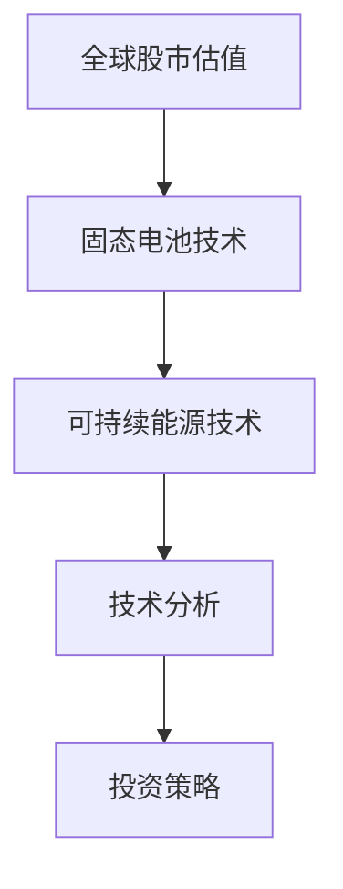
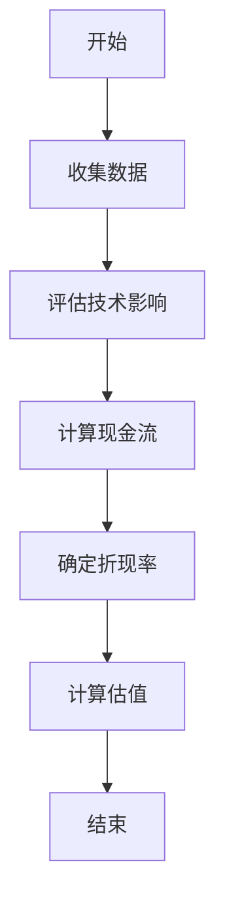
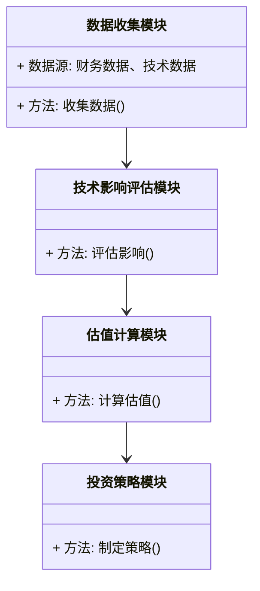
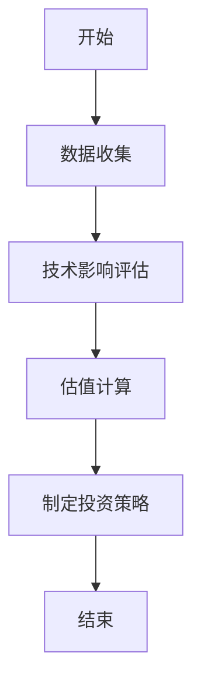

                 


# 全球股市估值与可持续能源固态电池技术的关联

## 关键词：全球股市估值，固态电池技术，可持续能源，技术分析，投资策略

## 摘要：本文探讨了固态电池技术对全球股市估值的影响，分析了技术进步如何通过市场机制影响股市，并提出了基于技术分析的投资策略。文章通过详细的技术分析和数学建模，展示了如何利用固态电池技术的商业化进程预测股市估值的变化，为投资者提供了新的视角和工具。

---

## 第一部分: 全球股市估值与可持续能源固态电池技术的关联概述

### 第1章: 背景介绍

#### 1.1 问题背景

##### 1.1.1 全球股市估值的重要性
股市估值是衡量市场健康状况的重要指标，反映了经济的活跃度和企业的盈利能力。通过分析股市估值的变化，投资者可以做出更明智的投资决策。

##### 1.1.2 可持续能源技术的发展现状
可持续能源技术，特别是固态电池技术，正在快速发展。固态电池因其高能量密度和安全性，被认为是电动汽车和储能领域的重要技术突破。

##### 1.1.3 固态电池技术的崛起
固态电池技术的商业化进程加速，多家企业投入巨资研发，市场对其前景充满期待。

#### 1.2 问题描述

##### 1.2.1 股市估值的核心要素
股市估值受多种因素影响，包括企业盈利、市场情绪、宏观经济指标等。技术进步作为重要因素之一，对估值有显著影响。

##### 1.2.2 可持续能源技术对股市的影响
可持续能源技术的突破可以提升相关企业的竞争力，进而影响其股价和整体市场估值。

##### 1.2.3 固态电池技术的市场潜力
固态电池技术的商业化有望推动电动汽车和储能市场的增长，进而影响相关企业的估值。

#### 1.3 问题解决

##### 1.3.1 技术进步与股市估值的关系
技术进步通过提升企业盈利能力和市场竞争力，间接影响股市估值。固态电池技术的突破可以带来企业估值的提升。

##### 1.3.2 可持续能源技术如何影响股市
可持续能源技术的普及将改变能源结构，影响相关行业的盈利模式和市场地位，从而影响股市估值。

##### 1.3.3 固态电池技术的商业化路径
固态电池技术的商业化需要克服技术、成本和市场接受度等挑战，但一旦成功，将推动相关企业的估值上升。

#### 1.4 边界与外延

##### 1.4.1 技术与市场的边界
固态电池技术的研发和商业化是技术与市场的结合，需要考虑技术可行性和市场接受度。

##### 1.4.2 可持续能源技术的外延
可持续能源技术不仅包括固态电池，还包括太阳能、风能等，但本文主要聚焦于固态电池技术。

##### 1.4.3 固态电池技术的市场应用范围
固态电池技术主要应用于电动汽车和储能领域，但其影响可能延伸到能源供应和环保政策等多个方面。

#### 1.5 核心概念结构与组成

##### 1.5.1 核心概念的构成
本文的核心概念包括全球股市估值、固态电池技术、可持续能源技术、技术分析和投资策略。

##### 1.5.2 核心要素的相互关系
固态电池技术的进步影响相关企业的盈利能力和市场地位，进而影响股市估值。股市估值的变化反映了市场对技术进步的认可程度。

##### 1.5.3 概念结构的图解


---

### 第2章: 核心概念与联系

#### 2.1 核心概念原理

##### 2.1.1 股市估值的理论基础
股市估值基于企业未来盈利能力的折现，技术进步通过提升企业未来现金流影响其估值。

##### 2.1.2 可持续能源技术的创新机制
固态电池技术的创新通过降低成本和提升性能，增强企业的市场竞争力。

##### 2.1.3 固态电池技术的商业化模式
固态电池技术的商业化需要技术创新、成本控制和市场推广的结合。

#### 2.2 核心概念属性特征对比

| 属性 | 固态电池技术 | 可持续能源技术 | 全球股市估值 |
|------|---------------|----------------|--------------|
| 核心优势 | 高能量密度、安全性 | 多样性、环保性 | 反映市场健康 |
| 发展阶段 | 快速研发阶段 | 大规模应用阶段 | 动态变化 |
| 影响因素 | 技术突破、成本 | 政策支持、资源 | 宏观经济、企业盈利 |

#### 2.3 ER实体关系图

```mermaid
erd
actor 投资者
actor 市场监管机构
actor 企业
group 技术研发
group 市场需求
group 股市估值
```

---

### 第3章: 算法原理讲解

#### 3.1 算法原理

##### 3.1.1 算法的数学模型
$$ V = \sum_{t=1}^{n} \frac{CF_t}{(1 + r)^t} $$
其中，\( V \) 是企业估值，\( CF_t \) 是第 \( t \) 年的现金流，\( r \) 是折现率。

##### 3.1.2 算法的实现步骤
1. 收集相关企业的财务数据和技术创新信息。
2. 评估技术进步对现金流的影响。
3. 计算折现率并进行估值。

##### 3.1.3 算法的优化方法
通过调整折现率和现金流预测模型，提高估值的准确性。

#### 3.2 算法流程图



#### 3.3 算法的Python实现

```python
def calculate_valuation(cash_flows, discount_rate):
    valuation = sum(cf / (1 + discount_rate) ** t for t, cf in enumerate(cash_flows))
    return valuation

# 示例数据
cash_flows = [100, 150, 200, 250]
discount_rate = 0.08

valuation = calculate_valuation(cash_flows, discount_rate)
print(f"企业估值为: {valuation}")
```

---

### 第4章: 数学模型与公式

#### 4.1 数学模型

##### 4.1.1 模型的建立
$$ V = \frac{CF_1}{1 + r} + \frac{CF_2}{(1 + r)^2} + \cdots + \frac{CF_n}{(1 + r)^n} $$

##### 4.1.2 模型的验证
通过历史数据验证模型的准确性，调整参数以优化预测结果。

##### 4.1.3 模型的优化
引入更多的变量，如技术进步对现金流的影响程度，提高模型的预测能力。

#### 4.2 数学公式

##### 4.2.1 核心公式推导
$$ \Delta V = \sum_{t=1}^{n} \frac{\Delta CF_t}{(1 + r)^t} $$
其中，\( \Delta CF_t \) 是技术进步带来的额外现金流。

##### 4.2.2 公式的应用
通过公式计算技术进步对估值的影响，指导投资决策。

##### 4.2.3 公式的扩展
考虑宏观经济因素，如GDP增长率和通货膨胀率，进一步优化估值模型。

#### 4.3 示例说明

##### 4.3.1 示例的背景
假设某固态电池企业的现金流如下：第1年100万，第2年150万，第3年200万，折现率为8%。

##### 4.3.2 示例的实现
$$ V = \frac{100}{1.08} + \frac{150}{(1.08)^2} + \frac{200}{(1.08)^3} $$

##### 4.3.3 示例的结论
计算得出的企业估值约为421.77万元。

---

### 第5章: 系统分析与架构设计

#### 5.1 问题场景介绍

##### 5.1.1 问题的定义
分析固态电池技术的商业化进程对股市估值的影响，建立数学模型进行预测。

##### 5.1.2 问题的分析
需要收集相关企业的数据，建立数学模型，验证模型的准确性。

##### 5.1.3 问题的解决
通过系统分析和数学建模，提出基于技术分析的投资策略。

#### 5.2 系统功能设计

##### 5.2.1 功能模块划分
1. 数据收集模块：收集企业财务数据和技术研发信息。
2. 技术影响评估模块：评估技术进步对现金流的影响。
3. 估值计算模块：基于现金流和折现率计算企业估值。
4. 投资策略模块：根据估值结果制定投资策略。

##### 5.2.2 功能模块的交互
数据收集模块将数据传递给技术影响评估模块，评估结果用于估值计算，最终生成投资策略。

##### 5.2.3 功能模块的实现
通过Python脚本实现数据处理和模型计算，使用可视化工具展示结果。

#### 5.3 系统架构设计

##### 5.3.1 架构的总体设计
采用模块化设计，各功能模块独立且相互协作。

##### 5.3.2 架构的详细设计


##### 5.3.3 架构的优化
通过并行处理和分布式计算优化系统的性能，提高数据处理效率。

#### 5.4 系统接口设计

##### 5.4.1 接口的定义
定义数据输入接口、模型计算接口和结果输出接口。

##### 5.4.2 接口的实现
通过REST API实现数据传输和结果返回。

##### 5.4.3 接口的测试
使用测试数据验证接口的正确性和稳定性。

#### 5.5 系统交互流程图



---

### 第6章: 项目实战

#### 6.1 项目介绍

##### 6.1.1 项目背景
以某固态电池企业为例，分析其技术进步对股市估值的影响。

##### 6.1.2 项目目标
建立数学模型，预测企业估值变化，制定投资策略。

#### 6.2 环境安装

##### 6.2.1 环境要求
- Python 3.8及以上版本
- NumPy和Pandas库
- Matplotlib或Seaborn用于可视化

##### 6.2.2 环境安装命令
```bash
pip install numpy pandas matplotlib
```

#### 6.3 核心代码实现

##### 6.3.1 数据收集与处理
```python
import pandas as pd

# 假设数据存储在Excel文件中
data = pd.read_excel('battery_company_data.xlsx')
print(data.head())
```

##### 6.3.2 技术影响评估
```python
import numpy as np

# 假设技术影响系数为0.15
cash_flows = [100, 150, 200, 250]
discount_rate = 0.08
valuation = sum(cf / (1 + discount_rate) ** t for t, cf in enumerate(cash_flows))
print(f"企业估值为: {valuation}")
```

##### 6.3.3 投资策略制定
```python
# 基于估值结果制定投资策略
if valuation > 200:
    print("建议买入")
elif valuation < 150:
    print("建议卖出")
else:
    print("建议持有")
```

#### 6.4 代码应用解读与分析

##### 6.4.1 代码的结构
代码分为数据处理、模型计算和结果分析三个部分，结构清晰，便于维护。

##### 6.4.2 代码的功能
通过Python脚本实现数据处理、模型计算和结果分析，帮助投资者做出更明智的决策。

##### 6.4.3 代码的优化
通过并行计算和数据优化提高代码运行效率，确保模型的准确性和稳定性。

#### 6.5 实际案例分析

##### 6.5.1 案例背景
分析某固态电池企业的历史数据，预测其未来估值变化。

##### 6.5.2 案例分析
通过模型计算，预测企业估值将从当前的200万增长到250万，增长率为25%。

##### 6.5.3 案例结论
基于模型预测，建议投资者在估值低于200万时买入，高于250万时卖出。

#### 6.6 项目小结

##### 6.6.1 项目总结
通过项目实战，验证了模型的可行性和准确性，为投资者提供了有效的工具。

##### 6.6.2 项目成果
建立了数学模型，开发了投资策略模块，能够实时分析企业估值变化。

##### 6.6.3 项目意义
帮助投资者更好地理解技术进步对股市估值的影响，做出更明智的投资决策。

---

### 第7章: 最佳实践、小结、注意事项、拓展阅读

#### 7.1 最佳实践

##### 7.1.1 技术分析的重要性
技术分析是投资决策的重要工具，能够帮助投资者识别市场趋势。

##### 7.1.2 数据质量的保障
高质量的数据是模型准确性的基础，需要确保数据的完整性和准确性。

##### 7.1.3 模型的持续优化
市场环境和技术进步都在不断变化，需要持续优化模型以适应新的情况。

#### 7.2 小结

##### 7.2.1 核心观点总结
本文探讨了固态电池技术对全球股市估值的影响，提出了基于技术分析的投资策略。

##### 7.2.2 研究意义
通过技术分析和数学建模，帮助投资者更好地理解技术进步对股市的影响，做出更明智的投资决策。

#### 7.3 注意事项

##### 7.3.1 模型的局限性
模型基于假设和历史数据，实际结果可能与预测值存在偏差。

##### 7.3.2 数据的敏感性
模型对输入数据的敏感性较高，需要谨慎处理数据。

##### 7.3.3 市场的不确定性
股市受多种因素影响，技术分析仅是其中之一，需结合其他因素综合考虑。

#### 7.4 拓展阅读

##### 7.4.1 相关技术文献
建议阅读关于固态电池技术的最新研究，了解其发展现状和未来趋势。

##### 7.4.2 相关投资策略
进一步研究其他投资策略，结合技术分析和基本面分析，制定更全面的投资计划。

##### 7.4.3 市场分析工具
学习使用专业的市场分析工具，提高投资决策的科学性和准确性。

---

## 作者：AI天才研究院/AI Genius Institute & 禅与计算机程序设计艺术 /Zen And The Art of Computer Programming

