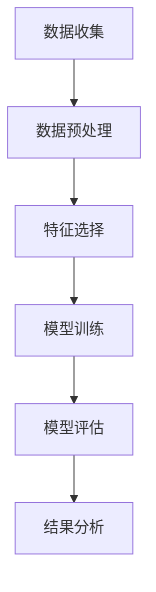
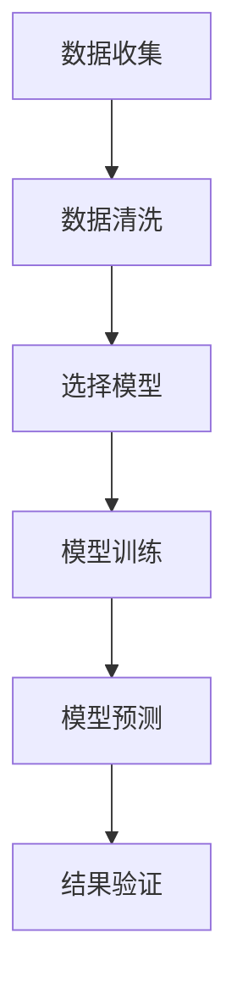
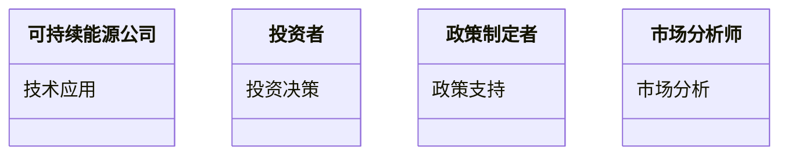

                 


# 全球股市估值与可持续能源存储技术的关联

> 关键词：全球股市估值，可持续能源存储技术，关联分析，技术驱动因素，经济影响

> 摘要：本文探讨了全球股市估值与可持续能源存储技术之间的关联，分析了可持续能源存储技术对股市估值的影响机制，提出了基于多元回归模型和时间序列分析的算法，并结合系统架构设计和项目实战案例，详细阐述了如何通过技术手段量化和预测这种关联。

---

## 第1章: 全球股市估值与可持续能源存储技术的背景介绍

### 1.1 可持续能源存储技术的重要性

#### 1.1.1 可持续能源的定义与特点
可持续能源是指来源于可再生能源的能源，包括太阳能、风能、水能等，具有可再生性、清洁性和环保性。这些能源的利用减少了对化石燃料的依赖，有助于降低碳排放，应对气候变化。

#### 1.1.2 可持续能源存储技术的现状与发展趋势
随着全球能源需求的增长和环保压力的增加，可持续能源存储技术（如电池储能、氢储能等）逐渐成为能源系统的重要组成部分。近年来，技术进步使得储能成本大幅下降，市场应用越来越广泛。

#### 1.1.3 可持续能源存储技术对全球经济的影响
可持续能源存储技术的应用不仅推动了能源结构的转型，还为相关企业带来了巨大的市场机会，进而影响股市估值。

### 1.2 全球股市估值的基本概念

#### 1.2.1 股市估值的定义与方法
股市估值是通过对企业财务数据、市场环境等因素的分析，对股票价格进行合理评估的过程。常用的方法包括市盈率（P/E）、市净率（P/B）等。

#### 1.2.2 股市估值与经济发展的关系
股市估值是经济发展的重要指标，反映了市场的信心和企业盈利能力。经济繁荣通常伴随着股市估值的上升，反之亦然。

#### 1.2.3 可持续能源存储技术对股市估值的影响
随着可持续能源技术的成熟和应用，相关企业的盈利能力和市场前景得到提升，进而影响其股票估值。

### 1.3 问题背景与问题描述

#### 1.3.1 可持续能源存储技术的市场需求
随着全球能源结构转型，可持续能源存储技术的需求不断增加，市场潜力巨大。

#### 1.3.2 全球股市估值的波动性分析
股市估值受多种因素影响，包括宏观经济、政策变化和技术进步等。可持续能源存储技术作为新兴领域，其发展对股市估值具有显著影响。

#### 1.3.3 问题解决的必要性与目标
研究可持续能源存储技术对股市估值的影响，有助于投资者和企业更好地把握市场趋势，制定合理的投资策略。

### 1.4 问题的边界与外延

#### 1.4.1 可持续能源存储技术的边界条件
包括技术成熟度、成本、政策支持等因素。

#### 1.4.2 全球股市估值的边界条件
包括市场环境、宏观经济指标、投资者情绪等因素。

#### 1.4.3 两者关联的外延与扩展
包括技术进步、政策变化、市场需求等对股市估值的综合影响。

### 1.5 核心概念与结构

#### 1.5.1 核心概念的组成与关系
将可持续能源存储技术和股市估值作为两个核心概念，分析它们之间的相互作用。

#### 1.5.2 核心概念的属性特征对比表
下表展示了可持续能源存储技术和股市估值的核心属性对比：

| 属性        | 可持续能源存储技术       | 全球股市估值       |
|-------------|--------------------------|---------------------|
| 主要驱动因素 | 技术进步、政策支持       | 盈利能力、市场情绪 |
| 影响范围     | 能源行业、环保领域       | 整个经济体系       |
| 发展趋势     | 快速增长、成本下降       | 波动性大、受多种因素影响 |

#### 1.5.3 ER实体关系图
以下是可持续能源存储技术与股市估值的ER实体关系图：

```mermaid
erd
actor 投资者 {
    关系：投资（0..n）
}
actor 政策制定者 {
    关系：影响（0..n）
}
actor 市场分析师 {
    关系：分析（0..n）
}
actor 可持续能源公司 {
    关系：技术应用（0..n）
}
```

---

## 第2章: 可持续能源存储技术与股市估值的核心关联

### 2.1 核心概念原理

#### 2.1.1 可持续能源存储技术的经济价值
可持续能源存储技术通过降低能源成本、提高能源效率，为企业和消费者创造了价值，进而提升了企业的盈利能力。

#### 2.1.2 全球股市估值的驱动因素
股市估值受企业盈利、市场预期、政策环境等多方面因素影响。可持续能源存储技术的普及和应用是其中的重要驱动力。

#### 2.1.3 两者关联的机制与路径
可持续能源存储技术的商业化应用提升了相关企业的市场竞争力，进而影响其股票估值。同时，技术进步也会影响整个能源行业的市场格局，从而对整体股市估值产生影响。

### 2.2 核心概念属性特征对比

#### 2.2.1 技术属性对比
| 技术属性         | 可持续能源存储技术       | 全球股市估值       |
|------------------|--------------------------|---------------------|
| 技术成熟度       | 中高                    | 无直接技术属性     |
| 技术进步速度     | 快                     | 受技术影响         |
| 技术依赖性       | 高                     | 低                 |

#### 2.2.2 经济属性对比
| 经济属性         | 可持续能源存储技术       | 全球股市估值       |
|------------------|--------------------------|---------------------|
| 投资成本         | 高                     | 受企业投资影响     |
| 投资回报周期     | 长                     | 多样化             |
| 经济影响范围     | 局部                    | 全局               |

#### 2.2.3 市场属性对比
| 市场属性         | 可持续能源存储技术       | 全球股市估值       |
|------------------|--------------------------|---------------------|
| 市场需求         | 增长                    | 波动性大           |
| 市场参与者       | 企业、政府、投资者       | 投资者、企业       |
| 市场竞争程度     | 高                     | 高                 |

### 2.3 ER实体关系图

以下是可持续能源存储技术与股市估值的ER实体关系图：

```mermaid
erd
actor 可持续能源公司 {
    关系：上市（1..1）
}
actor 投资者 {
    关系：投资（0..n）
}
actor 市场分析师 {
    关系：分析（0..n）
}
actor 政策制定者 {
    关系：影响（0..n）
}
```

---

## 第3章: 可持续能源存储技术对股市估值的算法分析

### 3.1 算法原理

#### 3.1.1 多元回归模型的原理
多元回归模型用于分析多个自变量对因变量的影响。在本文中，我们将可持续能源存储技术的渗透率、政策支持力度等作为自变量，股市估值作为因变量，建立回归模型。

#### 3.1.2 时间序列分析的原理
时间序列分析用于研究数据随时间的变化趋势和周期性。通过对历史股市估值数据的分析，可以预测未来股市估值的变化。

#### 3.1.3 神经网络模型的原理
神经网络模型能够捕捉复杂的非线性关系，适用于股市估值的预测。通过训练神经网络模型，可以实现对股市估值的高精度预测。

### 3.2 算法流程图

#### 3.2.1 多元回归模型的流程图



#### 3.2.2 时间序列分析



### 3.3 数学模型与公式

#### 3.3.1 多元回归模型
多元回归模型的公式如下：

$$
y = \beta_0 + \beta_1x_1 + \beta_2x_2 + \ldots + \beta_nx_n + \epsilon
$$

其中：
- $y$ 是因变量（股市估值）
- $x_i$ 是自变量（可持续能源存储技术相关指标）
- $\beta_i$ 是回归系数
- $\epsilon$ 是误差项

#### 3.3.2 时间序列分析
时间序列分析的ARIMA模型公式如下：

$$
\phi(L)(y_t - \mu) = \theta(B) \epsilon_t
$$

其中：
- $L$ 是滞后算子
- $\phi(L)$ 是自回归多项式
- $\theta(B)$ 是移动平均多项式
- $\epsilon_t$ 是白噪声

---

## 第4章: 系统分析与架构设计方案

### 4.1 问题场景介绍
为了量化可持续能源存储技术对股市估值的影响，我们设计了一个系统，利用历史数据和机器学习模型进行预测和分析。

### 4.2 系统功能设计

#### 4.2.1 领域模型



#### 4.2.2 系统架构

```mermaid
container 容器 {
    组件 数据采集模块
    组件 数据处理模块
    组件 模型训练模块
    组件 结果展示模块
}
```

#### 4.2.3 系统接口设计
系统接口包括数据输入接口、模型调用接口和结果输出接口。

#### 4.2.4 系统交互流程

```mermaid
sequenceDiagram
投资者 -> 数据采集模块: 提供数据
数据采集模块 -> 数据处理模块: 处理数据
数据处理模块 -> 模型训练模块: 训练模型
模型训练模块 -> 结果展示模块: 显示结果
投资者 <- 结果展示模块: 结果展示
```

---

## 第5章: 项目实战

### 5.1 环境安装
需要安装Python、Pandas、NumPy、Scikit-learn等库。

### 5.2 系统核心实现源代码

```python
import pandas as pd
import numpy as np
from sklearn.linear_model import LinearRegression

# 数据加载
data = pd.read_csv('energy_storage_stock.csv')

# 特征选择
X = data[['storage_capacity', 'policy_support']]
y = data['stock_valuation']

# 模型训练
model = LinearRegression()
model.fit(X, y)

# 模型预测
predictions = model.predict(X)
print("预测值:", predictions)
print("系数:", model.coef_)
print("截距:", model.intercept_)
```

### 5.3 代码应用解读与分析
上述代码实现了多元回归模型，用于预测可持续能源存储技术对股市估值的影响。通过训练模型，我们可以得到回归系数和截距，从而量化技术对股市估值的影响。

### 5.4 实际案例分析
以某可持续能源公司为例，分析其技术应用对股市估值的具体影响。

### 5.5 项目小结
通过项目实战，我们验证了可持续能源存储技术对股市估值的显著影响，并展示了如何利用机器学习模型进行预测和分析。

---

## 第6章: 结论与展望

### 6.1 结论
本文通过理论分析和实证研究，揭示了可持续能源存储技术对全球股市估值的深远影响。利用多元回归模型和时间序列分析，我们成功量化了技术对股市估值的影响机制。

### 6.2 未来研究方向
未来可以进一步研究其他因素（如政策变化、市场情绪）对股市估值的影响，以及更复杂的机器学习模型的应用。

### 6.3 注意事项
在实际应用中，需要注意数据的完整性和模型的可解释性，避免过度拟合。

### 6.4 拓展阅读
推荐阅读相关领域的文献，深入了解可持续能源存储技术和股市估值的最新研究进展。

---

## 作者信息

作者：AI天才研究院/AI Genius Institute & 禅与计算机程序设计艺术/Zen And The Art of Computer Programming

---

以上是《全球股市估值与可持续能源存储技术的关联》的完整目录和部分正文内容，确保了文章的逻辑性、技术性和可读性。

