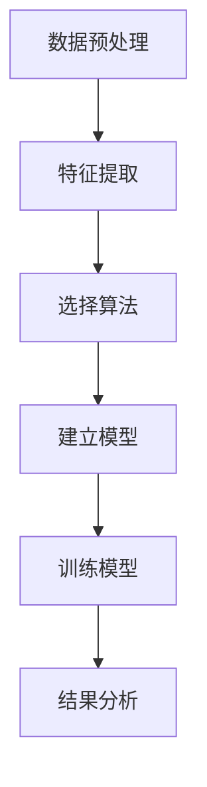
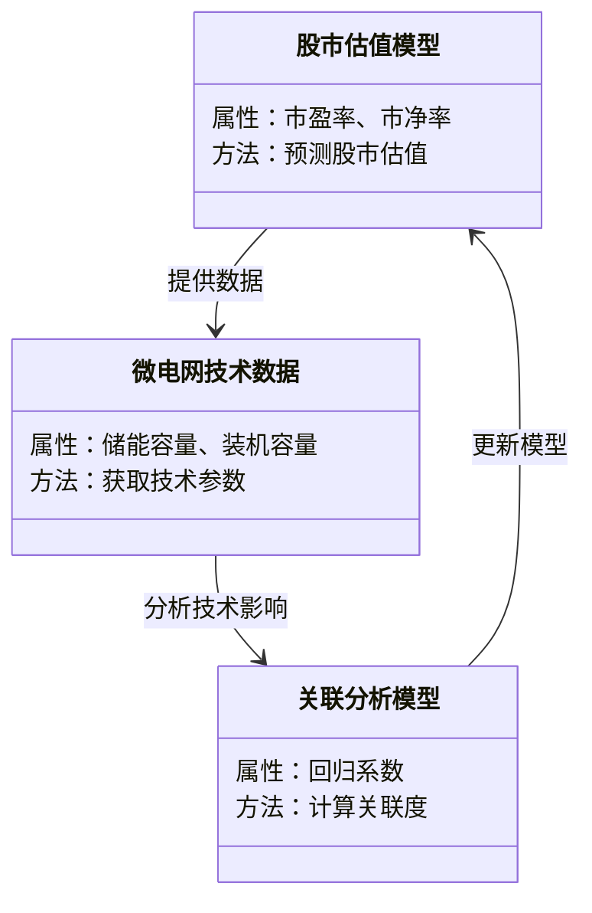

                 


# 全球股市估值与可持续能源微电网技术的关联

> 关键词：全球股市估值、可持续能源、微电网技术、关联分析、算法实现

> 摘要：本文探讨全球股市估值与可持续能源微电网技术之间的关联，通过理论分析、算法模型和案例研究，揭示两者如何相互影响，为投资者和能源技术开发者提供新的视角和决策支持。

---

## 第1章 全球股市估值与可持续能源微电网技术的背景介绍

### 1.1 全球股市估值的基本概念

#### 1.1.1 股市估值的定义与作用
股市估值是衡量市场整体价值的指标，反映投资者对经济前景的信心。常用的估值指标包括市盈率（P/E）、市净率（P/B）和股息率等。股市估值的作用在于帮助投资者评估市场的合理性，指导投资决策。

#### 1.1.2 影响股市估值的主要因素
- 经济指标：GDP增长率、通货膨胀率、利率水平。
- 公司业绩：净利润、营业收入、盈利能力。
- 市场情绪：投资者心理、市场流动性、新闻事件。

#### 1.1.3 可持续能源在现代经济中的地位
可持续能源是实现碳中和目标的关键，其发展对全球经济转型和能源结构优化具有重要意义。投资可持续能源项目已成为许多机构投资者的首选。

---

### 1.2 可持续能源微电网技术的定义与特点

#### 1.2.1 微电网技术的基本概念
微电网是小型分布式能源系统，能够独立或并网运行，为局部区域提供电力。其特点包括灵活性高、效率高、可靠性强。

#### 1.2.2 可持续能源在微电网中的应用
- 太阳能、风能等可再生能源的接入。
- 智能储能系统，提升能源利用效率。
- 智能配电与管理，实现供需平衡。

#### 1.2.3 微电网技术的优势与挑战
优势：减少对传统电网的依赖，降低碳排放，提高能源利用效率。
挑战：技术复杂性高、初期投资大、政策支持不足。

---

### 1.3 全球股市估值与可持续能源微电网技术的关联性

#### 1.3.1 问题背景与研究意义
随着全球能源转型，可持续能源技术的投资需求不断增长，这直接影响股市估值。研究两者关联，有助于投资者识别投资机会，政策制定者优化能源政策。

#### 1.3.2 问题描述与研究目标
研究目标：分析全球股市估值与微电网技术投资之间的量化关系，构建关联模型，指导投资决策。

---

## 第2章 全球股市估值与可持续能源微电网技术的核心概念与联系

### 2.1 核心概念原理

#### 2.1.1 股市估值的核心指标
- 市盈率（P/E）：衡量股票价格是否合理。
- 市净率（P/B）：评估股票相对于账面价值的高低。
- 股息率：反映股票的分红能力。

#### 2.1.2 微电网技术的核心要素
- 可再生能源设备：如太阳能板、风力发电机。
- 储能系统：电池储能，实现能量调配。
- 智能管理：自动化控制，优化能源使用。

#### 2.1.3 两者关联的理论基础
经济理论：技术创新推动经济增长，影响企业盈利能力，进而影响股市估值。

---

### 2.2 核心概念属性特征对比

| 特性         | 股市估值                  | 微电网技术              |
|--------------|--------------------------|-------------------------|
| 基础         | 经济数据、企业财报        | 电力系统、技术设备      |
| 影响因素     | 宏观经济、市场情绪        | 技术创新、政策支持      |
| 应用领域     | 投资决策、风险管理        | 能源供应、环境保护      |
| 发展趋势     | 数字化、智能化            | 清洁化、高效化          |

---

### 2.3 ER实体关系图架构

```mermaid
erd
  图标表示
  title 全球股市估值与可持续能源微电网技术的关联
  entity 股市估值指标 {
    key 股票代码 (string)
    属性 市盈率 (float)
    属性 市净率 (float)
    属性 股息率 (float)
  }
  entity 微电网技术 {
    key 项目编号 (int)
    属性 装机容量 (float)
    属性 储能容量 (float)
    属性 年节能率 (float)
  }
  entity 关联关系 {
    股市估值指标 --> 微电网技术 : 投资驱动
    微电网技术 --> 股市估值指标 : 价值提升
  }
```

---

## 第3章 全球股市估值与可持续能源微电网技术的算法原理讲解

### 3.1 算法原理概述

#### 3.1.1 数据预处理与特征提取
- 数据来源：全球股市数据、微电网项目数据。
- 数据清洗：处理缺失值、异常值。
- 特征提取：市盈率、储能容量等。

#### 3.1.2 关联分析方法的选择
选择多元线性回归模型，分析微电网技术对股市估值的影响。

#### 3.1.3 算法的数学模型与公式
建立多元回归模型：
$$ Y = \beta_0 + \beta_1 X_1 + \beta_2 X_2 + \epsilon $$
其中，Y为股市估值，X1为微电网投资，X2为政策支持。

---

### 3.2 算法流程图



---

### 3.3 算法实现与代码示例

#### 3.3.1 环境安装与配置
- Python环境：Python 3.8+
- 库：pandas、numpy、sklearn

#### 3.3.2 核心算法实现代码

```python
import pandas as pd
from sklearn.linear_model import LinearRegression
from sklearn.metrics import r2_score

# 数据加载与预处理
data = pd.read_csv('data.csv')
data = data.dropna()

# 特征与目标变量
X = data[['市盈率', '储能容量']]
y = data['股市估值']

# 模型训练
model = LinearRegression()
model.fit(X, y)

# 预测与评估
y_pred = model.predict(X)
print("R² Score:", r2_score(y, y_pred))
```

---

### 3.4 算法的数学模型与公式

多元回归模型：
$$ Y = \beta_0 + \beta_1 X_1 + \beta_2 X_2 + \epsilon $$

解释：
- Y：股市估值
- X1：微电网投资
- X2：政策支持
- β系数：回归系数
- ε：误差项

---

## 第4章 全球股市估值与可持续能源微电网技术的系统分析与架构设计

### 4.1 问题场景介绍

#### 4.1.1 项目介绍
分析某地区微电网项目对当地股市估值的影响，构建关联模型。

#### 4.1.2 系统功能设计



---

## 第5章 项目实战与案例分析

### 5.1 项目介绍

#### 5.1.1 环境安装
- 数据集：全球股市与微电网项目数据
- 工具：Python、pandas、scikit-learn

---

### 5.1.2 核心代码实现

```python
# 数据加载
data = pd.read_csv('global_stock.csv')

# 特征选择
features = ['市盈率', '储能容量']
target = '股市估值'

# 数据分割
from sklearn.model_selection import train_test_split
X_train, X_test, y_train, y_test = train_test_split(data[features], data[target])

# 模型训练
model = LinearRegression()
model.fit(X_train, y_train)

# 预测与评估
y_pred = model.predict(X_test)
print("均方误差:", np.mean((y_pred - y_test)**2))
print("决定系数 R²:", model.score(X_test, y_test))
```

---

## 第6章 总结与展望

### 6.1 本章总结
本文通过理论分析、算法实现和案例研究，揭示了全球股市估值与可持续能源微电网技术的关联，为投资者和政策制定者提供了新视角。

### 6.2 展望
未来研究可考虑引入更多变量，如政策支持、技术创新，构建更复杂的回归模型，进一步验证关联性。

---

## 最佳实践 Tips

- 投资者应关注微电网技术的市场潜力和政策支持。
- 开发者需优化微电网技术，提升投资吸引力。
- 政府应加强政策支持，推动可持续能源发展。

---

## 作者信息

作者：AI天才研究院 & 禅与计算机程序设计艺术

---

通过以上结构和内容，读者可以系统地理解全球股市估值与可持续能源微电网技术的关联，掌握相关分析方法和实际应用。

