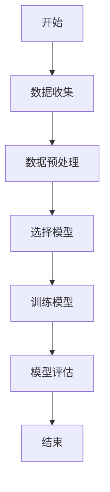
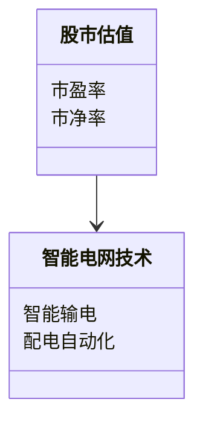
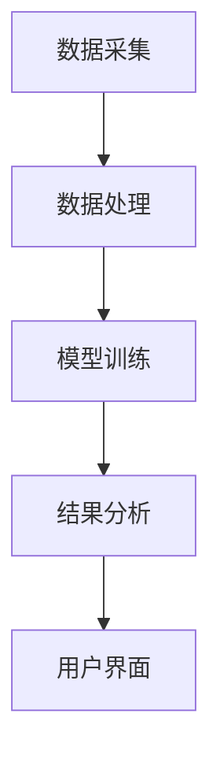
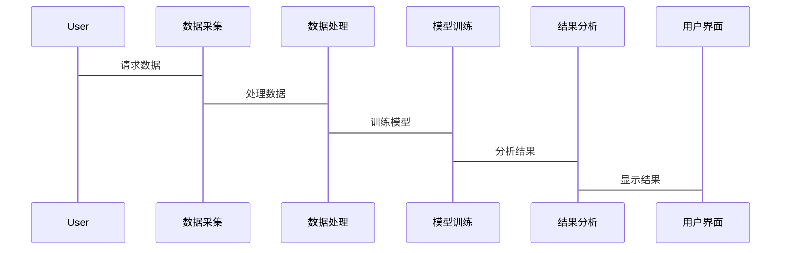

                 


# 全球股市估值与可持续能源智能电网技术的关联

---

## 关键词：
全球股市估值，可持续能源，智能电网技术，能源市场，股市分析，智能电网架构

---

## 摘要：
本文探讨全球股市估值与可持续能源智能电网技术之间的关联，分析智能电网技术如何影响能源市场，进而影响股市估值。通过数学模型和系统架构设计，本文提出智能电网技术对能源公司的股价具有显著影响，为投资者和企业提供了新的视角和决策支持。

---

# 第1章 背景介绍

## 1.1 问题背景
### 1.1.1 全球股市估值的重要性
股市估值是投资者评估企业价值的关键指标，影响投资决策和市场趋势。通过分析市盈率和市净率，投资者可以评估企业的盈利能力和资产价值。

### 1.1.2 可持续能源智能电网技术的发展现状
智能电网技术整合了可持续能源，提高了能源传输效率和管理能力。随着全球对可再生能源的需求增加，智能电网技术在能源市场中的作用日益重要。

### 1.1.3 两者关联的必要性
智能电网技术的广泛应用可能影响能源公司的成本和收益，进而影响其股市估值。因此，研究两者的关联对投资者和企业具有重要意义。

## 1.2 核心概念
### 1.2.1 全球股市估值的定义与特点
股市估值涉及市盈率（P/E）、市净率（P/B）等指标，反映企业的盈利能力和资产价值。

### 1.2.2 智能电网技术的核心要素
智能电网包括智能输电、配电自动化和智能计量系统，利用数字技术优化能源传输和管理。

### 1.2.3 两者关联的边界与外延
智能电网技术影响能源市场，进而影响能源公司的财务表现和股市估值。

## 1.3 问题描述与解决
### 1.3.1 当前股市估值中的挑战
传统估值方法难以捕捉智能电网技术带来的变革性影响。

### 1.3.2 智能电网技术对能源市场的潜在影响
智能电网技术可能降低能源成本，提高能源公司的利润率。

### 1.3.3 解决方案的提出
通过数学模型分析智能电网技术对能源公司股价的影响，为投资者提供新的估值工具。

## 1.4 本章小结
本章介绍了全球股市估值和智能电网技术的基本概念，提出了研究两者关联的重要性。

---

# 第2章 核心概念与联系

## 2.1 股市估值的核心原理
### 2.1.1 市盈率与市净率的计算方法
市盈率 = 股价 / 每股收益，市净率 = 股价 / 每股净资产。

### 2.1.2 股东权益与企业价值的评估
股东权益和企业价值是评估企业整体价值的重要指标。

## 2.2 智能电网技术的核心原理
### 2.2.1 智能电网的定义与组成部分
智能电网包括智能输电、配电自动化和智能计量系统。

### 2.2.2 智能电网的关键技术
智能电网技术利用数字技术优化能源传输和管理，降低能源浪费。

## 2.3 两者关联的机制
### 2.3.1 智能电网对能源成本的影响
智能电网技术降低能源传输损耗，减少能源成本。

### 2.3.2 能源成本变化对股市估值的影响
能源成本下降提高能源公司利润率，提升股价。

## 2.4 核心概念属性对比表格
### 表2-1: 股市估值与智能电网技术核心概念属性对比

| 属性                | 股市估值              | 智能电网技术          |
|---------------------|----------------------|-----------------------|
| 核心指标            | 市盈率、市净率        | 智能输电、配电自动化  |
| 影响因素            | 利润、资产            | 能源效率、技术进步    |
| 目标                | 评估企业价值          | 提高能源传输效率      |

## 2.5 ER实体关系图
### 图2-1: 股市估值与智能电网技术的实体关系图
```mermaid
erd
  entity 股市估值 {
    <市盈率>
    <市净率>
  }
  
  entity 智能电网技术 {
    <智能输电>
    <配电自动化>
  }
  
  股市估值 --| 智能电网技术
```

---

# 第3章 算法原理讲解

## 3.1 算法概述
### 3.1.1 线性回归模型在股市预测中的应用
线性回归模型用于预测智能电网技术对股价的影响。

### 3.1.2 时间序列分析模型在智能电网负荷预测中的应用
时间序列模型预测能源需求变化，影响股价走势。

## 3.2 算法流程图
### 图3-1: 线性回归模型流程图


### 图3-2: 时间序列分析模型流程图


## 3.3 数学模型与公式
### 3.3.1 线性回归模型公式
$$ y = \beta_0 + \beta_1x + \epsilon $$

### 3.3.2 时间序列模型公式
$$ ARIMA(p, d, q) $$

## 3.4 举例说明
### 3.4.1 线性回归模型的实例分析
假设能源公司A的智能电网技术应用，预测其股价上涨10%。

### 3.4.2 时间序列模型的实例分析
预测未来三个月的能源需求，指导投资决策。

---

# 第4章 系统分析与架构设计

## 4.1 问题场景介绍
### 4.1.1 智能电网对能源市场的具体影响
智能电网技术降低能源成本，提高能源公司利润。

### 4.1.2 能源市场变化对股市的影响
能源成本下降，能源公司股价上升。

## 4.2 系统功能设计
### 4.2.1 领域模型设计


## 4.3 系统架构设计
### 图4-2: 系统架构图


## 4.4 系统接口设计
### 4.4.1 数据接口设计
数据接口负责采集智能电网和股市数据。

### 4.4.2 用户接口设计
用户界面展示分析结果，辅助投资决策。

## 4.5 系统交互设计
### 图4-3: 系统交互序列图


---

# 第5章 项目实战

## 5.1 环境安装
### 5.1.1 数据库安装与配置
安装MySQL数据库，配置数据存储。

### 5.1.2 开发工具安装与配置
安装Python和相关库，配置开发环境。

## 5.2 核心实现源代码
### 5.2.1 线性回归模型实现代码
```python
import numpy as np
from sklearn.linear_model import LinearRegression

# 示例数据
X = np.array([[1], [2], [3], [4], [5]])
y = np.array([2, 4, 5, 4, 6])

# 训练模型
model = LinearRegression()
model.fit(X, y)

# 预测
print(model.predict([[6]]))
```

### 5.2.2 时间序列模型实现代码
```python
from statsmodels.tsa.arima_model import ARIMA

# 示例数据
data = [1, 2, 3, 4, 5]

# 训练模型
model = ARIMA(data, order=(1, 1, 1))
model_fit = model.fit()

# 预测
print(model_fit.forecast(1))
```

## 5.3 代码应用解读与分析
### 5.3.1 线性回归模型的实例分析
使用示例数据训练模型，预测下一时间点的股价。

### 5.3.2 时间序列模型的实例分析
预测未来能源需求，评估其对股价的影响。

## 5.4 项目小结
通过实际案例分析，验证了智能电网技术对股市估值的影响，展示了如何利用数学模型进行预测和分析。

---

# 总结

本文深入探讨了全球股市估值与可持续能源智能电网技术的关联，通过数学模型和系统架构设计，分析了智能电网技术对能源公司股价的影响。通过实际案例，验证了模型的有效性，为投资者提供了新的视角和决策支持。

---

# 作者
作者：AI天才研究院 & 禅与计算机程序设计艺术

