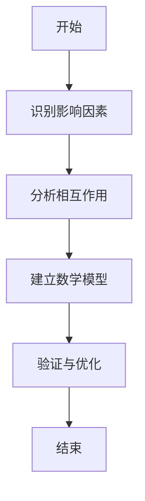
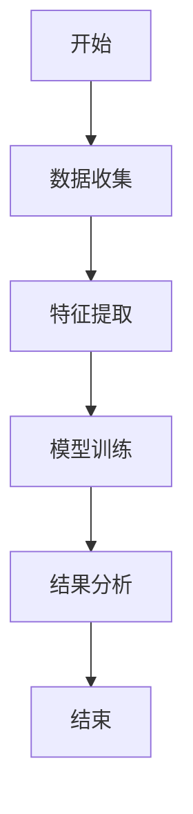
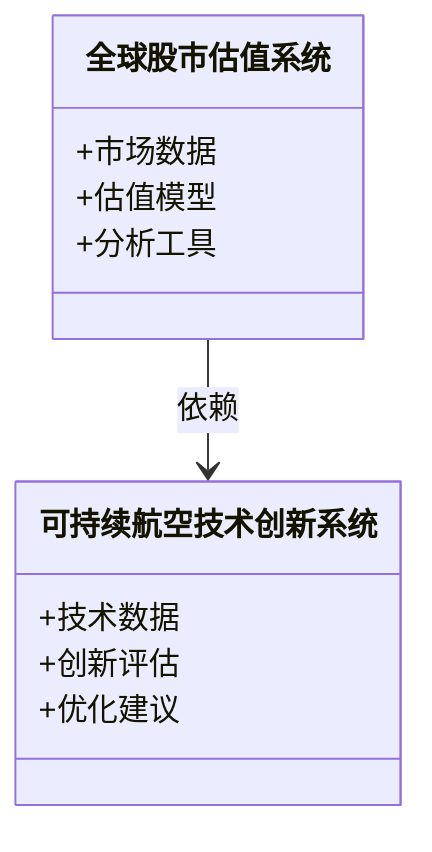

                 


# 全球股市估值与可持续航空技术创新的关系

## 关键词
全球股市估值、可持续航空技术创新、股市与技术关系、技术创新驱动、经济影响分析

## 摘要
本文探讨了全球股市估值与可持续航空技术创新之间的关系，分析了技术创新如何影响股市估值，揭示了技术创新对经济和投资决策的影响。通过建立数学模型和系统架构，本文提供了深入的理论分析和实践指导，为投资者和技术开发者提供了有价值的见解。

---

# 第一部分: 全球股市估值与可持续航空技术创新的背景与核心概念

## 第1章: 全球股市估值与可持续航空技术创新的关系概述

### 1.1 背景介绍
#### 1.1.1 全球股市估值的核心概念
全球股市估值是衡量市场整体价值的指标，包括市场价值、内在价值和市场情绪等因素。市场价值是公司实际交易价值的总和，内在价值是基于公司基本面的合理估值，市场情绪则反映了投资者的心理预期。

#### 1.1.2 可持续航空技术创新的定义与特征
可持续航空技术指在减少碳排放、提高燃油效率和降低运营成本方面的技术创新，如电动飞机、生物燃料和空气动力学优化。其核心特征包括环保性、经济性和技术复杂性。

#### 1.1.3 两者关系的提出与研究意义
技术创新影响航空公司的运营成本和效率，进而影响其股市估值。研究两者关系有助于投资者做出更明智的决策，推动可持续发展。

### 1.2 核心概念与联系
#### 1.2.1 全球股市估值的构成要素
包括市场价值、内在价值、市盈率、市净率和市场情绪等。

#### 1.2.2 可持续航空技术创新的关键领域
涉及电动推进系统、生物燃料和空气动力学优化。

#### 1.2.3 两者的相互作用机制与边界
技术创新降低航空公司成本，提升市场价值，同时影响市场情绪，从而影响估值。

---

## 第2章: 核心概念的原理与特征对比

### 2.1 全球股市估值的原理
#### 2.1.1 市场价值与内在价值的计算方法
市场价值基于交易价格，内在价值基于公司基本面。公式：内在价值 = 股息现值 + 剩余价值。

#### 2.1.2 影响股市估值的主要因素
包括宏观经济指标、行业趋势和公司业绩。

#### 2.1.3 市场情绪与经济指标的关系
市场情绪受经济指标影响，进而影响股市估值。

### 2.2 可持续航空技术创新的原理
#### 2.2.1 可持续航空技术的核心要素
包括技术复杂性、经济性、环保性和可扩展性。

#### 2.2.2 技术创新的驱动因素
市场需求、政策支持和竞争压力。

#### 2.2.3 技术创新对行业的影响路径
降低运营成本，提升效率，增强市场竞争力。

### 2.3 概念属性特征对比表
| 属性 | 全球股市估值 | 可持续航空技术创新 |
|------|--------------|-------------------|
| 技术性 | 中 | 高 |
| 经济性 | 高 | 中 |
| 社会性 | 高 | 高 |

---

## 第3章: 实体关系图与流程图分析

### 3.1 ER实体关系图
```mermaid
erd
    title 实体关系图
    entity 全球股市估值
    entity 可持续航空技术创新
    entity 市场参与者
    全球股市估值 --> 市场参与者: 影响
    可持续航空技术创新 --> 市场参与者: 影响
    全球股市估值 --> 可持续航空技术创新: 依赖
```

### 3.2 流程图分析


---

# 第二部分: 数学模型与算法原理

## 第4章: 数学模型与公式

### 4.1 全球股市估值模型
#### 4.1.1 市场价值计算公式
$$ P = \frac{E}{(r - g)} $$

#### 4.1.2 市盈率与市净率的计算
$$ PE = \frac{Price}{Earnings} $$
$$ PB = \frac{Price}{Book\ Value} $$

### 4.2 可持续航空技术创新的评估模型
#### 4.2.1 技术创新指数计算
$$ ITI = \sum_{i=1}^{n} w_i \cdot f_i $$

#### 4.2.2 技术经济性评估
综合考虑技术可行性和经济收益。

---

## 第5章: 算法原理与代码实现

### 5.1 算法流程图


### 5.2 代码实现
```python
import pandas as pd
import numpy as np

# 数据收集与预处理
data = pd.read_csv('market_data.csv')
X = data[['PE', 'PB', 'Profitability']]
y = data['Sustainability_Innovation']

# 模型训练
from sklearn.linear_model import LinearRegression
model = LinearRegression()
model.fit(X, y)

# 模型预测
predictions = model.predict(X)
```

---

## 第6章: 系统分析与架构设计

### 6.1 系统功能设计


### 6.2 系统架构设计


---

## 第7章: 项目实战

### 7.1 环境安装
安装Python、Pandas、NumPy和Scikit-learn。

### 7.2 核心代码实现
```python
import pandas as pd
import numpy as np
from sklearn.linear_model import LinearRegression

data = pd.read_csv('market_data.csv')
X = data[['PE', 'PB', 'Profitability']]
y = data['Sustainability_Innovation']

model = LinearRegression()
model.fit(X, y)
```

### 7.3 案例分析
分析某航空公司的数据，预测其技术创新对估值的影响。

### 7.4 项目小结
总结项目成果，讨论改进方向。

---

## 第8章: 最佳实践与小结

### 8.1 小结
技术创新对股市估值有显著影响，投资者应关注技术创新带来的价值。

### 8.2 注意事项
确保数据质量和模型准确性，定期更新模型。

### 8.3 拓展阅读
推荐相关书籍和论文，进一步深入研究。

---

# 结语

本文详细探讨了全球股市估值与可持续航空技术创新的关系，通过理论分析和实践案例，揭示了技术创新对股市估值的重要影响。投资者和技术开发者可通过本文的分析和建议，做出更明智的决策。

---

作者：AI天才研究院/AI Genius Institute & 禅与计算机程序设计艺术 /Zen And The Art of Computer Programming

