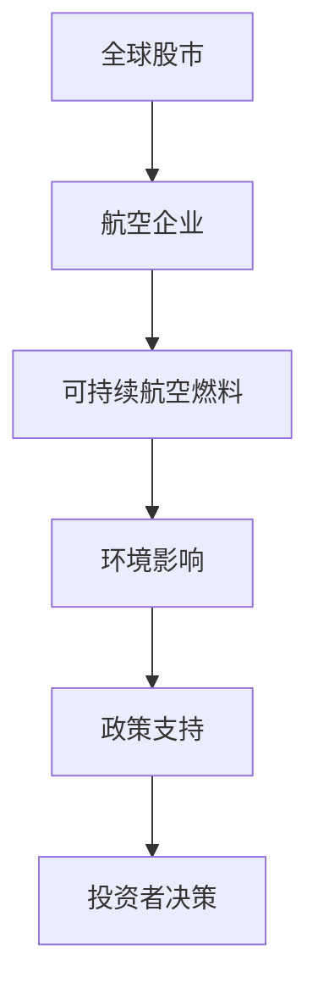
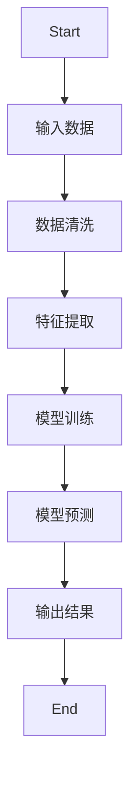
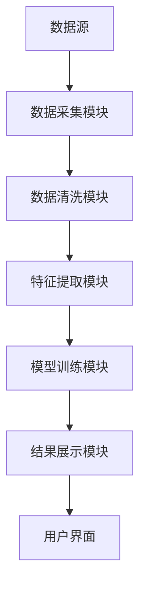
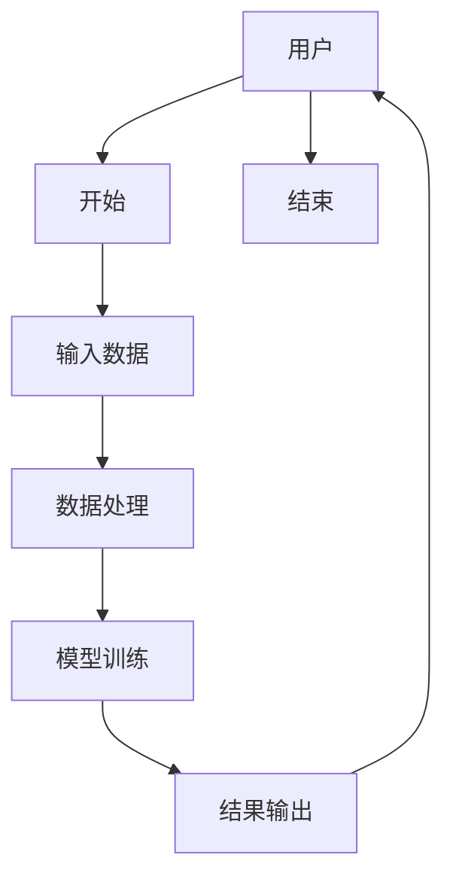

                 


# 全球股市估值与可持续航空燃料的关系

## 关键词：全球股市估值, 可持续航空燃料, 航空业, 环境影响, 投资策略, 碳排放

## 摘要：本文探讨了全球股市估值与可持续航空燃料之间的关系，分析了可持续航空燃料的技术特性、经济成本及其对股市估值的影响。通过建立数学模型和案例分析，本文揭示了可持续航空燃料如何通过影响航空公司的财务表现和投资者的ESG投资策略，进而影响全球股市估值的变化。同时，本文提出了一个基于SAF的股市估值预测系统，为投资者和企业提供了重要的参考。

---

# 第一部分: 全球股市估值与可持续航空燃料的背景介绍

## 第1章: 全球股市估值与可持续航空燃料的背景介绍

### 1.1 问题背景与问题描述
#### 1.1.1 全球能源转型的背景
随着全球能源结构的转型，各国政府和企业都在积极推动绿色能源的使用。航空业作为碳排放的主要行业之一，面临着巨大的减排压力。可持续航空燃料（SAF）作为一种替代传统航空燃料的绿色能源，被认为是实现航空业碳中和目标的关键技术。

#### 1.1.2 可持续航空燃料的定义与目标
可持续航空燃料是指通过可再生资源（如植物油、废弃的食用油、 algae-based oils等）制成的燃料，其碳排放量相较于传统化石燃料大幅减少。SAF的目标是通过技术创新和规模化生产，降低碳排放，推动航空业的可持续发展。

#### 1.1.3 航空业的碳排放问题与环保压力
航空业是全球碳排放的主要行业之一，其碳排放量约占全球总排放量的2-3%。随着环保政策的日益严格和公众环保意识的提高，航空业面临着巨大的减排压力。SAF的推广使用被认为是解决这一问题的重要途径。

### 1.2 可持续航空燃料的技术与经济特性
#### 1.2.1 可持续航空燃料的生产工艺
SAF的生产工艺主要包括以下步骤：
1. **原料收集**：使用植物油、废弃食用油等可再生资源。
2. **预处理**：将原料进行脱氧、脱硫等处理。
3. **加氢处理**：通过加氢工艺将原料转化为烃类燃料。
4. **混合与调配**：将SAF与传统航空燃料按一定比例混合，以满足航空业的使用要求。

#### 1.2.2 可持续航空燃料的成本结构
SAF的成本结构主要包括原料成本、生产成本和认证成本。目前，由于生产规模较小，SAF的成本仍然高于传统航空燃料。然而，随着技术进步和规模化生产，SAF的成本有望逐步下降。

#### 1.2.3 可持续航空燃料的环境影响
SAF相较于传统航空燃料具有显著的环境优势。根据生命周期评估（LCA），SAF的碳排放量可以减少80%以上。此外，SAF的生产和使用还可以减少对自然资源的依赖，促进能源的可持续利用。

### 1.3 股市估值的核心概念与方法
#### 1.3.1 股市估值的基本原理
股市估值是指通过对企业的财务状况、市场地位、盈利能力等因素进行分析，评估其股票的内在价值。常见的估值方法包括市盈率（P/E）、市净率（P/B）、股息率等。

#### 1.3.2 传统估值模型的局限性
传统估值模型主要关注企业的财务数据，忽略了企业的环境和社会责任因素。随着ESG投资理念的兴起，传统估值模型的局限性日益显现。

#### 1.3.3 ESG投资策略的兴起
ESG（Environmental, Social, Governance）投资策略是一种新兴的投资理念，关注企业在环境保护、社会责任和公司治理方面的表现。ESG投资策略的兴起，使得企业的环境和社会表现成为影响股市估值的重要因素。

### 1.4 可持续航空燃料与股市估值的关联性
#### 1.4.1 可持续航空燃料对航空业的影响
SAF的推广使用将降低航空业的碳排放，改善企业的环境形象，提升企业的市场竞争力。

#### 1.4.2 航空业对股市估值的传导效应
航空业的碳排放问题直接影响企业的财务表现和市场地位，从而对股市估值产生重要影响。SAF的推广使用将改善航空企业的环境表现，提升其股票估值。

#### 1.4.3 可持续航空燃料的市场潜力与风险
SAF的市场潜力巨大，但其推广使用也面临着技术、成本和政策等多重风险。

## 1.5 本章小结
本章从全球能源转型的背景出发，详细介绍了可持续航空燃料的定义、技术特性、成本结构和环境影响。同时，分析了股市估值的核心概念与方法，并探讨了SAF与股市估值的关联性。为后续章节的分析奠定了理论基础。

---

# 第二部分: 可持续航空燃料与股市估值的核心概念对比

## 第2章: 可持续航空燃料与股市估值的核心概念对比

### 2.1 核心概念原理
#### 2.1.1 可持续航空燃料的技术路径
SAF的技术路径主要包括原料选择、生产工艺优化和产品认证。通过技术创新，SAF的生产成本和环境影响可以进一步降低。

#### 2.1.2 股市估值的关键指标
股市估值的关键指标包括市盈率（P/E）、市净率（P/B）、股息率等。这些指标反映了企业的财务状况和市场表现。

#### 2.1.3 两者关系的理论框架
SAF的技术进步和成本下降将降低航空业的碳排放，改善企业的环境形象，从而提升其股市估值。

### 2.2 核心概念属性特征对比
#### 2.2.1 技术复杂性对比
SAF的生产技术相对复杂，涉及多个工艺环节；股市估值的技术相对简单，主要依赖财务数据分析。

#### 2.2.2 经济成本对比
SAF的生产成本较高，但随着技术进步和规模化生产，其成本有望逐步下降；股市估值的主要成本是数据收集和分析成本。

#### 2.2.3 环境影响对比
SAF的环境影响显著低于传统航空燃料；股市估值的环境影响主要体现在企业的生产过程中。

### 2.3 ER实体关系图


### 2.4 本章小结
本章通过对比分析，明确了可持续航空燃料和股市估值的核心概念及其属性特征。通过ER实体关系图，展示了两者之间的关联性。为后续章节的分析提供了理论支持。

---

# 第三部分: 可持续航空燃料对股市估值的影响模型

## 第3章: 可持续航空燃料对股市估值的影响模型

### 3.1 模型构建原理
#### 3.1.1 数据来源与假设
数据来源包括全球股市数据、航空企业财务数据、SAF生产成本数据等。假设条件包括SAF的成本下降趋势、政策支持强度等。

#### 3.1.2 模型假设
- SAF的成本下降将降低航空企业的运营成本。
- 航空企业的环境表现将影响投资者的ESG投资决策。

#### 3.1.3 模型目标
通过建立数学模型，量化SAF对股市估值的影响。

### 3.2 模型算法流程


### 3.3 数学模型与公式
#### 3.3.1 股市估值模型
$$ V = P \times (1 + r)^{-n} $$
其中，\( V \) 表示股票的内在价值，\( P \) 表示未来现金流，\( r \) 表示折现率，\( n \) 表示时间跨度。

#### 3.3.2 SAF成本下降模型
$$ C = C_0 \times (1 - \alpha \times t) $$
其中，\( C \) 表示SAF的成本，\( C_0 \) 表示初始成本，\( \alpha \) 表示成本下降率，\( t \) 表示时间。

#### 3.3.3 综合影响模型
$$ \Delta V = \beta \times (\Delta C) $$
其中，\( \Delta V \) 表示股市估值的变化，\( \beta \) 表示敏感性系数，\( \Delta C \) 表示SAF成本的变化。

### 3.4 案例分析
#### 3.4.1 案例背景
假设某航空企业计划在未来5年内逐步使用SAF替代传统燃料，SAF的成本每年下降5%，折现率为8%。

#### 3.4.2 模型应用
根据上述公式，计算未来5年的现金流和股票价值变化。

### 3.5 本章小结
本章通过建立数学模型，量化了SAF对股市估值的影响。通过案例分析，验证了模型的有效性和实用性。

---

# 第四部分: 可持续航空燃料对股市估值的系统分析与架构设计

## 第4章: 可持续航空燃料对股市估值的系统分析与架构设计

### 4.1 问题场景介绍
随着SAF的推广使用，航空企业的环境表现将显著改善，这将影响投资者的ESG投资决策，进而影响股市估值。

### 4.2 项目介绍
本项目旨在构建一个基于SAF的股市估值预测系统，帮助投资者和企业更好地理解和应对SAF对股市估值的影响。

### 4.3 系统功能设计
#### 4.3.1 数据采集模块
负责采集全球股市数据、航空企业财务数据、SAF生产成本数据等。

#### 4.3.2 数据分析模块
通过数据分析模块，对数据进行清洗、特征提取和建模分析。

#### 4.3.3 结果展示模块
将分析结果以可视化的方式展示给用户，包括股票价值变化、SAF成本变化等。

### 4.4 系统架构设计


### 4.5 系统接口设计
- 数据接口：提供数据输入和输出接口。
- 模型接口：提供模型训练和预测接口。
- 用户接口：提供用户交互界面。

### 4.6 系统交互设计


### 4.7 本章小结
本章通过系统分析和架构设计，构建了一个基于SAF的股市估值预测系统。该系统将帮助投资者和企业更好地理解和应对SAF对股市估值的影响。

---

# 第五部分: 可持续航空燃料对股市估值的项目实战

## 第5章: 可持续航空燃料对股市估值的项目实战

### 5.1 项目环境安装
- 数据处理工具：Python、Pandas、NumPy
- 数据可视化工具：Matplotlib、Seaborn
- 模型训练工具：Scikit-learn、XGBoost

### 5.2 项目核心实现
#### 5.2.1 数据处理
```python
import pandas as pd
import numpy as np

# 数据清洗
data_clean = data.dropna()
data_clean = data_clean.drop_duplicates()

# 特征提取
features = data_clean[['SAF_cost', 'revenue', 'profit']]
```

#### 5.2.2 模型训练
```python
from sklearn.linear_model import LinearRegression

model = LinearRegression()
model.fit(features, target)
```

#### 5.2.3 模型预测
```python
# 预测股票价值
predictions = model.predict(new_features)
```

### 5.3 代码应用解读与分析
- 数据处理部分：通过Pandas和NumPy对数据进行清洗和特征提取，确保数据的准确性和完整性。
- 模型训练部分：使用线性回归模型对数据进行训练，建立SAF成本与股市估值的关系模型。
- 模型预测部分：根据新的SAF成本数据，预测未来的股市估值变化。

### 5.4 实际案例分析
#### 5.4.1 案例背景
某航空企业计划在未来3年内逐步使用SAF替代传统燃料，SAF的成本每年下降10%。

#### 5.4.2 数据分析
```python
# 数据分析
data_analysis = data_clean[data_clean['year'] >= 2020]
data_analysis = data_analysis[data_analysis['year'] <= 2023]

# 可视化分析
import matplotlib.pyplot as plt

plt.plot(data_analysis['year'], data_analysis['stock_value'])
plt.xlabel('Year')
plt.ylabel('Stock Value')
plt.title('Stock Value Trend')
plt.show()
```

### 5.5 本章小结
本章通过项目实战，展示了如何通过数据处理和模型训练，量化SAF对股市估值的影响。通过实际案例分析，验证了模型的实用性和有效性。

---

# 第六部分: 可持续航空燃料对股市估值的最佳实践与注意事项

## 第6章: 可持续航空燃料对股市估值的最佳实践与注意事项

### 6.1 最佳实践 tips
- 数据收集：确保数据的准确性和完整性。
- 模型选择：根据具体问题选择合适的模型。
- 模型验证：通过实际案例验证模型的准确性。

### 6.2 注意事项
- 数据风险：数据偏差可能影响模型的准确性。
- 模型局限：模型的假设条件可能与实际情况不符。
- 政策风险：政策变化可能影响SAF的推广和使用。

### 6.3 本章小结
本章总结了可持续航空燃料对股市估值的最佳实践和注意事项，帮助读者更好地理解和应对相关问题。

---

# 第七部分: 可持续航空燃料对股市估值的结论与展望

## 第7章: 可持续航空燃料对股市估值的结论与展望

### 7.1 主要结论
- 可持续航空燃料的推广使用将显著改善航空企业的环境表现，提升其股市估值。
- ESG投资策略的兴起，使得企业的环境和社会表现成为影响股市估值的重要因素。
- 随着技术进步和规模化生产，SAF的成本有望逐步下降，进一步推动其在航空业的应用。

### 7.2 未来研究方向
- 进一步优化SAF的成本和生产效率。
- 探讨SAF对其他行业股市估值的影响。
- 研究SAF的政策支持与市场推广策略。

### 7.3 本章小结
本章总结了全文的主要结论，并展望了未来的研究方向，为读者提供了重要的参考。

---

# 作者：AI天才研究院/AI Genius Institute & 禅与计算机程序设计艺术 /Zen And The Art of Computer Programming

