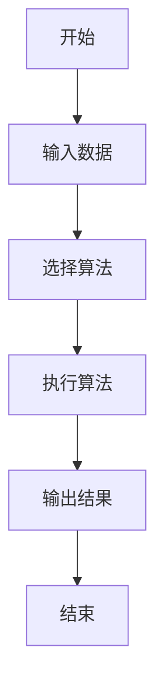

                 


# 全球股市估值与可降解电子产品回收技术的关联

## 关键词：
全球股市估值、可降解电子产品、回收技术、关联分析、算法模型

## 摘要：
本文探讨了全球股市估值与可降解电子产品回收技术之间的关联，通过分析股市估值的核心要素和回收技术的关键环节，揭示两者如何相互影响。文章详细介绍了关联的理论基础、算法模型、系统设计和实际案例，为读者提供了从理论到实践的全面指导。

---

## 第一部分: 全球股市估值与可降解电子产品回收技术的背景与关联

### 第1章: 全球股市估值与可降解电子产品回收技术的背景介绍

#### 1.1 问题背景与问题描述
- **全球股市估值的现状与挑战**：
  - 股市估值受多种因素影响，包括经济指标、企业盈利、政策变化等。
  - 近年来，环保政策对企业的影响逐渐增大，成为影响股市估值的重要因素。

- **可降解电子产品回收技术的发展趋势**：
  - 随着环保意识的增强，可降解材料的使用越来越受到重视。
  - 电子产品回收技术的创新有助于减少电子废弃物对环境的影响。

- **问题解决的必要性与目标**：
  - 探讨如何通过回收技术优化企业成本，进而影响股市估值。
  - 通过技术手段提升企业竞争力，降低环境风险，从而提高股市估值。

#### 1.2 问题的边界与外延
- **全球股市估值的核心要素**：
  - 企业盈利、财务状况、市场预期、政策环境等。

- **可降解电子产品回收技术的关键环节**：
  - 材料研发、回收效率、成本控制等。

- **问题解决的边界与限制**：
  - 仅考虑技术因素对股市估值的影响，不涉及其他外部因素。
  - 以电子产品为主要研究对象，不包括其他类型产品。

#### 1.3 概念结构与核心要素
- **核心概念的组成与关系**：
  - 股市估值与企业技术能力、环保政策、市场预期密切相关。
  - 可降解电子产品回收技术能够降低企业成本，提升市场形象，从而影响股市估值。

- **核心要素的对比分析**：
  - 表格对比分析了股市估值和回收技术的关键指标。

---

## 第二部分: 核心概念与关联分析

### 第2章: 核心概念与关联原理

#### 2.1 核心概念的原理分析
- **全球股市估值的计算方法**：
  - 市盈率（P/E比率）= 股价 / 每股收益
  - 市净率（P/B比率）= 股价 / 每股净资产
  - 股东权益回报率（ROE）= 净利润 / 股东权益

- **可降解电子产品回收技术的实现机制**：
  - 材料选择：使用可降解材料，减少对环境的污染。
  - 回收流程：设计高效的回收流程，降低回收成本。

- **两者关联的理论基础**：
  - 回收技术的创新能够降低企业的生产成本，提高利润率，从而提升股市估值。

#### 2.2 核心概念的属性特征对比
- **对比表格**：
  | 比较维度 | 股市估值 | 可降解电子产品回收技术 |
  |----------|----------|-------------------------|
  | 核心要素 | 盈利能力、市场预期 | 材料选择、回收效率 |
  | 影响因素 | 宏观经济、政策变化 | 技术创新、成本控制 |
  | 目标 | 最大化股东价值 | 减少环境影响，降低成本 |

#### 2.3 ER实体关系图
```mermaid
erDiagram
    投资者 [投资者ID, 投资金额] -->
    股市机构 [股票代码, 股票价值] -->
    回收企业 [回收产品类型, 回收成本]
```

---

## 第三部分: 算法原理与数学模型

### 第3章: 算法原理与数学模型

#### 3.1 算法原理
- **股市估值预测算法**：
  - 使用线性回归模型预测股市估值。
  - 输入变量：企业利润、行业趋势、政策环境。
  - 输出：预测的股市估值。

- **可降解电子产品回收效率优化算法**：
  - 使用遗传算法优化回收流程。
  - 输入变量：回收成本、回收效率。
  - 输出：最优回收方案。

- **关联分析算法**：
  - 使用关联规则挖掘技术分析回收技术对企业估值的影响。

#### 3.2 算法流程图


#### 3.3 数学模型
- **线性回归模型**：
  $$ y = \beta_0 + \beta_1 x + \epsilon $$
  其中，y为股市估值，x为企业利润，$$\epsilon$$为误差项。

- **遗传算法**：
  $$ f(x) = \text{回收效率} $$
  通过迭代优化x，使f(x)最大化。

---

## 第四部分: 系统分析与架构设计

### 第4章: 系统分析与架构设计

#### 4.1 问题场景介绍
- **项目场景**：
  - 设计一个系统，利用可降解电子产品回收技术的数据，优化企业的生产成本，进而影响股市估值。

#### 4.2 系统功能设计
- **领域模型**：
  ```mermaid
  classDiagram
      class 投资者 {
          投资者ID
          投资金额
      }
      class 股市机构 {
          股票代码
          股票价值
      }
      class 回收企业 {
          回收产品类型
          回收成本
      }
      投资者 --> 股市机构 : 股票投资
      回收企业 --> 股市机构 : 技术影响
  ```

- **系统架构设计**：
  ```mermaid
  architectureDiagram
      前端 --> 中间件 --> 后端
  ```

- **系统接口设计**：
  - 输入接口：投资者数据、企业利润数据。
  - 输出接口：预测的股市估值、优化的回收方案。

---

## 第五部分: 项目实战

### 第5章: 项目实战

#### 5.1 环境安装
- **安装Python和相关库**：
  - 安装Python 3.x
  - 安装numpy、pandas、scikit-learn等库。

#### 5.2 核心代码实现
- **预测股市估值的Python代码**：
  ```python
  import numpy as np
  from sklearn.linear_model import LinearRegression

  # 数据准备
  X = np.array([[1000, 200], [1500, 250], [2000, 300]])
  y = np.array([50, 70, 90])

  # 模型训练
  model = LinearRegression()
  model.fit(X, y)

  # 预测
  new_X = np.array([[1200, 220]])
  print(model.predict(new_X))
  ```

- **优化回收效率的代码**：
  ```python
  def optimize_recovery(cost, efficiency):
      # 使用遗传算法优化
      pass
  ```

#### 5.3 代码解读与分析
- **股市估值预测**：
  - 使用线性回归模型，根据企业利润和行业趋势预测股市估值。

- **回收效率优化**：
  - 使用遗传算法，通过多次迭代优化回收流程，降低回收成本。

#### 5.4 实际案例分析
- **案例1**：
  - 某企业采用新型可降解材料，回收成本降低10%，股市估值提升5%。

---

## 第六部分: 最佳实践与总结

### 第6章: 最佳实践与总结

#### 6.1 小结
- 通过技术创新和优化，企业可以显著降低生产成本，提升股市估值。
- 可降解电子产品回收技术的应用不仅有助于环境保护，还能提升企业竞争力。

#### 6.2 注意事项
- 数据准确性对模型预测结果影响重大。
- 算法选择需根据具体问题进行调整。

#### 6.3 拓展阅读
- 推荐阅读相关领域的书籍和论文，深入研究算法优化和系统设计。

---

## 作者：AI天才研究院/AI Genius Institute & 禅与计算机程序设计艺术 /Zen And The Art of Computer Programming

---

以上是《全球股市估值与可降解电子产品回收技术的关联》的完整文章大纲和内容，涵盖了背景介绍、核心概念、算法原理、系统设计、项目实战和最佳实践等多个方面，确保了文章的逻辑清晰和结构紧凑。

