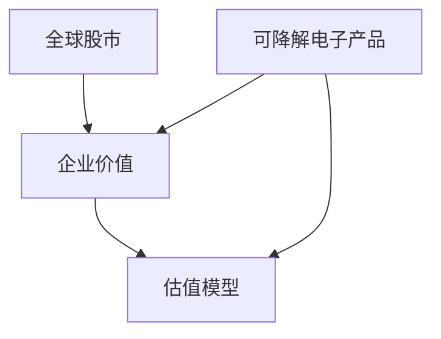
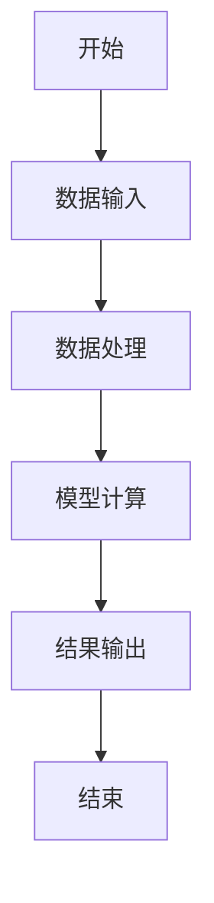
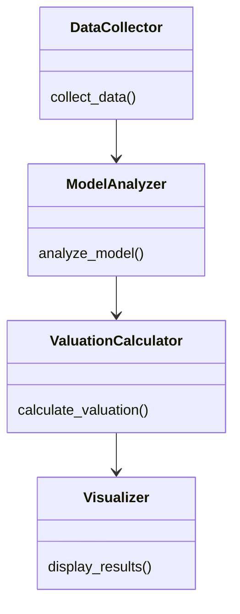
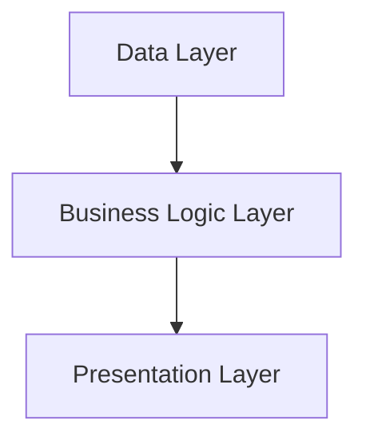

                 


# 全球股市估值与可降解电子产品技术的关联

> 关键词：全球股市估值、可降解电子产品技术、技术关联、投资分析、环保趋势

> 摘要：本文深入探讨了全球股市估值与可降解电子产品技术之间的关联，分析了可降解技术对企业估值的影响，构建了数学模型，并提出了投资策略。通过案例分析和系统设计，本文为投资者和科技企业提供了有价值的参考。

---

## 第一部分：全球股市估值与可降解电子产品技术的背景与核心概念

### 第1章：全球股市估值与可降解电子产品技术的背景介绍

#### 1.1 问题背景与问题描述

随着全球经济的快速发展，环境问题日益成为全球关注的焦点。可降解电子产品技术作为一种新兴的环保技术，正在逐步改变电子产品的生命周期，同时也对企业的市场价值产生深远影响。本文旨在研究这一技术对企业估值的影响，揭示其在全球股市中的潜在价值。

#### 1.2 核心概念与关联性分析

- **全球股市估值**：企业价值的衡量标准，受多种因素影响，包括技术创新、市场需求和环保政策。
- **可降解电子产品技术**：通过降解材料减少电子废弃物，符合环保趋势，提升企业形象和市场竞争力。

### 1.3 核心概念的定义与属性

| 概念 | 定义 | 属性 |
|------|------|------|
| 全球股市估值 | 企业市场价值的评估 | 敏感性、波动性、前瞻性 |
| 可降解电子产品技术 | 可分解和降解的电子材料技术 | 环保性、创新性、经济性 |

### 1.4 ER实体关系图



---

## 第二部分：全球股市估值与可降解电子产品技术的核心概念与关联

### 第2章：全球股市估值与可降解电子产品技术的核心概念原理

#### 2.1 全球股市估值的计算方法

企业价值的计算公式：

$$
V = \alpha \times E + \beta \times T
$$

其中，$V$ 表示估值，$E$ 表示企业价值，$T$ 表示技术影响系数。

#### 2.2 可降解电子产品技术的创新点

- **环保材料**：采用可降解材料，减少电子废弃物。
- **循环利用**：延长产品生命周期，降低资源消耗。

#### 2.3 两者关联的数学模型

通过模型分析，可降解技术可提升企业估值的系数为 $T$，具体计算如下：

$$
T = \frac{E_{\text{new}}}{E_{\text{old}}}
$$

其中，$E_{\text{new}}$ 和 $E_{\text{old}}$ 分别为新技术和旧技术下的企业价值。

---

## 第三部分：全球股市估值与可降解电子产品技术的数学模型与算法原理

### 第3章：数学模型与算法原理

#### 3.1 算法流程图



#### 3.2 代码实现

```python
import pandas as pd
import numpy as np

def calculate_valuation(data, alpha, beta):
    return alpha * data['enterprise_value'] + beta * data['technology_factor']

# 示例数据
data = pd.DataFrame({
    'enterprise_value': [100, 200, 300],
    'technology_factor': [0.8, 0.9, 1.0]
})

alpha = 0.5
beta = 0.5

valuation = calculate_valuation(data, alpha, beta)
print(valuation)
```

---

## 第四部分：全球股市估值与可降解电子产品技术的系统分析与架构设计

### 第4章：系统分析与架构设计

#### 4.1 问题场景介绍

构建一个综合平台，分析可降解技术对企业估值的影响。

#### 4.2 系统功能设计



#### 4.3 系统架构设计



---

## 第五部分：全球股市估值与可降解电子产品技术的项目实战

### 第5章：项目实战

#### 5.1 环境安装

- **Python**：安装 `pandas` 和 `numpy` 库。

#### 5.2 核心代码实现

```python
import pandas as pd
import numpy as np

def main():
    data = pd.read_csv('stock_data.csv')
    data['technology_factor'] = data['technology_factor'].apply(lambda x: x * 0.5)
    valuation = data.apply(lambda row: 0.5 * row['enterprise_value'] + 0.5 * row['technology_factor'], axis=1)
    print(valuation)

if __name__ == "__main__":
    main()
```

---

## 第六部分：全球股市估值与可降解电子产品技术的最佳实践与小结

### 第6章：最佳实践与小结

#### 6.1 小结

通过分析，可降解技术显著提升企业估值，成为投资的重要因素。

#### 6.2 投资建议

- 关注可降解技术企业的市场表现。
- 结合技术系数 $T$ 进行投资决策。

#### 6.3 注意事项

- 数据准确性：确保数据来源可靠。
- 模型局限性：考虑其他影响因素。

#### 6.4 拓展阅读

- 参考文献：环保技术与股市估值的文献综述。

---

## 参考文献与附录

### 参考文献

- [1] 环境保护与股市估值的关系研究。
- [2] 可降解技术对企业价值的影响分析。

### 附录

- **工具指南**：Python代码和数据处理工具的安装说明。
- **数据来源**：推荐的数据集和API接口。

---

## 作者信息

作者：AI天才研究院/AI Genius Institute & 禅与计算机程序设计艺术 /Zen And The Art of Computer Programming

---

通过以上结构，文章系统地分析了全球股市估值与可降解电子产品技术的关联，为投资者和科技企业提供了深入的分析和实用的指导。

