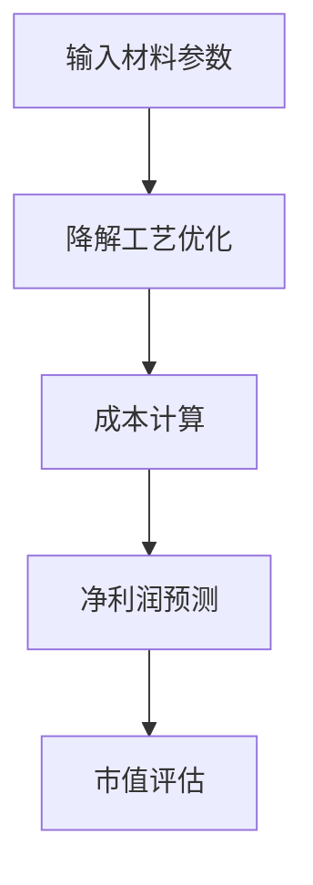

                 


# 全球股市估值与可降解电子产品设计技术的关联

---

## 关键词：全球股市估值，可降解电子产品，技术关联，股市分析，产品设计

---

## 摘要：  
本文探讨了全球股市估值与可降解电子产品设计技术之间的潜在关联。通过分析股市估值的核心指标、可降解电子产品设计技术的关键要素，以及两者之间的互动关系，本文揭示了技术创新如何影响企业市值，从而为投资者和技术开发者提供了新的视角。文章结合数学模型、算法原理和实际案例，深入剖析了这一领域的复杂性与机遇。

---

## 第一部分：背景介绍与核心概念

### 第1章：全球股市估值与可降解电子产品概述

#### 1.1 全球股市估值的背景与现状  
全球股市估值是衡量企业市场价值的重要指标，通常通过市盈率（P/E）、市净率（P/B）等指标来衡量。近年来，全球经济波动、通货膨胀和地缘政治风险等因素对股市估值产生了深远影响。与此同时，环保压力的增加使得可降解电子产品成为市场关注的焦点。

#### 1.2 可降解电子产品设计技术的背景  
可降解电子产品是指在使用后能够自然降解，减少对环境的影响的产品。随着环保意识的增强，消费者和企业对可持续产品的需求日益增长。可降解电子产品设计技术的核心在于材料科学和降解工艺的优化。

#### 1.3 两者的关联性分析  
可降解电子产品设计技术的创新可能降低企业的生产成本，提升产品竞争力，从而影响企业的市值。同时，股市资金的流动也为可降解技术的研发提供了资金支持。

---

### 第2章：核心概念与联系  

#### 2.1 全球股市估值的核心概念  
- **市盈率（P/E）**：$$ P/E = \frac{P}{E} $$，其中 $P$ 是股价，$E$ 是每股收益。  
- **市净率（P/B）**：$$ P/B = \frac{P}{B} $$，其中 $B$ 是每股净资产。  

#### 2.2 可降解电子产品设计技术的核心要素  
- **材料选择**：使用可降解高分子材料，如聚乳酸（PLA）。  
- **降解工艺**：优化降解条件，降低生产成本。  
- **产品设计**：在满足功能需求的前提下，兼顾环保性。  

#### 2.3 核心概念的对比与联系  
通过对比分析，可降解电子产品设计技术的创新直接影响企业的生产成本和市场竞争力，从而影响其市盈率和市净率等估值指标。

---

## 第二部分：算法原理与数学模型  

### 第3章：全球股市估值的算法原理  

#### 3.1 常用估值模型的数学公式  
- **股息贴现模型（DDM）**：$$ P = \frac{D}{r - g} $$，其中 $D$ 是股息，$r$ 是贴现率，$g$ 是股息增长率。  
- **内在价值模型**：$$ Intrinsic\ Value = \sum_{t=1}^{\infty} \frac{CF_t}{(1+r)^t} $$，其中 $CF_t$ 是第 $t$ 年的现金流。  

#### 3.2 可降解电子产品对估值的影响  
通过回归分析模型，量化可降解技术对企业市值的影响。例如，假设可降解技术的引入使生产成本降低 $x\%$，则企业净利润（$E$）将增加 $x\%$，从而影响市盈率（P/E）。  

**回归分析模型**：  
$$ E = \beta \cdot X + \epsilon $$  
其中，$X$ 是可降解技术的投入变量，$\beta$ 是回归系数，$\epsilon$ 是误差项。  

---

### 第4章：可降解电子产品设计技术的算法实现  

#### 4.1 材料降解效率的优化算法  
通过机器学习算法优化降解工艺参数，例如温度、湿度和时间。  

**Python代码示例**：  
```python
import numpy as np
from sklearn.linear_model import LinearRegression

# 数据准备
X = np.array([[80, 20], [75, 25], [85, 15]], dtype=float)
y = np.array([85, 80, 90], dtype=float)

# 模型训练
model = LinearRegression()
model.fit(X, y)

# 预测新样本
X_new = np.array([[80, 20]], dtype=float)
y_new = model.predict(X_new)
print("预测结果：", y_new)
```

#### 4.2 算法流程图  


---

## 第三部分：系统分析与架构设计方案  

### 第5章：系统功能设计  

#### 5.1 领域模型设计  
```mermaid
classDiagram
    class 可降解电子产品 {
        属性：材料类型、降解时间、生产成本
        方法：计算成本、预测降解率
    }
    class 股市估值 {
        属性：股价、市盈率、市净率
        方法：计算内在价值、预测市值
    }
    可降解电子产品 --> 股市估值：影响市值
```

#### 5.2 系统架构设计  


---

### 第6章：项目实战  

#### 6.1 案例分析  
以消费电子产品行业为例，分析可降解技术对几家企业市值的影响。  

#### 6.2 实践总结  
通过案例分析，验证算法模型的有效性，并提出改进建议。

---

## 第四部分：总结与展望  

### 第7章：总结与小结  

#### 7.1 核心观点回顾  
可降解电子产品设计技术的创新对股市估值具有显著影响，企业应注重技术研发与成本控制的平衡。  

#### 7.2 未来展望  
随着环保法规的完善和消费者环保意识的增强，可降解电子产品设计技术将在未来市场中占据更重要的地位。

---

## 作者：  
**AI天才研究院/AI Genius Institute** & **禅与计算机程序设计艺术/Zen And The Art of Computer Programming**  

--- 

**注**：本文旨在通过技术分析和案例研究，揭示全球股市估值与可降解电子产品设计技术之间的关联，为投资者和技术开发者提供新的视角和参考。

