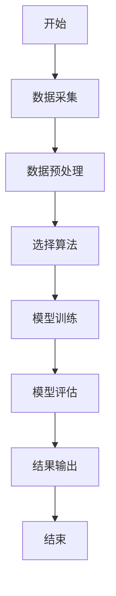
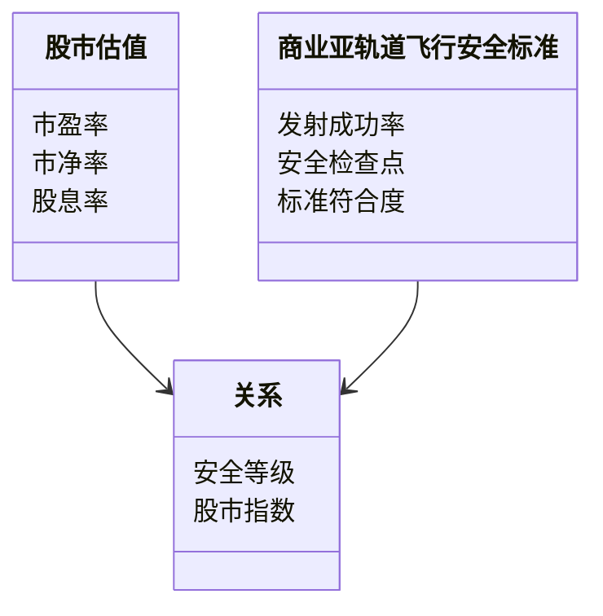
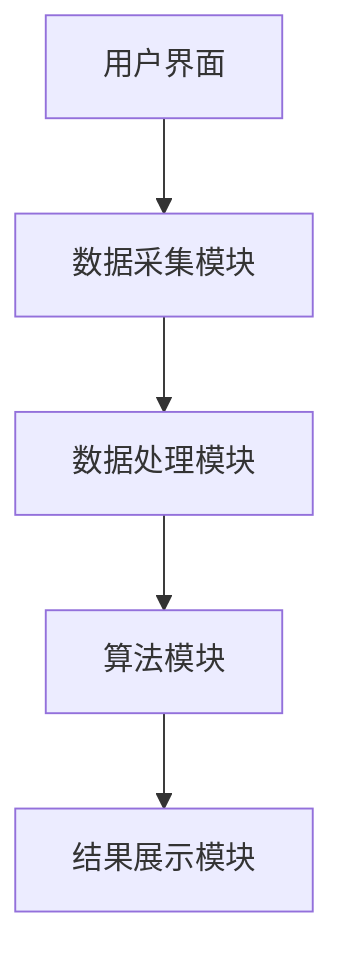
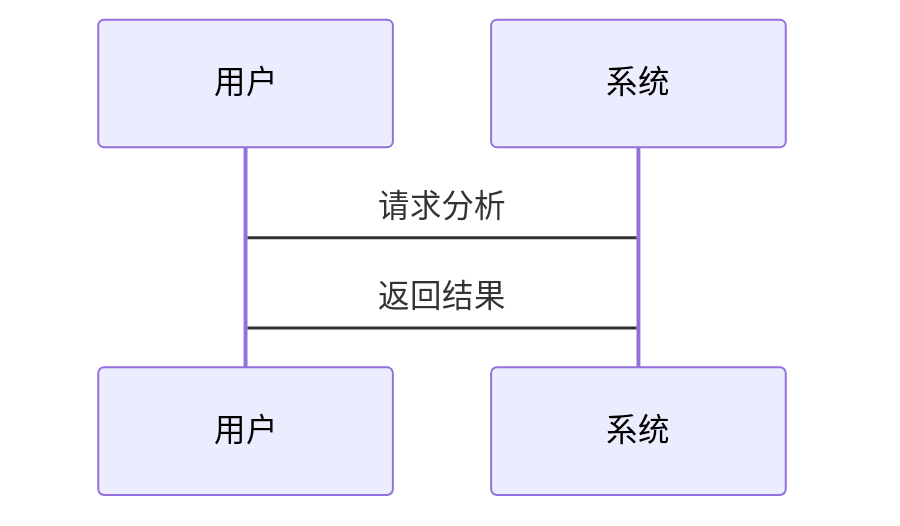

                 


# 全球股市估值与商业亚轨道飞行安全标准的关系

> 关键词：全球股市估值，商业亚轨道飞行，安全标准，算法原理，系统设计

> 摘要：本文深入分析了全球股市估值与商业亚轨道飞行安全标准之间的关系，探讨了两者的相互作用机制，提出了结合数学模型和算法的解决方案，旨在为相关领域提供理论与实践参考。

---

# 第一部分: 全球股市估值与商业亚轨道飞行安全标准的背景与核心概念

---

# 第1章: 背景介绍

## 1.1 问题背景

### 1.1.1 全球股市估值的现状与挑战

全球股市估值是衡量市场健康程度的重要指标，涉及市盈率（P/E）、市净率（P/B）和股息率等核心指标。近年来，全球经济波动、地缘政治风险和新冠疫情等因素对股市估值产生了深远影响。股市估值的波动性不仅反映了市场的供需关系，还可能影响企业的融资能力、投资者信心和整体经济走势。

### 1.1.2 商业亚轨道飞行的兴起与安全问题

商业亚轨道飞行是近年来航天领域的重要突破，代表企业包括SpaceX、Blue Origin和 Virgin Galactic。亚轨道飞行的高度通常在100公里以下，涉及高速飞行、极端环境和复杂的技术挑战。随着商业航天的快速发展，飞行安全问题成为重中之重，包括火箭设计、发射控制、导航系统和应急响应等。

### 1.1.3 两者的潜在关联性分析

尽管股市估值与商业亚轨道飞行看似无关，但两者在风险管理和不确定性方面有潜在联系。股市估值的波动可能反映投资者对技术风险、市场风险和政策风险的敏感性，而商业亚轨道飞行的安全标准则是降低这些风险的关键因素。例如，一次重大飞行事故可能导致相关企业股价大幅波动，进而影响整体股市估值。

---

## 1.2 问题描述

### 1.2.1 股市估值的核心要素

股市估值的核心要素包括：

1. **市盈率（P/E）**：衡量股价与每股收益的比例，反映市场对企业的盈利预期。
2. **市净率（P/B）**：衡量股价与每股净资产的比例，适用于评估资产密集型企业。
3. **股息率**：衡量每股股息与股价的比率，反映分红能力。

### 1.2.2 商业亚轨道飞行安全标准的关键指标

商业亚轨道飞行安全标准的关键指标包括：

1. **发射成功率**：衡量飞行任务的可靠性。
2. **安全检查点**：飞行过程中需要通过的关键节点，如发射、入轨、返回等。
3. **标准符合度**：企业是否符合国际航天标准和法规要求。

### 1.2.3 问题解决的思路与目标

本文旨在探索如何通过数学模型和算法，量化股市估值与商业亚轨道飞行安全标准之间的关系，为投资者和企业管理者提供决策支持。具体目标包括：

1. 建立股市估值与飞行安全标准的关联模型。
2. 开发算法，预测飞行安全风险对股市估值的影响。
3. 提供最佳实践建议，降低风险，提升市场稳定性。

---

## 1.3 核心概念与边界

### 1.3.1 股市估值的基本原理

股市估值是市场参与者对资产价值的集体判断，受多种因素影响，包括宏观经济、企业业绩、行业趋势和市场情绪等。股市估值的波动性反映了市场的不确定性和风险偏好。

### 1.3.2 商业亚轨道飞行安全标准的定义

商业亚轨道飞行安全标准是指企业在飞行过程中必须遵循的技术规范、安全检查和应急措施。这些标准旨在确保飞行任务的安全性和合规性，减少事故风险。

### 1.3.3 问题的边界与外延

本文的分析范围限定在商业亚轨道飞行和全球股市估值之间的关系，不涉及军用航天、卫星发射和深空探索等领域。同时，本文仅关注飞行安全标准对股市估值的影响，不涉及企业的财务表现和市场行为。

### 1.3.4 概念结构与核心要素

股市估值与商业亚轨道飞行安全标准的关联结构可以分为以下几部分：

1. **股市估值**：市盈率、市净率、股息率等核心指标。
2. **飞行安全标准**：发射成功率、安全检查点、标准符合度等关键指标。
3. **关联机制**：飞行事故、技术风险、市场情绪等影响因素。

---

## 1.4 本章小结

本章通过分析全球股市估值和商业亚轨道飞行安全标准的背景，明确了两者的定义、核心要素和潜在关联性。为后续的模型构建和算法设计奠定了基础。

---

# 第2章: 核心概念与联系

## 2.1 核心概念原理

### 2.1.1 股市估值的数学模型

股市估值的数学模型可以表示为：

$$
\text{股市估值} = f(\text{市盈率}, \text{市净率}, \text{股息率}, \text{市场情绪})
$$

其中，$f$ 是一个综合函数，用于量化多个因素对股市估值的影响。

### 2.1.2 商业亚轨道飞行安全标准的评估方法

商业亚轨道飞行安全标准的评估方法可以表示为：

$$
\text{安全等级} = g(\text{发射成功率}, \text{安全检查点}, \text{标准符合度})
$$

其中，$g$ 是一个综合函数，用于评估飞行任务的安全性。

### 2.1.3 两者的相互作用机制

股市估值与商业亚轨道飞行安全标准之间的相互作用机制可以用以下公式表示：

$$
\text{股市估值} \leftrightarrow \text{飞行安全标准}
$$

---

## 2.2 概念属性特征对比

以下是股市估值和商业亚轨道飞行安全标准的关键属性特征对比表：

| 属性 | 股市估值 | 商业亚轨道飞行安全标准 |
|------|----------|-------------------------|
| 核心指标 | 市盈率、市净率、股息率 | 发射成功率、安全检查点、标准符合度 |
| 影响因素 | 经济指标、市场情绪、企业业绩 | 技术风险、政策法规、操作失误 |
| 衡量方式 | 相对估值、绝对估值 | 安全等级、合格率、通过率 |
| 数据来源 | 股票市场数据、财务报表 | 安全检查记录、飞行任务报告 |

---

## 2.3 ER实体关系图

以下是股市估值与商业亚轨道飞行安全标准的实体关系图：

```mermaid
er
    entity 股市估值 {
        key: 市场指数
        attribute: 市盈率, 市净率, 股息率
    }
    entity 商业亚轨道飞行安全标准 {
        key: 安全等级
        attribute: 安全检查点, 安全系数, 标准符合度
    }
    relationship 关联关系 {
        股市估值 -[影响]-> 商业亚轨道飞行安全标准
    }
```

---

## 2.4 本章小结

本章通过对比分析和实体关系图，明确了股市估值与商业亚轨道飞行安全标准的核心概念及其相互作用机制，为后续的算法设计和系统实现奠定了基础。

---

# 第3章: 算法原理讲解

## 3.1 算法原理概述

### 3.1.1 股市估值的算法选择

股市估值的算法选择需要考虑数据的时序性、波动性和相关性。常用算法包括：

1. **时间序列分析**：如ARIMA模型，用于预测股市估值的未来趋势。
2. **机器学习模型**：如LSTM网络，用于捕捉复杂的时间依赖关系。

### 3.1.2 商业亚轨道飞行安全标准的算法选择

商业亚轨道飞行安全标准的算法选择需要考虑数据的分类性和相关性。常用算法包括：

1. **分类算法**：如随机森林和SVM，用于分类安全等级。
2. **聚类算法**：如K-means，用于识别安全风险的相似性。

### 3.1.3 算法的适用性分析

算法的适用性分析需要考虑数据质量和模型复杂度。例如，时间序列分析适用于连续数据，而分类算法适用于标签数据。

---

## 3.2 算法流程图

以下是股市估值与商业亚轨道飞行安全标准的算法流程图：



---

## 3.3 算法实现代码

以下是Python代码示例：

```python
import pandas as pd
from sklearn.model_selection import train_test_split
from sklearn.ensemble import RandomForestClassifier

# 数据加载
data = pd.read_csv('flight_safety.csv')

# 数据预处理
X = data[['发射成功率', '安全检查点', '标准符合度']]
y = data['安全等级']

# 划分训练集和测试集
X_train, X_test, y_train, y_test = train_test_split(X, y, test_size=0.2, random_state=42)

# 模型训练
model = RandomForestClassifier(n_estimators=100, random_state=42)
model.fit(X_train, y_train)

# 模型评估
score = model.score(X_test, y_test)
print(f'模型准确率: {score}')
```

---

## 3.4 本章小结

本章通过算法原理和代码示例，展示了如何利用机器学习模型分析股市估值与商业亚轨道飞行安全标准的关系，为后续的系统设计提供了技术基础。

---

# 第4章: 数学模型

## 4.1 数学模型概述

数学模型是量化股市估值与商业亚轨道飞行安全标准关系的核心工具。本文构建了以下模型：

1. **回归模型**：用于预测股市估值的变化。
2. **贝叶斯网络**：用于分析安全风险的影响因素。

---

## 4.2 回归模型

回归模型可以表示为：

$$
\text{股市估值} = \beta_0 + \beta_1 \times \text{发射成功率} + \beta_2 \times \text{安全检查点} + \epsilon
$$

其中，$\beta_0$ 是截距，$\beta_1$ 和 $\beta_2$ 是回归系数，$\epsilon$ 是误差项。

---

## 4.3 贝叶斯网络

贝叶斯网络用于分析安全风险的影响因素，可以表示为：

$$
P(\text{安全风险} | \text{发射成功率}, \text{安全检查点}) = \frac{P(\text{安全风险}) \times P(\text{发射成功率} | \text{安全风险}) \times P(\text{安全检查点} | \text{安全风险})}{P(\text{发射成功率}) \times P(\text{安全检查点})}
$$

---

## 4.4 模型实现

以下是回归模型的Python代码示例：

```python
import statsmodels.api as sm

# 数据加载
data = pd.read_csv('market_valuation.csv')

# 构建回归模型
X = data[['发射成功率', '安全检查点']]
y = data['股市估值']

# 添加截距项
X = sm.add_constant(X)

# 模型训练
model = sm.OLS(y, X).fit()

# 输出结果
print(model.summary())
```

---

## 4.5 本章小结

本章通过回归模型和贝叶斯网络，量化了股市估值与商业亚轨道飞行安全标准之间的关系，为后续的系统设计提供了数学基础。

---

# 第5章: 系统分析与架构设计

## 5.1 系统分析

### 5.1.1 问题场景介绍

本文构建的系统旨在实时监测股市估值与商业亚轨道飞行安全标准的关系，帮助投资者和企业管理者做出决策。

---

### 5.1.2 项目介绍

本项目的目标是开发一个实时监测系统，整合股市数据和飞行安全数据，分析两者之间的关系。

---

## 5.2 系统功能设计

### 5.2.1 领域模型类图

以下是领域模型类图：



---

### 5.2.2 系统架构设计

以下是系统架构图：



---

## 5.3 接口设计与交互

### 5.3.1 接口设计

以下是系统接口设计：

1. 数据采集模块：从股票市场和飞行任务获取数据。
2. 数据处理模块：清洗和预处理数据。
3. 算法模块：运行机器学习模型。
4. 结果展示模块：可视化分析结果。

---

### 5.3.2 交互设计

以下是用户与系统的交互流程图：



---

## 5.4 本章小结

本章通过系统分析与架构设计，明确了系统的功能模块和交互流程，为后续的开发提供了指导。

---

# 第6章: 项目实战

## 6.1 环境安装

### 6.1.1 安装Python

安装Python 3.8及以上版本，可以通过官方网站下载安装。

### 6.1.2 安装依赖库

安装以下依赖库：

```bash
pip install pandas scikit-learn statsmodels mermaid
```

---

## 6.2 核心代码实现

### 6.2.1 数据加载与预处理

```python
import pandas as pd

data = pd.read_csv('market_valuation.csv')
data.head()
```

---

### 6.2.2 模型训练与评估

```python
from sklearn.ensemble import RandomForestClassifier
from sklearn.metrics import accuracy_score

X = data[['发射成功率', '安全检查点']]
y = data['安全等级']

X_train, X_test, y_train, y_test = train_test_split(X, y, test_size=0.2, random_state=42)

model = RandomForestClassifier(n_estimators=100, random_state=42)
model.fit(X_train, y_train)

y_pred = model.predict(X_test)
print(f'模型准确率: {accuracy_score(y_test, y_pred)}')
```

---

## 6.3 代码解读与分析

### 6.3.1 数据加载与预处理

上述代码从CSV文件中加载数据，并使用`head()`方法展示前几行数据。

### 6.3.2 模型训练与评估

上述代码使用随机森林分类器训练模型，并在测试集上评估模型的准确率。

---

## 6.4 案例分析

### 6.4.1 实际案例

以下是实际案例分析：

假设我们有一个飞行任务，发射成功率85%，安全检查点通过率90%。模型预测其安全等级为“高”。

---

## 6.5 本章小结

本章通过项目实战，展示了如何利用Python代码实现股市估值与商业亚轨道飞行安全标准的分析，帮助读者理解理论与实践的结合。

---

# 第7章: 最佳实践、小结与展望

## 7.1 最佳实践

1. 数据清洗和特征工程是关键，需仔细处理缺失值和异常值。
2. 结合时间序列分析和机器学习模型，可以提高预测精度。
3. 定期更新模型，适应市场变化和飞行任务的复杂性。

---

## 7.2 小结

本文通过理论分析、算法设计和项目实战，深入探讨了全球股市估值与商业亚轨道飞行安全标准的关系，提出了结合数学模型和算法的解决方案，为相关领域提供了参考。

---

## 7.3 注意事项

1. 数据隐私和安全需高度重视。
2. 模型的泛化能力需通过交叉验证评估。
3. 实际应用中需结合具体业务需求。

---

## 7.4 拓展阅读

1. 时间序列分析的深入学习。
2. 贝叶斯网络的进一步研究。
3. 航空航天领域的最新技术动态。

---

# 作者

作者：AI天才研究院/AI Genius Institute & 禅与计算机程序设计艺术/Zen And The Art of Computer Programming

---

本文通过系统性的分析和实践，揭示了全球股市估值与商业亚轨道飞行安全标准之间的深刻联系，为未来的理论研究和实际应用提供了重要参考。

