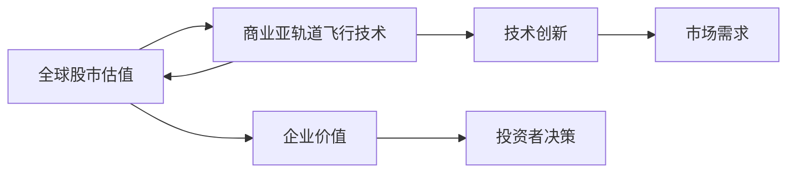
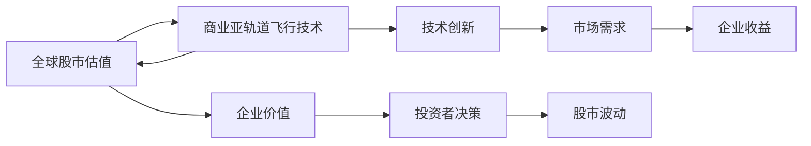
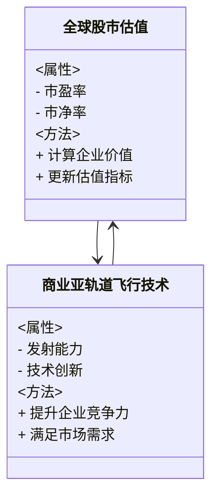

                 


# 全球股市估值与商业亚轨道飞行技术的关系

> 关键词：全球股市估值，商业亚轨道飞行技术，协同效应，系统分析，算法原理

> 摘要：本文探讨了全球股市估值与商业亚轨道飞行技术之间的关系，分析了它们如何相互影响，协同效应的实现路径，以及系统设计与实际应用。通过理论分析和案例研究，揭示了这两者在经济和科技领域的深度联系。

---

# 第一部分: 全球股市估值与商业亚轨道飞行技术的关系概述

## 第1章: 全球股市估值的背景与现状

### 1.1 全球股市估值的基本概念

#### 1.1.1 什么是全球股市估值
全球股市估值是通过对全球各主要股票市场的整体价值进行评估的过程，通常以市盈率（P/E）、市净率（P/B）等指标衡量。股市估值反映了市场对企业的整体看法，是投资者决策的重要依据。

#### 1.1.2 全球股市估值的分类与特点
股市估值可以分为单市场估值和多市场估值。单市场估值针对某一国家或地区的股市，而多市场估值则综合考虑全球多个市场的表现。特点包括数据多样性、动态变化和受多种因素影响（如经济政策、企业盈利等）。

#### 1.1.3 全球股市估值的重要性
准确的股市估值有助于投资者做出明智决策，识别市场风险，优化投资组合。同时，股市估值还能反映经济整体健康状况，为政策制定者提供参考。

### 1.2 商业亚轨道飞行技术的定义与现状

#### 1.2.1 亚轨道飞行技术的定义
亚轨道飞行是指飞行器在大气层外飞行，但未达到地球同步轨道的飞行活动。商业亚轨道飞行技术主要应用于太空旅游、卫星发射等领域。

#### 1.2.2 商业亚轨道飞行技术的发展历程
从早期的政府主导到如今的商业公司主导，亚轨道技术经历了从实验阶段到商业化应用的转变。SpaceX、Blue Origin等公司推动了技术进步。

#### 1.2.3 当前商业亚轨道飞行技术的应用领域
包括太空旅游、卫星发射、通信服务和科学研究。这些应用推动了商业亚轨道技术的快速发展。

## 第2章: 全球股市估值与商业亚轨道飞行技术的关系

### 2.1 两者关系的背景分析

#### 2.1.1 经济全球化与股市估值的关系
经济全球化使得股市估值更加国际化，投资者可以跨国投资，推动了股市的联动效应。

#### 2.1.2 科技创新对股市估值的影响
技术创新提高了企业竞争力，提升了企业价值，进而影响股市估值。

#### 2.1.3 亚轨道飞行技术对商业发展的推动作用
亚轨道技术的应用为企业带来了新的增长点，提升了企业的市场价值，进而影响股市估值。

### 2.2 两者关系的核心概念

#### 2.2.1 全球股市估值的核心要素
- 市盈率（P/E）：衡量股价与每股收益的比例。
- 市净率（P/B）：衡量股价与每股净资产的比例。
- 市销率（P/S）：衡量股价与每股收入的比例。

#### 2.2.2 商业亚轨道飞行技术的核心要素
- 发射能力：飞行器的运载能力。
- 技术创新：材料科学、推进系统等的技术进步。
- 商业模式：太空旅游、卫星发射等的商业模式。

#### 2.2.3 两者关系的实体关系图



---

## 第3章: 全球股市估值与商业亚轨道飞行技术的相互影响

### 3.1 亚轨道飞行技术对股市估值的影响

#### 3.1.1 亚轨道技术如何影响企业价值
- 提高企业的技术壁垒，增加企业竞争力。
- 扩大企业的市场空间，提升企业盈利能力。

#### 3.1.2 亚轨道技术对投资决策的影响
- 投资者更倾向于投资具备先进亚轨道技术的企业。
- 企业的技术创新能力成为投资者评估的重要因素。

#### 3.1.3 亚轨道技术对股市波动的潜在影响
- 技术突破可能导致相关股票价格上涨。
- 技术失败可能导致股价下跌，引发市场波动。

### 3.2 股市估值对商业亚轨道飞行技术的影响

#### 3.2.1 股市估值如何影响技术投资
- 高估值的股市环境吸引更多资金投入技术开发。
- 低估值可能限制企业的技术投资能力。

#### 3.2.2 股市估值对技术发展的推动作用
- 高估值的股市为技术创新提供资金支持。
- 股市的波动性促使企业更加注重技术研发，以提高抗风险能力。

#### 3.2.3 股市估值对技术商业化的影响
- 高估值的股市环境加速技术的商业化进程。
- 股市的反馈机制促使企业将技术转化为实际收益。

---

## 第4章: 全球股市估值与商业亚轨道飞行技术的协同效应

### 4.1 协同效应的理论基础

#### 4.1.1 协同效应的定义与特点
协同效应指两者在相互作用中产生的整体效应大于各部分效应之和。

#### 4.1.2 协同效应的实现机制
- 技术创新与资本市场的互动。
- 企业价值与技术发展的相互促进。

#### 4.1.3 协同效应的数学模型

$$协同效应 = f(技术创新, 企业价值, 市场反馈)$$

### 4.2 协同效应的实现路径

#### 4.2.1 技术创新与资本市场的结合
- 企业通过股市融资支持技术创新。
- 投资者通过股市投资推动技术创新。

#### 4.2.2 股市估值对技术创新的反馈机制
- 高估值激励企业加大技术创新。
- 低估值促使企业优化技术应用。

#### 4.2.3 协同效应的系统架构设计



---

## 第5章: 全球股市估值与商业亚轨道飞行技术的系统分析

### 5.1 系统分析

#### 5.1.1 问题场景介绍
当前，商业亚轨道飞行技术的发展依赖于股市的资金支持，而股市估值又受技术发展的影响。这种相互依赖关系构成了一个复杂的系统。

#### 5.1.2 系统功能设计



#### 5.1.3 系统架构设计


---

## 第6章: 项目实战

### 6.1 环境安装

```bash
pip install numpy pandas matplotlib
```

### 6.2 核心实现源代码

```python
import numpy as np
import pandas as pd
import matplotlib.pyplot as plt

# 示例数据
data = {
    '公司名称': ['A', 'B', 'C'],
    '市盈率': [15, 20, 25],
    '技术创新': [80, 60, 90]
}

df = pd.DataFrame(data)

# 可视化分析
plt.scatter(df['技术创新'], df['市盈率'])
plt.xlabel('技术创新')
plt.ylabel('市盈率')
plt.title('技术创新与市盈率的关系')
plt.show()
```

### 6.3 实际案例分析

#### 6.3.1 案例背景
某商业亚轨道公司通过技术创新提升了市场竞争力，导致其股票市盈率上升。

#### 6.3.2 数据分析
使用回归分析模型评估技术创新对公司市盈率的影响。

### 6.4 项目总结

- 技术创新与股市估值的相互作用显著。
- 协同效应能够提升企业的整体价值。
- 系统设计与实际应用相结合能够更好地实现目标。

---

## 第7章: 最佳实践

### 7.1 小结

- 理解全球股市估值与商业亚轨道飞行技术的关系，有助于优化投资决策和技术创新。
- 协同效应是两者关系的核心，能够提升企业的竞争力和市场价值。

### 7.2 注意事项

- 技术创新需要长期投入，股市估值可能受短期波动影响。
- 投资者应关注技术的商业化能力，避免盲目跟风。

### 7.3 拓展阅读

- 《股市估值与企业战略》
- 《商业亚轨道技术发展现状与未来》

---

# 作者：AI天才研究院/AI Genius Institute & 禅与计算机程序设计艺术 /Zen And The Art of Computer Programming

