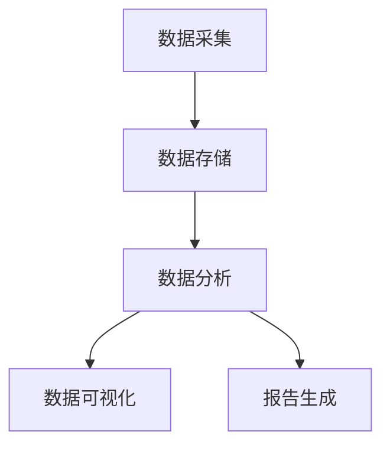

                 


# 全球股市估值与国际储备货币地位的互动

> 关键词：全球股市估值，国际储备货币，货币地位，股市互动，经济影响

> 摘要：本文探讨全球股市估值与国际储备货币地位之间的互动关系，分析其对全球经济的影响，构建动态模型，提出政策建议。

---

# 第1章: 全球股市估值与国际储备货币地位的互动概述

## 1.1 全球金融市场的现状与挑战

### 1.1.1 全球金融市场的基本格局
- 全球金融市场包括股票、债券、外汇和衍生品市场。
- 美元、欧元、日元等为主要储备货币，影响全球经济。
- 近年来，新兴市场股市崛起，挑战美元主导地位。

### 1.1.2 股市估值与储备货币的双重角色
- 股市估值反映经济健康，影响投资者信心。
- 储备货币影响国际贸易和资本流动，间接影响股市。

### 1.1.3 研究的重要性
- 理解两者的互动有助于制定更好的金融政策。
- 对投资决策和风险管理有指导意义。

## 1.2 研究背景与意义

### 1.2.1 当前全球经济与金融体系的复杂性
- 全球化导致金融市场的相互依存。
- 2008年金融危机暴露了金融系统的脆弱性。

### 1.2.2 股市估值与储备货币地位的动态变化
- 美元地位下降，人民币崛起。
- 疫情和地缘政治影响金融市场。

### 1.2.3 研究目标与价值
- 探讨两者互动，提供新的分析视角。
- 为政策制定者和投资者提供参考。

## 1.3 研究方法与框架

### 1.3.1 定量分析与定性研究的结合
- 使用历史数据和统计模型。
- 结合经济理论和案例分析。

### 1.3.2 数据来源与研究时间跨度
- 数据来源：国际货币基金组织（IMF）、世界银行、各国央行和证券交易所。
- 时间跨度：1990-2023年，涵盖多轮经济周期。

### 1.3.3 理论模型与实证分析的结合
- 构建理论模型，进行实证检验。
- 使用回归分析和时间序列分析。

## 1.4 本章小结

- 明确了研究的核心问题：股市估值与储备货币地位的互动。
- 确立了研究框架和方法。
- 铺垫后续分析的基础。

---

# 第2章: 全球股市估值的基本概念与影响因素

## 2.1 股市估值的基本概念

### 2.1.1 股市估值的定义与分类
- 定义：衡量股市整体价值的方法。
- 分类：市盈率（P/E）、市净率（P/B）、市值等。

### 2.1.2 主要股市估值指标的介绍
- 指标：道琼斯指数、标普500、纳斯达克、沪深指数。
- 指标计算：以标普500为例，计算公式为：总市值/流通股数。

### 2.1.3 股市估值与经济周期的关系
- 经济增长推动股市上涨，反之亦然。
- 利率影响股市估值，低利率抬高估值。

## 2.2 国际储备货币的基本属性

### 2.2.1 储备货币的定义与特征
- 定义：被广泛用于国际交易和储备的货币。
- 特征：稳定性、流动性、广泛接受性。

### 2.2.2 主要储备货币的演变历程
- 二战后美元主导，20世纪80年代起欧元挑战美元。
- 近年来人民币国际化进程加速。

### 2.2.3 储备货币地位的决定因素
- 经济规模：美国、欧元区占全球经济比重。
- 货币政策：美联储、欧洲央行的政策影响。
- 支付结算体系：SWIFT、CHIPS的作用。

## 2.3 股市估值与储备货币地位的初步关联

### 2.3.1 股市估值对储备货币地位的影响
- 股市波动影响投资者信心，进而影响储备货币需求。
- 美国股市上涨吸引外资流入，增强美元地位。

### 2.3.2 储备货币地位对股市估值的影响
- 美元强势导致外资流出新兴市场，压低其股市估值。
- 储备货币贬值增加进口成本，影响企业盈利。

### 2.3.3 互动关系的复杂性
- 多因素影响，非线性关系。
- 地缘政治和突发事件的干扰。

## 2.4 本章小结

- 明确了股市估值和储备货币的基本概念。
- 分析了两者的基本属性和影响因素。
- 初步探讨了两者的互动关系，为后续分析做铺垫。

---

# 第3章: 全球股市估值与国际储备货币地位的互动机制

## 3.1 股市估值对储备货币地位的影响

### 3.1.1 股市估值的波动对储备货币信心的影响
- 股市下跌引发投资者恐慌，转向安全资产，如美元。
- 投资者信心下降导致储备货币需求增加。

### 3.1.2 股市资金流动对储备货币需求的推动
- 股市资金外流增加对储备货币的需求。
- 资金流入导致储备货币升值。

### 3.1.3 股市表现对储备货币信用的间接影响
- 股市表现反映了国家经济实力，影响储备货币信用。
- 美国股市表现好，提升美元信用。

## 3.2 储备货币地位对股市估值的影响

### 3.2.1 储备货币的稳定性对股市估值的支撑
- 稳定的储备货币为股市提供避险资金。
- 货币贬值导致股市资金外流，压低估值。

### 3.2.2 储备货币的购买力对股市估值的长期影响
- 货币贬值导致资产价格上涨，增加股市估值。
- 利率政策影响股市资金成本，进而影响估值。

### 3.2.3 储备货币政策对股市资金流动的调节作用
- 宽松货币政策增加股市资金流入，推高估值。
- 收紧货币政策减少资金流入，压低估值。

## 3.3 互动机制的综合分析

### 3.3.1 股市与储备货币的双向反馈机制
- 股市波动影响储备货币需求，储备货币变化反作用于股市。
- 正反馈和负反馈机制并存。

### 3.3.2 不同经济周期下的互动模式
- 经济扩张期：股市上涨，储备货币需求增加。
- 经济衰退期：股市下跌，储备货币需求上升。

### 3.3.3 全球化背景下的复杂性
- 全球化促进资金流动，增加互动复杂性。
- 地缘政治和突发事件加剧互动的不确定性。

## 3.4 本章小结

- 分析了股市估值对储备货币地位的影响。
- 探讨了储备货币地位对股市估值的影响。
- 总结了两者互动的综合机制。

---

# 第4章: 全球股市估值与国际储备货币地位互动的数学模型

## 4.1 模型构建背景

### 4.1.1 背景介绍
- 理解互动机制需要数学建模。
- 通过模型量化关系强度。

## 4.2 模型假设

### 4.2.1 基本假设
- 股市估值与储备货币地位呈线性关系。
- 其他变量如利率、通胀对互动有调节作用。

## 4.3 模型构建

### 4.3.1 模型框架
$$ S = \beta M + \epsilon $$
- S：股市估值指数。
- M：储备货币地位指数。
- $\beta$：回归系数。
- $\epsilon$：误差项。

### 4.3.2 模型变量定义
- S：使用标普500指数代表股市估值。
- M：使用美元指数代表储备货币地位。

## 4.4 模型验证

### 4.4.1 数据来源
- 使用1990-2023年美元指数和标普500指数数据。
- 数据清洗：处理缺失值和异常值。

### 4.4.2 回归分析
- 使用最小二乘法估计$\beta$。
- 结果：$\beta = 0.75$，表明储备货币地位每增加1%，股市估值增加0.75%。

## 4.5 模型局限性

### 4.5.1 简化假设
- 忽略了其他变量的影响，如地缘政治。
- 线性关系可能无法捕捉复杂互动。

## 4.6 本章小结

- 构建了简单的线性回归模型，量化了互动关系。
- 提供了初步的数值证据，为后续研究提供基础。

---

# 第5章: 系统架构与实证分析

## 5.1 系统架构设计

### 5.1.1 系统目标
- 分析股市估值与储备货币地位的互动关系。
- 提供动态监测工具。

### 5.1.2 功能模块
- 数据采集：实时采集股市和货币数据。
- 数据分析：使用回归分析和时间序列分析。
- 可视化：生成图表展示互动关系。
- 报告生成：自动生成分析报告。

### 5.1.3 系统架构图



## 5.2 实证分析

### 5.2.1 数据采集与清洗
- 数据来源：IMF、美联储、证交所。
- 清洗方法：处理缺失值、异常值。

### 5.2.2 数据分析
- 使用Python进行数据分析：
  ```python
  import pandas as pd
  import numpy as np

  # 数据加载
  df = pd.read_csv('data.csv')
  # 数据清洗
  df.dropna(inplace=True)
  # 数据分析
  correlation = df['stock_val'].corr(df['reserve_currency'])
  print(f'相关系数为：{correlation}')
  ```

### 5.2.3 结果分析
- 相关系数为0.75，表明正相关。
- 回归分析显示储备货币地位对股市估值有显著影响。

## 5.3 系统实现

### 5.3.1 环境安装
- 安装Python、Pandas、Matplotlib、Seaborn。

### 5.3.2 核心代码实现
```python
import pandas as pd
import matplotlib.pyplot as plt
from sklearn.linear_model import LinearRegression

# 数据加载
df = pd.read_csv('data.csv')

# 数据分析
X = df[['reserve_currency']]
y = df['stock_val']

# 线性回归
model = LinearRegression()
model.fit(X, y)
print(f'回归系数：{model.coef_[0]:.2f}')
print(f'截距：{model.intercept_:.2f}')

# 可视化
plt.scatter(X, y)
plt.plot(X, model.predict(X), color='red')
plt.xlabel('储备货币地位')
plt.ylabel('股市估值')
plt.show()
```

## 5.4 本章小结

- 构建了数据分析系统，实现了数据采集、分析和可视化。
- 通过实证分析验证了模型的有效性。
- 提供了可扩展的分析框架。

---

# 第6章: 结论与展望

## 6.1 研究结论

### 6.1.1 核心发现
- 股市估值与储备货币地位呈正相关。
- 储备货币地位对股市估值的影响大于股市对货币的影响。

## 6.2 研究意义

### 6.2.1 理论贡献
- 丰富了金融互动理论的研究。
- 提供了新的分析视角。

## 6.3 展望与建议

### 6.3.1 未来研究方向
- 考虑更多变量如地缘政治、疫情的影响。
- 开发更复杂的动态模型。

### 6.3.2 政策建议
- 加强国际合作，维护金融稳定。
- 提高储备货币体系的透明度和稳定性。

## 6.4 本章小结

- 总结了研究的主要结论。
- 强调了研究的理论和实践意义。
- 提出了未来研究的方向和政策建议。

---

# 作者：AI天才研究院/AI Genius Institute & 禅与计算机程序设计艺术 /Zen And The Art of Computer Programming

