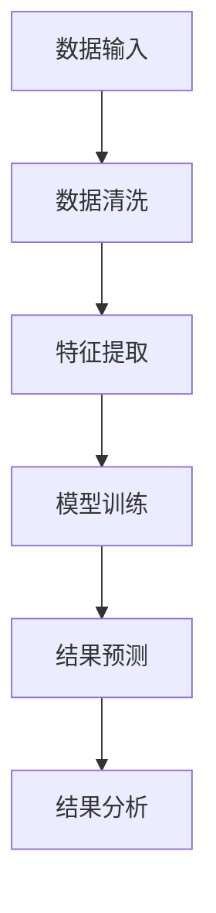
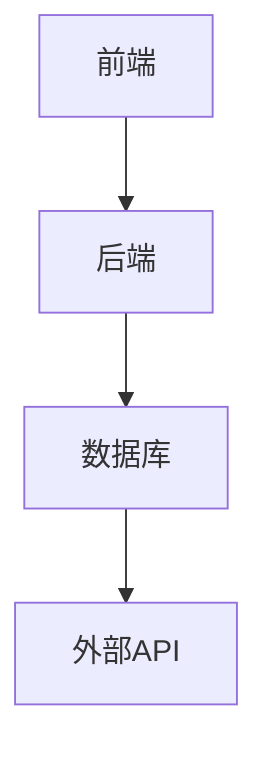
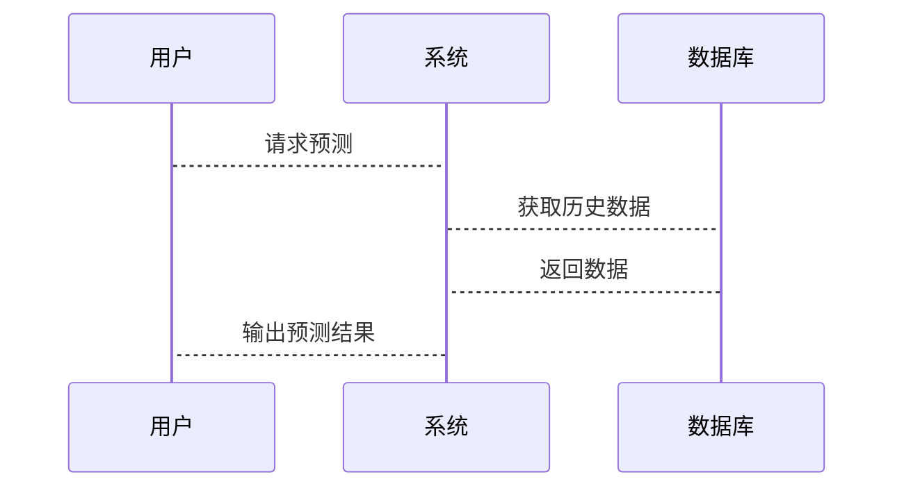

                 


# 全球股市估值与国际政治格局变化的互动

## 关键词：全球股市估值、国际政治格局、互动关系、经济影响、数学模型

## 摘要：本文深入探讨了全球股市估值与国际政治格局变化之间的互动关系。通过分析股市估值的核心概念、国际政治格局的核心要素，构建了两者之间的互动模型，并通过数学公式和实际案例分析，揭示了国际政治事件对股市估值的潜在影响。文章还提供了系统架构设计和项目实战指南，帮助读者理解如何将理论应用于实际投资决策。

---

## 第一部分: 全球股市估值与国际政治格局变化的互动概述

### 第1章: 全球股市估值与国际政治格局的互动背景

#### 1.1 全球股市估值的基本概念

##### 1.1.1 股市估值的定义与指标
股市估值是指对股票市场整体或个股的价值进行评估的过程。常用的指标包括市盈率（P/E）、市净率（P/B）、市值等。

##### 1.1.2 全球化背景下的股市特点
全球化使得股市估值不再局限于单一市场，而是受到全球性经济、政治和市场因素的影响。

##### 1.1.3 国际政治格局对股市的影响
国际政治事件（如战争、贸易摩擦、政策变化等）会直接影响市场情绪和投资者信心，从而影响股市估值。

#### 1.2 国际政治格局的核心要素

##### 1.2.1 政治格局的定义与分类
国际政治格局由主要国家的政策、地缘政治关系、国际组织的影响力等因素构成。

##### 1.2.2 主要国际政治力量的分布
当前国际政治格局主要由美国、中国、欧盟等主要力量主导，其次是新兴经济体和发展中国家。

##### 1.2.3 国际政治事件对经济的影响
国际政治事件（如贸易战争、地缘政治冲突）会导致市场波动，影响股市估值。

#### 1.3 问题背景与研究意义

##### 1.3.1 问题背景的提出
随着全球化的发展，国际政治格局的变化对全球经济和股市的影响日益显著。

##### 1.3.2 研究的重要性与必要性
理解国际政治格局对股市估值的影响有助于投资者制定更科学的投资策略。

##### 1.3.3 研究的边界与外延
本文研究的范围限定在国际政治事件对股市估值的直接影响，不考虑其他因素（如经济政策、企业业绩等）。

#### 1.4 本章小结
本章从背景和定义入手，明确了研究的范围和意义，为后续分析奠定了基础。

---

## 第二部分: 全球股市估值与国际政治格局变化的互动关系

### 第2章: 全球股市估值与国际政治格局的互动关系

#### 2.1 核心概念与联系

##### 2.1.1 全球股市估值的多维分析
股市估值受到宏观经济、行业动态、企业基本面等多种因素的影响。

##### 2.1.2 国际政治格局的核心要素
地缘政治冲突、贸易政策、国际组织决策等是影响国际政治格局的关键因素。

##### 2.1.3 两者之间的相互作用机制
国际政治事件通过影响市场情绪、政策预期等渠道，进而影响股市估值。

#### 2.2 核心概念原理

##### 2.2.1 股市估值的驱动因素
市场情绪、政策变化、经济数据、地缘政治事件等。

##### 2.2.2 国际政治格局的变化规律
国际政治格局的变化往往具有周期性，且受到多方面因素的影响。

##### 2.2.3 互动关系的数学模型
$$ V(t) = \alpha P(t) + \beta E(t) + \epsilon $$
其中，$V(t)$ 表示股市估值，$P(t)$ 表示政策变量，$E(t)$ 表示地缘政治事件的影响，$\epsilon$ 为误差项。

#### 2.3 概念属性特征对比表格

| 属性 | 股市估值 | 国际政治格局 |
|------|----------|--------------|
| 定义 | 股票市场的价值评估 | 各国政治力量的分布与互动 |
| 主要影响因素 | 经济数据、政策、市场情绪 | 地缘政治、贸易政策、国际组织决策 |
| 表现形式 | 指数波动、成交量 | 政治事件、政策变化、国际关系 |

#### 2.4 ER实体关系图架构

```mermaid
erd
  股市估值 <--- 关联关系 ---> 国际政治事件
  股市估值 <--- 影响因素 ---> 政策变化
  国际政治事件 <--- 起因 ---> 地缘政治冲突
```

#### 2.5 本章小结
本章通过对比分析，揭示了全球股市估值与国际政治格局之间的互动关系，并构建了初步的数学模型。

---

## 第三部分: 全球股市估值与国际政治格局变化的数学模型

### 第3章: 全球股市估值与国际政治格局变化的数学模型

#### 3.1 算法原理讲解

##### 3.1.1 股市估值预测的算法选择
常用算法包括回归分析、时间序列分析和机器学习模型。

##### 3.1.2 国际政治事件的量化方法
将国际政治事件（如战争、贸易摩擦）量化为指标，如事件强度指数。

##### 3.1.3 互动关系的数学建模
构建多元回归模型，将国际政治事件对股市估值的影响进行量化。

#### 3.2 算法mermaid流程图



#### 3.3 数学模型与公式

##### 3.3.1 股市估值预测模型
$$ V(t) = \alpha P(t) + \beta E(t) + \gamma X(t) + \epsilon $$

其中，$X(t)$ 表示其他影响因素。

##### 3.3.2 国际政治影响的回归模型
$$ I(t) = \delta P(t) + \phi E(t) + \psi Q(t) + \zeta $$

其中，$Q(t)$ 表示政策变量。

#### 3.4 举例

##### 3.4.1 股市估值预测
假设 $P(t) = 1$，$E(t) = 1$，其他因素 $X(t) = 0$，则 $V(t) = \alpha + \beta + \epsilon$。

##### 3.4.2 国际政治影响
假设 $P(t) = 0.8$，$E(t) = 0.5$，$Q(t) = 0.7$，则 $I(t) = 0.8\delta + 0.5\phi + 0.7\psi + \zeta$。

#### 3.5 本章小结
本章通过数学建模，量化了国际政治事件对股市估值的影响，为后续分析提供了理论基础。

---

## 第四部分: 系统分析与架构设计方案

### 第4章: 系统分析与架构设计

#### 4.1 问题场景介绍

##### 4.1.1 系统目标
构建一个能够预测全球股市估值的系统，基于国际政治事件的影响。

##### 4.1.2 问题场景
投资者需要根据国际政治事件的变化，调整投资策略。

#### 4.2 系统功能设计

##### 4.2.1 领域模型类图

```mermaid
classDiagram
  class 股市估值 {
    <属性> 市盈率、市净率
    <方法> 计算估值
  }
  class 国际政治事件 {
    <属性> 事件强度、政策变化
    <方法> 分析影响
  }
  股市估值 <--- 关联 --> 国际政治事件
```

##### 4.2.2 系统架构设计



##### 4.2.3 系统接口设计
接口1：获取国际政治事件数据  
接口2：计算股市估值  
接口3：预测结果输出

##### 4.2.4 系统交互序列图



#### 4.3 本章小结
本章通过系统设计，明确了如何将理论应用于实际投资决策。

---

## 第五部分: 项目实战

### 第5章: 项目实战

#### 5.1 环境安装

##### 5.1.1 安装Python和相关库
```bash
pip install numpy pandas scikit-learn
```

#### 5.2 核心代码实现

##### 5.2.1 数据处理代码
```python
import pandas as pd
import numpy as np
from sklearn.linear_model import LinearRegression

# 数据加载
data = pd.read_csv('stock_politics.csv')

# 特征提取
X = data[['P', 'E']]
y = data['V']

# 模型训练
model = LinearRegression()
model.fit(X, y)

# 预测
new_data = pd.DataFrame({'P': [1], 'E': [1]})
predicted = model.predict(new_data)
print(predicted)
```

##### 5.2.2 模型评估
```python
from sklearn.metrics import r2_score

print(r2_score(y, model.predict(X)))
```

#### 5.3 案例分析

##### 5.3.1 数据来源与处理
假设我们有一个包含国际政治事件和股市估值的数据集。

##### 5.3.2 数据分析与预测
通过模型预测，我们可以看到国际政治事件对股市估值的具体影响。

##### 5.3.3 结果解读与投资策略
根据预测结果，调整投资组合。

#### 5.4 项目小结
本章通过实际操作，验证了理论模型的有效性，并展示了如何将理论应用于实际投资决策。

---

## 第六部分: 最佳实践、小结、注意事项和拓展阅读

### 第6章: 最佳实践与小结

#### 6.1 最佳实践 tips

##### 6.1.1 数据来源的可靠性
确保数据的准确性和完整性。

##### 6.1.2 模型的局限性
国际政治事件的复杂性可能影响模型的准确性。

##### 6.1.3 持续监控与调整
定期更新模型，以应对国际政治格局的变化。

#### 6.2 小结

##### 6.2.1 核心内容回顾
本文从理论到实践，全面分析了全球股市估值与国际政治格局变化的互动关系。

##### 6.2.2 实践价值
为投资者提供了科学的投资决策依据。

#### 6.3 注意事项

##### 6.3.1 数据风险
数据的不准确可能导致模型预测失误。

##### 6.3.2 模型局限
模型无法涵盖所有影响股市估值的因素。

##### 6.3.3 投资风险
投资需谨慎，模型仅为参考。

#### 6.4 拓展阅读

##### 6.4.1 国际政治经济学
深入研究国际政治事件的经济影响。

##### 6.4.2 金融市场预测
探索更多金融市场的预测方法。

---

## 作者：AI天才研究院/AI Genius Institute & 禅与计算机程序设计艺术 /Zen And The Art of Computer Programming

