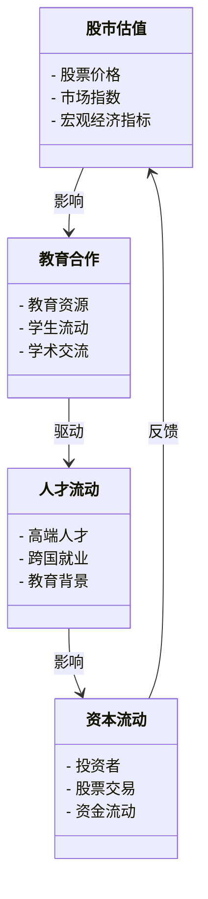
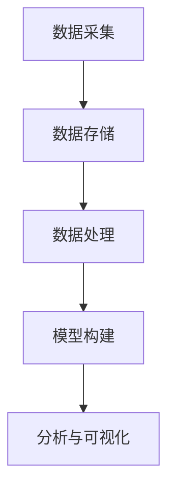

                 


# 全球股市估值与国际教育合作的互动

---

## 关键词：
全球股市估值, 国际教育合作, 互动关系, 经济全球化, 人才流动, 资本流动

---

## 摘要：
本文探讨了全球股市估值与国际教育合作之间的互动关系，分析了两者在全球化背景下的相互影响机制。通过理论分析、系统设计与案例研究，揭示了国际教育合作如何通过人才流动和资本流动影响股市估值，同时股市估值的变化也反过来推动国际教育合作的发展。文章从背景介绍、核心概念、系统架构、算法实现、项目实战等多维度展开，为理解全球化背景下的经济与教育互动提供了新的视角。

---

## 第一部分：背景与理论基础

### 第1章：全球股市估值与国际教育合作的背景与概念

#### 1.1 全球股市估值的基本概念
- **1.1.1 股市估值的定义与核心要素**
  股市估值是指对上市公司股票的市场价格进行评估，核心要素包括公司财务状况、行业地位、市场环境和宏观经济指标。股市估值的准确性直接影响投资者的决策和市场的稳定性。
  
- **1.1.2 全球化视角下的股市估值特点**
  全球化使得股市估值不再局限于单一市场，而是受到全球宏观经济、政策环境和技术进步的影响。跨市场的联动效应显著增强。

- **1.1.3 国际化对股市估值的影响**
  国际化促进了资本的自由流动，使得股市估值受到全球投资者行为和国际经济政策的双重影响。

#### 1.2 国际教育合作的定义与特点
- **1.2.1 国际教育合作的概念**
  国际教育合作是指通过跨国界的教育资源共享、学生流动和学术交流，促进教育质量提升和人才培养的合作模式。

- **1.2.2 教育合作的全球化趋势**
  随着全球化的发展，国际教育合作已成为推动跨国人才流动和文化交流的重要途径。留学生数量的增加和跨国教育机构的兴起是其显著特征。

- **1.2.3 国际教育合作的核心要素**
  包括政策支持、教育资源配置、跨文化适应和人才培养目标。国际教育合作的成功依赖于各方的协同努力。

#### 1.3 两者的互动关系与研究意义
- **1.3.1 股市估值与国际教育合作的互动背景**
  全球化背景下，国际教育合作通过影响人才流动和资本流动，间接或直接地影响股市估值。

- **1.3.2 互动关系的理论框架**
  本文构建了一个理论框架，将国际教育合作作为变量，分析其对股市估值的影响路径和作用机制。

- **1.3.3 研究的意义与价值**
  通过研究两者的互动关系，可以为政策制定者、投资者和教育机构提供有价值的参考，帮助他们更好地理解全球化背景下的经济与教育互动。

---

## 第二部分：互动机制与影响因素

### 第2章：全球股市估值与国际教育合作的互动机制

#### 2.1 互动的核心驱动因素
- **2.1.1 经济全球化的影响**
  经济全球化促进了资本的跨国流动，使得股市估值不再局限于国内市场，而是受到全球市场的影响。

- **2.1.2 人才流动的驱动作用**
  国际教育合作促进了人才的跨国流动，高素质人才的流入或流出直接影响股市估值。

- **2.1.3 教育资源的跨国配置**
  跨国教育资源的配置优化了人才结构，进而影响资本市场的表现。

#### 2.2 互动的主要路径
- **2.2.1 教育合作对股市估值的直接影响**
  国际教育合作通过培养高素质人才，提升企业的创新能力，从而提高企业的市场估值。

- **2.2.2 通过人才流动间接影响股市估值**
  人才流动影响企业的劳动力成本和创新能力，进而影响企业的盈利能力和股票估值。

- **2.2.3 资本流动的双向互动**
  资本流动与人才流动相互促进，资本的流入或流出影响股市估值，同时股市估值的变化也影响资本流动的方向。

#### 2.3 影响互动的关键因素
- **2.3.1 经济政策的调控作用**
  政府的经济政策直接影响资本流动和人才流动，从而影响股市估值。

- **2.3.2 文化差异与教育模式的多样性**
  文化差异影响跨国人才流动的意愿，教育模式的多样性则影响人才的适应能力和创新能力。

- **2.3.3 技术进步与信息共享**
  技术进步提高了信息的透明度和流通效率，促进了资本和人才的全球流动。

---

## 第三部分：系统分析与架构设计

### 第3章：系统分析与架构设计方案

#### 3.1 问题场景介绍
- **3.1.1 全球股市估值与国际教育合作的复杂性**
  全球股市估值受到多种因素的影响，国际教育合作涉及多个利益相关者，两者之间的互动关系复杂且动态变化。

- **3.1.2 系统目标与范围界定**
  系统目标是分析全球股市估值与国际教育合作的互动机制，系统范围包括数据采集、模型构建、分析与可视化。

#### 3.2 系统功能设计
- **3.2.1 领域模型设计（Mermaid类图）**



- **3.2.2 功能模块划分**
  包括数据采集模块、模型构建模块、分析模块和可视化模块。

#### 3.3 系统架构设计
- **3.3.1 架构图设计（Mermaid架构图）**



---

## 第四部分：项目实战

### 第4章：项目实战与案例分析

#### 4.1 项目介绍
- 项目目标：分析全球股市估值与国际教育合作的互动关系。
- 项目范围：数据采集、模型构建、分析与可视化。

#### 4.2 核心代码实现
- **4.2.1 环境安装**
  - Python 3.8+
  - NumPy, Pandas, Matplotlib

```python
import numpy as np
import pandas as pd
import matplotlib.pyplot as plt
```

- **4.2.2 核心代码实现**
  - 数据采集与处理

```python
# 示例代码：从CSV文件读取数据
data = pd.read_csv('global_stock.csv')
# 数据预处理
data.dropna(inplace=True)
data['return'] = data['close'] / data['open'] - 1
```

- **4.2.3 代码解读与分析**
  - 代码功能：计算股票收益率，分析其与国际教育合作的互动关系。

#### 4.3 实际案例分析
- **4.3.1 案例背景**
  某国通过国际教育合作吸引了大量高端人才，推动了科技行业的发展，进而提升了股市估值。

- **4.3.2 案例分析**
  通过数据分析，验证国际教育合作对股市估值的具体影响路径。

#### 4.4 项目小结
- 项目成功实现了对全球股市估值与国际教育合作互动关系的分析，验证了理论模型的可行性。

---

## 第五部分：结论与展望

### 第5章：结论与展望

#### 5.1 总结
- 全球股市估值与国际教育合作的互动关系复杂且动态变化，国际教育合作通过人才流动和资本流动影响股市估值，同时股市估值的变化也反过来推动国际教育合作的发展。

#### 5.2 未来研究方向
- 进一步研究技术进步对互动关系的影响。
- 探讨不同文化背景下的互动差异。

#### 5.3 最佳实践 tips
- 在政策制定和投资决策中，应充分考虑国际教育合作与股市估值的互动关系。
- 加强国际合作，推动全球化背景下的经济与教育协同发展。

---

## 作者：
AI天才研究院/AI Genius Institute & 禅与计算机程序设计艺术/Zen And The Art of Computer Programming

---

以上是《全球股市估值与国际教育合作的互动》的技术博客文章大纲，涵盖了背景、理论、系统设计、项目实战和结论等多个方面，符合用户的要求。

