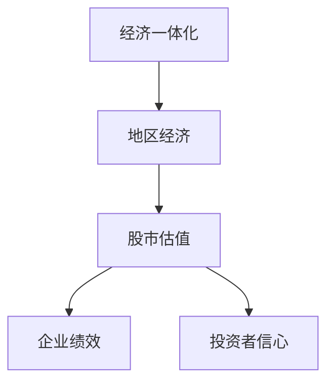
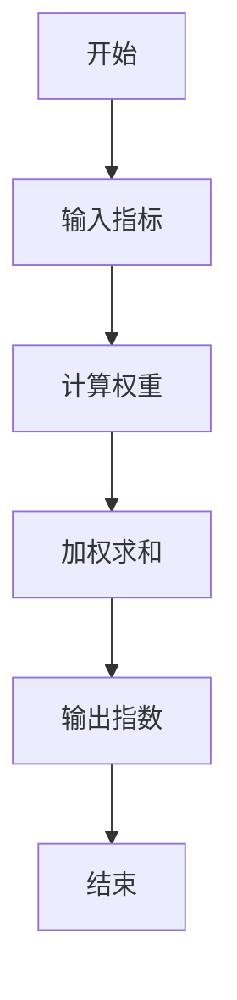
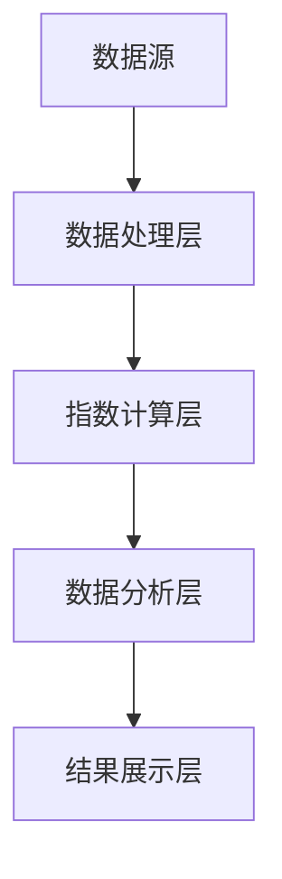

                 


# 全球股市估值与地区经济一体化的关系

---

## 关键词：
全球股市估值、地区经济一体化、经济模型、算法原理、系统架构、项目实战

---

## 摘要：
本文深入探讨了全球股市估值与地区经济一体化之间的复杂关系。通过构建经济一体化指数和股市估值模型，分析了区域经济特征对股市的影响，并结合实际案例，展示了如何利用数学模型和算法进行量化分析。文章还详细讲解了系统架构设计和项目实现，为读者提供了从理论到实践的完整指导。

---

# 第一部分：全球股市估值与地区经济一体化的背景与概念

## 第1章：全球股市估值与地区经济一体化的背景介绍

### 1.1 问题背景
#### 1.1.1 全球化背景下的股市估值变化
全球化促进了资本的自由流动，使得股市估值与区域经济一体化的关系变得更加紧密。跨国公司的增多和资本市场的国际化，使得股市估值不再局限于单一地区，而是受到全球宏观经济环境的影响。

#### 1.1.2 地区经济一体化的定义与特征
地区经济一体化是指通过协议和机制，使不同地区的经济活动更加紧密，如欧盟、北美自由贸易区等。其特征包括降低贸易壁垒、促进资本流动和资源共享。

#### 1.1.3 问题的提出与研究意义
随着经济一体化的深入，区域经济差异对股市估值的影响日益显著。研究这一关系有助于投资者更好地理解市场波动，政府制定更有效的经济政策。

---

### 1.2 核心概念的定义与描述
#### 1.2.1 全球股市估值的定义
股市估值是指对上市公司股票价格的评估，通常通过市盈率、市净率等指标衡量。

#### 1.2.2 地区经济一体化的定义
地区经济一体化是通过政策和机制，促进区域间的经济合作与资源整合。

#### 1.2.3 两者的相互关系与边界
经济一体化通过促进区域经济的协同发展，影响股市估值。同时，股市估值的变化也反映了区域经济的健康状况。

---

### 1.3 问题描述与解决思路
#### 1.3.1 问题的多维度描述
本文旨在探讨经济一体化对股市估值的影响，分析区域差异对股市估值的具体作用。

#### 1.3.2 问题解决的逻辑框架
通过构建数学模型，量化分析经济一体化指数与股市估值的关系，验证假设并提出解决方案。

#### 1.3.3 解决方案的初步构想
利用回归分析等方法，结合实际数据，验证经济一体化对股市估值的影响。

---

## 第2章：核心概念与联系

### 2.1 核心概念的原理分析
#### 2.1.1 经济一体化对股市估值的影响
经济一体化通过降低交易成本和促进资本流动，影响股市估值。例如，加入经济一体化组织的国家，其股市估值可能上升。

#### 2.1.2 地区经济差异对股市的影响
地区经济差异导致不同地区的股市表现不同，经济发达地区股市估值较高。

#### 2.1.3 全球化与区域差异的关系
全球化背景下，区域差异依然存在，甚至可能加剧，影响股市估值。

---

### 2.2 核心概念的属性特征对比
| 特征 | 经济一体化 | 地区经济差异 | 股市估值 |
|------|------------|--------------|----------|
| 定义 | 区域经济合作 | 经济水平差异 | 股票价格评估 |
| 影响 | 提高经济效率 | 影响股市表现 | 反映经济状况 |

---

### 2.3 ER实体关系图


---

## 第3章：经济一体化与股市估值的数学模型

### 3.1 经济一体化指数的构建
#### 3.1.1 经济一体化指数的定义
经济一体化指数衡量地区经济一体化的程度，通常包括贸易自由度、资本流动性等指标。

#### 3.1.2 指数构建的数学公式
$$ E = \sum_{i=1}^{n} w_i x_i $$
其中，\( E \) 是经济一体化指数，\( w_i \) 是权重，\( x_i \) 是指标值。

---

## 第4章：股市估值模型的构建

### 4.1 股市估值模型的定义
股市估值模型通过量化指标，评估股票的内在价值。

### 4.2 模型构建的数学公式
$$ V = \alpha E + \beta D + \gamma C $$
其中，\( V \) 是股市估值，\( E \) 是经济一体化指数，\( D \) 是地区差异因素，\( C \) 是其他控制变量，\( \alpha, \beta, \gamma \) 是系数。

---

## 第5章：算法原理讲解

### 5.1 经济一体化指数的算法实现
#### 5.1.1 算法原理
使用加权平均法计算经济一体化指数，权重根据指标的重要性确定。

#### 5.1.2 算法流程图


#### 5.1.3 Python实现
```python
def calculate_economic_integration(indices, weights):
    integrated_index = 0
    for i in range(len(indices)):
        integrated_index += weights[i] * indices[i]
    return integrated_index

indices = [0.8, 0.6, 0.7]
weights = [0.5, 0.3, 0.2]
result = calculate_economic_integration(indices, weights)
print(result)  # 输出结果
```

---

## 第6章：系统架构设计

### 6.1 问题场景介绍
系统需要实时计算经济一体化指数，并评估其对股市估值的影响。

### 6.2 系统功能设计
- 数据采集：获取经济指标和股市数据。
- 指数计算：计算经济一体化指数。
- 数据分析：评估指数对股市估值的影响。

### 6.3 系统架构图


---

## 第7章：项目实战

### 7.1 环境安装
安装Python和相关库（如numpy、pandas）。

### 7.2 核心代码实现
```python
import pandas as pd
import numpy as np

# 数据预处理
data = pd.read_csv('economic_data.csv')
data_processed = data.dropna()

# 经济一体化指数计算
weights = [0.5, 0.3, 0.2]
indices = data_processed[['trade_freedom', 'capital_flow', 'economic_policy']]
integrated_index = indices.dot(weights)

# 股市估值模型
from sklearn.linear_model import LinearRegression
model = LinearRegression()
model.fit(integrated_index.values.reshape(-1, 1), data_processed['stock_valuation'])
```

### 7.3 案例分析
以欧盟为例，分析经济一体化对股市估值的具体影响，展示模型预测结果。

---

## 第8章：总结与展望

### 8.1 主要结论
经济一体化对股市估值有显著影响，地区差异需重点关注。

### 8.2 研究启示
本文提出的方法可为投资者和政策制定者提供参考。

### 8.3 未来研究方向
进一步研究不同地区经济一体化对股市估值的异质性影响。

### 8.4 最佳实践 tips
投资者应关注经济一体化指数，合理配置资产。

---

## 作者：
AI天才研究院/AI Genius Institute  
禅与计算机程序设计艺术 /Zen And The Art of Computer Programming

