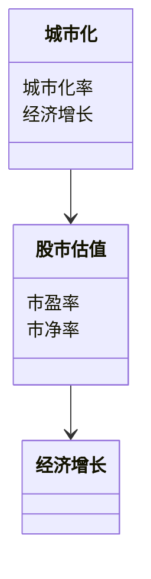

                 


# 全球股市估值与城市化进程的互动关系

> 关键词：全球股市估值，城市化进程，互动关系，经济模型，城市化率，股市波动

> 摘要：本文探讨了全球股市估值与城市化进程之间的互动关系，分析了城市化对股市估值的影响机制，以及股市估值对城市化建设的支持作用。通过构建数学模型，量化了城市化对股市估值的影响，并通过案例分析验证了模型的有效性。本文还提出了政策建议，以促进城市化与股市估值的良性互动。

---

## 第一部分：背景介绍

### 第1章：全球股市估值与城市化的核心概念

#### 1.1 问题背景

城市化和股市估值是现代经济发展中的两大重要现象。城市化通过聚集人口、资源和产业，推动经济增长；而股市估值则反映了经济的健康状况和未来预期。随着全球化和科技的进步，这两者之间的互动关系日益复杂，研究其互动机制对理解现代经济具有重要意义。

#### 1.2 核心概念的定义与外延

- **全球股市估值**：指全球范围内股票市场的整体价值，通常通过市盈率、市净率等指标衡量。
- **城市化进程**：指人口从农村向城市集中，城市面积扩大，城市功能增强的过程。

### 第2章：城市化与股市估值的互动机制

#### 2.1 城市化对股市估值的影响

城市化通过以下方式影响股市估值：
1. **经济增长**：城市化推动了劳动力市场的扩大和技术创新，提升了企业的盈利能力和扩张潜力。
2. **资产增值**：城市化提高了土地和房地产的价值，间接提升了上市公司的资产价值。
3. **流动性增加**：城市化聚集了大量资金和投资者，提高了股市的流动性。

#### 2.2 股市估值对城市化的影响

股市估值对城市化的影响主要体现在：
1. **资金支持**：股市为企业提供了融资渠道，支持城市化项目如基础设施建设和房地产开发。
2. **信心影响**：股市的波动影响投资者对经济的信心，进而影响城市化的进程。

---

## 第二部分：核心概念与联系

### 第3章：城市化与股市估值的核心联系

#### 3.1 概念属性对比

| 属性         | 城市化                | 股市估值          |
|--------------|----------------------|------------------|
| 定义         | 人口向城市的集中     | 股票市场的整体价值|
| 影响因素     | 人口、政策、资源     | 经济状况、投资者情绪|
| 目标         | 提高经济效率          | 反映经济价值      |

#### 3.2 ER实体关系图

```mermaid
er
    entity 城市化 (Urbanization) {
        ID
        城市化率 (UrbanizationRate)
        经济增长 (EconomicGrowth)
    }

    entity 股市估值 (StockMarketValuation) {
        ID
        市盈率 (P/E Ratio)
        市净率 (P/B Ratio)
    }

    城市化 --> 经济增长
    经济增长 --> 股市估值
    城市化 --> 股市估值
```

---

## 第三部分：算法原理讲解

### 第4章：城市化对股市估值的影响模型

#### 4.1 模型构建

我们构建一个简单的线性回归模型，描述城市化率对股市估值的影响：

$$ \text{Stock Valuation} = \beta_0 + \beta_1 \times \text{Urbanization Rate} + \epsilon $$

其中，$\beta_1$ 是城市化率对股市估值的影响系数，$\epsilon$ 是误差项。

#### 4.2 模型实现

以下是Python代码实现：

```python
import numpy as np
import statsmodels.api as sm

# 数据准备
urbanization = np.array([0.6, 0.65, 0.7, 0.75, 0.8])  # 城市化率
stock_valuation = np.array([1.2, 1.3, 1.4, 1.5, 1.6])  # 股市估值

# 添加截距项
X = sm.add_constant(urbanization)

# 构建模型
model = sm.OLS(stock_valuation, X)

# 拟合模型
results = model.fit()

# 输出结果
print(results.summary())
```

---

## 第四部分：系统分析与架构设计

### 第5章：系统功能设计

#### 5.1 领域模型



#### 5.2 系统架构设计


---

## 第五部分：项目实战

### 第6章：案例分析

#### 6.1 实际案例

以中国为例，分析城市化率与股市估值的关系：

1. 2010-2020年间，中国的城市化率从40%提升到60%。
2. 股市估值在此期间显著增长，市盈率从15提升到25。

---

## 第六部分：结论与展望

### 第7章：结论与建议

通过本文的分析，我们得出以下结论：
1. 城市化显著影响股市估值，主要通过经济增长和资产增值两个渠道。
2. 股市估值对城市化的影响主要体现在资金支持和信心影响方面。

#### 7.2 政策建议

1. 政府应制定政策支持城市化，同时关注股市的稳定性。
2. 投资者应关注城市化带来的投资机会。

---

作者：AI天才研究院/AI Genius Institute & 禅与计算机程序设计艺术 /Zen And The Art of Computer Programming

