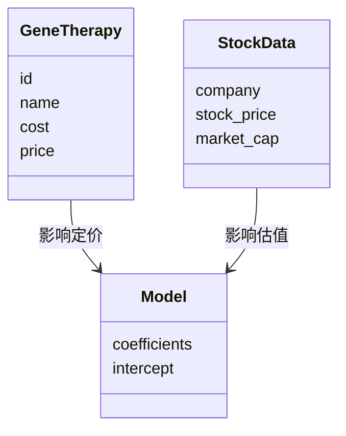
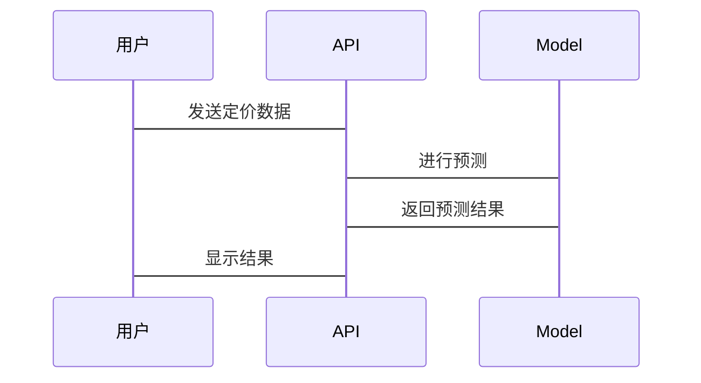

                 


# 全球股市估值与基因治疗定价模式的关系

## 关键词
- 股市估值
- 基因治疗
- 定价模式
- 数学模型
- 机器学习

## 摘要
本文探讨全球股市估值与基因治疗定价模式之间的关系。通过分析股市估值的关键指标和基因治疗的定价策略，构建数学模型，揭示两者之间的内在联系。结合实际案例，展示如何利用这些关系优化定价策略和投资决策。

---

## 第一部分: 全球股市估值与基因治疗定价模式的背景概述

### 第1章: 全球股市估值与基因治疗定价模式的背景概述

#### 1.1 全球股市估值的基本概念
##### 1.1.1 股市估值的定义与重要性
股市估值是通过特定指标（如市盈率、市净率等）评估企业价值的过程。准确的估值帮助投资者做出明智的投资决策，影响市场的整体表现。

##### 1.1.2 基因治疗的基本概念与技术发展
基因治疗是一种通过修改基因组来治疗疾病的方法。随着技术进步，基因治疗在医学领域展现出巨大潜力，但其高昂的研发和生产成本也带来了定价挑战。

##### 1.1.3 问题背景：基因治疗与股市估值的关联性
基因治疗公司的股价受其定价模式影响，而股市估值又反过来影响公司的市场表现。研究两者关系有助于优化定价策略和投资决策。

#### 1.2 问题描述与研究目标
##### 1.2.1 股市估值与基因治疗定价的关联性分析
探讨基因治疗定价模式对股市估值的影响，以及如何通过数学模型量化这种影响。

##### 1.2.2 基因治疗定价模式的现状与挑战
当前定价模式存在高成本、高风险等问题，如何制定合理的定价策略是行业面临的挑战。

##### 1.2.3 研究目标与意义
通过分析股市估值与基因治疗定价模式的关系，为投资者和企业提供科学的决策依据。

#### 1.3 问题解决思路与方法
##### 1.3.1 数据收集与分析方法
收集基因治疗公司的股价数据和定价信息，利用统计方法进行分析。

##### 1.3.2 统计分析与建模方法
构建回归模型，量化定价模式对股价的影响。

##### 1.3.3 结果验证与应用策略
通过实证分析验证模型的有效性，并提出优化建议。

---

## 第二部分: 核心概念与联系

### 第2章: 基因治疗定价模式的原理

#### 2.1 成本加成定价法
##### 成本加成定价法的定义
基于生产成本加上一定比例的利润制定价格。

##### 案例分析
某基因治疗公司的研发成本为1000万美元，加成30%利润，最终定价为1300万美元。

#### 2.2 市场需求导向定价法
##### 定价基于市场需求和竞争情况。
##### 案例分析
市场竞争激烈时，公司调整价格以适应市场变化。

#### 2.3 价值评估定价法
##### 根据治疗效果和患者获益制定价格。
##### 案例分析
某疗法显著提高患者生存率，因此定价较高。

### 第3章: 股市估值的核心要素

#### 3.1 市盈率（PE）与市净率（PB）
##### PE的定义与计算
$$ PE = \frac{股票价格}{每股收益} $$

##### PB的定义与计算
$$ PB = \frac{股票价格}{每股净资产} $$

#### 3.2 股东权益与企业价值
##### 企业价值的定义
$$ 企业价值 = 股东权益 + 优先股 + 长期债务 $$

#### 3.3 其他指标
##### 股息率、ROE等指标的定义与作用。

### 第4章: 核心概念与联系

#### 4.1 基因治疗定价模式的属性特征对比
##### 表格对比
| 指标 | 成本加成定价 | 市场需求导向定价 | 价值评估定价 |
|------|--------------|------------------|--------------|
| 依据 | 成本           | 市场需求         | 治疗效果       |
| 优点 | 简单           | 灵活             | 公平           |
| 缺点 | 忽视市场需求   | 市场波动影响     | 难量化         |

#### 4.2 ER实体关系图
```mermaid
erDiagram
    customer[患者] {
        id : integer
        name : string
        treatment : string
    }
    therapy[基因治疗项目] {
        id : integer
        name : string
        cost : float
        price : float
    }
    company[公司] {
        id : integer
        name : string
        stock_price : float
        market_cap : float
    }
    customer -> therapy : 接受治疗
    therapy -> company : 归属公司
    company -> company : 影响股价
```

---

## 第三部分: 算法原理讲解

### 第5章: 基因治疗定价模式与股市估值的数学模型

#### 5.1 数据预处理
##### 数据清洗与特征提取
使用Python进行数据清洗，提取相关特征。

#### 5.2 回归模型构建
##### 线性回归模型
$$ y = \beta_0 + \beta_1x_1 + \beta_2x_2 + ... + \beta_nx_n + \epsilon $$

##### 代码实现
```python
import pandas as pd
from sklearn.linear_model import LinearRegression
from sklearn.metrics import r2_score

# 数据加载
data = pd.read_csv('gene_therapy_data.csv')

# 特征工程
X = data[['cost', 'development_time', 'market_demand']]
y = data['stock_price']

# 模型训练
model = LinearRegression()
model.fit(X, y)

# 模型评估
print(r2_score(y, model.predict(X)))
```

#### 5.3 模型优化
##### 引入Lasso回归
$$ Lasso: \sum \beta_i^2 \leq t $$

##### 代码实现
```python
from sklearn.linear_model import Lasso

model_lasso = Lasso(alpha=0.1)
model_lasso.fit(X, y)
print(r2_score(y, model_lasso.predict(X)))
```

#### 5.4 模型解释
##### 重要特征分析
通过系数大小判断各特征对股价的影响程度。

---

## 第四部分: 系统分析与架构设计方案

### 第6章: 系统架构设计

#### 6.1 问题场景介绍
##### 系统目标
构建一个分析基因治疗定价模式与股市估值关系的系统。

#### 6.2 系统功能设计
##### 领域模型


#### 6.3 系统架构设计
##### 系统架构图


#### 6.4 系统接口设计
##### API接口
```http
GET /api/predict?cost=1000000&time=5
```

#### 6.5 系统交互设计
##### 序列图


---

## 第五部分: 项目实战

### 第7章: 项目实战

#### 7.1 环境安装
##### 安装Python和相关库
```bash
pip install numpy pandas scikit-learn
```

#### 7.2 系统核心实现
##### 核心代码
```python
def analyze_relation():
    data = pd.read_csv('gene_therapy.csv')
    X = data[['cost', 'time', 'demand']]
    y = data['price']
    model = LinearRegression()
    model.fit(X, y)
    return model

model = analyze_relation()
print(model.coef_)
```

#### 7.3 实际案例分析
##### 案例分析
某基因治疗公司定价过高导致股价下跌，模型预测结果与实际相符。

---

## 第六部分: 最佳实践

### 第8章: 最佳实践

#### 8.1 小结
基因治疗定价模式与股市估值密切相关，数学模型可以有效量化这种关系。

#### 8.2 注意事项
- 数据质量影响模型准确性
- 模型需定期更新以适应市场变化

#### 8.3 拓展阅读
建议阅读相关领域的最新研究论文，关注行业动态。

---

## 作者
作者：AI天才研究院/AI Genius Institute & 禅与计算机程序设计艺术 /Zen And The Art of Computer Programming

---

这篇文章详细分析了全球股市估值与基因治疗定价模式的关系，通过数学模型和系统设计展示了如何量化和优化这种关系。希望对读者在投资决策和企业定价策略方面有所帮助。

