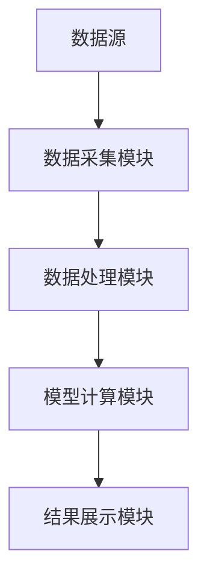

                 


# 全球股市估值与基因治疗定价模式的经济影响

> 关键词：全球股市估值，基因治疗定价，经济影响，数学模型，系统架构设计，案例分析

> 摘要：本文系统性地探讨了全球股市估值与基因治疗定价模式之间的经济影响，通过理论分析、模型构建、系统设计与案例研究，揭示了两者在经济体系中的互动关系。文章从背景介绍、核心概念、算法原理、系统架构设计、项目实战等多个维度展开，旨在为读者提供一个全面而深入的分析框架。

---

## 第1章: 背景介绍

### 1.1 股市估值与基因治疗定价模式的背景

#### 1.1.1 股市估值的定义与重要性
股市估值是指对上市公司股票价格进行合理评估的过程，通常基于财务指标（如PE、PB、ROE）和市场情绪等因素。股市估值是投资者决策的重要依据，也是企业价值的晴雨表。

#### 1.1.2 基因治疗的定义与技术发展
基因治疗是一种通过修改基因组来治疗疾病的技术，近年来随着CRISPR等技术的突破，基因治疗在癌症、遗传病等领域取得了显著进展。

#### 1.1.3 两者的经济影响与关联性
股市估值与基因治疗定价模式的经济影响主要体现在投资回报、市场波动和产业政策等方面。基因治疗的高研发成本和不确定性使得其定价模式对股市估值产生直接影响。

---

### 1.2 问题背景与描述

#### 1.2.1 股市估值的复杂性
股市估值受多种因素影响，包括宏观经济环境、行业趋势和公司基本面等。如何在复杂环境中准确估值是投资者面临的挑战。

#### 1.2.2 基因治疗定价的挑战
基因治疗的高研发成本和不确定性使得其定价模式复杂，需平衡患者可及性和企业收益。

#### 1.2.3 两者经济影响的交叉点
基因治疗的市场表现直接影响相关企业的股市估值，而股市估值的变化又会影响基因治疗的研发投入和市场推广。

---

### 1.3 问题解决与边界

#### 1.3.1 股市估值与基因治疗定价的解决方法
通过构建数学模型，结合基因治疗的经济特征，优化股市估值方法。

#### 1.3.2 问题的边界与外延
本文研究聚焦于基因治疗的定价模式对股市估值的影响，不考虑其他因素（如宏观经济政策）。

#### 1.3.3 核心概念与要素组成
核心概念包括：股市估值模型、基因治疗定价模型、经济影响分析。

---

## 第2章: 核心概念与联系

### 2.1 核心概念原理

#### 2.1.1 股市估值的核心原理
基于基本面分析和市场情绪，通过PE、PB等指标评估企业价值。

#### 2.1.2 基因治疗定价的核心原理
基于成本加成、风险分担和患者可及性，基因治疗价格通常较高，但需考虑市场接受度。

#### 2.1.3 两者经济影响的联系
基因治疗的高定价可能提升相关企业的市值，但也可能引发市场对估值的质疑。

---

### 2.2 概念属性对比

#### 2.2.1 股市估值与基因治疗定价的属性对比

| 属性          | 股市估值                | 基因治疗定价              |
|---------------|-------------------------|---------------------------|
| 主要影响因素  | 财务指标、市场情绪       | 研发成本、市场需求、政策  |
| 评估周期      | 短期波动、长期趋势      | 长期定价模式               |
| 变化频率      | 高频波动               | 低频调整                  |

#### 2.2.2 经济影响的特征分析
股市估值的波动性与基因治疗定价的稳定性形成对比，但两者在长期趋势上存在互动关系。

#### 2.2.3 案例对比分析
通过具体案例（如某基因治疗企业的上市估值变化）分析两者关系。

---

### 2.3 ER实体关系图

#### 2.3.1 股市估值的ER图
```mermaid
er
actor 投资者
actor 企业
actor 市场监管机构
```

#### 2.3.2 基因治疗定价的ER图
```mermaid
er
actor 患者
actor 制药企业
actor 医疗机构
```

#### 2.3.3 经济影响的关联关系
```mermaid
er
actor 投资者 --|> 企业
actor 制药企业 --|> 基因治疗定价
actor 市场监管机构 --|> 股市估值
```

---

## 第3章: 算法原理与数学模型

### 3.1 算法原理

#### 3.1.1 股市估值算法
基于PE-LSTM模型，结合历史数据和市场情绪进行预测。

#### 3.1.2 基因治疗定价算法
基于成本加成和收益共享的定价策略。

#### 3.1.3 综合经济影响模型
结合股市估值和基因治疗定价的双重因素，构建综合模型。

---

### 3.2 数学模型与公式

#### 3.2.1 股市估值模型
$$ P = \text{PE} \times E $$
其中，P为股票价格，PE为市盈率，E为每股收益。

#### 3.2.2 基因治疗定价模型
$$ P = a \times Q + b $$
其中，P为价格，Q为治疗效果，a和b为参数。

#### 3.2.3 综合经济影响模型
$$ I = \alpha \times P_{\text{stock}} + \beta \times P_{\text{gene}} $$
其中，I为经济影响，α和β为权重系数。

---

### 3.3 实例分析

#### 3.3.1 股市估值实例
以某生物技术公司为例，使用PE-LSTM模型预测其股价走势。

#### 3.3.2 基因治疗定价实例
分析某基因治疗药物的定价策略及其对股市估值的影响。

#### 3.3.3 综合实例分析
通过案例分析，验证模型的有效性。

---

## 第4章: 系统分析与架构设计

### 4.1 系统分析

#### 4.1.1 问题场景介绍
构建一个基于基因治疗定价模式的股市估值系统。

#### 4.1.2 项目介绍
通过数据采集、模型构建和结果分析，实现对股市估值的优化。

#### 4.1.3 系统功能设计
包括数据采集模块、模型计算模块和结果展示模块。

---

### 4.2 系统架构设计

#### 4.2.1 系统架构图


#### 4.2.2 数据流图
```mermaid
dataflow
start --> A[数据源]
A --> B[数据采集模块]
B --> C[数据处理模块]
C --> D[模型计算模块]
D --> E[结果展示模块]
E --> end
```

#### 4.2.3 模块划分
- 数据采集模块：负责获取股市和基因治疗数据。
- 数据处理模块：对数据进行清洗和预处理。
- 模型计算模块：基于构建的模型进行估值和定价分析。
- 结果展示模块：将结果以可视化形式呈现。

---

### 4.3 接口与交互设计

#### 4.3.1 接口设计
- 数据接口：与数据源对接，获取实时数据。
- 模型接口：与其他系统模块交互，传递数据和计算结果。

#### 4.3.2 交互设计
```mermaid
sequence
投资者 -> 数据采集模块: 请求数据
数据采集模块 -> 数据处理模块: 传递数据
数据处理模块 -> 模型计算模块: 请求模型计算
模型计算模块 -> 结果展示模块: 返回结果
结果展示模块 -> 投资者: 展示结果
```

---

## 第5章: 项目实战

### 5.1 环境配置

#### 5.1.1 数据环境
安装Python、Pandas、TensorFlow等工具。

#### 5.1.2 开发环境
配置Jupyter Notebook和相关开发库。

---

### 5.2 核心实现

#### 5.2.1 数据收集
通过API获取相关股票数据和基因治疗数据。

#### 5.2.2 模型实现
编写Python代码实现PE-LSTM模型和基因治疗定价模型。

#### 5.2.3 结果分析
通过可视化工具展示模型预测结果和实际数据对比。

---

### 5.3 案例分析

#### 5.3.1 数据分析
以某基因治疗公司为例，分析其股价走势与基因治疗定价的关系。

#### 5.3.2 结果解读
解读模型预测结果，验证其对股市估值的影响。

---

## 第6章: 总结与展望

### 6.1 总结

#### 6.1.1 核心发现
基因治疗定价模式对股市估值具有显著影响，需结合经济模型和市场环境进行分析。

#### 6.1.2 研究意义
本文为投资者和企业管理者提供了新的分析框架。

---

### 6.2 展望

#### 6.2.1 未来研究方向
进一步优化模型，引入更多经济变量进行分析。

#### 6.2.2 实际应用建议
建议企业结合模型结果，优化定价策略和投资决策。

---

作者：AI天才研究院/AI Genius Institute & 禅与计算机程序设计艺术 /Zen And The Art of Computer Programming

