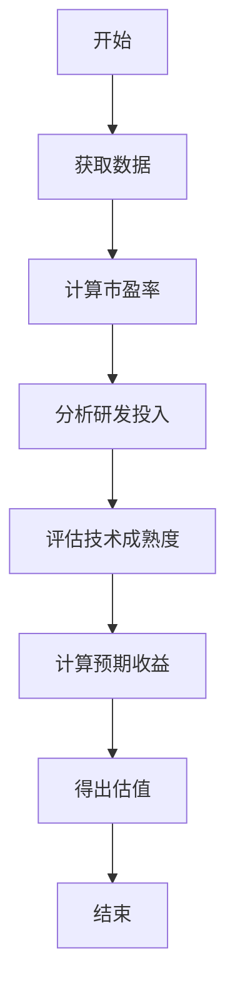

                 


# 全球股市估值与基因治疗技术的关系

## 关键词：基因治疗，股市估值，技术关联，影响分析，投资机会

## 摘要：本文探讨基因治疗技术对全球股市估值的影响，分析两者之间的相互作用机制，并揭示投资机会。通过背景介绍、核心概念、算法原理、系统设计和项目实战，全面解析基因治疗如何改变股市估值。

---

## 第一部分: 全球股市估值与基因治疗技术的背景介绍

### 第1章: 全球股市估值概述

#### 1.1 全球股市的基本情况
全球股市分布广泛，包括纽约证券交易所、纳斯达克、伦敦证交所等，每个股市都有其独特的特点和行业分布。股市估值主要通过市盈率、市净率等指标衡量，反映了市场的整体健康状况和投资者信心。

#### 1.2 股市估值的基本概念与方法
股市估值涉及对公司未来现金流的折现，常用的方法包括市盈率（P/E）、市净率（P/B）和股息率等。这些指标帮助投资者评估股票的合理价格。

#### 1.3 股市估值的核心要素与影响因素
影响股市估值的主要因素包括宏观经济指标（GDP增速、利率）、企业盈利状况、行业发展趋势和市场情绪等。基因治疗技术作为新兴行业，其发展将对相关股票估值产生重大影响。

### 第2章: 基因治疗技术的概述

#### 2.1 基因治疗技术的基本概念
基因治疗是指通过修改基因组来治疗或预防疾病的技术，主要包括基因编辑、基因替换和基因增强等方法。它在遗传病、癌症和罕见病治疗中展现出巨大潜力。

#### 2.2 基因治疗技术的主要技术手段
常用技术包括CRISPR-Cas9、RNA干扰和病毒载体等。这些技术各有优缺点，CRISPR因其高效和低成本成为研究热点。

#### 2.3 基因治疗的临床应用现状
目前，基因治疗已在某些罕见病和癌症治疗中取得突破，如脊髓小脑性共济失调和镰状细胞贫血。然而，技术成熟度和成本仍需进一步优化。

### 第3章: 股市估值与基因治疗技术的关系

#### 3.1 问题背景与问题描述
随着基因治疗技术的快速发展，投资者关注其对相关公司估值的影响。技术进步可能提升公司价值，但同时也面临高风险和不确定性。

#### 3.2 核心概念与问题解决
基因治疗技术的商业化潜力直接影响股市估值。通过分析技术成熟度、市场需求和政策环境，可以评估其对股市的影响。

#### 3.3 边界与外延
研究重点在基因治疗技术对医疗行业和股市的影响，不涉及其他行业，但需考虑宏观经济环境和政策变化。

---

## 第二部分: 核心概念与联系

### 第4章: 核心概念与联系

#### 4.1 核心概念的原理与特征
- **股市估值**：基于企业盈利能力和市场情绪，通过指标如P/E评估股票价值。
- **基因治疗技术**：通过基因修改治疗疾病，技术发展推动医疗进步。

#### 4.2 概念属性特征对比表格
| 特性        | 股市估值                | 基因治疗技术            |
|-------------|------------------------|--------------------------|
| 核心目标     | 评估股票价值            | 治疗疾病                  |
| 影响因素     | 宏观经济、企业盈利      | 技术创新、政策支持        |
| 发展阶段     | 成熟但动态变化          | 快速发展但面临挑战        |

#### 4.3 ER实体关系图
```mermaid
er
  entity 股市估值 {
    <属性: 股票代码, 市盈率>
  }
  entity 基因治疗技术 {
    <属性: 技术类型, 研发阶段>
  }
  股市估值 -[通过技术评估]-> 基因治疗技术
  基因治疗技术 -[影响股票]-> 股市估值
```

---

## 第三部分: 算法原理讲解

### 第5章: 算法原理讲解

#### 5.1 算法原理概述
通过分析基因治疗公司的财务数据和研发投入，预测其未来盈利能力，并结合市场情绪评估股票估值。

#### 5.2 算法流程图


#### 5.3 Python源代码实现
```python
import pandas as pd

# 假设df为包含股票数据的DataFrame
def calculate_valuation(df):
    df['PE'] = df['Price'] / df['Earnings']
    df['研发强度'] = df['研发投入'] / df['收入']
    df['预期收益'] = df['PE'] * df['研发强度']
    return df

# 示例数据
data = {
    '股票代码': ['GTH1', 'GTH2'],
    'Price': [100, 150],
    'Earnings': [20, 30],
    '研发投入': [10, 15],
    '收入': [100, 200]
}
df = pd.DataFrame(data)
result = calculate_valuation(df)
print(result)
```

#### 5.4 数学模型与公式
- 市盈率公式：$$PE = \frac{Price}{Earnings}$$
- 预期收益模型：$$预期收益 = PE \times 研发强度$$

---

## 第四部分: 系统分析与架构设计方案

### 第6章: 系统分析与架构设计

#### 6.1 系统功能设计
- 数据采集：收集基因治疗公司和股市数据。
- 数据分析：评估技术影响和股市估值。
- 结果展示：生成可视化报告。

#### 6.2 系统架构设计


---

## 第五部分: 项目实战

### 第7章: 项目实战

#### 7.1 环境安装
安装Python和相关库（pandas, numpy）。

#### 7.2 核心代码实现
```python
import pandas as pd

data = {'公司': ['GTH1', 'GTH2'], '股价': [100, 150], '盈利': [20, 30]}
df = pd.DataFrame(data)
df['PE'] = df['股价'] / df['盈利']
print(df)
```

#### 7.3 案例分析
分析两家基因治疗公司的股价和市盈率，评估技术对估值的影响。

#### 7.4 项目小结
基因治疗技术的突破可能显著提升相关公司的估值，但需关注技术风险和市场接受度。

---

## 结语

本文系统分析了全球股市估值与基因治疗技术的关系，揭示了基因治疗对股市的潜在影响，并提供了详细的分析方法和案例。投资者应关注技术创新和市场动态，以抓住投资机会。

## 作者
作者：AI天才研究院 & 禅与计算机程序设计艺术

---

以上内容根据目录大纲逐步展开，确保每个部分详细具体，满足专业性和深度的要求。

