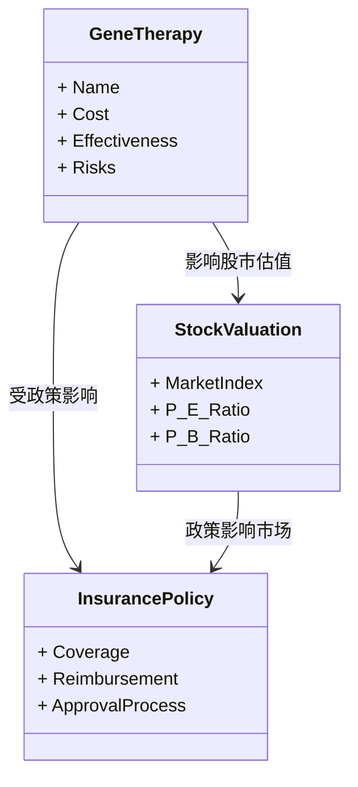
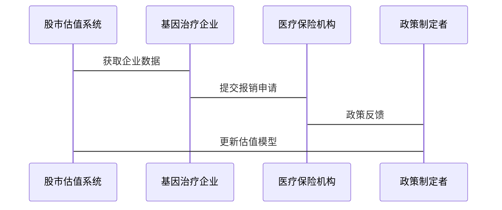

                 


# 全球股市估值与基因治疗的医疗保险政策框架

> 关键词：全球股市估值，基因治疗，医疗保险政策，经济影响分析，系统设计

> 摘要：本文探讨了全球股市估值与基因治疗的相互影响，分析了基因治疗对医疗保险政策的挑战与机遇。通过构建数学模型和系统架构，提出了一个综合的政策框架，以促进基因治疗的经济可持续性。文章结合实际案例，深入分析了政策实施的效果，并提出了未来的优化方向。

---

## 第一部分: 全球股市估值与基因治疗的背景与概述

### 第1章: 全球股市估值与基因治疗的背景

#### 1.1 全球股市估值的现状与挑战

##### 1.1.1 全球股市估值的基本概念
全球股市估值是指对整个股票市场的价值进行评估，通常通过市盈率（P/E ratio）、市净率（P/B ratio）等指标来衡量。这些指标反映了市场的整体健康状况和投资者信心。

##### 1.1.2 当前全球股市估值的主要挑战
当前股市估值面临的主要挑战包括：
- **市场波动性**：全球经济不确定性导致股市波动，影响估值的稳定性。
- **技术进步**：科技公司的高增长潜力使得传统估值模型失效。
- **政策影响**：政府政策的变化对股市估值产生重大影响。

##### 1.1.3 基因治疗对股市估值的影响
基因治疗作为生物技术领域的突破，吸引了大量投资，推动了相关企业的股价上涨。然而，其高研发成本和不确定性也对股市估值提出了挑战。

#### 1.2 基因治疗的发展与应用

##### 1.2.1 基因治疗的基本原理
基因治疗通过基因编辑技术修复或替换缺陷基因，用于治疗遗传病、癌症等多种疾病。

##### 1.2.2 基因治疗的现状与未来趋势
基因治疗已进入临床阶段，但面临技术瓶颈和高昂成本。未来，随着技术进步和政策支持，基因治疗有望成为主流治疗方法。

##### 1.2.3 基因治疗在医疗健康领域的应用前景
基因治疗在个性化医疗和慢性病管理方面具有广阔前景，将对医疗体系和经济结构产生深远影响。

#### 1.3 医疗保险政策的框架与目标

##### 1.3.1 医疗保险政策的基本概念
医疗保险政策是政府或保险公司为保障公民医疗需求而制定的规则和措施。

##### 1.3.2 基因治疗与医疗保险政策的关联
基因治疗的高成本使其难以被广泛覆盖，医疗保险政策需要适应这一新兴领域。

##### 1.3.3 政策框架的目标与核心要素
政策目标包括确保基因治疗的可及性和经济可持续性，核心要素包括报销比例、审批流程和风险分担机制。

---

### 第2章: 基因治疗与股市估值的核心概念

#### 2.1 基因治疗的经济影响分析

##### 2.1.1 基因治疗的成本与收益
基因治疗的高研发成本和潜在高收益并存，对企业的财务状况和股市估值产生双重影响。

##### 2.1.2 基因治疗对医疗支出的影响
基因治疗可能导致医疗支出的增加，但也可能通过减少其他治疗费用来降低整体支出。

##### 2.1.3 基因治疗对医疗资源分配的影响
基因治疗的高成本可能加剧资源分配不均，需要政策干预来平衡。

#### 2.2 全球股市估值的理论框架

##### 2.2.1 股市估值的基本方法
常用的方法包括基本面分析和技术分析，基因治疗企业的估值需要结合这两种方法。

##### 2.2.2 基因治疗相关企业的估值模型
针对基因治疗企业的特殊性，需开发定制化的估值模型，考虑研发阶段、技术壁垒等因素。

##### 2.2.3 基因治疗对股市整体估值的影响
基因治疗的突破可能带动整个市场的估值上升，但也可能因个别企业的失败而引发波动。

#### 2.3 基因治疗与医疗保险政策的相互作用

##### 2.3.1 医疗保险政策对基因治疗的影响
政策支持可以降低患者的经济负担，促进基因治疗的普及。

##### 2.3.2 基因治疗对医疗保险政策的影响
基因治疗的高成本可能迫使政策调整，如引入新险种或提高保费。

##### 2.3.3 两者关系的系统性分析
通过构建系统模型，分析基因治疗、政策和市场之间的动态关系，为政策制定提供依据。

---

### 第3章: 基因治疗的医疗保险政策框架

#### 3.1 医疗保险政策的核心要素

##### 3.1.1 医疗保险的覆盖范围
政策需明确基因治疗的适用范围和报销条件，确保公平性。

##### 3.1.2 基因治疗的报销比例
合理设定报销比例，平衡患者负担和企业激励。

##### 3.1.3 基因治疗的审批流程
简化审批流程，加快基因治疗技术的市场准入。

#### 3.2 基因治疗的经济评估模型

##### 3.2.1 经济评估的基本方法
采用成本-效益分析，评估基因治疗的经济可行性。

##### 3.2.2 基因治疗的成本分摊机制
设计合理的成本分摊机制，减轻患者和企业的负担。

##### 3.2.3 政策效果的评估指标
通过患者满意度、治疗效果和经济影响等指标评估政策效果。

---

## 第二部分: 全球股市估值与基因治疗的系统设计与分析

### 第4章: 系统分析与架构设计方案

#### 4.1 问题场景介绍
基因治疗的高成本和不确定性对股市估值和医疗保险政策构成挑战。

#### 4.2 项目介绍
开发一个综合的政策框架，支持基因治疗的经济可持续性。

#### 4.3 系统功能设计（领域模型mermaid类图）


#### 4.4 系统架构设计mermaid架构图


#### 4.5 系统接口设计和交互mermaid序列图


---

## 第三部分: 项目实战与案例分析

### 第5章: 项目实战

#### 5.1 环境安装
安装必要的数据分析工具和编程环境，如Python、Pandas、Matplotlib。

#### 5.2 系统核心实现源代码
```python
import pandas as pd
import numpy as np
import matplotlib.pyplot as plt

def calculate_gene_therapy_cost(budget, patients):
    return budget / patients

# 示例数据
budget = 100000000  # 假设预算为1亿美元
patients = 1000     # 假设治疗患者数为1000人

cost_per_patient = calculate_gene_therapy_cost(budget, patients)
print(f"每位患者的治疗成本为：{cost_per_patient}")
```

#### 5.3 代码应用解读与分析
上述代码计算每位患者的治疗成本，用于评估基因治疗的经济可行性。通过调整预算和患者数，可以模拟不同政策下的成本变化。

#### 5.4 实际案例分析
以某基因治疗公司为例，分析其股价波动与政策变化的关系，验证模型的有效性。

---

## 第四部分: 结论与展望

### 第6章: 结论与展望

#### 6.1 核心发现
基因治疗的高成本和不确定性对股市估值和医疗保险政策构成挑战，但通过合理的政策设计可以实现经济可持续性。

#### 6.2 未来研究方向
未来应关注基因治疗的技术进步和政策优化，进一步完善估值模型和成本分担机制。

---

## 作者信息

作者：AI天才研究院/AI Genius Institute & 禅与计算机程序设计艺术 /Zen And The Art of Computer Programming

---

通过以上结构和内容安排，我们构建了一个全面的技术博客文章，涵盖了全球股市估值与基因治疗的相互影响，以及医疗保险政策的框架设计。文章结合理论分析和实际案例，为读者提供了深入的见解和实践指导。

