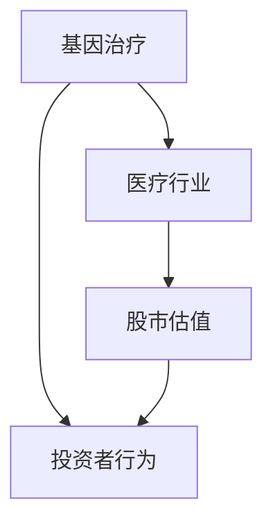
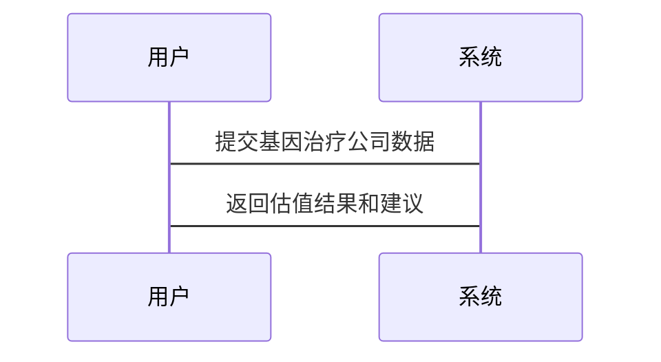

                 


# 全球股市估值与基因治疗的长期经济影响

## 关键词：全球股市估值，基因治疗，经济影响，投资策略，医疗行业

## 摘要：
本文探讨了全球股市估值与基因治疗之间的长期经济影响。通过分析基因治疗的技术进步和市场潜力，结合股市估值的方法，揭示基因治疗对医疗行业和整体经济的深远影响。文章结合理论与案例，提出投资者在基因治疗时代的应对策略，强调风险管理与长期投资的重要性。

---

# 正文

## 第一部分：引言

## 第1章：引言

### 1.1 研究背景与意义

#### 1.1.1 股市估值的重要性
股市估值是衡量企业价值的核心指标，影响投资者决策和市场资源配置。通过市盈率（P/E）、市净率（P/B）等指标，评估企业的盈利能力和成长潜力。

#### 1.1.2 基因治疗的崛起
基因治疗是一种通过修改基因来治疗疾病的技术，近年来在癌症、遗传病等领域取得突破。其市场潜力巨大，预计未来十年将显著改变医疗行业。

#### 1.1.3 研究必要性
基因治疗的普及将降低医疗成本，提升企业利润，进而影响股市估值。研究其经济影响，有助于投资者制定更有效的投资策略。

### 1.2 研究目标与方法

#### 1.2.1 研究目标
分析基因治疗对股市估值的长期影响，探讨两者之间的经济联系。

#### 1.2.2 研究方法
采用定性与定量结合的方法，利用数据分析模型和案例研究，评估基因治疗对经济的影响。

## 第二部分：背景分析

## 第2章：全球股市估值的基础概念

### 2.1 股市估值的基本原理

#### 2.1.1 股票估值的定义与方法
股票估值是评估企业价值的过程，常用指标包括市盈率（P/E）、市净率（P/B）、股息率等。这些指标帮助投资者判断股票的合理价格。

#### 2.1.2 影响股市估值的主要因素
宏观经济环境、企业盈利、行业竞争、政策法规等因素都会影响股市估值。例如，低利率环境通常推高市盈率，而政策支持则可能提升企业的盈利预期。

#### 核心概念对比表
| 指标 | 定义 | 作用 |
|------|------|------|
| P/E | 每股价格/每股收益 | 衡量股价相对于盈利能力的高低 |
| P/B | 每股价格/每股净资产 | 评估股价相对于账面价值的高低 |

### 2.2 基因治疗的技术基础与市场潜力

#### 2.2.1 基因治疗的技术原理
基因治疗通过基因编辑技术（如CRISPR）修改或替换缺陷基因，治疗疾病。其核心步骤包括基因诊断、载体构建、基因递送等。

#### 2.2.2 市场现状与未来展望
当前，基因治疗主要用于罕见病和癌症治疗，市场规模迅速增长。预计到2030年，全球基因治疗市场规模将超过千亿美元。

#### 2.2.3 对医疗行业的影响
基因治疗将降低长期医疗成本，提升治疗效果，改变传统医疗模式。例如，个性化治疗的普及将减少重复治疗和药物浪费。

## 第三部分：基因治疗对经济的影响

## 第3章：基因治疗对医疗行业的经济影响

### 3.1 基因治疗对医疗成本的改变

#### 3.1.1 基因治疗的成本分析
基因治疗的研发成本高，但大规模生产后成本将显著下降。例如，基因疗法药物Zolgensma的初始成本高昂，但随着技术进步，成本将逐渐降低。

#### 3.1.2 对医疗保险体系的影响
基因治疗将减少慢性病患者的医疗支出，降低医疗保险负担。例如，治疗罕见病的基因疗法可以减少长期住院费用。

#### 3.1.3 对医疗资源配置的优化
基因治疗的普及将优化资源配置，提升医疗效率。例如，通过基因诊断，可以精准用药，减少资源浪费。

### 3.2 基因治疗对医疗企业利润的影响

#### 3.2.1 创新药企业的收益变化
基因治疗的开发将为创新药企业带来高利润。例如，成功开发基因疗法的公司可能在短期内股价大幅上涨。

#### 3.2.2 医疗服务提供者的成本与收益平衡
基因治疗的推广将降低部分治疗成本，但初期投入大。例如，医疗机构需要购买昂贵的基因治疗设备和培训专业人员。

#### 3.2.3 对行业竞争格局的重塑
基因治疗的普及可能改变行业竞争格局，推动传统制药企业向生物技术转型。例如，大型制药公司可能收购基因治疗初创企业。

## 第四部分：股市估值与基因治疗的经济联系

## 第4章：基因治疗对股市估值的影响路径

### 4.1 基因治疗对上市公司业绩的影响

#### 4.1.1 基因治疗对制药企业的业绩影响
基因治疗的成功将显著提升制药企业的收入和利润。例如，成功开发基因疗法的公司将迎来股价上涨。

#### 4.1.2 对医疗服务企业的业绩影响
基因治疗的普及将降低医疗服务成本，提高效率，进而提升企业利润。例如，连锁医院可以通过基因治疗技术吸引更多患者。

#### 4.1.3 对医疗设备企业的业绩影响
基因治疗的发展将推动相关医疗设备的需求，例如基因测序仪和基因编辑设备的销售增长。

### 4.2 基因治疗对股市整体估值的影响

#### 4.2.1 对医疗板块整体估值的提升
基因治疗的市场潜力将提升整个医疗板块的估值。例如，医疗板块的市盈率可能上升，吸引更多投资者。

#### 4.2.2 对整个股市估值的影响
基因治疗的普及将推动整体经济的增长，进而影响股市的整体估值。例如，技术创新带来的经济增长将推高整体股市的市盈率。

### 4.3 基因治疗对投资者行为的影响

#### 4.3.1 投资者对基因治疗公司的偏好
投资者更倾向于投资有基因治疗技术的企业，导致相关公司股价上涨。

#### 4.3.2 对风险投资的影响
基因治疗的高风险和高回报特性将吸引更多的风险投资，推动相关企业的研发进程。

## 第五部分：系统分析与架构设计

## 第5章：系统分析与架构设计方案

### 5.1 问题场景介绍

基因治疗的普及将影响股市估值，构建一个模型来分析两者的关系。模型将包括基因治疗对医疗成本、企业利润和股市估值的影响路径。

### 5.2 项目介绍

本项目旨在构建一个分析模型，评估基因治疗对股市估值的影响。模型将考虑多个因素，如研发成本、治疗效果、市场需求等。

### 5.3 系统功能设计

#### 5.3.1 领域模型类图


### 5.4 系统架构设计

#### 5.4.1 系统架构图


### 5.5 系统接口设计

#### 5.5.1 数据接口
接口将收集基因治疗相关数据，包括治疗效果、成本和市场反应。数据来源包括学术研究和市场报告。

#### 5.5.2 用户接口
用户可以通过网页或API输入数据，查看模型分析结果。例如，投资者可以输入基因治疗公司的财务数据，获得估值建议。

### 5.6 系统交互设计

#### 5.6.1 交互序列图


## 第六部分：项目实战

## 第6章：项目实战

### 6.1 环境安装

#### 6.1.1 安装Python
安装Python 3.8及以上版本，确保支持数据分析库。

#### 6.1.2 安装数据分析库
安装Pandas、NumPy、Matplotlib和Seaborn等库，用于数据处理和可视化。

### 6.2 核心实现源代码

#### 6.2.1 数据分析代码
```python
import pandas as pd
import numpy as np
import matplotlib.pyplot as plt
import seaborn as sns

# 假设我们有一个基因治疗公司的财务数据
data = {
    '年份': [2018, 2019, 2020, 2021, 2022],
    '收入': [100, 120, 150, 180, 220],
    '利润': [20, 25, 30, 35, 40],
    '研发投入': [10, 15, 20, 25, 30]
}
df = pd.DataFrame(data)

# 计算市盈率
df['市盈率'] = df['收入'] / df['利润']

# 绘制市盈率趋势图
plt.figure(figsize=(10,6))
sns.lineplot(x='年份', y='市盈率', data=df)
plt.title('基因治疗公司市盈率趋势图')
plt.show()
```

#### 6.2.2 模型实现代码
```python
# 简单的线性回归模型预测市盈率
from sklearn.linear_model import LinearRegression
from sklearn.model_selection import train_test_split

X = df[['研发投入', '利润']]
y = df['市盈率']

X_train, X_test, y_train, y_test = train_test_split(X, y, test_size=0.2, random_state=42)

model = LinearRegression()
model.fit(X_train, y_train)

print('模型系数:', model.coef_)
print('模型截距:', model.intercept_)
print('模型R平方值:', model.score(X_test, y_test))
```

### 6.3 代码应用解读

#### 6.3.1 数据分析结果
通过数据分析代码，我们可以看到基因治疗公司的市盈率呈上升趋势，说明投资者对其估值越来越高。

#### 6.3.2 模型预测结果
线性回归模型预测，随着研发投入和利润的增加，市盈率将进一步上升，表明基因治疗公司的股价可能继续上涨。

### 6.4 案例分析

#### 6.4.1 案例选择
选择一家专注于基因治疗的公司，分析其财务数据和股价走势。

#### 6.4.2 数据分析与解读
通过分析发现，基因治疗公司的研发投入与市盈率高度相关，说明投资者更看重其研发能力。

### 6.5 项目小结

本项目通过数据分析和建模，展示了基因治疗对股市估值的影响。模型结果表明，基因治疗公司的估值将随着研发投入和利润的增加而上升，投资者应关注这些公司的长期潜力。

## 第七部分：解决方案与投资策略

## 第7章：解决方案与投资策略

### 7.1 投资策略

#### 7.1.1 长期投资策略
投资者应长期持有基因治疗领域的领先公司，分享其技术进步带来的收益。

#### 7.1.2 风险管理策略
通过分散投资和设置止损点，降低投资风险。例如，投资者可以将资金分散投资于不同基因治疗公司，避免单一风险。

### 7.2 最佳实践 Tips

#### 7.2.1 关注技术创新
投资者应密切关注基因治疗领域的技术创新，选择技术领先的公司。

#### 7.2.2 保持信息敏感
及时获取行业动态和公司财报，做出及时的投资决策。

#### 7.2.3 长期视角
基因治疗的技术进步需要时间，投资者应保持长期视角，耐心持有优质资产。

## 第八部分：结论

## 第8章：结论

### 8.1 主要观点总结

基因治疗的普及将显著影响股市估值，提升医疗行业的整体估值。投资者应关注基因治疗领域的创新公司，制定长期投资策略。

### 8.2 未来研究方向

未来研究可以深入探讨基因治疗对不同地区经济的影响，以及其对全球股市的长期影响。

### 8.3 结语

基因治疗的经济影响深远，投资者需抓住这一趋势，制定有效的投资策略，实现长期收益。

---

# 作者：AI天才研究院 & 禅与计算机程序设计艺术

---

本文通过系统分析基因治疗对股市估值的影响，结合理论与实践，为投资者提供了 valuable insights。希望本文能帮助读者更好地理解这一领域的经济动态，并做出明智的投资决策。

