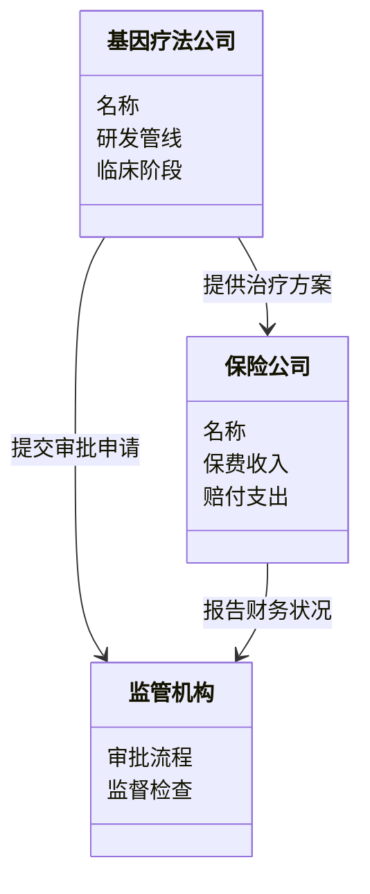
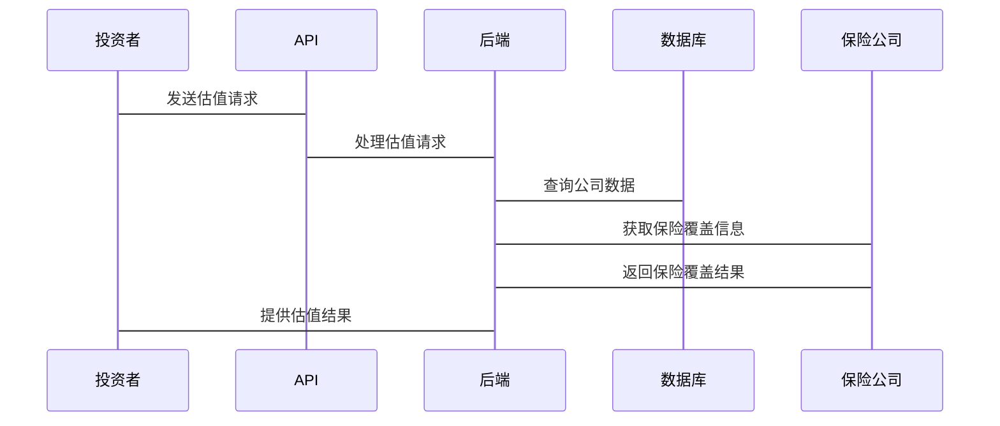

                 


# 全球股市估值与基因疗法的医疗保险覆盖模式

> 关键词：基因疗法、医疗保险、股市估值、覆盖模式、投资分析

> 摘要：基因疗法作为医疗领域的革命性技术，其开发和应用对医疗保险覆盖模式提出了新的挑战。本文将探讨基因疗法与医疗保险覆盖模式的关系，分析其对全球股市估值的影响，并提出相应的解决方案。

---

## 第一部分: 全球股市估值与基因疗法的背景与概念

### 第1章: 背景介绍

#### 1.1 全球股市估值的现状与挑战
##### 1.1.1 全球股市估值的基本概念
股市估值是指通过对公司财务数据和市场环境的分析，评估公司股票的合理价格。常用的估值方法包括市盈率（P/E）、市净率（P/B）和现金流折现法（DCF）等。然而，传统估值方法在面对基因疗法这类高风险、高投入的医疗技术时显得力不从心。

##### 1.1.2 当前股市估值的主要挑战
基因疗法的研发周期长、成本高，且存在较高的不确定性。这些特点使得传统的估值模型难以准确反映基因疗法公司的价值。此外，基因疗法的商业化还受到医疗保险覆盖模式的严重影响，这进一步增加了估值的复杂性。

##### 1.1.3 基因疗法对股市估值的影响
基因疗法的成功可能为公司带来巨大的收益，但也可能导致重大亏损。因此，投资者需要更加谨慎地评估基因疗法公司的潜在价值，并考虑医疗保险覆盖模式对其收入的影响。

#### 1.2 基因疗法的定义与发展
##### 1.2.1 基因疗法的定义与核心原理
基因疗法是一种通过修改基因组来治疗或预防疾病的技术。其核心原理是利用基因编辑工具（如CRISPR）修复或替换致病基因，从而达到治疗疾病的目的。

##### 1.2.2 基因疗法的发展历程
基因疗法的发展经历了多个阶段，从早期的实验性治疗到现在的临床应用，逐步证明了其在治疗遗传病、癌症等领域的潜力。然而，其高昂的研发成本和不确定性也使得基因疗法公司面临巨大的财务压力。

##### 1.2.3 基因疗法在医疗领域的应用前景
基因疗法在治疗罕见病、癌症和其他遗传性疾病方面展现出巨大潜力。随着技术的进步和成本的降低，基因疗法有望在未来成为主流的治疗方式之一。

#### 1.3 医疗保险覆盖模式的基本概念
##### 1.3.1 医疗保险的基本类型
医疗保险可以分为社会医疗保险和商业医疗保险两大类。社会医疗保险由政府主导，覆盖范围广；商业医疗保险则由保险公司提供，覆盖范围和保障程度可以根据客户需求定制。

##### 1.3.2 医疗保险覆盖模式的特点
医疗保险覆盖模式的特点包括风险分担、保费支付、按需报销等。不同国家和地区的医疗保险制度存在差异，但基本上都旨在为患者提供经济支持，同时控制医疗成本。

##### 1.3.3 基因疗法与医疗保险覆盖的关联性
基因疗法的高昂成本和不确定性使得其医疗保险覆盖模式成为关键问题。保险公司需要在确保患者能够负担治疗费用的同时，控制自身的财务风险。

---

## 第二部分: 核心概念与联系

### 第2章: 基因疗法与医疗保险覆盖模式的内在联系

#### 2.1 基因疗法与医疗保险覆盖模式的内在联系
##### 2.1.1 基因疗法的成本与医疗保险支付
基因疗法的研发和生产成本极高，保险公司需要在支付患者治疗费用的同时，确保自身财务的可持续性。这使得基因疗法的定价策略和保险覆盖范围成为关键问题。

##### 2.1.2 基因疗法的疗效与保险覆盖决策
基因疗法的疗效是决定其是否被纳入医疗保险覆盖的重要因素。保险公司通常会根据临床试验结果和长期疗效数据来评估基因疗法的风险和收益。

##### 2.1.3 基因疗法的商业化与保险覆盖的互动关系
基因疗法的商业化依赖于医疗保险覆盖模式的支持。保险公司通过覆盖基因疗法，可以为患者提供必要的治疗，同时促进基因疗法技术的普及和应用。

#### 2.2 基因疗法与全球股市估值的相互作用
##### 2.2.1 基因疗法公司的估值模型
基因疗法公司的估值需要考虑其研发管线的潜力、临床试验结果、市场前景以及医疗保险覆盖的可能性。这些因素共同决定了公司的市值和投资者信心。

##### 2.2.2 基因疗法的市场表现与股市估值的关系
基因疗法的成功案例通常会带来股价的大幅上涨，而失败案例则可能导致股价的大幅下跌。因此，基因疗法的市场表现对股市估值具有重要影响。

##### 2.2.3 基因疗法的不确定性对股市估值的影响
基因疗法的高风险特性使得其估值具有高度不确定性。投资者需要通过分析临床试验结果、市场竞争情况和医疗保险覆盖政策来评估基因疗法公司的潜在价值。

#### 2.3 核心概念的ER实体关系图

```mermaid
er
actor: 投资者
actor: 保险公司
actor: 基因疗法公司
actor: 监管机构
```

---

## 第三部分: 算法原理讲解

### 第3章: 基因疗法医疗保险覆盖模式的算法模型

#### 3.1 基因疗法的疗效预测模型
##### 3.1.1 基因疗法疗效预测模型的数学公式
$$ P(\text{疗效成功}) = \frac{\text{成功案例数}}{\text{总案例数}} $$

##### 3.1.2 基因疗法疗效预测模型的实现步骤
1. 收集临床试验数据。
2. 确定疗效成功的标准。
3. 计算疗效成功的概率。

##### 3.1.3 基因疗法疗效预测模型的优缺点
优点：能够量化基因疗法的疗效，为保险覆盖决策提供依据。缺点：依赖于临床试验数据的质量和完整性。

#### 3.2 基因疗法的保险覆盖决策树模型
##### 3.2.1 基因疗法保险覆盖决策树模型的构建
1. 确定决策节点（如疗效成功、成本可控）。
2. 构建决策树的分支。
3. 计算各路径的概率和收益。

##### 3.2.2 基因疗法保险覆盖决策树模型的实现步骤
1. 收集相关数据。
2. 构建决策树。
3. 计算各路径的价值。
4. 确定最佳覆盖策略。

##### 3.2.3 基因疗法保险覆盖决策树模型的优缺点
优点：能够帮助保险公司制定科学的覆盖决策。缺点：模型的复杂性较高，需要大量数据支持。

#### 3.3 基因疗法公司估值的回归模型
##### 3.3.1 基因疗法公司估值回归模型的数学公式
$$ \text{公司价值} = \beta \times \text{收入} + \gamma \times \text{研发投入} + \delta \times \text{临床阶段} $$

##### 3.3.2 基因疗法公司估值回归模型的实现步骤
1. 收集公司财务数据。
2. 确定影响估值的关键因素。
3. 建立回归模型。
4. 验证模型的准确性。

##### 3.3.3 基因疗法公司估值回归模型的优缺点
优点：能够量化基因疗法公司的潜在价值。缺点：模型的准确性依赖于数据的质量和完整性。

---

## 第四部分: 系统分析与架构设计

### 第4章: 基因疗法医疗保险覆盖模式的系统分析

#### 4.1 问题场景介绍
基因疗法的高成本和不确定性使得其医疗保险覆盖模式成为关键问题。保险公司需要在确保患者能够负担治疗费用的同时，控制自身的财务风险。

#### 4.2 系统功能设计
##### 4.2.1 领域模型（Mermaid 类图）



##### 4.2.2 系统架构设计（Mermaid 架构图）


##### 4.2.3 系统接口设计
系统接口包括投资者界面、保险公司数据接口和监管机构审批接口。各接口需要实现数据的交互和系统的协调。

##### 4.2.4 系统交互设计（Mermaid 序列图）



---

## 第五部分: 项目实战

### 第5章: 项目实战与案例分析

#### 5.1 环境安装
为了进行基因疗法医疗保险覆盖模式的分析，需要安装以下环境：
1. Python 3.8+
2. Jupyter Notebook
3. 必要的Python库（如pandas、numpy、scikit-learn）

#### 5.2 系统核心实现源代码

##### 5.2.1 基因疗法疗效预测模型的实现

```python
import pandas as pd

def predict_efficacy(clinical_data):
    success_cases = clinical_data['success'].sum()
    total_cases = len(clinical_data)
    return success_cases / total_cases

# 示例数据
data = {
    'success': [1, 1, 0, 1, 0],
    'patient_id': [1, 2, 3, 4, 5]
}
clinical_data = pd.DataFrame(data)
print(predict_efficacy(clinical_data))  # 输出疗效成功概率
```

##### 5.2.2 基因疗法保险覆盖决策树模型的实现

```python
from sklearn.tree import DecisionTreeClassifier
from sklearn.model_selection import train_test_split

def insurance_decision_model(features, labels):
    X_train, X_test, y_train, y_test = train_test_split(features, labels, test_size=0.2)
    model = DecisionTreeClassifier()
    model.fit(X_train, y_train)
    return model

# 示例数据
features = [[1, 1], [0, 1], [1, 0], [0, 0]]
labels = [1, 0, 1, 0]
model = insurance_decision_model(features, labels)
print(model.predict([[1, 1]]))  # 输出覆盖决策
```

##### 5.2.3 基因疗法公司估值回归模型的实现

```python
from sklearn.linear_model import LinearRegression
from sklearn.metrics import r2_score

def company_valuation_model(features, target):
    model = LinearRegression()
    model.fit(features, target)
    return model, model.score(features, target)

# 示例数据
features = [[100, 50], [80, 40], [120, 60], [90, 45]]
target = [200, 150, 240, 180]
model, score = company_valuation_model(features, target)
print(score)  # 输出模型准确度
```

#### 5.3 代码应用解读与分析
通过上述代码，我们可以实现基因疗法的疗效预测、保险覆盖决策和公司估值。这些模型可以帮助投资者和保险公司更好地理解基因疗法的潜在价值和风险。

#### 5.4 实际案例分析
以某基因疗法公司为例，分析其临床试验结果、研发投入和临床阶段，使用回归模型评估其潜在价值。通过案例分析，我们可以更好地理解模型的实际应用。

#### 5.5 项目小结
基因疗法医疗保险覆盖模式的分析需要结合多种算法和模型。通过实际案例的分析，我们可以验证模型的准确性和实用性，为投资者和保险公司提供科学的决策支持。

---

## 第六部分: 结论与展望

### 第6章: 结论与展望

#### 6.1 研究总结
基因疗法作为医疗领域的革命性技术，其开发和应用对医疗保险覆盖模式提出了新的挑战。通过本文的分析，我们可以更好地理解基因疗法与医疗保险覆盖模式的内在联系，以及其对全球股市估值的影响。

#### 6.2 未来展望
随着基因疗法技术的不断进步和医疗保险覆盖模式的创新，基因疗法的商业化应用将更加广泛。未来的研究可以进一步探索基因疗法的长期疗效、保险覆盖模式的优化以及股市估值方法的创新。

---

## 参考文献

1. 《基因疗法原理与应用》
2. 《医疗保险覆盖模式分析》
3. 《股市估值方法与实践》

---

作者：AI天才研究院/AI Genius Institute & 禅与计算机程序设计艺术/Zen And The Art of Computer Programming

