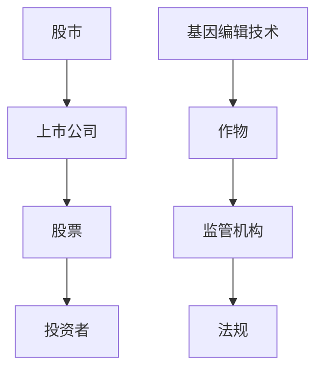
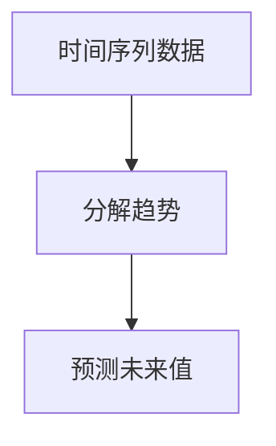
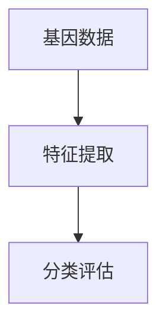
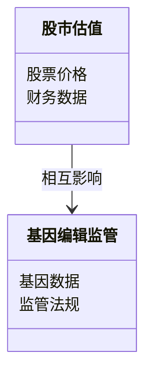
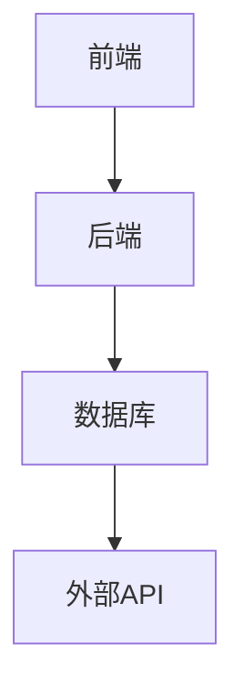
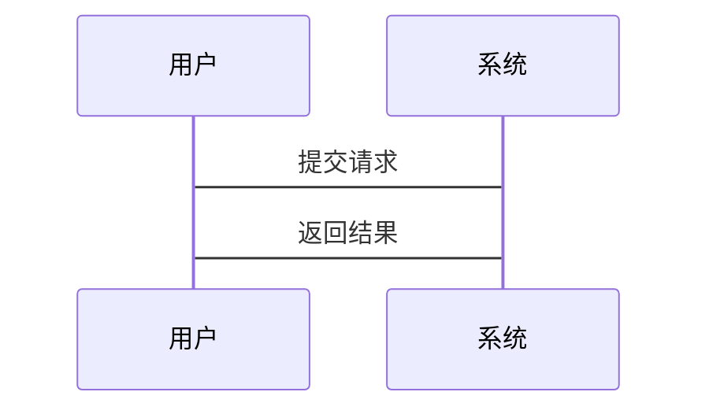

                 


# 全球股市估值与基因编辑作物的监管框架

> 关键词：全球股市估值，基因编辑作物，监管框架，时间序列分析，机器学习，系统架构

> 摘要：本文探讨了全球股市估值与基因编辑作物监管框架之间的联系，通过分析股市估值的核心概念、基因编辑技术的基本原理以及监管框架的构建，提出了一种结合时间序列分析与机器学习的算法，用于预测股市波动和评估基因编辑作物的风险。文章还详细介绍了系统的架构设计和实际案例分析，为相关领域的研究和实践提供了参考。

---

# 第1章: 背景介绍

## 1.1 全球股市估值的背景与现状

### 1.1.1 股市估值的核心概念
股市估值是通过分析上市公司的财务数据和市场表现，对其股票的内在价值进行评估的过程。常用的估值指标包括市盈率（P/E）、市净率（P/B）等。

### 1.1.2 全球股市估值的现状与趋势
近年来，全球股市估值呈现出波动性增强的趋势，尤其是受到技术进步、经济政策和全球事件的影响。投资者越来越依赖数据驱动的方法进行估值。

### 1.1.3 股市估值的关键影响因素
- 公司基本面：收入、利润、负债等。
- 市场情绪：投资者心理和市场波动。
- 宏观经济：GDP增长率、利率等。

## 1.2 基因编辑作物的背景与现状

### 1.2.1 基因编辑技术的基本原理
基因编辑技术通过精确修改生物体的基因组，以增强其特定性状。常用的技术包括CRISPR-Cas9。

### 1.2.2 基因编辑作物的应用领域
- 农业：提高作物抗病性和产量。
- 医药：开发新药和治疗工具。

### 1.2.3 基因编辑作物的争议与挑战
- 生态风险：可能对生态系统造成不可逆的影响。
- 监管难题：不同国家的法规差异较大。

## 1.3 问题背景与问题描述

### 1.3.1 股市估值与基因编辑作物的关联性
基因编辑作物的商业化可能影响农业公司的股价波动。

### 1.3.2 基因编辑技术对股市估值的影响
技术进步可能提升公司的估值，但同时也带来不确定性和风险。

### 1.3.3 当前监管框架的不足与改进方向
现有监管框架难以应对基因编辑作物的快速商业化和潜在风险。

## 1.4 问题解决与边界定义

### 1.4.1 股市估值问题的解决思路
通过数据分析和模型构建，预测基因编辑技术对公司股价的影响。

### 1.4.2 基因编辑作物监管框架的构建目标
制定统一的监管标准，降低技术带来的风险。

### 1.4.3 问题的边界与外延
- 范围：聚焦于基因编辑作物对股市估值的影响。
- 边界：不涉及其他类型的技术或作物。

## 1.5 核心概念与结构

### 1.5.1 核心概念的定义与属性
- 股市估值：通过财务指标和市场数据评估股票价值。
- 基因编辑作物：通过基因技术改良的作物。

### 1.5.2 概念结构与核心要素
- 估值模型：市盈率、市净率。
- 技术特性：基因编辑的精确性和效率。

### 1.5.3 核心概念之间的关系
基因编辑技术可能影响农业公司的财务表现，从而影响其股票估值。

---

# 第2章: 核心概念与联系

## 2.1 核心概念的原理与特征

### 2.1.1 股市估值的原理
通过分析公司财务数据和市场趋势，预测股票的内在价值。

### 2.1.2 基因编辑作物监管框架的原理
制定法规和技术标准，确保基因编辑作物的安全性和合规性。

### 2.1.3 核心概念的属性对比
- 股市估值：数据驱动、动态变化。
- 基因编辑作物：技术驱动、风险可控。

## 2.2 概念属性特征对比表格

| 概念      | 属性                | 特征                              |
|-----------|---------------------|-----------------------------------|
| 股市估值  | 数据驱动            | 基于财务数据和市场情绪             |
| 基因编辑  | 技术驱动            | 基于基因技术的精确性和效率         |

## 2.3 ER实体关系图


---

# 第3章: 算法原理讲解

## 3.1 股市估值算法

### 3.1.1 时间序列分析


代码示例：
```python
import pandas as pd
import numpy as np

# 示例数据
data = pd.Series(np.random.randn(100).cumsum(), index=pd.date_range('2020-01-01', periods=100))

# 时间序列分析
from statsmodels.tsa.arima_model import ARIMA
model = ARIMA(data, order=(1,1,1))
model_fit = model.fit()
forecast = model_fit.forecast(steps=5)[0]
```

### 3.1.2 基因编辑评估算法


代码示例：
```python
from sklearn.tree import DecisionTreeClassifier
import numpy as np

# 示例数据
X = np.random.rand(100, 5)
y = np.random.randint(0, 2, 100)

# 分类模型
model = DecisionTreeClassifier()
model.fit(X, y)
```

## 3.2 算法实现细节

### 3.2.1 时间序列分析的数学模型
$$ ARIMA(p, d, q) $$
其中，p为自回归阶数，d为差分阶数，q为移动平均阶数。

### 3.2.2 基因编辑评估的数学模型
$$ y = \beta_0 + \beta_1x_1 + ... + \beta_nx_n + \epsilon $$
其中，$\epsilon$为误差项。

---

# 第4章: 数学模型与系统架构设计

## 4.1 数学模型

### 4.1.1 时间序列分析
$$ ARIMA(p, d, q) $$
用于预测股市的未来走势。

### 4.1.2 回归模型
$$ y = \beta_0 + \beta_1x_1 + \beta_2x_2 + ... + \beta_nx_n + \epsilon $$
用于评估基因编辑作物的影响。

## 4.2 系统架构设计

### 4.2.1 领域模型


### 4.2.2 系统架构图


### 4.2.3 接口设计
- 前端：用户输入查询参数。
- 后端：接收请求，调用算法模型进行计算。
- 数据库：存储历史数据和模型结果。

### 4.2.4 交互序列图


---

# 第5章: 项目实战

## 5.1 环境配置

```bash
pip install pandas numpy scikit-learn statsmodels
```

## 5.2 核心实现

### 5.2.1 股市估值代码
```python
from statsmodels.tsa.arima_model import ARIMA

# 训练模型
model = ARIMA(train_data, order=(1, 1, 1))
model_fit = model.fit()

# 预测
forecast = model_fit.forecast(steps=10)
```

### 5.2.2 基因编辑监管代码
```python
from sklearn.tree import DecisionTreeClassifier

# 训练模型
model = DecisionTreeClassifier()
model.fit(X_train, y_train)

# 预测
y_pred = model.predict(X_test)
```

## 5.3 实际案例分析

### 5.3.1 股市案例
分析某农业公司股票的走势，预测其未来的价格波动。

### 5.3.2 基因编辑案例
评估某基因编辑作物的市场潜力和风险。

## 5.4 项目小结
通过实际案例验证了模型的有效性，为监管框架的构建提供了数据支持。

---

# 第6章: 结论

## 6.1 核心结论
- 股市估值与基因编辑作物的监管框架密切相关。
- 时间序列分析和机器学习算法可以有效预测股市波动和评估作物风险。

## 6.2 未来研究方向
- 探讨更多跨领域技术的结合。
- 提升算法的准确性和稳定性。

## 6.3 最佳实践 tips
- 数据收集是关键，确保数据的完整性和准确性。
- 在模型优化过程中，注重参数调优和特征选择。

---

作者：AI天才研究院/AI Genius Institute & 禅与计算机程序设计艺术 /Zen And The Art of Computer Programming

