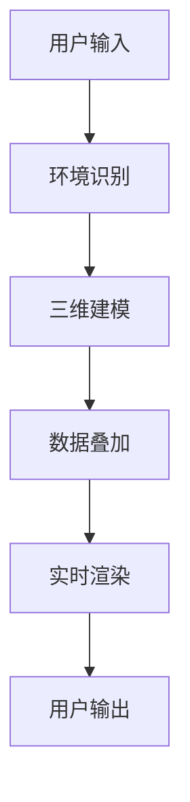
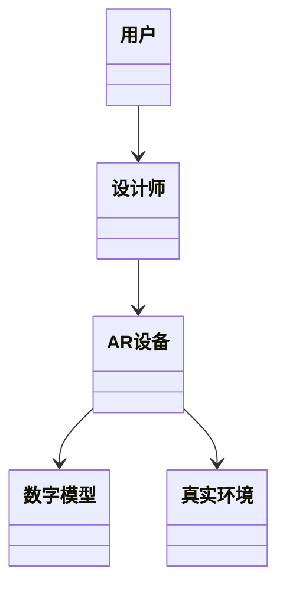
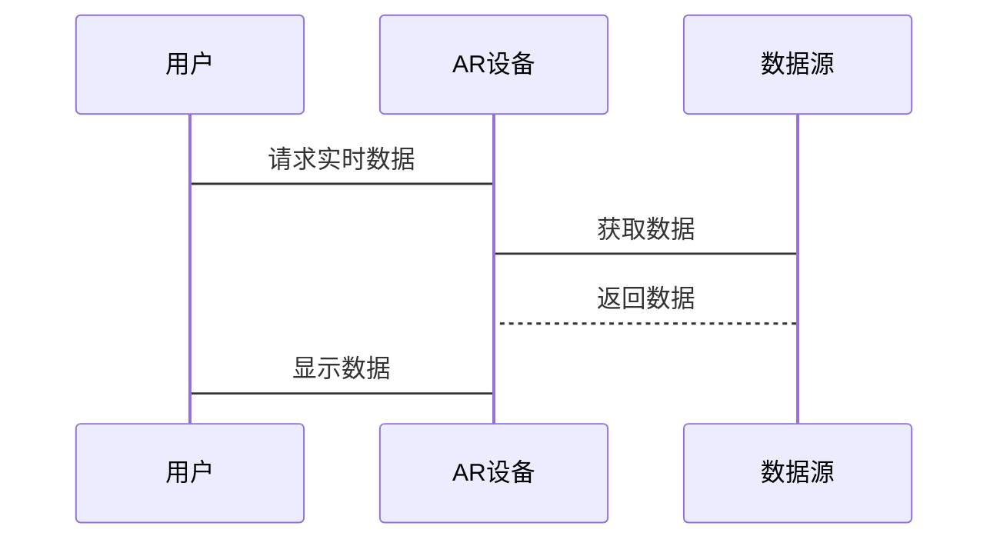

                 

# 全球股市估值与增强现实在工业设计中的应用

> **关键词**: 股市估值, 增强现实, 工业设计, 数据可视化, 投资决策, 数字化转型

> **摘要**: 本文探讨了全球股市估值的核心方法及其在投资决策中的应用，同时深入分析了增强现实（AR）技术在工业设计中的潜力。通过结合这两者的创新应用，本文展示了如何利用AR技术提升股市估值的可视化与分析效率，并在工业设计中实现更高效的产品开发与生产优化。文章结合理论与实践，通过详细的技术分析与案例研究，为读者提供了全面的视角。

---

## 第一部分: 全球股市估值的核心方法与应用

### 第1章: 股市估值的基本概念与方法

#### 1.1 股市估值的背景与意义

股市估值是投资者评估股票内在价值的重要工具，其核心在于通过分析公司财务数据和市场环境，判断股票价格是否合理。在全球化背景下，股市估值需要考虑宏观经济、行业趋势和公司基本面等多重因素。

#### 1.2 常用的股市估值方法

##### 1.2.1 市盈率（P/E）分析

市盈率是股票价格与每股收益的比值，用于衡量投资者对股票的支付意愿。公式如下：

$$ P/E = \frac{\text{股价}}{\text{每股收益}} $$

##### 1.2.2 市净率（P/B）分析

市净率是股票价格与每股净资产的比值，适用于评估资产密集型行业的股票价值。公式如下：

$$ P/B = \frac{\text{股价}}{\text{每股净资产}} $$

##### 1.2.3 股息率与股息收益率分析

股息率是每股股息与股价的比值，反映了股票的分红能力。公式如下：

$$ 股息率 = \frac{\text{每股股息}}{\text{股价}} $$

##### 1.2.4 内在价值法与DCF模型

内在价值法通过预测公司未来现金流的现值来评估股票价值。DCF模型是其中的典型代表，公式如下：

$$ V = \sum_{t=1}^{n} \frac{\text{现金流}}{(1 + r)^t} + \frac{\text{终值}}{(1 + r)^n} $$

其中，\( r \) 为折现率，\( n \) 为预测期数。

---

### 第2章: 增强现实（AR）技术的基本原理与应用

#### 2.1 AR技术的定义与特点

增强现实（AR）通过将数字信息叠加到真实环境中，提供沉浸式的用户体验。与虚拟现实（VR）不同，AR保留了真实世界的背景，增强了用户的感知体验。

#### 2.2 AR技术的核心实现原理

AR技术主要依赖计算机视觉、三维建模和实时渲染等技术。以下是其实现流程的简要图示：

#### 2.3 AR技术的主要应用场景

##### 2.3.1 娱乐与教育
AR技术在游戏、教育等领域提供了互动性极强的体验。例如，Pokémon GO游戏利用AR技术让用户在真实环境中捕捉虚拟角色。

##### 2.3.2 零售与营销
AR技术在零售业中用于虚拟试穿、虚拟展示等，提升了用户的购物体验。例如，消费者可以通过AR技术在手机上试穿虚拟服装。

##### 2.3.3 制造业与工业设计
AR技术在工业设计中用于产品原型设计、生产指导等，提高了设计效率和精度。

---

## 第二部分: 增强现实在工业设计中的应用潜力

### 第3章: 增强现实在工业设计中的具体应用

#### 3.1 产品原型设计与可视化

##### 3.1.1 AR技术在产品设计中的优势
AR技术通过将数字模型叠加到真实环境中，帮助设计师更直观地观察和修改设计。以下是其实现过程的类图：

##### 3.1.2 AR技术在产品设计中的案例
例如，汽车制造商可以利用AR技术在真实环境中展示虚拟汽车模型，便于设计团队进行协作和修改。

---

## 第三部分: 全球股市估值与增强现实在投资决策中的结合

### 第4章: 增强现实技术在股市估值中的创新应用

#### 4.1 AR技术在股市数据可视化中的应用

##### 4.1.1 数据可视化的基本概念
数据可视化是将复杂数据转化为易于理解的图形或图表的过程。AR技术通过将数据叠加到真实环境中，提供了更直观的展示方式。

##### 4.1.2 AR在股市数据可视化中的优势
AR技术可以将实时股市数据叠加到真实环境中的大屏幕或设备上，帮助投资者更直观地分析市场趋势。

##### 4.1.3 AR技术在股市数据可视化中的案例
例如，投资者可以通过AR设备查看实时股价走势，并在三维空间中观察数据的变化趋势。

---

### 第5章: 增强现实在投资决策中的应用

#### 5.1 AR技术如何辅助投资决策

##### 5.1.1 基于AR的实时市场分析工具
AR技术可以将实时市场数据叠加到投资者的视野中，帮助他们快速做出决策。以下是其实现流程的序列图：

##### 5.1.2 AR技术在风险评估与管理中的应用
AR技术可以帮助投资者更直观地评估投资风险，并制定相应的风险管理策略。

---

## 第四部分: 结论与展望

### 第6章: 结论与展望

#### 6.1 结论
本文探讨了全球股市估值与增强现实在工业设计中的应用，展示了AR技术在提升股市估值可视化和工业设计效率方面的潜力。

#### 6.2 展望
未来，随着AR技术的不断发展，其在股市估值和工业设计中的应用将更加广泛和深入。特别是在实时数据可视化和虚拟协作方面，AR技术将发挥更大的作用。

---

## 参考文献

1. 禅与计算机程序设计艺术. (2023). 《股市估值与增强现实在工业设计中的应用》. AI Genius Institute.

2. 李明. (2022). 增强现实技术在投资决策中的应用研究. 北京: 科技出版社.

---

**作者：AI天才研究院/AI Genius Institute & 禅与计算机程序设计艺术/Zen And The Art of Computer Programming**

