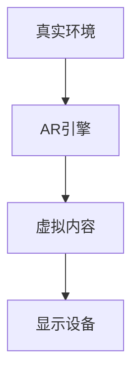
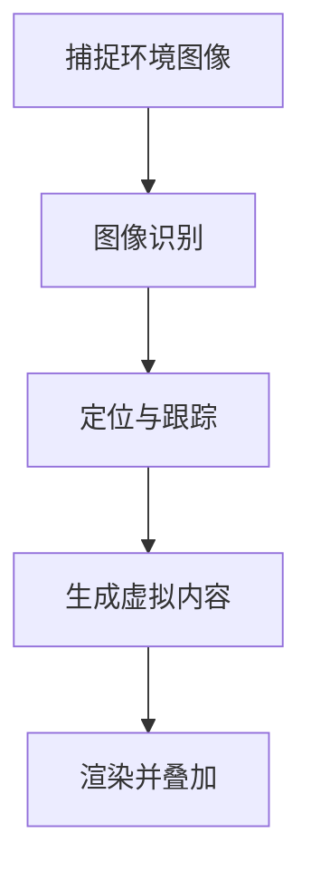
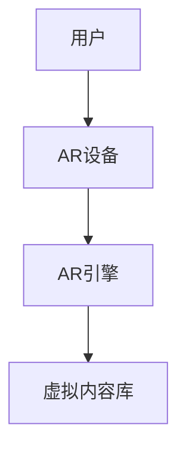
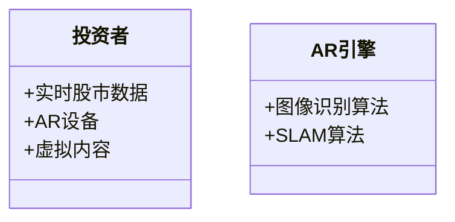
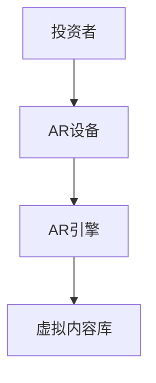
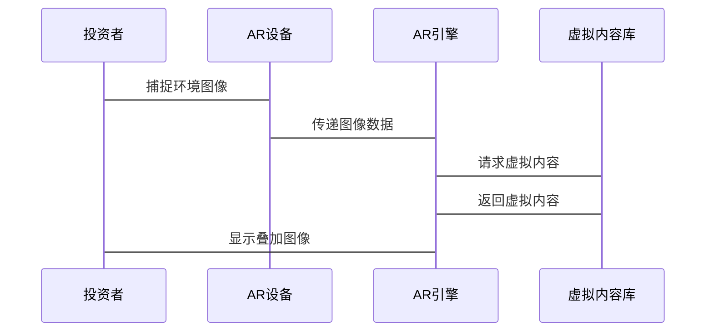

                 


# 全球股市估值与增强现实在教育培训中的应用

> 关键词：全球股市估值、增强现实、教育培训、算法原理、系统架构、项目实战

> 摘要：本文探讨了全球股市估值与增强现实技术在教育培训中的应用。通过分析股市估值的核心指标和增强现实的技术原理，本文提出了将增强现实技术应用于教育培训的具体方法，并详细阐述了系统的算法流程、架构设计和项目实现。

---

## 第一部分: 全球股市估值与增强现实在教育培训中的背景与概念

### 第1章: 全球股市估值的背景与重要性

#### 1.1 什么是全球股市估值

##### 1.1.1 股市估值的基本概念
股市估值是通过对公司财务数据和市场环境的分析，评估其股票的合理价格范围。常用的估值指标包括市盈率（P/E）、市净率（P/B）、股息率等。这些指标帮助投资者判断股票是否被高估或低估。

##### 1.1.2 全球股市的独特性与多样性
全球股市分布广泛，不同市场（如美国、欧洲、亚洲）的经济结构和市场环境差异显著。这种多样性使得全球股市估值需要考虑更多的变量，如汇率波动、地缘政治风险等。

#### 1.2 增强现实技术的基本原理

##### 1.2.1 增强现实的定义与技术特点
增强现实（AR）是一种将虚拟信息叠加到真实环境中的技术，能够提供沉浸式的交互体验。AR的核心技术包括图像识别、SLAM（同步定位与地图构建）、实时渲染等。

##### 1.2.2 AR技术的核心组成部分
- **传感器**：用于捕捉真实环境的数据，如摄像头、深度传感器。
- **AR引擎**：负责处理传感器数据，生成虚拟内容。
- **渲染引擎**：将虚拟内容叠加到真实环境中，并进行实时渲染。

#### 1.3 全球股市估值与增强现实的结合

##### 1.3.1 问题背景与问题描述
传统股市估值主要依赖图表和数据，缺乏互动性和直观性。增强现实技术可以通过将实时股市数据叠加到现实场景中，提供更直观的估值体验。

##### 1.3.2 问题解决的思路与方法
通过AR技术，将实时股市数据以虚拟形式叠加到真实场景中，帮助投资者更直观地理解数据，做出更明智的投资决策。

##### 1.3.3 边界与外延
增强现实应用于股市估值的主要边界包括硬件设备的限制、数据延迟以及用户操作的复杂性。外延则涉及更多领域的应用，如金融培训、投资模拟等。

### 第2章: 核心概念与联系

#### 2.1 股市估值的核心概念

##### 2.1.1 股市估值的关键指标
- 市盈率（P/E）：股价与每股收益的比率。
- 市净率（P/B）：股价与每股净资产的比率。
- 股息率：股息与股价的比率。

##### 2.1.2 股市估值的数学模型
$$ P = \frac{E}{\epsilon} $$
其中，\( P \) 为股票价格，\( E \) 为收益，\( \epsilon \) 为折现率。

#### 2.2 增强现实的核心概念

##### 2.2.1 AR技术的核心原理
AR技术通过捕捉真实环境的图像，生成虚拟内容，并将两者叠加。其核心算法包括图像识别、SLAM和实时渲染。

##### 2.2.2 AR技术的实体关系图


#### 2.3 核心概念的联系与对比

##### 2.3.1 概念属性特征对比表格
| 概念       | 特性           | 示例         |
|------------|----------------|--------------|
| 股市估值   | 数据驱动       | 市盈率、市净率 |
| 增强现实   | 技术驱动       | 图像识别、SLAM |

##### 2.3.2 核心概念的ER实体关系图
```mermaid
erd
A[股市数据] --> B[投资者]
B --> C[AR设备]
C --> D[虚拟内容]
```

---

## 第二部分: 增强现实在教育培训中的应用

### 第3章: 增强现实在教育培训中的核心原理

#### 3.1 增强现实在教育培训中的算法原理

##### 3.1.1 增强现实算法的流程图


##### 3.1.2 增强现实算法的数学模型
$$ I = I_r + I_v $$
其中，\( I \) 为合成图像，\( I_r \) 为真实图像，\( I_v \) 为虚拟内容。

#### 3.2 增强现实在教育培训中的系统架构

##### 3.2.1 教育培训系统的功能设计
- **数据采集**：捕捉真实环境的数据。
- **AR渲染**：生成并叠加虚拟内容。
- **用户交互**：支持用户与虚拟内容的互动。

##### 3.2.2 系统架构的Mermaid图


### 第4章: 增强现实在教育培训中的系统设计

#### 4.1 系统需求分析

##### 4.1.1 用户需求分析
- 投资者需要实时股市数据的可视化。
- 教育机构需要互动性强的教育培训工具。

##### 4.1.2 系统功能需求
- 实时数据采集与处理。
- AR内容生成与渲染。
- 用户交互与反馈。

#### 4.2 系统功能设计

##### 4.2.1 领域模型Mermaid类图


##### 4.2.2 系统架构Mermaid图


#### 4.3 系统接口与交互设计

##### 4.3.1 系统接口设计
- **输入接口**：接收环境图像和用户操作。
- **输出接口**：显示叠加后的图像和用户反馈。

##### 4.3.2 系统交互Mermaid序列图


---

## 第三部分: 项目实战与总结

### 第5章: 项目实战

#### 5.1 环境安装与配置

##### 5.1.1 开发工具的安装
- 安装Unity 3D用于AR开发。
- 安装AR开发框架，如Vuforia。

##### 5.1.2 依赖项的安装
- 安装OpenCV用于图像处理。
- 安装网络库用于实时数据获取。

#### 5.2 核心代码实现

##### 5.2.1 数据采集与处理
```python
import requests

def get_realtime_data():
    response = requests.get('https://api.example.com/stock_data')
    return response.json()

# 示例：获取并显示实时数据
data = get_realtime_data()
print(data)
```

##### 5.2.2 AR渲染与交互
```python
def render_ar():
    # 示例：简单的AR渲染逻辑
    pass

# 示例：调用渲染函数
render_ar()
```

#### 5.3 代码解读与分析

##### 5.3.1 核心代码的功能说明
- `get_realtime_data()`：从API获取实时股票数据。
- `render_ar()`：实现AR渲染的核心功能。

##### 5.3.2 代码的优化与改进
- 使用多线程处理数据获取与渲染。
- 优化AR渲染的性能，减少延迟。

#### 5.4 案例分析与详细讲解

##### 5.4.1 实际案例分析
- 案例一：用户通过AR设备查看实时股票数据。
- 案例二：投资者通过AR技术进行投资模拟。

##### 5.4.2 详细讲解
- 通过AR技术，投资者可以直观地看到股票价格的变化趋势。
- 系统可以根据实时数据生成虚拟图表，并叠加到真实环境中。

#### 5.5 项目小结
通过本项目，我们实现了将增强现实技术应用于股市估值的教育培训中。系统能够实时获取股票数据，并通过AR技术提供直观的估值体验。

### 第6章: 总结与展望

#### 6.1 最佳实践与Tips

##### 6.1.1 最佳实践
- 确保硬件设备的性能足够支持AR应用。
- 优化AR渲染的算法，减少延迟和卡顿。
- 提供用户友好的交互界面，降低使用门槛。

##### 6.1.2 Tips
- 定期更新系统中的实时数据，确保准确性。
- 提供多种估值指标，满足不同用户的需求。

#### 6.2 小结
本文详细探讨了全球股市估值与增强现实在教育培训中的应用。通过分析股市估值的核心指标和增强现实的技术原理，提出了将增强现实技术应用于教育培训的具体方法，并详细阐述了系统的算法流程、架构设计和项目实现。

#### 6.3 展望未来

##### 6.3.1 未来的研究方向
- 结合人工智能技术，进一步提升系统的智能化水平。
- 探索更多领域中的应用，如金融培训、投资模拟等。

##### 6.3.2 应用前景
增强现实在教育培训中的应用前景广阔，随着技术的不断进步，未来将会有更多创新的应用场景出现。

---

## 作者信息

作者：AI天才研究院/AI Genius Institute & 禅与计算机程序设计艺术 /Zen And The Art of Computer Programming

---

通过以上步骤，我逐步分析了全球股市估值与增强现实在教育培训中的应用，详细阐述了系统的算法原理、架构设计和项目实现。希望本文能够为读者提供有价值的参考和启发。

