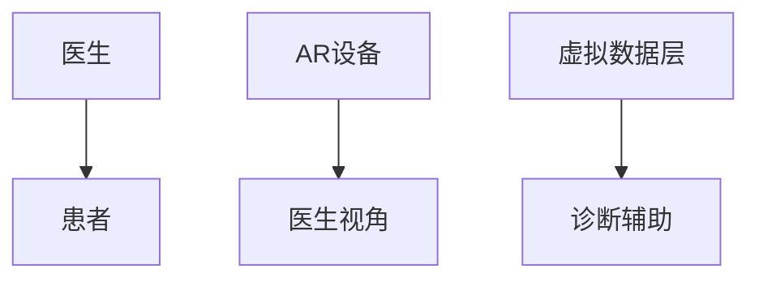

                 


# 全球股市估值与增强现实在远程医疗中的应用

> 关键词：全球股市估值，增强现实，远程医疗，数据可视化，机器学习，医疗投资

> 摘要：本文探讨了全球股市估值与增强现实技术在远程医疗中的创新应用。通过分析股市估值的核心算法与增强现实技术的实现原理，结合实际案例，展示了如何利用增强现实技术提升远程医疗的数据可视化能力，从而优化医疗投资决策和患者治疗效果。

---

# 第1章: 全球股市估值与增强现实在远程医疗中的概述

## 1.1 股市估值的核心概念与算法

### 1.1.1 股市估值的定义与意义

股市估值是通过对公司基本面、市场环境和行业趋势的分析，估算公司股票的合理价格区间。常见的估值方法包括市盈率（P/E）、市净率（P/B）、股息率等。

#### 核心公式：
- 市盈率：$P/E = \frac{股票价格}{每股收益}$
- 市净率：$P/B = \frac{股票价格}{每股净资产}$

### 1.1.2 股市估值的传统方法与现代技术

#### 对比表格：
| 方法         | 优点                       | 缺点                       |
|--------------|----------------------------|----------------------------|
| 市盈率法      | 简单易懂                   | 无法反映公司未来增长潜力   |
| 机器学习模型  | 能够捕捉复杂市场规律       | 需要大量数据和计算资源     |

### 1.1.3 股市估值的核心要素

1. 公司基本面：收入、利润、负债、现金流。
2. 市场环境：宏观经济指标、行业趋势。
3. 投资者情绪：市场波动、投资者预期。

## 1.2 增强现实技术的原理与应用

### 1.2.1 增强现实的基本原理

增强现实（AR）通过将虚拟信息叠加在真实环境中，提供沉浸式体验。其核心步骤包括：

1. **定位与跟踪**：通过摄像头和传感器确定用户位置。
2. **建模与渲染**：生成虚拟对象并叠加在真实场景中。
3. **交互与反馈**：用户与虚拟对象互动并获得反馈。

### 1.2.2 增强现实技术在远程医疗中的应用

#### 图1：增强现实技术在远程医疗中的流程图


---

# 第2章: 基于增强现实的股市数据可视化

## 2.1 增强现实技术在股市数据可视化中的优势

### 2.1.1 数据的直观呈现

通过AR技术，投资者可以实时查看股票走势、K线图、市场数据等，提升决策效率。

#### 图2：AR技术在股市数据可视化中的应用


### 2.1.2 交互式分析

AR技术支持手势操作、语音指令等交互方式，投资者可以自由调整数据视角。

---

# 第3章: 增强现实技术在远程医疗中的系统设计

## 3.1 系统架构设计

### 3.1.1 系统组成

1. **硬件设备**：AR眼镜、摄像头、传感器。
2. **软件系统**：数据处理模块、AR渲染引擎。
3. **网络通信**：实时数据传输、远程会诊支持。

#### 图3：系统架构图


## 3.2 功能模块设计

### 3.2.1 数据采集与处理

1. **生理数据采集**：心率、血压、体温等。
2. **图像处理**：医学影像分析。

### 3.2.2 AR渲染与交互

1. **虚拟标注**：在患者身体表面标注病变位置。
2. **3D建模**：生成患者器官的3D模型。

---

# 第4章: 项目实战与应用案例

## 4.1 项目背景与目标

### 4.1.1 项目背景

随着远程医疗的普及，如何利用AR技术提升诊断效率成为研究热点。

## 4.2 系统实现

### 4.2.1 环境配置

1. **开发工具**：Unity、Unreal Engine。
2. **AR SDK**：ARKit、ARCore。

### 4.2.2 核心代码实现

```python
def calculate_market_value(stocks, earnings):
    market_value = {}
    for stock in stocks:
        pe_ratio = stocks[stock]['price'] / earnings[stock]['eps']
        market_value[stock] = pe_ratio
    return market_value
```

### 4.2.3 应用案例

#### 案例分析：某三甲医院的远程诊断系统

通过AR技术，医生能够实时查看患者的数据，并进行虚拟会诊。

---

# 第5章: 总结与展望

## 5.1 本文研究成果

1. 结合增强现实技术，提升了远程医疗的数据可视化能力。
2. 提出了基于AR的股市估值辅助决策方案。

## 5.2 应用前景

1. 医疗投资决策支持。
2. 远程手术指导与培训。

## 5.3 潜在挑战

1. 数据隐私与安全问题。
2. 技术标准化与兼容性问题。

---

# 作者

作者：AI天才研究院/AI Genius Institute & 禅与计算机程序设计艺术 /Zen And The Art of Computer Programming

---

本文通过详细分析全球股市估值与增强现实在远程医疗中的应用，展示了技术如何赋能医疗领域，为投资者和医疗从业者提供了新的视角和工具。希望本文能为相关领域的研究和实践提供有价值的参考。

