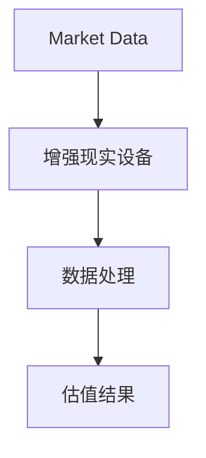
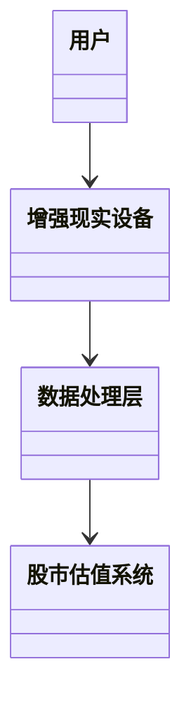
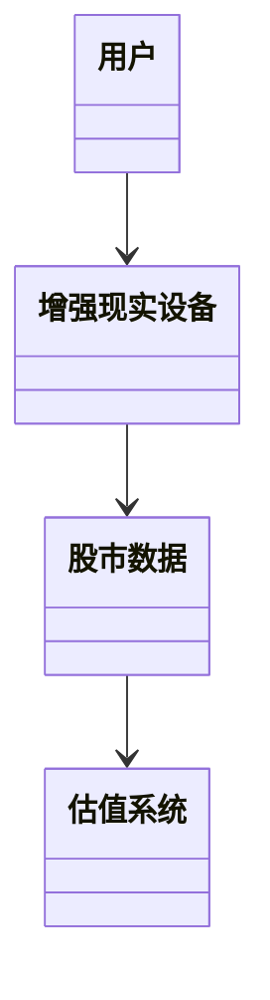
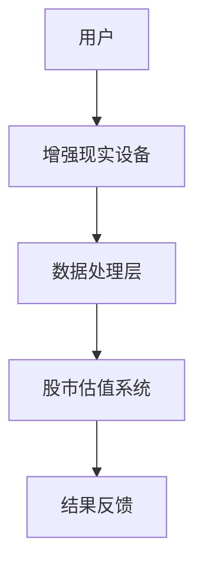
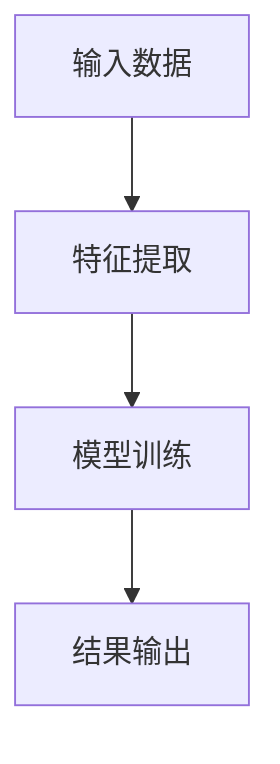

                 


# 全球股市估值与增强现实技术的关联

> 关键词：全球股市估值，增强现实技术，数据可视化，投资决策，技术关联

> 摘要：本文探讨了全球股市估值与增强现实技术之间的关联，分析了增强现实技术如何通过数据可视化和交互式体验提升股市估值的效率与准确性。文章从背景、核心概念、关联机制、协同应用、系统分析、算法原理等方面展开，结合实际案例和系统架构设计，全面解析了增强现实技术在全球股市估值中的应用潜力与挑战。

---

## 第1章: 全球股市估值与增强现实技术的背景与关联

### 1.1 问题背景与问题描述

#### 1.1.1 全球股市估值的现状与挑战
全球股市估值是金融领域的重要研究方向，其核心目标是通过对市场数据的分析，评估股票的内在价值。然而，传统估值方法依赖于复杂的数学模型和大量历史数据，存在以下挑战：
- 数据量庞大且实时性要求高。
- 投资者决策受情绪影响，难以完全理性化。
- 市场波动性大，传统模型难以捕捉实时变化。

#### 1.1.2 增强现实技术的快速发展
增强现实（AR）技术近年来迅速发展，通过将虚拟信息叠加到真实环境中，为用户提供沉浸式体验。AR技术在教育、医疗、游戏等领域已得到广泛应用，其核心优势包括：
- 实时交互性。
- 高度沉浸式体验。
- 数据可视化能力。

#### 1.1.3 两者的潜在关联性
尽管股市估值和增强现实技术分属不同领域，但两者在数据处理和用户交互方面存在潜在关联：
- AR技术可以将复杂的股市数据转化为直观的可视化形式。
- 通过AR设备，投资者可以实时获取市场动态，做出更高效的决策。

### 1.2 核心概念与问题解决

#### 1.2.1 全球股市估值的核心要素
- 市场数据：包括股票价格、成交量、市场指数等。
- 基本面分析：包括公司财务数据、行业地位等。
- 技术分析：通过K线图、均线等技术指标预测市场走势。

#### 1.2.2 增强现实技术的核心特征
- 实时性：AR技术能够实时叠加虚拟信息到真实环境中。
- 交互性：用户可以通过手势、语音等方式与虚拟信息互动。
- 可视化：将复杂的数据转化为直观的图形或动画。

#### 1.2.3 问题解决的边界与外延
本文研究的边界主要集中在增强现实技术如何辅助股市估值，不涉及股市预测模型的改进。其外延则包括AR技术在金融领域的其他应用，如虚拟交易模拟和实时市场监控。

---

## 第2章: 全球股市估值与增强现实技术的核心概念

### 2.1 核心概念原理

#### 2.1.1 全球股市估值的数学模型
股市估值的核心是通过数学模型计算股票的内在价值。常用模型包括：
- **DCF模型**：通过现金流折现计算公司价值。
- **PE模型**：通过市盈率评估股票估值是否合理。

#### 2.1.2 增强现实技术的实现原理
AR技术的核心是将虚拟信息与真实环境完美结合，主要步骤包括：
1. **环境感知**：通过摄像头、传感器等设备获取真实环境数据。
2. **数据处理**：对环境数据进行分析和处理，生成虚拟信息。
3. **渲染与叠加**：将虚拟信息渲染并叠加到真实环境中。

### 2.2 核心概念对比分析

#### 2.2.1 核心属性特征对比表格

| 特性                | 全球股市估值                     | 增强现实技术                   |
|---------------------|----------------------------------|-------------------------------|
| 核心目标            | 评估股票内在价值               | 提供沉浸式交互体验             |
| 数据依赖            | 历史数据、市场数据             | 环境数据、用户交互数据         |
| 技术实现            | 数学模型、统计分析             | 图像处理、实时渲染             |
| 应用场景            | 投资决策、市场分析             | 教育、游戏、虚拟试用           |

#### 2.2.2 ER实体关系图架构
以下是一个简化的ER图，展示了增强现实技术与股市估值的核心关系：

```mermaid
erd
    entity 全球股市估值 {
        key 市场指数
        key 股票代码
        属性 股价、成交量、市盈率
    }
    
    entity 增强现实技术 {
        key 设备ID
        属性 显示内容、用户交互
    }
    
    relationship 关联关系 {
        全球股市估值 -< 关联 >- 增强现实技术
    }
```

---

## 第3章: 增强现实技术与全球股市估值的关联机制

### 3.1 关联机制的数学模型

#### 3.1.1 关联模型的数学表达式
增强现实技术通过实时数据叠加，为股市估值提供动态信息。其关联机制可以用以下公式表示：

$$
\text{AR\_Valuation} = f(\text{Market\_Data}, \text{User\_Interaction})
$$

其中，$\text{Market\_Data}$ 表示市场数据，$\text{User\_Interaction}$ 表示用户交互信息，$f$ 是增强现实技术的处理函数。

#### 3.1.2 关联模型的公式推导
以下是一个简化的推导过程：

1. 获取市场数据：$\text{Market\_Data} = (P, V, Q)$，其中 $P$ 是股价，$V$ 是成交量，$Q$ 是市场指数。
2. 用户通过AR设备与虚拟界面交互，生成交互数据：$\text{User\_Interaction} = (U_x, U_y, U_z)$。
3. 处理数据并生成估值结果：$\text{AR\_Valuation} = f(P, V, Q, U_x, U_y, U_z)$。

### 3.2 关联机制的mermaid流程图



---

## 第4章: 增强现实技术在股市估值中的协同应用

### 4.1 协同应用的场景分析

#### 4.1.1 虚拟股票交易平台
通过AR技术，投资者可以在虚拟环境中进行股票交易，实时查看市场动态。

#### 4.1.2 增强现实数据可视化
将复杂的市场数据（如K线图、市盈率等）以直观的图形形式呈现，帮助投资者快速理解市场趋势。

#### 4.1.3 交互式投资决策支持
用户可以通过AR设备与虚拟助手互动，获取实时的投资建议。

### 4.2 协同应用的系统架构设计

#### 4.2.1 系统功能设计
以下是系统的功能模块图：



---

## 第5章: 增强现实技术与全球股市估值的系统分析

### 5.1 系统功能设计

#### 5.1.1 领域模型mermaid类图
以下是系统的领域模型：



### 5.2 系统架构设计

#### 5.2.1 系统架构mermaid架构图



---

## 第6章: 增强现实技术与全球股市估值的算法原理

### 6.1 算法原理讲解

#### 6.1.1 增强现实技术的算法流程



---

## 第7章: 结论与展望

### 7.1 最佳实践 tips

- **数据可视化**：通过AR技术将复杂的数据转化为直观的图形，提升用户体验。
- **交互设计**：设计高效的用户交互流程，减少用户操作负担。
- **系统优化**：优化系统的实时性和稳定性，确保在高并发场景下的表现。

### 7.2 小结

本文探讨了全球股市估值与增强现实技术的关联，分析了AR技术在股市估值中的潜力和挑战。通过系统的架构设计和算法流程分析，展示了如何将AR技术应用于金融领域。

### 7.3 注意事项

- AR技术的应用需要考虑设备的普及性和用户接受度。
- 系统的安全性和数据隐私保护是需要重点关注的方面。

### 7.4 拓展阅读

- 《增强现实技术与金融创新》
- 《大数据时代下的股市估值模型》

---

作者：AI天才研究院/AI Genius Institute & 禅与计算机程序设计艺术 /Zen And The Art of Computer Programming

