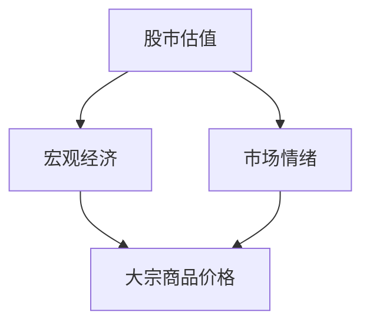
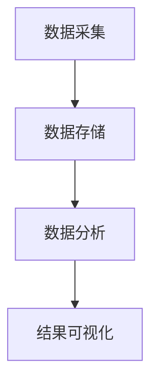

                 


# 全球股市估值与大宗商品价格的关系

## 关键词：
全球股市估值, 大宗商品价格, 股市与大宗商品关系, 价格波动分析, 机器学习预测

## 摘要：
本文探讨全球股市估值与大宗商品价格之间的关系，分析宏观经济因素、市场情绪对两者的影响，结合统计分析和机器学习模型，通过实证案例验证理论，并提出系统化解决方案。

---

## # 第一部分: 引言

## # 第1章: 背景介绍

### 1.1 问题背景
- 1.1.1 全球化经济与金融市场的发展：经济全球化推动了全球金融市场的互联互通，股市和大宗商品市场成为经济体系的重要组成部分。
- 1.1.2 股市估值与大宗商品价格的重要性：股市估值反映了企业的内在价值，而大宗商品价格影响生产成本和通货膨胀，两者共同影响经济运行。
- 1.1.3 问题的提出与研究意义：研究股市估值与大宗商品价格的关系，有助于理解金融市场波动，优化投资决策，降低风险。

### 1.2 核心概念
- 1.2.1 股市估值的定义与特征：股市估值是市场对上市公司价值的评估，主要指标包括市盈率（P/E）、市净率（P/B）、股息率（Dividend Yield）等。
- 1.2.2 大宗商品价格的定义与特征：大宗商品包括能源（原油）、金属（黄金、铜）和农产品（小麦、大豆），价格受供需、宏观经济和市场情绪影响。
- 1.2.3 两者关系的边界与外延：股市估值与大宗商品价格在宏观经济因素、市场情绪、通货膨胀等方面存在相互影响。

### 1.3 核心要素组成
- 1.3.1 股市估值的核心要素：企业盈利、市盈率、市净率、股息率、市场情绪。
- 1.3.2 大宗商品价格的核心要素：供需关系、宏观经济指标（GDP、利率、通货膨胀）、市场情绪。
- 1.3.3 两者关系的结构化分析：宏观经济因素（如通货膨胀）同时影响股市估值和大宗商品价格，市场情绪也起到中介作用。

---

## # 第二部分: 核心概念与联系

## # 第2章: 核心概念原理

### 2.1 股市估值的原理
- 2.1.1 市盈率与市净率的计算：市盈率 = 股价 / 每股收益，市净率 = 股价 / 每股净资产。
- 2.1.2 股息率与股票内在价值：股息率 = 每股股息 / 股价，反映股票收益能力。
- 2.1.3 市场情绪与股价波动：市场情绪通过投资者行为影响股价，进而影响股市估值。

### 2.2 大宗商品价格的原理
- 2.2.1 供需关系与价格波动：需求增加或供给减少导致价格上涨。
- 2.2.2 宏观经济因素对价格的影响：通货膨胀、利率、汇率变化影响大宗商品需求。
- 2.2.3 市场情绪与大宗商品价格：投资者情绪波动影响大宗商品交易量和价格。

### 2.3 两者关系的实体关系图


---

## # 第三部分: 统计分析与建模

## # 第3章: 数据收集与分析方法

### 3.1 数据收集
- 3.1.1 股市估值数据的获取：通过金融数据API（如Yahoo Finance）获取股票价格、市盈率、市净率等数据。
- 3.1.2 大宗商品价格数据的获取：通过数据供应商（如Bloomberg、Reuters）获取原油、黄金、铜等价格数据。
- 3.1.3 数据清洗与转换：处理缺失值、异常值，标准化数据格式。

### 3.2 数据可视化
- 3.2.1 股市估值与大宗商品价格的时间序列图：展示两者价格走势。
- 3.2.2 相关性分析：绘制散点图，观察两者之间的相关性。

### 3.3 数据分析方法
- 3.3.1 相关性分析：计算股市估值与大宗商品价格的相关系数，判断两者关系的强弱。
- 3.3.2 回归分析：建立线性回归模型，分析宏观经济因素对两者的影响。

---

## # 第四部分: 机器学习的应用

## # 第4章: 机器学习模型构建与分析

### 4.1 机器学习原理
- 4.1.1 线性回归：用于预测股市估值与大宗商品价格的关系。
- 4.1.2 随机森林：用于分类和回归，捕捉非线性关系。
- 4.1.3 神经网络：用于复杂模式识别。

### 4.2 算法实现
- 4.2.1 线性回归模型
  ```python
  from sklearn.linear_model import LinearRegression
  model = LinearRegression()
  model.fit(X, y)
  ```

### 4.3 模型评估
- 4.3.1 回归模型的R²值：衡量模型解释力。
- 4.3.2 交叉验证：评估模型的泛化能力。

---

## # 第五部分: 实证分析

## # 第5章: 实证分析与案例研究

### 5.1 案例分析
- 5.1.1 2008年金融危机对股市估值和大宗商品价格的影响：金融危机导致股市估值下降，大宗商品价格波动加剧。
- 5.1.2 大宗商品价格波动对股市估值的影响：原油价格上涨推高企业生产成本，影响股市估值。

---

## # 第六部分: 系统分析与架构设计

## # 第6章: 系统分析与架构设计方案

### 6.1 系统功能设计
- 6.1.1 数据采集模块：实时获取股市估值和大宗商品价格数据。
- 6.1.2 数据分析模块：统计分析和机器学习模型。
- 6.1.3 可视化模块：生成图表和报告。

### 6.2 系统架构设计


---

## # 第七部分: 项目实战

## # 第7章: 项目实战与代码实现

### 7.1 项目介绍
- 项目目标：构建一个预测原油价格的系统。
- 项目需求：实时数据采集、数据分析、预测模型构建。

### 7.2 系统实现
- 7.2.1 环境配置：安装Python、Pandas、Matplotlib、Scikit-learn。
- 7.2.2 数据获取：使用Pandas获取原油价格数据。
- 7.2.3 数据处理：清洗和转换数据。
- 7.2.4 模型训练：构建线性回归模型。
- 7.2.5 结果分析：评估模型性能。

### 7.3 代码实现
```python
import pandas as pd
from sklearn.linear_model import LinearRegression
import matplotlib.pyplot as plt

# 数据获取
data = pd.DataFrame({'date': dates, 'price': prices})
# 数据处理
data['date'] = pd.to_datetime(data['date'])
data.set_index('date', inplace=True)
# 模型训练
model = LinearRegression()
X = data.index.toordinal().values.reshape(-1, 1)
y = data['price'].values
model.fit(X, y)
# 模型预测
predicted = model.predict(X)
# 结果可视化
plt.plot(data.index, y, label='Actual Price')
plt.plot(data.index, predicted, label='Predicted Price')
plt.legend()
plt.show()
```

---

## # 第八部分: 总结与展望

## # 第8章: 总结与展望

### 8.1 总结
- 本文系统分析了股市估值与大宗商品价格的关系，提出了统计分析和机器学习的解决方案。
- 通过实证分析和案例研究，验证了理论的正确性。

### 8.2 展望
- 结合更多宏观经济指标，优化预测模型。
- 探索深度学习在金融时间序列分析中的应用。

---

## 作者：AI天才研究院 & 禅与计算机程序设计艺术

---

通过以上目录结构和内容安排，您可以根据需要进一步扩展每个章节的具体内容，确保每部分都详尽且符合技术博客的专业性要求。

