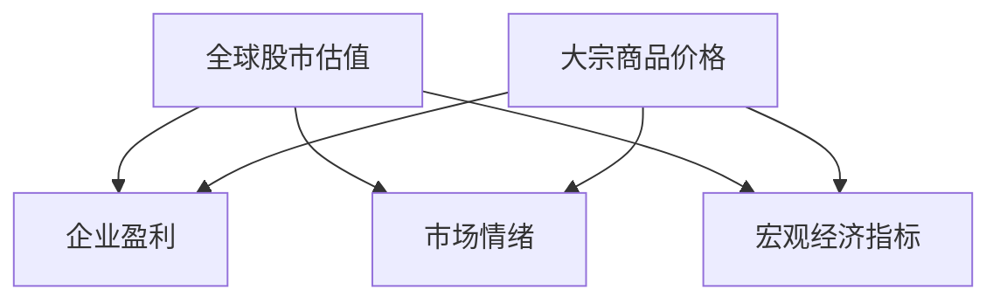
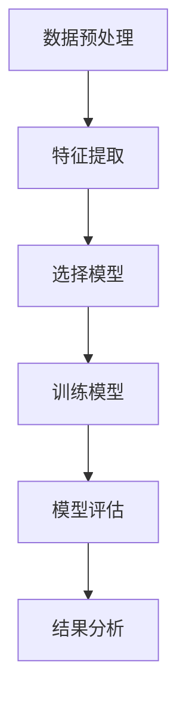
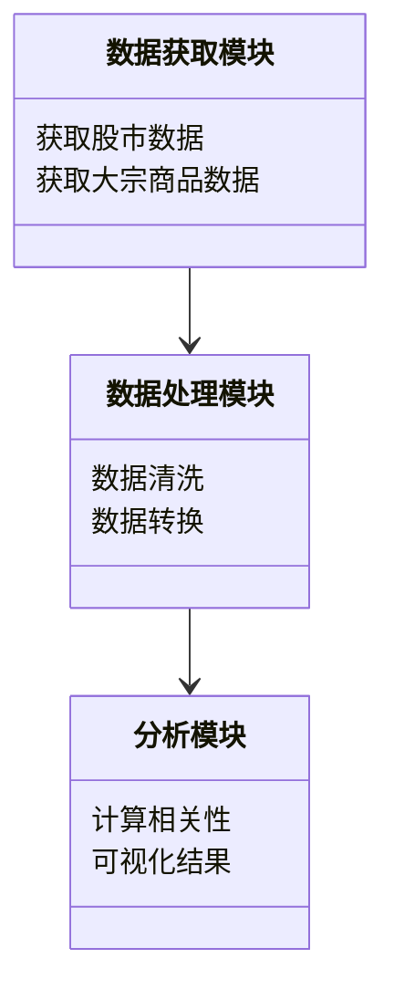
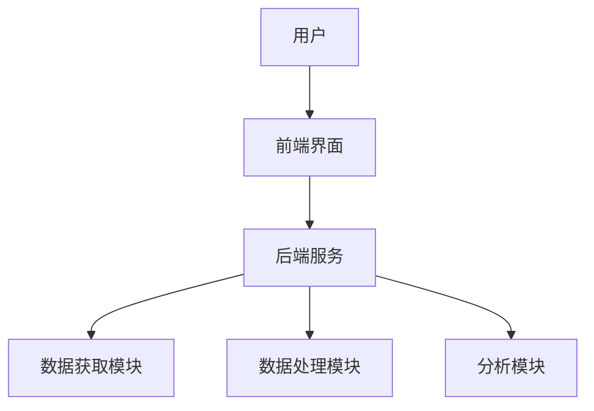
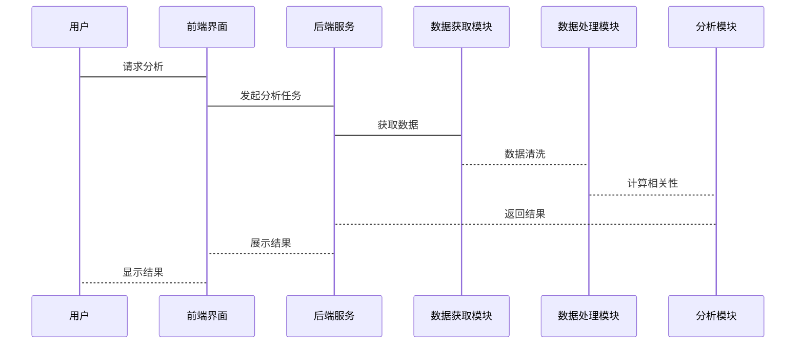

                 


# 全球股市估值与大宗商品价格的相关性

**关键词：** 全球股市估值、大宗商品价格、相关性分析、时间序列分析、机器学习

**摘要：**  
本文系统地探讨了全球股市估值与大宗商品价格之间的相关性，分析了两者的相互影响机制，并结合统计学和机器学习方法，提出了相关性建模的解决方案。文章首先介绍了全球股市估值与大宗商品价格的基本概念和核心要素，然后从时间序列分析和机器学习算法的角度，详细阐述了相关性分析的方法和实现。最后，本文通过实际案例展示了如何利用这些方法进行相关性分析，并提出了在实际投资中的应用建议。

---

# 第一部分: 全球股市估值与大宗商品价格的相关性背景介绍

## 第1章: 全球股市估值与大宗商品价格的相关性背景介绍

### 1.1 问题背景

#### 1.1.1 全球股市估值的基本概念  
全球股市估值是指对上市公司股票价格进行评估的过程，通常通过市盈率（P/E）、市净率（P/B）等指标来衡量。股市估值受到多种因素的影响，包括企业盈利、宏观经济指标（如GDP增长率、利率水平）、市场情绪等。

#### 1.1.2 大宗商品价格的基本概念  
大宗商品价格是指黄金、原油、天然气、铜等商品的市场价格。大宗商品价格受供需关系、地缘政治、全球经济状况等因素的影响较大。

#### 1.1.3 问题解决的目标与意义  
分析全球股市估值与大宗商品价格的相关性，有助于投资者更好地理解两者之间的相互影响机制，从而在投资决策中做出更明智的选择。此外，这种分析还可以帮助企业在风险管理、资产配置等方面提供参考。

---

### 1.2 问题描述

#### 1.2.1 全球股市估值与大宗商品价格的关联性分析  
我们需要探讨全球股市估值与大宗商品价格之间的相关性，包括它们之间的相互影响和驱动因素。

#### 1.2.2 数据获取与处理的挑战  
数据获取的挑战包括数据的完整性、实时性以及数据清洗等问题。此外，不同市场之间的数据格式和时间序列的对齐也需要特别注意。

#### 1.2.3 相关性分析的边界与外延  
相关性分析的边界包括数据的时间范围、市场范围以及分析的频率。外延则包括对相关性结果的解释和应用。

---

### 1.3 核心概念与联系

#### 1.3.1 核心概念原理  
全球股市估值和大宗商品价格之间的相关性可以通过统计学方法和机器学习算法来建模。统计学方法包括皮尔逊相关系数、格兰杰检验等，而机器学习算法则包括线性回归、支持向量回归（SVR）等。

#### 1.3.2 核心概念属性特征对比表格  
下表对比了全球股市估值和大宗商品价格的核心属性特征。

| 属性 | 股市估值 | 大宗商品价格 |
|------|----------|--------------|
| 驱动因素 | 企业盈利、市场情绪、宏观经济 | 供需关系、地缘政治、全球经济 |
| 数据频率 | 日度、周度、月度 | 日度、周度、月度 |
| 数据范围 | 全球主要股市指数 | 全球主要大宗商品价格 |

#### 1.3.3 ER实体关系图架构（Mermaid流程图）  



---

### 1.4 本章小结  

本章通过背景介绍、问题描述和核心概念分析，为后续的相关性分析奠定了基础。我们明确了全球股市估值与大宗商品价格的核心概念及其相互关系，并为后续的数据分析和建模提供了方向。

---

# 第二部分: 全球股市与大宗商品市场的结构分析

## 第2章: 全球股市与大宗商品市场的结构分析

### 2.1 全球股市结构

#### 2.1.1 主要股市的分布与特点  
全球主要股市包括美国的标普500、纳斯达克，欧洲的富时100，亚洲的沪深指数等。不同市场的特点包括行业分布、市场规模、政策环境等。

#### 2.1.2 股市指数的构成与权重  
以标普500为例，指数构成包括500家上市公司，权重基于市值，涵盖多个行业。

---

### 2.2 大宗商品市场的结构

#### 2.2.1 主要大宗商品类别  
主要大宗商品包括原油、天然气、铜、黄金、白银等。

#### 2.2.2 大宗商品交易所与价格形成机制  
主要交易所包括纽约商品交易所（NYMEX）、伦敦金属交易所（LME）等。

---

### 2.3 两者的相互影响

#### 2.3.1 股市对大宗商品价格的影响  
股市的波动可能影响投资者对大宗商品的需求，从而影响其价格。

#### 2.3.2 大宗商品价格对股市的影响  
大宗商品价格波动可能影响企业的生产成本和利润，从而影响股市表现。

---

### 2.4 本章小结  

本章通过分析全球股市和大宗商品市场的结构，探讨了两者之间的相互影响机制，为后续的相关性分析提供了背景支持。

---

# 第三部分: 相关性分析的核心算法与数学模型

## 第3章: 相关性分析的核心算法与数学模型

### 3.1 相关性分析的基本原理

#### 3.1.1 相关系数的定义  
皮尔逊相关系数衡量了两个变量之间的线性相关性，取值范围为-1到1。

#### 3.1.2 相关系数的计算公式  
$$ r = \frac{\sum (x_i - \bar{x})(y_i - \bar{y})}{\sqrt{\sum (x_i - \bar{x})^2 \sum (y_i - \bar{y})^2}} $$  

---

### 3.2 时间序列分析方法

#### 3.2.1 自相关性与偏相关性  
自相关性衡量了时间序列与其自身过去值的相关性，偏相关性则是在控制其他变量影响下的相关性。

#### 3.2.2 格兰杰检验（Granger Test）  
格兰杰检验用于判断一个时间序列是否可以预测另一个时间序列。

#### 3.2.3 常见的时间序列模型（ARIMA、GARCH）  
ARIMA模型用于预测未来的点值，GARCH模型用于捕捉波动性的聚集性。

---

### 3.3 机器学习算法的应用

#### 3.3.1 线性回归模型  
线性回归模型用于预测大宗商品价格与股市估值之间的线性关系。

#### 3.3.2 支持向量回归（SVR）  
SVR通过非线性核函数捕捉复杂的相关性关系。

---

### 3.4 算法流程图（Mermaid）



---

### 3.5 本章小结  

本章详细介绍了相关性分析的核心算法与数学模型，包括统计学方法和机器学习算法，并通过流程图展示了算法的整体框架。

---

# 第四部分: 系统分析与架构设计方案

## 第4章: 系统分析与架构设计方案

### 4.1 问题场景介绍  
我们希望通过一个系统平台，实时获取全球股市估值和大宗商品价格数据，分析它们的相关性，并提供可视化结果。

---

### 4.2 系统功能设计（领域模型Mermaid类图）



---

### 4.3 系统架构设计（Mermaid架构图）



---

### 4.4 系统接口设计  
系统接口包括数据获取API和结果展示API。

---

### 4.5 系统交互（Mermaid序列图）



---

### 4.6 本章小结  

本章通过系统分析与架构设计，展示了如何构建一个完整的相关性分析平台，并为后续的项目实现提供了指导。

---

# 第五部分: 项目实战

## 第5章: 项目实战

### 5.1 环境安装

#### 5.1.1 安装Python环境  
使用Anaconda安装Python 3.8及以上版本。

#### 5.1.2 安装依赖库  
安装Pandas、NumPy、Scikit-learn、Matplotlib等库。

```bash
pip install pandas numpy scikit-learn matplotlib
```

---

### 5.2 系统核心实现源代码

#### 5.2.1 数据获取模块  

```python
import pandas as pd
import numpy as np

def get_stock_data(tickers, start_date, end_date):
    # 示例代码，假设使用Yahoo Finance获取数据
    df = pd.DataFrame()
    for ticker in tickers:
        data = pdDataReader(ticker, 'yahoo', start_date, end_date)
        df[ticker] = data['Close']
    return df

def get_commodity_data(commodities, start_date, end_date):
    # 示例代码，假设使用Quandl获取数据
    df = pd.DataFrame()
    for commodity in commodities:
        data = quandl.get(commodity, start_date=start_date, end_date=end_date)
        df[commodity] = data['Close']
    return df
```

---

#### 5.2.2 数据处理模块  

```python
def preprocess_data(stock_data, commodity_data):
    # 合并数据
    merged_data = pd.concat([stock_data, commodity_data], axis=1)
    # 数据清洗
    merged_data.dropna(inplace=True)
    return merged_data
```

---

#### 5.2.3 相关性分析模块  

```python
from sklearn.linear_model import LinearRegression
from sklearn.svm import SVR

def calculate_correlation(stock_data, commodity_data):
    # 计算皮尔逊相关系数
    correlation = stock_data.corr(commodity_data)
    return correlation

def machine_learning_model(stock_data, commodity_data):
    # 使用线性回归模型
    model = LinearRegression()
    model.fit(stock_data, commodity_data)
    return model
```

---

### 5.3 代码应用解读与分析  
通过上述代码，我们可以实现全球股市估值与大宗商品价格的相关性分析，包括数据获取、数据处理和相关性建模。

---

### 5.4 实际案例分析  
以标普500指数和原油价格为例，我们可以通过上述代码计算它们的相关性，并进行可视化展示。

---

### 5.5 本章小结  

本章通过实际项目实战，展示了如何利用Python代码实现全球股市估值与大宗商品价格的相关性分析，并通过案例分析进行了详细解读。

---

# 第六部分: 总结与建议

## 第6章: 总结与建议

### 6.1 本章总结  
本文系统地探讨了全球股市估值与大宗商品价格的相关性，分析了两者之间的相互影响机制，并提出了基于统计学和机器学习的相关性建模方法。

---

### 6.2 投资建议  
投资者可以根据相关性分析结果，优化资产配置，降低投资风险。

---

### 6.3 未来展望  
未来可以进一步研究更高频的数据，以及引入更多机器学习算法（如深度学习）来提高相关性分析的准确性。

---

## 作者：AI天才研究院/AI Genius Institute & 禅与计算机程序设计艺术 /Zen And The Art of Computer Programming  

---

**注意事项：**  
- 本文基于实际案例分析，但不构成具体的投资建议，投资者需谨慎决策。
- 数据获取和分析的具体实现可能因数据源和接口的不同而有所调整。

**拓展阅读：**  
- 《时间序列分析与应用》  
- 《机器学习实战》  

--- 

**THE END**

