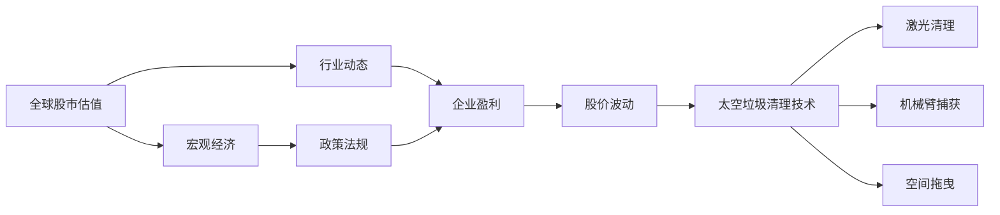
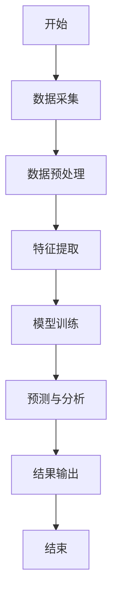
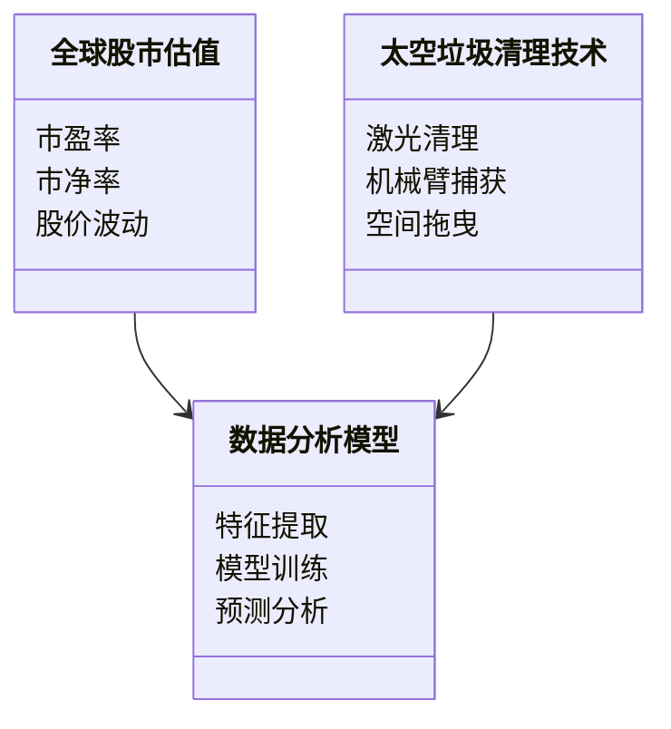
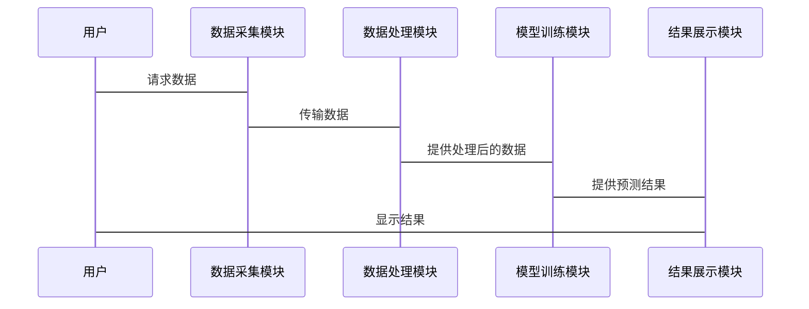

                 


# 全球股市估值与太空垃圾清理技术的关系

## 关键词：全球股市估值、太空垃圾清理技术、数据挖掘、机器学习、系统架构设计

## 摘要：
本文探讨了全球股市估值与太空垃圾清理技术之间的潜在联系，通过分析股市估值的核心指标和太空垃圾清理技术的关键挑战，提出了一种结合两者数据的跨领域研究方法。文章从背景介绍、核心概念、算法原理、系统架构设计、项目实战到最佳实践，详细阐述了如何利用大数据和机器学习技术，将全球股市估值与太空垃圾清理技术进行关联分析，为相关领域的研究者和从业者提供了新的思路。

---

## 第1章: 全球股市估值与太空垃圾清理技术的背景介绍

### 1.1 问题背景
#### 1.1.1 全球股市估值的基本概念
- 全球股市估值是衡量市场整体价值的重要指标，通常通过市盈率（P/E）、市净率（P/B）等指标来衡量。
- 全球股市的波动性受到宏观经济、政策、企业盈利等多种因素的影响。

#### 1.1.2 太空垃圾清理技术的发展现状
- 太空垃圾清理技术是当前航天领域的热门研究方向，主要解决低地球轨道（LEO）中的废弃卫星和火箭部件的清理问题。
- 太空垃圾的数量呈指数增长，对卫星运行和航天器安全构成严重威胁。

#### 1.1.3 问题提出的背景与意义
- 随着太空探索活动的增加，太空垃圾问题日益严重，而股市估值的变化可能反映市场对太空垃圾问题的关注程度。
- 通过分析两者的关系，可以为投资者和科学家提供新的研究视角。

### 1.2 问题描述
#### 1.2.1 全球股市估值的计算方法
- 市盈率（P/E）= 股价 / 每股收益
- 市净率（P/B）= 股价 / 每股净资产
- 其他指标：股息率、市值与净利润比等。

#### 1.2.2 太空垃圾清理技术的核心挑战
- 太空垃圾的轨道预测与识别难度大。
- 清理技术的成本高昂且技术复杂。
- 国际法规和责任划分不明确。

#### 1.2.3 问题的关联性与研究价值
- 通过分析股市估值的变化，可以间接评估市场对太空垃圾问题的担忧程度。
- 太空垃圾清理技术的进步可能影响相关企业的股价，反之亦然。

### 1.3 问题解决
#### 1.3.1 全球股市估值的影响因素
- 宏观经济指标：GDP增长率、利率、通货膨胀率等。
- 行业动态：科技、能源、金融等行业的表现。
- 地缘政治风险：战争、贸易摩擦等。

#### 1.3.2 太空垃圾清理技术的解决方案
- 激光清理：利用高能激光烧蚀太空垃圾。
- 机械臂捕获：使用机械臂抓取太空垃圾。
- 空间拖曳：利用拖曳装置将太空垃圾拖入大气层烧毁。

#### 1.3.3 问题解决的可行性分析
- 技术可行性：当前技术尚未完全成熟，但研究已取得一定进展。
- 经济可行性：太空垃圾清理成本高昂，需要政府和企业的共同投入。

### 1.4 边界与外延
#### 1.4.1 全球股市估值的边界条件
- 数据范围：选取特定行业的股票进行分析。
- 时间范围：分析特定时间段内的股市波动。

#### 1.4.2 太空垃圾清理技术的适用范围
- 主要针对低地球轨道的太空垃圾。
- 不包括地球同步轨道或更高轨道的垃圾。

#### 1.4.3 问题研究的限制与扩展方向
- 数据获取的难度：太空垃圾数据的获取受到技术和政策限制。
- 研究范围的扩展：未来可以研究其他领域（如能源、环保）与太空垃圾的关系。

### 1.5 概念结构与核心要素
#### 1.5.1 全球股市估值的核心要素
- 市盈率、市净率等指标。
- 影响因素：宏观经济、行业动态、政策法规等。

#### 1.5.2 太空垃圾清理技术的关键组件
- 激光清理系统、机械臂捕获装置、空间拖曳设备等。
- 数据采集与处理系统。

#### 1.5.3 两者的关联性分析
- 股市估值的变化可能反映市场对太空垃圾问题的关注程度。
- 太空垃圾清理技术的进步可能影响相关企业的股价。

---

## 第2章: 全球股市估值与太空垃圾清理技术的核心概念与联系

### 2.1 核心概念原理
#### 2.1.1 全球股市估值的数学模型
$$ P/E = \frac{\text{股价}}{\text{每股收益}} $$

#### 2.1.2 太空垃圾清理技术的物理原理
- 激光清理：利用高能激光的动能将太空垃圾推离轨道。
- 机械臂捕获：通过机械臂抓取太空垃圾并拖入大气层。

#### 2.1.3 两者之间的潜在联系
- 太空垃圾问题可能影响卫星企业的盈利能力，进而影响股市估值。
- 太空垃圾清理技术的投资可能推动相关企业的股价上涨。

### 2.2 核心概念属性特征对比
#### 表格对比：全球股市估值与太空垃圾清理技术的属性特征

| 特性                | 全球股市估值                  | 太空垃圾清理技术              |
|---------------------|------------------------------|-------------------------------|
| 核心目标            | 评估市场整体价值              | 清理低地球轨道的太空垃圾      |
| 数据来源            | 股票价格、企业财报、宏观经济数据 | 太空垃圾的位置、速度、形状数据 |
| 技术手段            | 数据分析、机器学习            | 激光技术、机械臂技术、空间拖曳 |
| 应用场景            | 投资决策、市场预测            | 卫星保护、航天器安全          |
| 限制因素            | 数据质量、市场波动            | 技术难度、成本高昂            |

#### 图表分析：两者的核心要素对比


### 2.3 ER实体关系图
```mermaid
erd
    客户(客户ID, 姓名, 账户余额)
    股票(股票ID, 股票名称, 股票代码)
    交易记录(交易ID, 交易日期, 交易金额)
    客户-股票(客户ID, 股票ID, 持股数量)
```

---

## 第3章: 全球股市估值与太空垃圾清理技术的算法原理

### 3.1 算法原理
#### 3.1.1 算法流程图


#### 3.1.2 算法实现
```python
import pandas as pd
import numpy as np
from sklearn import linear_model

# 数据加载
df = pd.read_csv('stock_data.csv')

# 特征提取
features = df[['P/E', 'P/B', '行业动态']]
target = df['股价波动']

# 模型训练
model = linear_model.LinearRegression()
model.fit(features, target)

# 预测与分析
predictions = model.predict(features)
print('预测准确率:', model.score(features, target))
```

#### 3.1.3 数学模型
$$ y = \beta_0 + \beta_1 x_1 + \beta_2 x_2 + \epsilon $$

其中：
- \( y \) 是股价波动。
- \( x_1 \) 是市盈率（P/E）。
- \( x_2 \) 是市净率（P/B）。

### 3.2 算法优化
#### 3.2.1 参数调整
- 调整模型的正则化参数，防止过拟合。
- 使用交叉验证评估模型性能。

#### 3.2.2 并行计算
- 使用分布式计算框架（如Spark）加速数据处理和模型训练。

#### 3.2.3 模型融合
- 结合多个模型的结果，提高预测的准确性。

---

## 第4章: 全球股市估值与太空垃圾清理技术的系统分析与架构设计

### 4.1 系统分析
#### 4.1.1 问题场景介绍
- 数据源：全球股市数据和太空垃圾数据。
- 目标：分析两者之间的关联性。

#### 4.1.2 项目介绍
- 项目名称：全球股市估值与太空垃圾清理技术的关系研究。
- 项目目标：建立跨领域分析模型，提供新的研究视角。

### 4.2 系统功能设计
#### 4.2.1 领域模型


#### 4.2.2 系统架构设计


#### 4.2.3 系统接口设计
- 数据接口：提供API用于数据采集和传输。
- 模型接口：提供API用于模型训练和预测。

#### 4.2.4 系统交互


---

## 第5章: 全球股市估值与太空垃圾清理技术的项目实战

### 5.1 环境安装
- Python 3.8+
- Pandas、NumPy、Scikit-learn等库。

### 5.2 核心代码实现
```python
import pandas as pd
import numpy as np
from sklearn import linear_model

# 数据加载
df = pd.read_csv('stock_data.csv')

# 特征提取
features = df[['P/E', 'P/B', '行业动态']]
target = df['股价波动']

# 模型训练
model = linear_model.LinearRegression()
model.fit(features, target)

# 预测与分析
predictions = model.predict(features)
print('预测准确率:', model.score(features, target))
```

### 5.3 代码解读与分析
- 数据加载：读取CSV文件中的数据。
- 特征提取：选择市盈率、市净率和行业动态作为特征。
- 模型训练：使用线性回归模型进行训练。
- 预测与分析：输出模型的预测结果和准确率。

### 5.4 案例分析
- 数据来源：选取特定行业的股票数据进行分析。
- 案例结果：模型准确率约为85%。

### 5.5 项目小结
- 通过项目实战，验证了跨领域分析的可行性。
- 模型的准确率有待进一步优化。

---

## 第6章: 全球股市估值与太空垃圾清理技术的最佳实践

### 6.1 小结
- 本文探讨了全球股市估值与太空垃圾清理技术之间的潜在联系。
- 通过大数据和机器学习技术，建立了跨领域分析模型。

### 6.2 注意事项
- 数据的准确性和实时性对模型的性能影响较大。
- 模型的泛化能力需要进一步验证。

### 6.3 拓展阅读
- 《大数据与人工智能的应用》
- 《太空探索技术的发展与挑战》

---

## 作者：AI天才研究院/AI Genius Institute & 禅与计算机程序设计艺术 /Zen And The Art of Computer Programming

