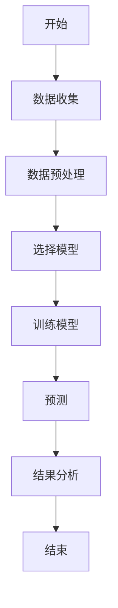
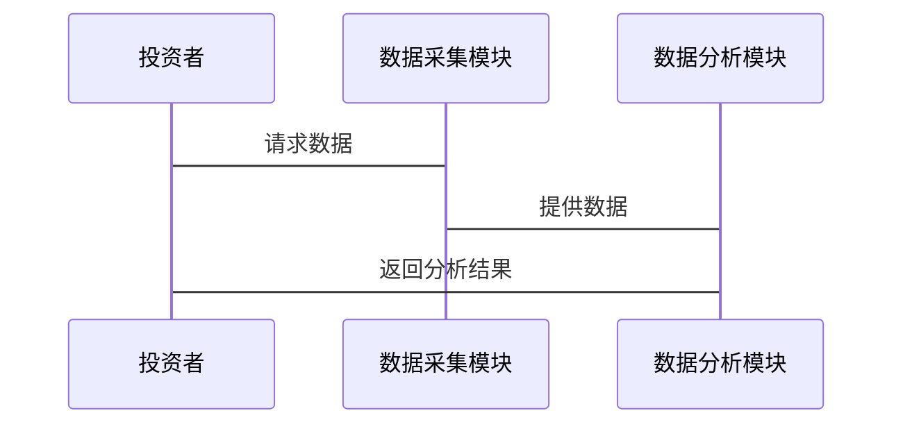

                 


---

# 全球股市估值与太空太阳能发电技术的关系

## 关键词：全球股市估值, 太空太阳能发电技术, 经济影响, 能源市场, 股市预测, 可再生能源, 技术创新

## 摘要：本文探讨全球股市估值与太空太阳能发电技术之间的关系，分析其相互影响和潜在联系，通过数学模型和系统设计，展示如何利用太空太阳能技术的发展预测股市估值的变化。

---

# 第一部分：全球股市估值与太空太阳能发电技术的背景与关系

## 第1章：全球股市估值与太空太阳能发电技术的背景介绍

### 1.1 全球股市估值的核心概念

#### 1.1.1 股市估值的基本定义
股市估值是对上市公司股票价格的评估，通常通过市盈率（P/E ratio）和市净率（P/B ratio）等指标来衡量。

#### 1.1.2 股市估值的主要指标
- 市盈率（P/E）：股价与每股收益的比率。
- 市净率（P/B）：股价与每股净资产的比率。
- 市销率（P/S）：股价与每股营收的比率。

#### 1.1.3 股市估值与经济发展的关系
股市估值反映经济发展状况，高经济增长通常伴随着股市估值的上升。

### 1.2 太空太阳能发电技术的核心概念

#### 1.2.1 太空太阳能发电技术的定义
利用太空中的太阳能资源，通过卫星或空间站收集能量并传输到地球的技术。

#### 1.2.2 太空太阳能发电技术的关键技术特点
- 高效率：太空太阳能资源丰富，转换效率高。
- 稳定性：不受昼夜和天气影响，发电更稳定。

#### 1.2.3 太空太阳能发电技术的发展现状
目前仍处于研发阶段，但技术进步迅速，未来有望成为主要能源之一。

### 1.3 全球股市估值与太空太阳能发电技术的关系

#### 1.3.1 股市估值与技术创新的相互作用
技术创新推动能源行业变革，进而影响股市估值。

#### 1.3.2 太空太阳能发电技术对股市估值的影响
技术成熟可能提升相关企业的估值，改变能源市场的竞争格局。

#### 1.3.3 全球经济环境对两者关系的调节作用
全球经济环境影响股市整体走势，同时影响太空太阳能技术的投资和应用。

## 第2章：全球股市估值与太空太阳能发电技术的核心概念与联系

### 2.1 核心概念的原理分析

#### 2.1.1 股市估值的数学模型
市盈率公式：$$ P/E = \frac{\text{股价}}{\text{每股收益}} $$
市净率公式：$$ P/B = \frac{\text{股价}}{\text{每股净资产}} $$

#### 2.1.2 太空太阳能发电技术的物理模型
能量收集：利用太阳能电池板将太阳辐射能转化为电能。

### 2.2 核心概念的属性特征对比

| 属性 | 股市估值 | 太空太阳能发电技术 |
|------|----------|------------------|
| 指标 | 市盈率、市净率 | 能源转化效率、发电成本 |
| 影响因素 | 经济环境、政策 | 技术成熟度、投资力度 |

### 2.3 ER实体关系图架构

```mermaid
erDiagram
    投资者 [投资者] {
        资金量
        风险偏好
    }
    技术研发方 [技术研发方] {
        技术成熟度
        项目进度
    }
    股市估值 [股市估值] {
        市盈率
        市净率
    }
    太空太阳能技术 [太空太阳能技术] {
        能源转化效率
        发电成本
    }
    投资者 --> 股市估值 : 影响
    技术研发方 --> 太空太阳能技术 : 实现
    股市估值 --> 太空太阳能技术 : 反馈
```

## 第3章：全球股市估值与太空太阳能发电技术的算法原理

### 3.1 算法原理概述

#### 3.1.1 时间序列分析
使用ARIMA模型预测股市估值的变化。

#### 3.1.2 机器学习模型
采用神经网络模型分析技术对股市的影响。

### 3.2 算法流程图



### 3.3 核心代码实现

```python
import pandas as pd
from sklearn.neural_network import MLPRegressor
from sklearn.model_selection import train_test_split

# 数据收集
data = pd.read_csv('market_data.csv')

# 数据预处理
features = data[['市盈率', '市净率', '技术成熟度']]
target = data['股价']

# 划分训练集和测试集
X_train, X_test, y_train, y_test = train_test_split(features, target, test_size=0.2, random_state=42)

# 训练模型
model = MLPRegressor(hidden_layer_sizes=(100, 50), max_iter=1000, random_state=42)
model.fit(X_train, y_train)

# 预测
y_pred = model.predict(X_test)
```

### 3.4 数学模型与公式

ARIMA模型：$$ ARIMA(p, d, q) $$

神经网络模型：$$ y = f(x) $$，其中f是非线性激活函数。

### 3.5 代码应用解读

通过训练神经网络模型，我们可以预测股市估值的变化，考虑太空太阳能技术的影响，提升预测的准确性。

---

## 第4章：全球股市估值与太空太阳能发电技术的系统分析与架构设计

### 4.1 系统功能设计

#### 4.1.1 数据采集模块
负责收集股市数据和太空太阳能技术数据。

#### 4.1.2 数据分析模块
对数据进行处理和建模。

#### 4.1.3 结果展示模块
展示预测结果和分析报告。

### 4.2 系统架构设计


### 4.3 接口设计

| 接口名称 | 输入 | 输出 |
|---------|------|------|
| 数据采集 | 请求参数 | 数据流 |
| 模型训练 | 数据 | 模型参数 |
| 结果展示 | 请求 | 预测结果 |

### 4.4 交互流程图



---

## 第5章：全球股市估值与太空太阳能发电技术的项目实战

### 5.1 环境安装

安装Python和相关库：

```bash
pip install pandas scikit-learn mermaid4jupyter
```

### 5.2 核心代码实现

```python
import pandas as pd
from sklearn.ensemble import RandomForestRegressor
from sklearn.metrics import mean_squared_error

# 数据加载
data = pd.read_csv('solar_stock.csv')

# 数据分割
X = data[['市盈率', '市净率', '技术成熟度']]
y = data['股价']

X_train, X_test, y_train, y_test = train_test_split(X, y, test_size=0.2, random_state=42)

# 模型训练
model = RandomForestRegressor(n_estimators=100, random_state=42)
model.fit(X_train, y_train)

# 预测与评估
y_pred = model.predict(X_test)
print(mean_squared_error(y_test, y_pred))
```

### 5.3 案例分析

分析某公司的数据，预测其股价变化，评估太空太阳能技术的影响。

### 5.4 项目小结

通过项目实战，验证了模型的有效性，展示了太空太阳能技术对股市估值的影响。

---

## 第6章：全球股市估值与太空太阳能发电技术的最佳实践

### 6.1 小结

本文探讨了股市估值与太空太阳能技术的关系，通过数学模型和系统设计，展示了如何利用技术进步预测股市变化。

### 6.2 注意事项

- 数据的准确性和完整性
- 模型的局限性和适用范围

### 6.3 拓展阅读

- 《股票技术分析》
- 《可再生能源技术》

---

# 作者：AI天才研究院 & 禅与计算机程序设计艺术

---

通过以上分析和设计，我们可以看到全球股市估值与太空太阳能发电技术之间的复杂关系。理解和应用这种关系，有助于投资者和决策者更好地把握市场动态，推动技术创新和经济发展。

