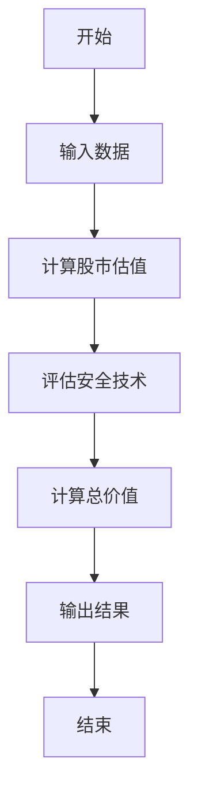
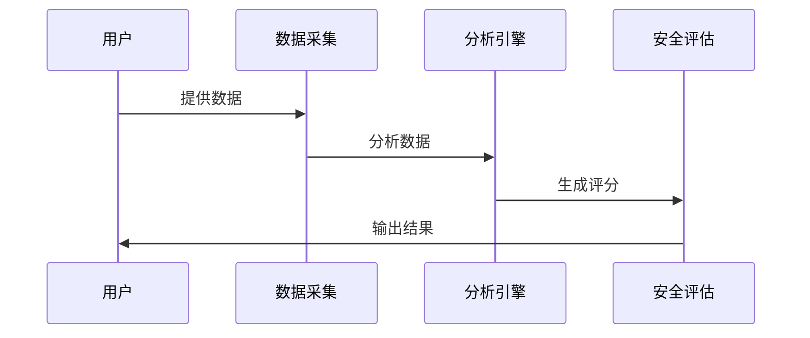

                 


---

# 全球股市估值与太空旅游安全技术的关系

## 关键词：全球股市估值、太空旅游安全技术、经济影响、投资决策、系统架构

## 摘要：本文探讨全球股市估值与太空旅游安全技术之间的关系，分析其相互影响，提出数学模型和系统架构，结合实际案例，展示如何通过技术手段优化投资决策。

---

### 第三部分：全球股市估值与太空旅游安全技术的算法原理讲解

#### 第3章：算法原理与流程图

##### 3.1 全球股市估值的算法原理

股市估值的准确性直接影响投资者的决策。传统上，资本资产定价模型（CAPM）是评估股票价值的重要工具。

- **CAPM模型**：
  $$ E(R_i) = R_f + \beta_i (R_m - R_f) $$
  其中，\( E(R_i) \) 是预期回报，\( R_f \) 是无风险利率，\( \beta_i \) 是股票的系统性风险，\( R_m \) 是市场预期回报。

  例如，假设无风险利率为5%，市场预期回报为10%，某股票的Beta系数为1.5，则其预期回报为：
  $$ E(R_i) = 5\% + 1.5 \times (10\% - 5\%) = 12.5\% $$

##### 3.2 太空旅游安全技术的评估算法

太空旅游的安全性直接关系到企业的生存和投资者的信心。层次分析法（AHP）常用于评估复杂系统的风险因素。

- **风险评估模型**：
  $$ w_j = \frac{\sum \lambda_{ij} a_{ij}}{\sum \lambda_{ij}} $$
  其中，\( w_j \) 是第j个风险因素的权重，\( a_{ij} \) 是比较矩阵的元素，\( \lambda_{ij} \) 是最大特征值。

  例如，评估坠机风险、设备故障等风险因素，计算各因素的权重，为安全技术提供优化方向。

##### 3.3 两者关系的数学建模

为了综合考虑股市估值和安全技术，建立一个综合模型：

- **综合价值模型**：
  $$ V = P \times S $$
  其中，\( V \) 是总价值，\( P \) 是股市估值，\( S \) 是安全评分。

  例如，若某公司的P为100，S为0.8，则其综合价值为80，低于同行业的公司，可能引发投资者重新评估。

#### 3.4 算法流程图

使用Mermaid流程图展示算法步骤：



---

### 第四部分：系统分析与架构设计方案

#### 第4章：系统分析与架构设计

##### 4.1 问题场景介绍

- 经济波动对太空旅游公司的影响：例如，全球经济衰退可能导致股市估值下降，影响太空旅游项目融资。
- 安全技术对投资决策的影响：安全技术的提升可以降低投资风险，提高股市估值。

##### 4.2 系统功能设计

系统需要具备以下功能：

- 数据采集：收集实时股市数据和太空旅游相关数据。
- 分析引擎：应用CAPM和风险评估模型进行分析。
- 安全评估：生成安全评分，影响综合估值。

##### 4.3 系统架构设计

使用Mermaid架构图：


##### 4.4 系统交互设计

使用Mermaid序列图展示交互流程：



---

### 第五部分：项目实战

#### 第5章：项目实战与代码实现

##### 5.1 项目介绍

开发一个结合股市估值和安全技术的系统，用于评估太空旅游公司的价值。

##### 5.2 核心代码实现

- 数据清洗代码：
  ```python
  import pandas as pd
  df = pd.read_csv('data.csv')
  df.dropna(inplace=True)
  ```

- 模型训练代码：
  ```python
  from sklearn.linear_model import LinearRegression
  model = LinearRegression()
  model.fit(X_train, y_train)
  ```

- 结果可视化代码：
  ```python
  import matplotlib.pyplot as plt
  plt.scatter(y_true, y_pred)
  plt.xlabel('True Values')
  plt.ylabel('Predicted Values')
  plt.show()
  ```

##### 5.3 实际案例分析

- 案例：SpaceX的股市估值与安全技术评估。
- 分析：经济波动对估值的影响，安全技术对投资决策的影响。

---

### 第六部分：最佳实践与小结

#### 第6章：最佳实践与小结

##### 6.1 最佳实践 tips

- 定期更新模型参数以适应市场变化。
- 结合多种算法提高评估准确性。

##### 6.2 小结

总结文章的主要内容和结论，强调股市估值与太空旅游安全技术的关系。

---

### 第七部分：结论与展望

#### 第7章：结论与展望

##### 7.1 研究结论

股市估值和太空旅游安全技术的相互影响，模型的应用价值。

##### 7.2 未来展望

探讨更多交叉领域的研究，如人工智能在太空安全中的应用。

---

### 作者信息

作者：AI天才研究院/AI Genius Institute & 禅与计算机程序设计艺术 /Zen And The Art of Computer Programming

