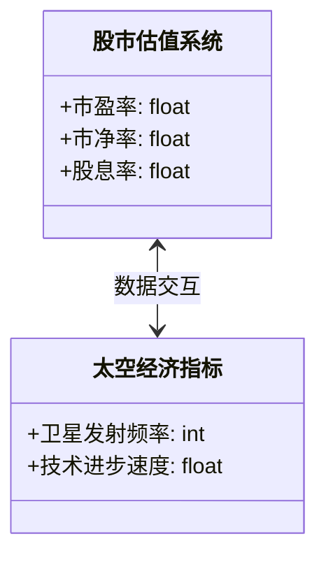

                 


# 全球股市估值与太空经济发展的关系

**关键词**：全球股市估值、太空经济发展、经济关系、数学模型、系统设计、投资分析

**摘要**：  
本文探讨了全球股市估值与太空经济发展之间的复杂关系，通过分析股市估值的核心指标、太空经济的主要驱动因素，以及两者之间的互动机制，构建了数学模型和系统架构，提出了基于太空经济因素的股市投资策略。文章从背景介绍、核心概念、数学建模、系统设计到项目实战，层层深入，为读者提供了全面的分析和实践指导。

---

# 第一部分: 全球股市估值与太空经济发展的背景与核心概念

## 第1章: 全球股市估值与太空经济的概述

### 1.1 全球股市估值的核心概念

#### 1.1.1 股市估值的基本定义  
股市估值是指通过对企业资产、收益、市场地位等多方面因素的分析，对企业的市场价值进行评估的过程。常见的估值方法包括市盈率（P/E）、市净率（P/B）、股息率等。  

#### 1.1.2 太空经济的定义与范围  
太空经济是指与航天技术、卫星通信、太空资源开发等相关产业的总和。其范围包括卫星发射、空间探索、太空资源利用等领域。  

#### 1.1.3 两者的关联性与研究意义  
股市估值与太空经济的关联性主要体现在：  
1. 太空经济的快速发展可能推动相关企业的市值增长。  
2. 股市资金为太空经济的项目提供融资支持。  
3. 太空经济的技术进步可能影响股市的整体估值水平。

---

### 1.2 全球股市估值与太空经济的核心要素

#### 1.2.1 股市估值的关键指标  
- 市盈率（P/E）：市价与每股收益的比率。  
- 市净率（P/B）：市价与每股净资产的比率。  
- 股息率：股息与股价的比率。  

#### 1.2.2 太空经济的主要驱动因素  
- 技术进步：卫星技术、火箭发射技术的提升。  
- 政策支持：政府对太空经济的投入和补贴。  
- 商业需求：通信、导航、遥感等领域的市场需求。  

#### 1.2.3 两者之间的互动关系  
- 太空经济的技术进步会提升相关企业的市场价值，从而影响股市估值。  
- 股市资金的流入为太空经济项目提供了资金支持，推动其发展。  

---

## 第2章: 全球股市估值与太空经济发展的核心概念与联系

### 2.1 核心概念的原理分析

#### 2.1.1 股市估值的理论基础  
股市估值基于市场预期和企业基本面分析。投资者通过分析企业的盈利能力、成长潜力和市场地位，来判断其股票的合理价值。  

#### 2.1.2 太空经济的产业特征  
太空经济具有高技术门槛、高投入、高回报的特点。其发展依赖于技术创新和政策支持。  

#### 2.1.3 两者的相互影响机制  
- 太空经济的技术进步会提升相关企业的市场竞争力，从而提高其股市估值。  
- 股市资金的流入为太空经济项目提供了资金支持，推动其更快发展。  

### 2.2 概念属性对比表格

| **属性**       | **股市估值**         | **太空经济**         |
|-----------------|----------------------|----------------------|
| 核心驱动因素    | 市场预期、企业盈利   | 技术进步、政策支持   |
| 主要影响因素    | 利率、市场情绪       | 发射成本、市场需求   |
| 发展趋势        | 波动性较大           | 增长潜力巨大         |
| 关联性          | 高度相关            | 间接关联，但潜力巨大 |

### 2.3 ER实体关系图

```mermaid
erDiagram
    股市估值 <--- 关联关系 --> 太空经济
    股市估值 --> 影响因素 : 市场情绪
    太空经济 --> 影响因素 : 技术进步
```

---

# 第二部分: 全球股市估值与太空经济发展的数学模型与算法原理

## 第3章: 数学模型与算法原理

### 3.1 股市估值与太空经济关系的数学模型

#### 3.1.1 模型假设与变量定义  
- \( V \)：股市估值（以市盈率为指标）。  
- \( T \)：太空经济指数（包括卫星发射频率、技术进步速度等）。  
- \( S \)：其他影响因素（如市场情绪、政策变化等）。  

#### 3.1.2 模型构建与公式推导  
假设股市估值 \( V \) 受太空经济指数 \( T \) 和其他因素 \( S \) 的共同影响，构建如下线性回归模型：  
$$ V = \alpha \cdot T + \beta \cdot S + \gamma $$  
其中，\( \alpha \) 和 \( \beta \) 为回归系数，\( \gamma \) 为误差项。  

---

## 第4章: 系统分析与架构设计

### 4.1 系统功能设计

#### 4.1.1 领域模型类图



#### 4.1.2 系统架构图


---

## 第5章: 项目实战与案例分析

### 5.1 环境安装与数据准备

```bash
pip install pandas numpy matplotlib
```

### 5.2 核心代码实现

```python
import pandas as pd
import numpy as np
from sklearn.linear_model import LinearRegression

# 数据准备
data = pd.DataFrame({
    'T': [10, 15, 20, 25, 30],  # 太空经济指数
    'S': [5, 6, 7, 8, 9],       # 其他因素
    'V': [20, 25, 30, 35, 40]   # 股市估值
})

# 模型训练
model = LinearRegression()
model.fit(data[['T', 'S']], data['V'])

# 模型预测
new_data = pd.DataFrame({
    'T': [35],
    'S': [10]
})
print(model.predict(new_data))
```

### 5.3 代码解读与分析

- 数据准备：构建包含太空经济指数 \( T \)、其他因素 \( S \) 和股市估值 \( V \) 的数据集。  
- 模型训练：使用线性回归算法，基于 \( T \) 和 \( S \) 预测 \( V \)。  
- 模型预测：输入新的 \( T \) 和 \( S \) 值，预测股市估值。  

---

## 第6章: 总结与展望

### 6.1 最佳实践 tips  
- 在实际投资中，应结合多种因素进行综合分析。  
- 定期更新模型参数，以适应市场变化。  

### 6.2 小结  
本文通过理论分析和数学建模，探讨了全球股市估值与太空经济发展之间的关系，提出了基于太空经济因素的股市投资策略。  

### 6.3 注意事项  
- 模型结果仅供参考，实际投资需谨慎。  
- 数据来源和质量直接影响模型的准确性。  

### 6.4 拓展阅读  
- 建议进一步研究太空经济对股市的长期影响。  
- 探索更多量化投资策略，如机器学习算法的应用。  

---

**作者**：AI天才研究院/AI Genius Institute & 禅与计算机程序设计艺术/Zen And The Art of Computer Programming

