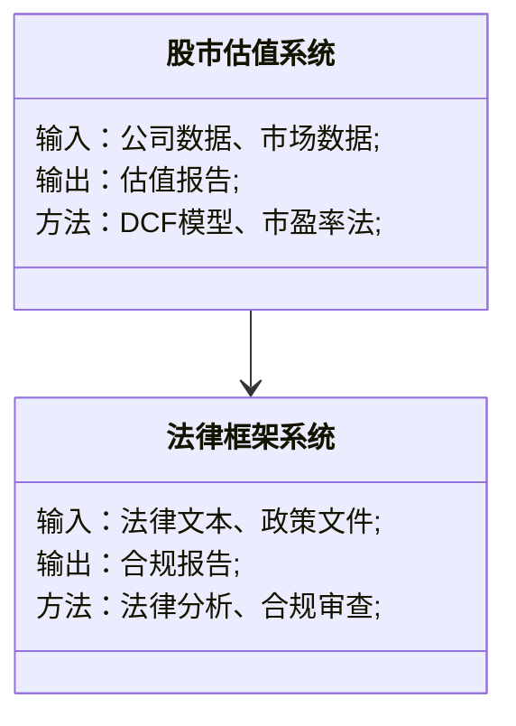

                 


# 《全球股市估值与太空资源开发法律框架的关系》

---

## 关键词：全球股市估值、太空资源开发、法律框架、股票估值模型、太空法、投资分析

---

## 摘要：  
本文探讨了全球股市估值与太空资源开发法律框架之间的复杂关系。通过分析股市估值的核心原理、太空资源开发的法律框架现状，以及两者之间的相互影响，本文揭示了如何通过法律框架的完善优化股市估值模型，推动太空资源开发的可持续性与合规性。文章结合数学模型、法律分析和实际案例，为投资者和政策制定者提供了深度洞察。

---

# 第1章: 全球股市估值与太空资源开发的背景与问题提出

## 1.1 全球股市估值的现状与挑战

### 1.1.1 股市估值的核心概念
股市估值是指通过对公司的财务数据、市场环境和行业趋势进行分析，确定其股票的合理价格。常用的方法包括市盈率（P/E）、市净率（P/B）和现金流折现模型（DCF）等。

**数学模型示例：**  
市盈率公式：  
$$ P/E = \frac{\text{股价}}{\text{每股收益}} $$

### 1.1.2 股市估值的主要影响因素
1. 公司财务状况：收入、利润、资产负债率等。
2. 行业趋势：行业增长潜力和竞争格局。
3. 宏观经济环境：GDP增速、利率、通货膨胀等。
4. 市场情绪：投资者情绪和市场流动性。

### 1.1.3 当前股市估值面临的挑战
1. 不确定性增加：地缘政治冲突、全球经济波动。
2. 技术创新：人工智能和大数据对估值方法的挑战。
3. 新兴行业：如太空资源开发对估值模型的影响。

## 1.2 太空资源开发的法律框架概述

### 1.2.1 太空资源开发的定义与范围
太空资源开发指在地球轨道以外的空间内，对资源（如 asteroid metals、月球土壤等）的开发和利用。

### 1.2.2 太空资源开发的法律框架现状
1. **国际法**：《外空条约》（Outer Space Treaty）禁止国家对太空资源进行主权宣示。
2. **国内法**：美国、欧盟等地区正在制定相关法规，明确资源开发的法律地位。

### 1.2.3 法律框架发展趋势
1. **私企参与**：SpaceX等公司推动了商业太空探索的快速发展。
2. **国际合作**：需要全球协调以解决资源分配问题。

## 1.3 问题提出与研究意义

### 1.3.1 问题背景与研究目标
随着太空资源开发的商业化，其法律不确定性可能影响相关公司的估值。

### 1.3.2 研究意义
通过分析股市估值与法律框架的互动，为投资者和政策制定者提供参考。

---

# 第2章: 全球股市估值与太空资源开发的核心概念与联系

## 2.1 全球股市估值的核心概念

### 2.1.1 股票估值的数学模型

#### 常用模型对比表：

| 模型名称 | 核心假设 | 输入参数 | 输出结果 |
|----------|----------|----------|----------|
| 市盈率法 | 市场公平 | 收益率、股价 | 估值倍数 |
| DCF模型 | 现金流折现 | 自由现金流、贴现率 | 内在价值 |

### 2.1.2 股票估值的算法原理


## 2.2 太空资源开发法律框架的核心概念

### 2.2.1 法律框架的复杂性


## 2.3 核心概念的联系

### 2.3.1 股市估值受法律框架影响的机制


---

# 第3章: 全球股市估值与太空资源开发的数学模型与法律分析

## 3.1 股票估值模型的数学分析

### 3.1.1 DCF模型的数学公式

$$ \text{内在价值} = \sum_{t=1}^{n} \frac{\text{现金流}_t}{(1 + r)^t} $$

### 3.1.2 案例分析：SpaceX估值

根据2023年数据，SpaceX的DCF模型计算如下：

1. 自由现金流：假设年现金流为$10亿。
2. 贴现率：假设为8%。
3. 内在价值计算：
   $$ \text{内在价值} = \frac{10}{(1+0.08)^1} + \frac{10}{(1+0.08)^2} + \cdots + \frac{10}{(1+0.08)^5} \approx \$92.3 \text{亿} $$

## 3.2 太空资源开发的法律框架对估值的影响

### 3.2.1 法律不确定性对估值的影响

1. 如果法律框架不明确，投资者可能要求更高的风险溢价，影响股价。
2. 法律冲突可能导致资源开发项目搁浅，进而影响公司估值。

---

# 第4章: 全球股市估值与太空资源开发法律框架的系统架构分析

## 4.1 系统功能设计

### 4.1.1 领域模型



## 4.2 系统架构设计


---

# 第5章: 全球股市估值与太空资源开发法律框架的项目实战

## 5.1 项目背景

### 5.1.1 项目介绍
以SpaceX为例，分析其估值受法律框架的影响。

## 5.2 核心实现

### 5.2.1 代码实现

```python
def calculate_intrinsic_value(cash_flow, discount_rate, years):
    iv = 0
    for t in range(years):
        iv += cash_flow / (1 + discount_rate) ** t
    return iv

# 示例
cash_flow = 10  # 假设每年现金流为10亿
discount_rate = 0.08
years = 5
print(f"内在价值：${calculate_intrinsic_value(cash_flow, discount_rate, years):.2f}亿")
```

---

# 第6章: 全球股市估值与太空资源开发法律框架的关系总结与展望

## 6.1 总结

### 6.1.1 核心观点回顾
法律框架的完善是优化股市估值模型的关键。

## 6.2 展望

### 6.2.1 未来研究方向
1. 探讨更多法律框架对估值的影响。
2. 提出更完善的估值模型。

---

# 作者：AI天才研究院 & 禅与计算机程序设计艺术

