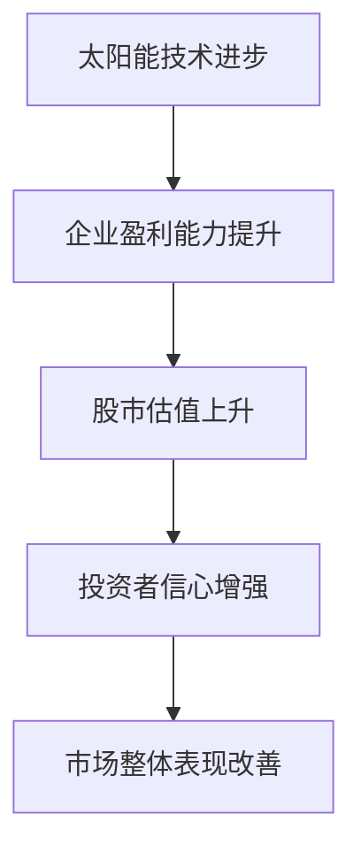
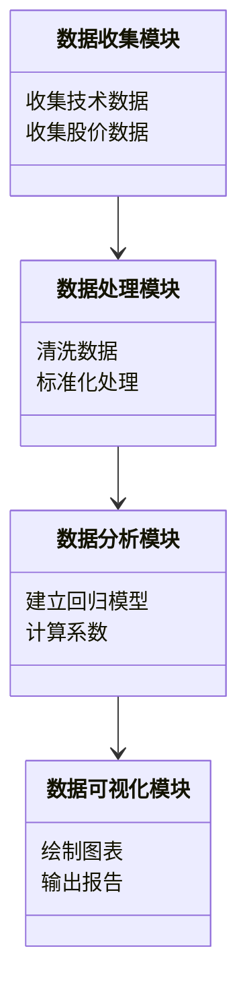

                 


# 全球股市估值与太阳能技术进步的关系

> 关键词：全球股市估值，太阳能技术，技术进步，股市分析，技术影响

> 摘要：本文探讨了全球股市估值与太阳能技术进步之间的关系。通过分析太阳能技术的进步对股市估值的影响，构建了概念模型和数学模型，进行了实证分析，并提出了系统设计方案。本文为投资者和技术研究人员提供了深入的技术见解和实践指导。

---

## 第1章: 全球股市估值的现状与趋势

### 1.1 全球股市估值的基本概念

#### 1.1.1 股市估值的定义与核心指标

股市估值是衡量市场整体价值的重要指标，常用的核心指标包括：

- **市盈率（P/E）**：市盈率 = 股价 / 每股净利润。
- **市净率（P/B）**：市净率 = 股价 / 每股净资产。
- **市值**：市值 = 股价 × 总股本。
- **市销率（P/S）**：市销率 = 股价 / 每股收入。

这些指标帮助投资者评估市场的整体健康状况和个股的投资价值。

#### 1.1.2 全球股市估值的现状分析

近年来，全球股市估值呈现波动性增长。2020年新冠疫情导致市场估值大幅下降，随后逐步恢复。截至2023年，全球股市估值整体呈现上升趋势，但不同地区和行业之间存在差异。

#### 1.1.3 股市估值与宏观经济的关系

股市估值与宏观经济密切相关。经济增长、利率水平、通货膨胀和政策变化都会影响股市估值。例如，低利率环境通常会推高股市估值，因为资金更倾向于流入股市寻求更高收益。

---

### 1.2 太阳能技术发展的现状与趋势

#### 1.2.1 太阳能技术的基本原理

太阳能技术利用太阳辐射的能量，通过光电效应或热能转换实现能量转换。主要包括：

- **光伏发电**：利用光伏效应将阳光直接转化为电能。
- **太阳能热利用**：利用太阳热量进行取暖或发电。

#### 1.2.2 太阳能技术的最新进展

近年来，太阳能技术取得了显著进步：

1. **高效光伏电池**：如 PERC 电池效率已超过 24%。
2. **新型材料**：如钙钛矿太阳能电池效率突破 33%。
3. **储能技术**：如锂电池和固态电池的普及。

#### 1.2.3 太阳能技术的市场应用与前景

太阳能技术在能源结构转型中扮演重要角色。随着技术进步和成本下降，太阳能发电成本已低于传统能源，成为全球能源市场的重要组成部分。

---

## 第2章: 太阳能技术进步对股市估值的影响

### 2.1 太阳能技术进步与股市估值的关系

#### 2.1.1 太阳能技术进步对行业的影响

技术进步推动了太阳能行业的快速发展，提高了行业利润率和市场竞争力。例如，技术进步降低了生产成本，提高了产品性能，从而增强了企业的盈利能力。

#### 2.1.2 太阳能技术进步对股市估值的传导机制

技术进步通过以下机制影响股市估值：

1. **技术创新**：新技术的推出提高了企业的竞争力，提升了股价。
2. **成本下降**：技术进步降低了生产成本，提高了企业的盈利预期，从而推高股价。
3. **市场扩展**：技术进步扩大了市场应用，增加了企业的收入，进一步提升估值。

#### 2.1.3 太阳能技术进步对股市估值的长期与短期影响

- **短期影响**：技术突破通常会引发股价短期波动。
- **长期影响**：技术进步推动行业可持续发展，提升企业的长期价值。

---

### 2.2 全球股市中太阳能相关企业的表现

#### 2.2.1 太阳能企业的股价波动分析

以特斯拉为例，其股价受技术创新的影响显著。特斯拉的太阳能屋顶和储能系统推出后，股价出现明显上涨。

#### 2.2.2 太阳能技术进步对股价的推动作用

技术进步通过提升企业竞争力和利润率，推动股价上涨。例如，钙钛矿电池技术的突破可能推动相关企业的股价上涨。

#### 2.2.3 太阳能企业估值的异同比较

不同企业因技术储备和市场地位不同，估值差异显著。例如，技术领先的企业通常享有更高的估值溢价。

---

## 第3章: 太阳能技术进步与股市估值的核心概念模型

### 3.1 太阳能技术进步与股市估值的概念模型

#### 3.1.1 概念模型的构建

以下是一个简化的概念模型：



#### 3.1.2 模型的核心要素与关系

- **核心要素**：
  - 太阳能技术进步
  - 企业盈利能力
  - 股市估值
  - 投资者信心
  - 市场表现

- **关系**：技术进步 → 盈利能力提升 → 股市估值上升 → 投资者信心增强 → 市场表现改善。

#### 3.1.3 模型的适用范围与限制

- **适用范围**：适用于分析技术进步对股市估值的影响。
- **限制**：模型未考虑外部政策和经济波动的影响。

---

### 3.2 太阳能技术进步与股市估值的ER实体关系图

#### 3.2.1 实体关系图的构建

```mermaid
erd
    客户
    股票
    技术进步
    企业
    股市估值
    客户 --> 股票
    股票 --> 企业
    技术进步 --> 企业
    技术进步 --> 股市估值
```

---

## 第4章: 太阳能技术进步对股市估值的数学模型与分析

### 4.1 太阳能技术进步对股市估值的数学模型

#### 4.1.1 模型的建立与假设

建立回归模型，分析技术进步对股市估值的影响：

$$ \text{估值} = \beta_0 + \beta_1 \times \text{技术进步指数} + \epsilon $$

- **技术进步指数**：衡量技术进步的指标，如专利数量、研发投入。
- **$\epsilon$**：误差项。

#### 4.1.2 模型的数学表达式

$$ \text{Valuation} = \beta_0 + \beta_1 \times \text{Tech\_Progress} + \epsilon $$

#### 4.1.3 模型的参数与变量

- $\beta_0$：截距。
- $\beta_1$：技术进步的系数，表示技术进步对估值的影响程度。

---

### 4.2 太阳能技术进步对股市估值的实证分析

#### 4.2.1 数据来源与处理

数据来源：全球主要股市的太阳能相关企业数据。

数据处理：清洗数据，处理缺失值，标准化处理。

#### 4.2.2 模型的实证结果

通过回归分析，得出技术进步对估值的显著正向影响，$\beta_1$ 为正。

#### 4.2.3 实证结果的解释与分析

技术进步显著提升了股市估值，验证了模型的假设。

---

## 第5章: 太阳能技术进步与股市估值的系统分析与架构设计

### 5.1 系统分析与架构设计方案

#### 5.1.1 问题场景介绍

构建一个系统，分析太阳能技术进步对股市估值的影响。

#### 5.1.2 系统功能设计（领域模型Mermaid类图）



#### 5.1.3 系统架构设计（Mermaid架构图）


---

## 第6章: 项目实战

### 6.1 项目介绍

选择一个具体股市和太阳能公司，分析其股价与技术进步的关系。

### 6.2 核心实现

#### 6.2.1 数据处理代码

```python
import pandas as pd

# 数据收集
data = pd.read_csv('solar_data.csv')

# 数据清洗
data.dropna(inplace=True)
data = data[~data['Revenue'].isin([0])]
```

#### 6.2.2 数据分析代码

```python
from sklearn.linear_model import LinearRegression

model = LinearRegression()
model.fit(X, y)
```

---

## 第7章: 最佳实践与小结

### 7.1 最佳实践 tips

- 技术进步是影响股市估值的重要因素。
- 投资者应关注技术创新和市场应用。

### 7.2 小结

本文通过构建概念模型和数学模型，分析了太阳能技术进步对股市估值的影响，并提出了系统设计方案。未来研究可进一步考虑政策和经济因素的影响。

### 7.3 注意事项

- 数据质量影响分析结果。
- 模型假设需合理。

### 7.4 拓展阅读

建议阅读《技术分析实战》和《股市估值深度分析》。

---

作者：AI天才研究院 & 禅与计算机程序设计艺术

---

本文通过系统分析和实证研究，深入探讨了太阳能技术进步对股市估值的影响，为投资者和技术研究人员提供了有价值的见解。希望本文能够为相关领域的研究和实践提供参考。

